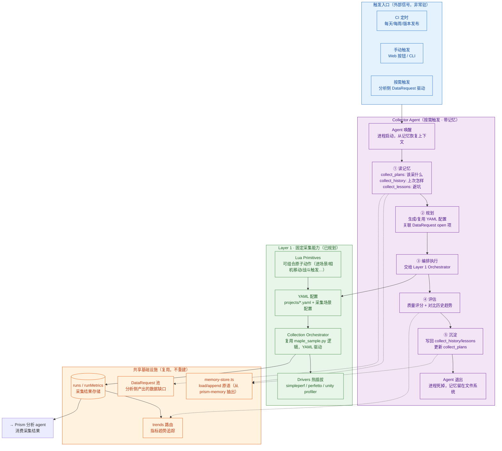
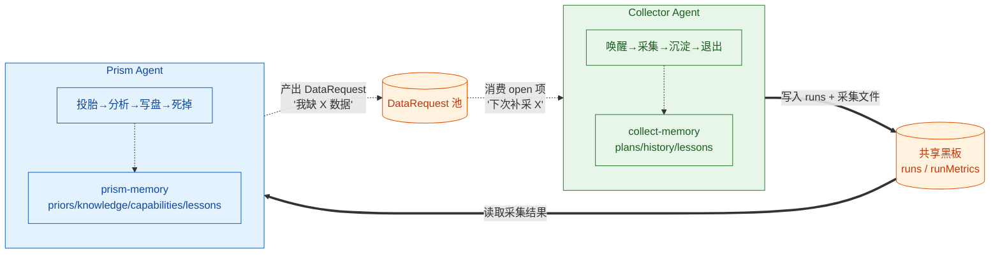
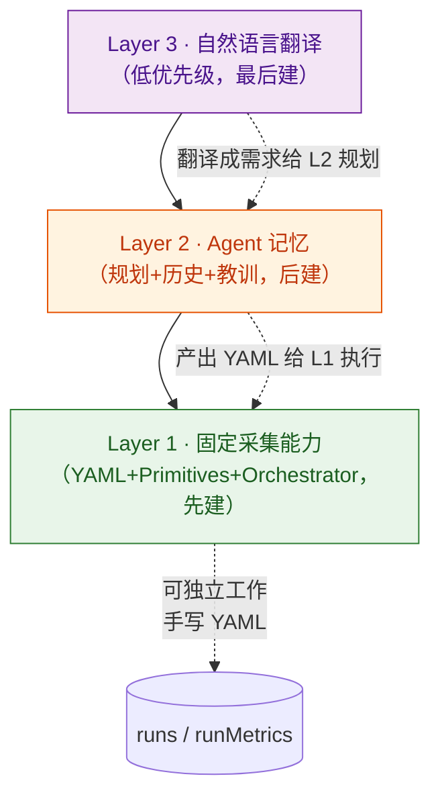
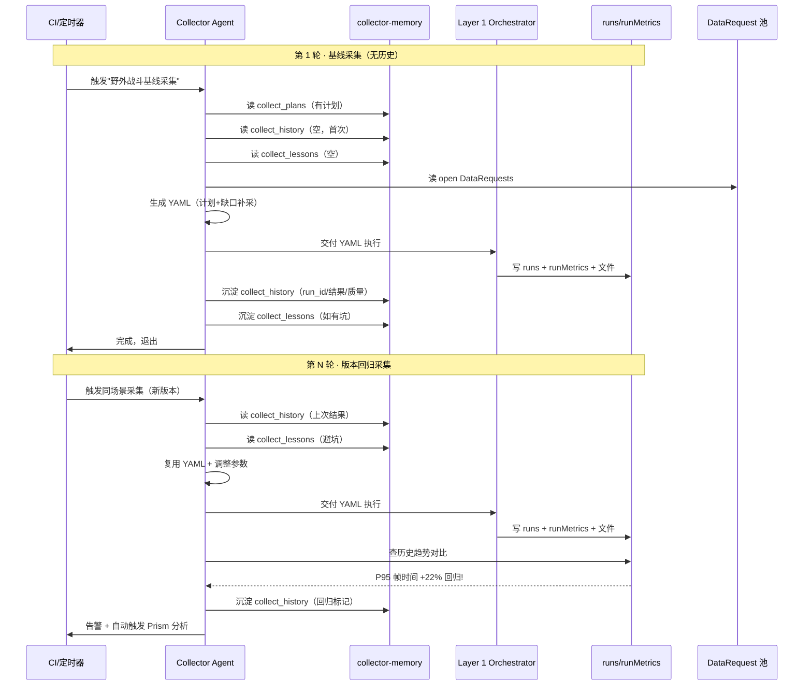
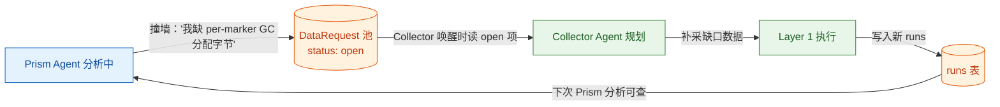

# COLLECTOR 设计哲学（Philosophy）

> **这份文档回答"为什么"，用人话。** 它和 Prism 的 philosophy.md 是姊妹篇——Prism 回答"怎么分析"，Collector 回答"怎么采集"。
>
> 关系：**Prism = 分析 agent**（消费数据 → 产出报告）｜**Collector = 采集 agent**（产出数据 → 喂给 Prism）。
> 两者是**职责不同的独立 agent**，共享基础设施层（存储原语、runs 表、trends 路由），但**记忆内容独立**——各占一排抽屉，互不翻对方的抽屉。
>
> 读者路径：想理解 Collector 为什么这么设计 → 读本文；想看 Prism 的设计哲学 → 读 `docs/prism/memory/philosophy.md`。

---

## 零、Collector 全景图（一张图看懂整个系统）



**怎么读这张图**：
- **蓝色** = 触发入口（外部信号，Agent 不常驻、不自己等闹钟）
- **紫色** = Agent 生命周期（唤醒→读记忆→规划→执行→评估→沉淀→退出），进程用完即弃
- **绿色** = Layer 1 固定采集能力（YAML 驱动，即使没有 Agent 也能手动跑）
- **橙色** = 共享基础设施（复用 Prism 已有的存储原语和 runs/trends，不重建）

**一句话**：Collector 是"被闹钟叫醒、带着记忆干活、干完写回记忆、继续睡觉"的 agent。记忆在文件系统里持久，进程无常驻。

---

## 一、两个 agent：Collector ⊥ Prism（职责正交，不是上下游链路）

最容易混淆的认知：Collector 不是 Prism 的"前置步骤"，Prism 也不是 Collector 的"后处理"。它们是**两个职责正交的独立 agent**，通过 runs 表（采集结果）这个"共享黑板"松耦合。

| | Collector Agent | Prism Agent |
|---|---|---|
| **职责** | 产出数据（在设备上跑游戏 + 采样） | 消费数据（分析 + 产出报告） |
| **输入** | 采集需求（自然语言/CI/DataRequest） | 一份采集结果（pdata/perf.data/pftrace） |
| **输出** | runs + runMetrics + 采集文件 | findings + verdict + report.html |
| **记忆** | collect_plans / collect_history / collect_lessons | priors / knowledge / capabilities / lessons |
| **生命周期** | 唤醒→采集→沉淀→退出 | 投胎→分析→写盘→死掉 |
| **LLM 的角色** | 翻译需求→YAML + 规划 + 评估 | 提假设→查工具→证伪→叙事 |

**为什么必须分成两个 agent，不合成一个**：

1. **触发时机不同**：采集是"主动行为"（要去设备上操作），分析是"被动响应"（数据来了才分析）。合成一个会导致"为了分析得先去采集"的强耦合，而实际场景里大量分析是消费已有数据。
2. **记忆性质不同**：Collector 的记忆是"采集经验"（哪个场景怎么进、哪个 primitive 组合有坑），Prism 的记忆是"分析知识"（哪个 marker 是正常业务、哪个是 bug）。混在一起会让"持久大脑"语义混乱。
3. **进化方向不同**：Collector 越用越会"采对数据"（覆盖度↑、噪声↓），Prism 越用越会"读懂数据"（归因准↑、幻觉↓）。这是两条独立的进化曲线。

**但它们通过两个共享物协作**：
- **runs 表**（共享黑板）：Collector 写入，Prism 读取
- **DataRequest 池**（反馈回路）：Prism 产出"我缺 X 数据"，Collector 消费"下次补采 X"



---

## 二、三层结构：固定能力 ⊥ Agent 记忆 ⊥ 自然语言（不是三选一，是叠加）

Collector 有**三个垂直的层**，和 Prism 的"单次管线 ⊥ 跨run回路"一样，混淆它们是理解 Collector 最大的坑。

### 第一层：固定采集能力（YAML + Primitives + Orchestrator）—— 先建

即使没有 Agent、没有 LLM，这一层也能独立工作。人手写 YAML，Orchestrator 读 YAML 执行。

```
人写 YAML 配置（场景+动作+工具）
    │
    Orchestrator 读 YAML
    │
    ├─ 调 Primitive: enter_scene(WildField, [120,45])
    ├─ 调 Primitive: camera_sweep(duration=30s, pattern=back_forth)
    ├─ 启动 Driver: simpleperf + perfetto（后台）
    ├─ 等待采样窗口结束
    ├─ 停止 Driver
    ├─ adb pull 采集文件
    └─ 写 runs + runMetrics + meta.json
```

**这一层的本质**：把 `maple_sample.py` 里硬编码的流程，拆成**可组合的原子动作（Primitives）** + **声明式配置（YAML）** + **编排器（Orchestrator）**。

**关键设计**：
- **Primitive 是原子动作**，不是完整脚本。`enter_scene` / `camera_sweep` / `trigger_battle` / `wait_frames` 各自独立，YAML 里组合。
- **Driver 热插拔**：simpleperf / perfetto / unity profiler 是可插拔的采集后端，YAML 里声明用哪些。
- **Source 可配置**：采集什么数据（CPU 采样 / 帧计数器 / 内存快照）由 YAML 声明，不写死在代码里。

**为什么 Primitive 用 Lua**：游戏内动作（进场景、移动相机、触发战斗）必须在游戏进程内执行，Lua 是游戏侧最通用的嵌入脚本。Primitive = 一组约定好签名的 Lua 函数，Orchestrator 通过 ADB intent 或 RPC 调用它们。

### 第二层：Agent 记忆（规划 + 历史 + 教训）—— 后建

在第一层之上，增加"带记忆的规划层"。Agent 产出 YAML 给第一层执行，不是自己直接操作设备。

```
采集需求（自然语言 or CI 信号）
    │
    Agent 唤醒
    │
    ├─ 读 collect_plans（该采什么？有现成计划吗？）
    ├─ 读 collect_history（上次采过吗？参数是什么？）
    ├─ 读 collect_lessons（有坑吗？primitive 组合有问题吗？）
    ├─ 读 DataRequest 池（分析侧缺什么数据？）
    │
    Agent 规划 → 产出 YAML
    │
    交给 Layer 1 Orchestrator 执行
    │
    Agent 评估结果 → 沉淀 collect_history / collect_lessons
    │
    Agent 退出
```

**这一层的本质**：Agent 是"翻译层 + 记忆层"，不是"执行层"。它把模糊需求翻译成精确 YAML，并记住每次采集的成败经验。

**为什么不能跳过第一层直接建第二层**：没有 Primitives 和 Orchestrator，Agent 产出的 YAML 无处执行——等于有大脑没手脚。所以顺序是**先有手（Layer 1），再有脑（Layer 2）**。

### 第三层：自然语言翻译 —— 最后建，低优先级

在第二层之上，把自然语言翻译成采集需求。这是"锦上添花"，不是"必需品"。

```
"帮我测野外战斗有没有变卡"
    │
    Layer 3: NL → 采集需求
    │ "野外战斗" → scene: WildField_Battle
    │ "有没有变卡" → 需要对比历史 → 读 collect_history
    │
    Layer 2: Agent 规划（带记忆）
    │
    Layer 1: Orchestrator 执行
```

**为什么低优先级**：初期采集场景有限（几个固定场景），手写 YAML 完全够用。等场景多了、需求杂了，再上 NL 翻译。而且 NL 翻译的准确率依赖 Layer 1 的 Primitive 词汇表是否完备——Primitive 不够多时，NL 翻译也翻不出花。

### 三层的关系：叠加，不是替代



- **Layer 1 可独立工作**（手写 YAML 跑采集）
- **Layer 2 需要 Layer 1**（Agent 产出 YAML 给 Layer 1 执行）
- **Layer 3 需要 Layer 2**（自然语言 → Agent 规划 → YAML）

---

## 三、记忆回路：三个分类（存什么 / 怎么注入 / 看得见的效果）

Collector 的记忆**单独建 collector-memory**，不复用 prism-memory 的分类，但**复用 memory-store 原语**（load/append，从 prism-memory.ts 抽出的纯文件系统读写层）。

### 为什么单独建，不放进 prism-memory

| 方案 | 判定 | 理由 |
|------|------|------|
| 放进 prism-memory（加 3 个分类） | ❌ | 语义混乱——prism-memory 的 priors/knowledge 是"分析知识"，Collector 的 collect_plans 是"采集计划"，混在一起读不出"谁的记忆" |
| **单独建 collector-memory**（复用原语） | ✅ | 语义清晰、职责隔离、可独立演进 |

**实现方式**：把 prism-memory.ts 里的 `loadCategory` / `appendMemory` / `MemoryEntry` 抽成 `memory-store.ts`（纯读写，不带语义），prism-memory 和 collector-memory 各自引用它，各自定义分类。

### 三个记忆分类

| 分类 | 存什么 | 怎么注入 | 看得见的效果 |
|------|--------|---------|-------------|
| **collect_plans** | 采集计划（哪些 case、什么频率、目标版本、关联的 DataRequest） | Agent 唤醒时读，决定"这次该采什么" | 不用每次重新描述需求，Agent 记得"每周三采野外战斗基线" |
| **collect_history** | 采集历史（run_id / 时间 / 版本 / 场景 / 结果摘要 / 质量评分） | Agent 规划时读，参考上次参数；评估时读，对比趋势 | Agent 能说"上次这个场景采了 60s，P95 帧时间 18ms，这次涨到 22ms 了" |
| **collect_lessons** | 采集教训（primitive 组合问题、数据不可信、环境差异、设备状态异常） | Agent 规划时读，避坑 | 不重复踩"华为设备 perfetto 要用 sideload"这种坑 |

### 记忆回路怎么转



**关键**：记忆在文件系统里持久，进程无常驻。Agent 每次唤醒时从记忆恢复上下文，干完写回记忆，退出。这和 Prism 的"投胎→分析→死掉"是同一个哲学——**记忆持久，进程用完即弃**。

---

## 四、Agent 不是常驻服务：按需触发 + 记忆恢复

### "每天采集"算常驻还是按需？

**算按需触发，触发源是定时器。**

| | 常驻服务 | 按需触发（Collector 的选择） |
|---|---|---|
| 进程状态 | 一直跑，持有状态 | 平时不存在，被信号唤醒 |
| "每天采集"怎么实现 | 进程内部跑定时器，到点自己触发 | CI/cron/任务计划当闹钟，到点启动 Agent |
| 记忆在哪 | 在进程内存里（丢了就没了） | 在文件系统里（进程死了也不丢） |
| 资源占用 | 一直占内存 + 需要心跳保活 | 用完即弃，零空闲开销 |

**为什么选按需触发**：
1. **记忆在文件系统，不在进程里**——Agent 不需要常驻来"记住"东西，唤醒时从 collector-memory 加载即可。
2. **采集是间歇性行为**——不是每秒都在采，每天可能就采几次。常驻等闹钟是浪费。
3. **和 Prism 一致**——Prism 也是"投胎→分析→死掉"，不是常驻。两个 agent 同一个哲学。
4. **CI 天然适合**——CI 本身就是"到点跑 job"的机制，用它当闹钟零成本。

### 触发方式不影响核心设计

Agent 的核心是"记忆回路"（读记忆→规划→执行→沉淀），触发方式是外层的事：

| 触发源 | 场景 | Agent 的反应 |
|--------|------|-------------|
| CI 定时 | 每天/每周周期采集 | 唤醒→读 collect_plans 发现"今天该采野外基线"→执行 |
| 版本发布钩子 | 新版本回归 | 唤醒→读 collect_history 发现"上次基线是 v1.2"→对比采集 |
| 手动（Web/CLI） | 临时需求 | 唤醒→读需求→规划→执行 |
| DataRequest 驱动 | 分析侧发现缺口 | 唤醒→读 DataRequest 池→补采缺口 |

Agent 不关心谁按的启动键，只关心"我被唤醒了，先去读记忆"。

---

## 五、交互形态：自然语言 → Agent → YAML → 执行

### 目标交互（成熟期）

```
你："进野外场景 (120, 45)，来回相机移动 30s，采 simpleperf + perfetto"

Agent 内部：
  1. 读记忆（collect_plans: 采过这个场景吗？collect_lessons: 有坑吗？）
  2. 翻译成 YAML：
     scene: WildField
     enterCoord: [120, 45]
     action:
       type: camera_sweep
       duration: 30s
       pattern: back_forth
     tools: [simpleperf, perfetto]
  3. 交给 Layer 1 Orchestrator 执行
  4. 结果写 runs + 沉淀 collect_history
  5. "采集完成，run_id=xxx，P95=18ms，比上次基线涨 2ms，在正常波动范围内"
```

**关键**：Agent 是"翻译层 + 记忆层"，不是"执行层"。真正操作设备的是 Layer 1 的 Orchestrator（复用 maple_sample.py 的逻辑，YAML 驱动）。

### 交互成熟度分三阶段

| 阶段 | 你说什么 | Agent 能做什么 | 前置条件 |
|------|---------|---------------|---------|
| **初期** | "跑 VG 对比采集" | 匹配已有 YAML 模板，执行 | Layer 1 基本可用 |
| **中期** | "进野外 (120,45) 相机移动 30s" | 翻译成 YAML + 记忆辅助 + 沉淀 | Layer 1 + camera_sweep primitive 存在 + Layer 2 记忆回路 |
| **成熟期** | "帮我测最近版本野外战斗有没有变卡" | 自主规划：选场景/动作/对比历史/告警回归 | Layer 1+2+3 全建 |

### 关键前置条件：Primitive 词汇表

Agent 能翻译什么，取决于 Layer 1 有什么 Primitive。如果 `camera_sweep` 不存在，Agent 会说"我还没有'相机来回移动'这个原子动作，需要先定义它"。

**所以交互能力的上限 = Primitive 词汇表的大小**。初期 Primitive 少，交互偏"模板匹配"；后期 Primitive 丰富，交互才真正"自然语言"。

---

## 六、与 Prism 的关系：共享基础设施，独立记忆

### 共享什么

| 共享物 | 性质 | 谁写谁读 |
|--------|------|---------|
| **memory-store.ts**（原语） | 代码库，纯文件系统读写 | 两个 agent 都引用，都不独占 |
| **runs / runMetrics**（存储） | 数据库表 | Collector 写，Prism 读 |
| **trends 路由** | API | 两个 agent 都读（Collector 评估用，Prism 分析用） |
| **DataRequest 池** | JSON 池 | Prism 写（产出缺口），Collector 读（补采缺口） |

### 不共享什么

| 独立物 | Collector 的 | Prism 的 |
|--------|-------------|---------|
| **记忆** | collect_plans / collect_history / collect_lessons | priors / knowledge / capabilities / lessons |
| **Agent 逻辑** | 采集规划 prompt + 评估逻辑 | 探索 prompt + 叙事 prompt |
| **生命周期** | 唤醒→采集→沉淀→退出 | 投胎→分析→写盘→死掉 |
| **进化方向** | 越用越会"采对数据" | 越用越会"读懂数据" |

### DataRequest 闭环：两个 agent 的协作纽带



这是两个 agent 唯一的"主动协作"通道：Prism 分析时撞到数据缺口 → 写 DataRequest → Collector 下次唤醒时读 open 项 → 补采 → 写入 runs → Prism 下次分析就能查到。

**这个闭环让两个独立 agent 形成"采集-分析"的螺旋上升**：分析侧发现的数据缺口，驱动采集侧补采；补采的数据，让分析侧能回答更深层的问题。

---

## 七、实现节奏：先有手再有脑（Phase 规划）

| 阶段 | 内容 | 复用已有 | 新增 | 交付物 |
|------|------|---------|------|--------|
| **Phase 1** | Layer 1 固定采集能力 | maple_sample.py 的采集逻辑 | auto_collector/ 全套（YAML schema + Primitives + Orchestrator + Drivers） | 手写 YAML 能跑采集 |
| **Phase 2** | 记忆回路 | memory-store 原语（从 prism-memory 抽出） | collector-memory 3 分类 + 沉淀逻辑 | Agent 能记住上次采集结果 |
| **Phase 3** | Agent 规划 + 回归告警 | ai-agent-session + trends 路由 | 规划 prompt + 告警逻辑 | Agent 自主规划 + 回归检测 |
| **Phase 4** | DataRequest 闭环 | capabilities + DataRequest 池 | 缺口→采集计划映射 | 分析缺口自动驱动补采 |
| **Phase 5** | 自然语言翻译 | Agent + LLM | NL→YAML 翻译 | 自然语言交互 |

**顺序的铁律**：Phase 1 必须先跑通。没有 Primitives 和 Orchestrator，Agent 产出的 YAML 无处执行——有脑无手。Phase 2 的记忆回路依赖 Phase 1 的执行能力才有意义——记住"上次怎么采的"前提是"上次确实采了"。

---

## 八、几条不会再拉锯的既定共识

- **Collector 和 Prism 是两个独立 agent**，不是一个大 agent 的两个模块。职责正交，记忆独立，通过 runs 表和 DataRequest 池松耦合。
- **记忆单独建 collector-memory**，不放进 prism-memory。但复用 memory-store 原语（load/append），不重复造文件系统读写轮子。
- **Agent 按需触发，不常驻**。"每天采集"由 CI/cron 当闹钟，Agent 唤醒→干活→退出。记忆在文件系统持久，进程无常驻。
- **三层结构是叠加不是替代**。Layer 1（固定能力）可独立工作；Layer 2（Agent 记忆）需要 Layer 1；Layer 3（NL 翻译）需要 Layer 2。
- **先有手再有脑**。Phase 1 先建固定采集能力，Phase 2 再叠记忆。没有 Primitives，Agent 翻译不出 YAML。
- **Agent 是翻译层不是执行层**。Agent 产出 YAML，Layer 1 Orchestrator 执行。Agent 不直接操作 ADB。
- **交互能力上限 = Primitive 词汇表大小**。初期 Primitive 少，交互偏模板匹配；后期丰富，才真正自然语言。
- **DataRequest 是两个 agent 的协作纽带**。Prism 产出缺口，Collector 补采，形成"采集-分析"螺旋上升。

---

_本文是 Collector Agent 的设计哲学文档，与 `docs/prism/memory/philosophy.md` 互为姊妹篇。设计决策随实现推进追加，但保持"成体系、可读"，不退化成流水账。_
