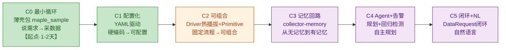

# COLLECTOR 整体路线图（ROADMAP）

> **这是龙头文件**：从今天到终态，Collector 分几个里程碑、每段打通什么、验收门是什么。
> BACKLOG（需求）以本文的里程碑为坐标系。
> 原则：**先跑通最小循环，再逐个加厚**（滚雪球，不赌大爆炸）。
> 姐妹文档：[设计哲学](../philosophy.md)｜[需求总表](backlog.md)

---

## 终态一句话

> 说一句"进野外场景来回相机移动 30s"→ Collector 自动翻译成采集计划、操作设备执行、记住结果、对比历史发现回归、喂给 Prism 分析。越用越会采对数据，越用越懂哪些场景该怎么采。

拆成两句可验收的话：
- **能采**：说需求 → 自动操作设备 → 产出采集文件。
- **越用越会采**：同场景第 N 次采集，比第 1 次更快规划、能避坑、能报"这次比上次变差了"。

---

## 开发策略：最小循环优先，再逐个加厚

**核心洞察**：`maple_sample.py`（786 行）已经是一个完整的采集脚本——ADB 连接、simpleperf/perfetto 启停、游戏 Intent 触发、logcat 监听、文件拉取、meta.json、上传 web，全有。

所以**不是从零写 Collector，而是先包一层薄壳让"说需求"能触发已有的 maple_sample.py，再逐步把硬编码拆成可配置架构**。

**读法**：C0 是起点（1-2 天跑通"说需求→采数据"）。C1-C2 是加厚采集能力（硬编码→可配置→可组合）。C3 加记忆。C4-C5 加智能。**每个里程碑可独立交付价值，中途可停。**

---

## C0 · 最小循环——薄壳包 maple_sample（起点·1-2 天）

**目标**：**第一天就能跑通"说需求 → 采到数据"**。不重构 maple_sample.py，只包一层薄壳。

**关键认知**：maple_sample.py 已经能完整采集，它的 `main()` 接受 `--label/--duration/--scene/--tools` 参数，`run_single()` 是完整流程。C0 只需让"说需求"能填这些参数。

**要打通的**：

| 工单 | 做什么 | 改哪些文件 | 验收门 | 依赖 |
|---|---|---|---|---|
| **C0-A · collect.py 通用采集脚本** | 写 `scripts/auto_collector/collect.py`，接受简化指令（`collect.py "VG对比 60s"`）或结构化参数（`--label --duration --scene --tools`）。**参考 maple_sample.py 的采集逻辑重写通用版，不 import 它**。项目特化参数（包名/Activity/Intent/路径）从 `config.json` 读，代码里不出现项目特化词 | 新增 `scripts/auto_collector/collect.py` + `config.json` | `python scripts/auto_collector/collect.py "VG对比 60s"` → 触发采集 → 产出文件 | 无（maple_sample.py 仅作参考） |
| **C0-B · 需求解析** | 最简解析：关键词匹配（"VG对比" → label=vg_compare, scene=StressTestBattleSimpleMode；"60s" → duration=60）。**不用 LLM**，纯规则 | `collect.py` 内 | "VG对比 60s" → 正确参数 | C0-A |
| **C0-C · 端到端验证** | 手机插电脑 + adb 连通 + 游戏前台 → `collect.py "VG对比 60s"` → 采集完成 → 文件产出 + meta.json + web 上传 | —（验证） | 真机跑通一次完整采集 | C0-A/B + 设备就绪 |

**验收门**：`python scripts/collect.py "VG对比 60s"` → 真机采集完成，产出 perf.data + pftrace + pdata + meta.json。**C0 达标 = 最小循环跑通，能用了。**

**产出价值**：第一天就有可用的"说需求→采数据"。后续加厚不影响这条链路。

**前置要求**：
- ✅ 手机插电脑，`adb devices` 能看到设备
- ✅ 游戏已安装并能启动
- ✅ simpleperf 二进制已 push 到设备（maple_sample.py 会自动 push）
- ✅ 符号文件目录 `output/maple/symbols/` 有 libil2cpp.dbg.so（simpleperf 符号化用）
- ✅ perfetto 脚本路径 `g:\AOEYZ_Trunk\Tools\AndroidPerfettoScripts\record_android_trace.py` 存在

---

## C1 · 配置化——YAML 驱动（把硬编码变成可配置）

**目标**：把 maple_sample.py 里硬编码的参数（包名、Activity、Intent Action、设备路径、perfetto 事件列表等）抽成 YAML 配置。**这一步之后，换项目/换场景只改 YAML 不改代码。**

**要打通的**：

| 工单 | 做什么 | 验收门 | 依赖 |
|---|---|---|---|
| **C1-A · 采集配置 YAML Schema** | 定义采集配置 YAML 格式：scene（场景名）、action（简化：duration + profile_name）、tools（simpleperf/perfetto）、output（目录/命名）、meta（版本/标签）。**先不搞 Primitive 组合，C1 只做参数配置化** | YAML 能描述现有 maple_sample.py 的所有参数 | C0 |
| **C1-B · Orchestrator 读 YAML 执行** | collect.py 改为读 YAML → 填参数 → 调用 maple_sample 的函数。maple_sample.py 的硬编码常量（PACKAGE_NAME/PROFILE_ACTIVITY 等）从 YAML 读 | 手写 YAML → collect.py 读 YAML → 采集成功 | C1-A |
| **C1-C · 项目级配置** | 把项目特化常量（包名/Activity/Intent/设备路径/perfetto 事件）放进 `projects/aoeyz/collect.yaml`，和现有 `projects/aoeyz/pack.yaml` 并列 | 换项目只改 `projects/<name>/collect.yaml` | C1-B |

**验收门**：手写一份采集 YAML → collect.py 读 YAML 执行 → 采集成功。**C1 达标 = 配置化完成，换场景/项目改 YAML 不改代码。**

**产出价值**：从"改代码"变成"改配置"。为 C2 的可组合打下基础。

---

## C2 · 可组合——Driver 热插拔 + Primitive 框架

**目标**：把 maple_sample.py 的采集流程（start_simpleperf → start_perfetto → trigger_combined_profile → wait → stop → pull）拆成可组合的 Driver 和 Primitive。**这一步之后，YAML 能声明"用哪些工具+做什么动作"，不再固定流程。**

**要打通的**：

| 工单 | 做什么 | 验收门 | 依赖 |
|---|---|---|---|
| **C2-A · Driver 热插拔** | 把 simpleperf/perfetto/unity-profiler 三段封装成统一 Driver 接口（start/stop/pull），YAML 声明 `tools: [simpleperf, perfetto]` → 对应 driver 按序启停 | YAML 声明不同工具组合 → 只启停声明的 driver | C1 |
| **C2-B · Primitive 框架** | 定义 Primitive 接口（Lua 函数签名约定 + ADB intent 调用）。实现首批：`enter_scene` / `camera_sweep` / `wait_duration`。**若游戏侧 Lua 暂不支持，先用 ADB input 降级** | YAML 声明 `action: camera_sweep 30s` → 游戏内执行 | C1 |
| **C2-C · runs/runMetrics 写入** | Orchestrator 收尾把采集结果写入 runs + runMetrics 表。复用现有 schema.ts 的 Run/runMetrics 模型 | 跑一次采集 → runs 表出现记录 | C2-A |
| **C2-D · 端到端验证** | 手写 YAML（场景+动作+工具）→ Orchestrator 执行 → 文件 + runs 写入 | 手写 YAML 跑通完整可组合采集 | C2-A/B/C |

**验收门**：手写 YAML（含 Primitive 动作 + Driver 工具）→ Orchestrator 执行 → 采集文件 + runs 记录。**C2 达标 = Layer 1 完整可用（philosophy 里的 Layer 1）。**

**产出价值**：采集流程可组合了，不再是固定管线。为 C3 记忆层打下基础。

**关键风险**：C2-B 的 Lua Primitive 需游戏侧配合。降级方案：ADB input（触摸事件序列），精度差但不阻塞。

---

## C3 · 记忆回路——从无记忆到有记忆（转折点）

**目标**：建 `collector-memory`（3 分类：collect_plans / collect_history / collect_lessons），Agent 每次唤醒时读记忆恢复上下文，干完写回。

**要打通的**：

| 工单 | 做什么 | 验收门 | 依赖 |
|---|---|---|---|
| **C3-A · collector-memory 存取** | 复制 prism-memory.ts 读写逻辑，改分类（collect_plans/history/lessons）和根目录。**不动 prism-memory.ts 任何代码**（零侵入） | 能 load/append 三个分类 | C2 |
| **C3-B · 采集历史沉淀** | Orchestrator 收尾自动写 collect_history（run_id/场景/参数/结果摘要/质量评分） | 跑一次采集 → collect_history 出现一条 | C3-A / C2-C |
| **C3-C · 采集教训沉淀** | 采集失败/异常时写 collect_lessons（primitive 组合问题/设备异常/数据不可信） | 采集失败 → collect_lessons 出现教训 | C3-A |
| **C3-D · 采集计划管理** | 支持周期采集计划（场景/频率/版本），存入 collect_plans，CLI `--plan` 触发 | 定义"每周采野外基线" → CLI 按计划触发 | C3-A |

**验收门**：连跑两次同场景，第二次能从 collect_history 读到第一次结果。**C3 达标 = Collector 有记忆了。**

**产出价值**：Collector 不再"每次从零开始"，能记住上次怎么采的、有什么坑。

---

## C4 · Agent 规划 + 回归告警——自主规划 + 趋势对比

**目标**：在 C2+C3 之上，加 Agent 规划层（读记忆→生成/复用 YAML）和回归告警（对比历史趋势，发现"这次比上次差"）。

**要打通的**：

| 工单 | 做什么 | 验收门 | 依赖 |
|---|---|---|---|
| **C4-A · Agent 规划 prompt** | 写 Collector Agent 规划 prompt（读 collect_plans/history/lessons → 产出 YAML）；复用 ai-agent-session | Agent 读记忆 → 产出可执行 YAML | C3 |
| **C4-B · 回归告警** | 采集后自动查 trends 路由对比历史，P95 涨幅超阈值 → 告警 + 触发 Prism 分析 | 同场景第 N 次采集 → 自动报"P95 涨 22%" | C3-B / trends 路由 |
| **C4-C · Web UI 采集模式** | AI Workbench 加"采集模式"，复用 /ai/chat SSE，后端路由到 Collector Agent | Web UI 输入自然语言 → Agent 规划 → 执行 → 流式反馈 | C4-A |
| **C4-D · LLM 需求解析** | 把 C0-B 的关键词匹配升级为 LLM 翻译（自然语言 → 采集参数/YAML） | "进野外相机移动 30s" → LLM 翻译成 YAML | C4-A |

**验收门**：Web UI 说"进野外相机移动 30s"→ Agent 读记忆+规划+执行+沉淀+反馈。**C4 达标 = 自然语言交互可用。**

**产出价值**：不用手写 YAML 了，说人话就能采。且能自动发现回归。

---

## C5 · DataRequest 闭环 + 完全自然语言

**目标**：Prism 分析产出的 DataRequest 自动驱动 Collector 补采；自然语言交互到顶。

**要打通的**：

| 工单 | 做什么 | 验收门 | 依赖 |
|---|---|---|---|
| **C5-A · DataRequest 消费** | Agent 唤醒时读 DataRequest 池 open 项，映射成采集计划 | DataRequest → Agent 规划补采 | C4 |
| **C5-B · 闭环验证** | Prism 产出 DataRequest → Collector 补采 → Prism 能用新数据 | 端到端闭环跑通 | C5-A / Prism 侧 |
| **C5-C · 完全自然语言** | 支持模糊需求（"帮我测最近版本野外战斗有没有变卡"），Agent 自主规划场景/动作/对比/告警 | 模糊自然语言 → 自主规划全流程 | C4-D / Primitive 词汇表丰富 |

**验收门**：Prism 产出缺口 → Collector 自动补采 → Prism 能用；模糊自然语言 → 自主规划全流程。**C5 达标 = 两个 agent 协作闭环 + 完全自然语言。**

**产出价值**：分析-采集螺旋上升；交互体验到顶。

---

## 里程碑 ↔ BACKLOG 映射

| 里程碑 | 相关 CL 需求 | 状态 | 估算 |
|---|---|---|---|
| **C0 最小循环** | CL-1 collect.py 通用脚本、CL-2 需求解析、CL-3 端到端验证 | ✅ 完成 | 1-2 天 |
| **C1 配置化** | CL-4 YAML Schema、CL-5 Orchestrator 读 YAML、CL-6 项目级配置 | ✅ 完成 | 3-5 天 |
| **C2 可组合** | CL-7 Driver 热插拔、CL-8 Primitive 框架、CL-9 runs 写入、CL-10 端到端验证 | ⬜ | 1-2 周 |
| **C3 记忆回路** | CL-11 collector-memory、CL-12 历史沉淀、CL-13 教训沉淀、CL-14 采集计划 | ⬜ | 3-5 天 |
| **C4 Agent+告警** | CL-15 规划 prompt、CL-16 回归告警、CL-17 Web UI、CL-18 LLM 解析 | ⬜ | 1-2 周 |
| **C5 闭环+NL** | CL-19 DataRequest 消费、CL-20 闭环验证、CL-21 完全自然语言 | ⬜ | 1 周 |

---

## 开发量评估

| 里程碑 | 估算 | 说明 |
|---|---|---|
| **C0** | **1-2 天** | 最轻。maple_sample.py 已能采，只包薄壳。**第一天就能用。** |
| **C1** | **3-5 天** | 轻。把硬编码常量抽成 YAML，collect.py 改读 YAML。 |
| **C2** | **1-2 周** | 重。拆 maple_sample.py 成 Driver+Primitive。Lua Primitive 需游戏侧配合。 |
| **C3** | **3-5 天** | 轻。读写逻辑复制 prism-memory.ts，沉淀逻辑加几行。 |
| **C4** | **1-2 周** | 中。规划 prompt 需调试，Web UI 复用现有 AI Workbench。 |
| **C5** | **1 周** | 中。DataRequest 映射 + NL 翻译迭代。 |

**总计**：约 5-7 周（全职）。但 **C0 只需 1-2 天就能跑通最小循环**，后续是加厚。

**减负策略**：
- C0 不重构 maple_sample.py，只 import 调用
- C2-B 的 Lua Primitive 如果游戏侧不支持，先用 ADB input 降级
- C3 的 collector-memory 复制不抽取，零侵入 Prism
- C4 的 Web UI 复用现有 AI Workbench

---

_本路线图是 BACKLOG/工单的坐标系。里程碑边界变更须经确认；里程碑内 CL 分配可随开发调整。_
