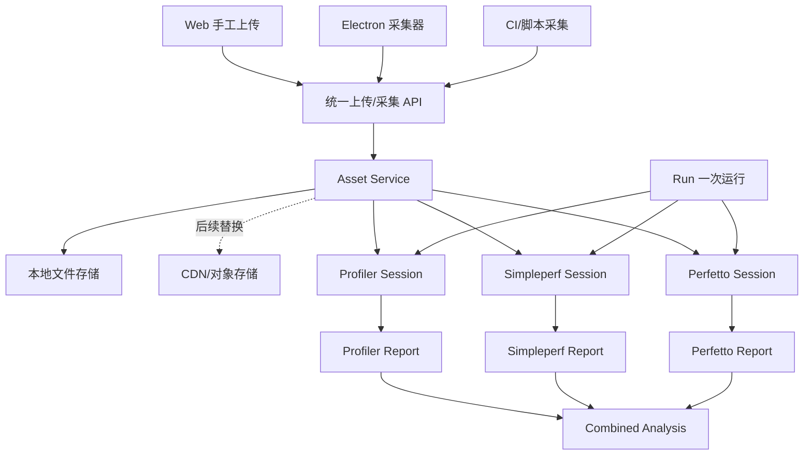
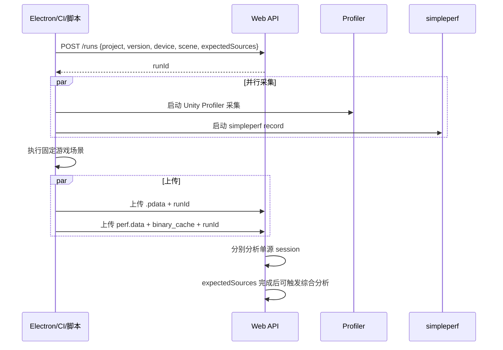

# 性能分析管理平台需求文档（v1 · 已被 v2 取代）

> ⚠️ **本文档（v1）已被 [`performance-platform-requirements-v2.md`](./performance-platform-requirements-v2.md) 统筹取代。** v2 收敛了数据模型（Run = core/detail/raw，取代每源一张 Session 表的筒仓）、去除了 `Maple` 关键字、将 `pdata` 改名为 `UnityProfilerData`，并新增了出数据/分析解耦、N+1 skill 架构、对比结论可读性等内容。本文保留作历史规划记录；新需求请以 v2 为准。
>
> 本文档用于定义性能分析管理平台的目标形态、核心需求、数据结构、采集/分析流程、UX 重构方向、simpleperf 接入、Profiler/simpleperf/Perfetto 多源关联分析，以及分阶段交付边界。本文档仅描述需求与设计，不代表当前代码已全部实现。

## 1. 背景与目标

当前项目已经具备 Unity Profiler `.pdata` 的 Web/Electron 分析基础能力，并在 `simpleperf/` 目录下沉淀了一套 Android native CPU 性能采集与分析工具链。后续平台需要从“单一 `.pdata` 分析工具”演进为“多数据源性能分析管理平台”，统一管理以下数据源：

- Unity Profiler `.pdata`：观察 Unity Marker、帧耗时、Jank、Spike、调用树。
- simpleperf `perf.data` + `binary_cache`：观察 Android native `.so`、线程、函数热点、调用栈与火焰图。
- Perfetto `.pftrace` / `.perfetto-trace`：观察系统调度、CPU 频率、线程状态、Surface/FrameTimeline、thermal 等系统级信息。

平台的最终目标是：

1. 统一采集入口：支持 Web 手工上传、Electron 客户端采集上传、CI/脚本自动上传。
2. 统一资产管理：所有原始数据和分析产物都通过 `Asset` 抽象管理，先落本地磁盘，后续可替换为 CDN/对象存储。
3. 统一分析模型：通过 `Run -> Session -> Asset -> Report` 组织单源与多源分析。
4. 支持 simpleperf 可视化：不只展示文本对比，还要提供图表、单次热点、线程/so 分解、火焰图。
5. 支持多源关联分析：将同一次运行的 `.pdata`、`perf.data`、Perfetto trace 聚合到一个 `Run` 下，用 AI 生成跨源证据链报告。
6. 每个阶段都能自测、验证、交付，避免一次性大改造成不可控风险。

## 2. 当前能力边界

### 2.1 已有能力

#### Unity Profiler / `.pdata`

已有 Electron 主进程解析与分析能力，关键位置：

- `src/main/profiler/pdata-parser.ts`
- `src/main/profiler/profile-analyzer.ts`
- `src/main/profiler/call-tree.ts`
- `src/main/profiler/spike-detector.ts`
- `src/main/ipc-handlers.ts`
- `src/renderer/modules/ProfilerModule/`

已有 Web 平台基础能力，关键位置：

- `web/server/routes/upload.ts`：上传 `.pdata`。
- `web/server/routes/analysis.ts`：触发分析、查询进度。
- `web/server/routes/history.ts`：历史记录。
- `web/server/routes/compare.ts`：多 session 对比。
- `web/server/routes/trends.ts`：趋势。
- `web/server/services/analysis-queue.ts`
- `web/server/services/cli-executor.ts`
- `web/server/db/schema.ts`
- `web/src/pages/Upload.tsx`
- `web/src/pages/Dashboard.tsx`
- `web/src/pages/History.tsx`
- `web/src/pages/ReportDetail.tsx`
- `web/src/pages/Compare.tsx`
- `web/src/pages/Trends.tsx`
- `web/src/pages/Settings.tsx`

当前数据库已有：

- `sessions`：`.pdata` 分析会话。
- `metrics`：从分析结果中提取的关键指标。
- `tags`：灵活标签。
- `reports`：AI 报告。
- `optimize_results`：优化建议。

#### simpleperf 工具链

`simpleperf/` 已有独立 Python 工具链：

- `simpleperf/scripts/collect_perf.py`：真机采集封装。
- `simpleperf/scripts/analyze.py`：单次分析。
- `simpleperf/scripts/compare.py`：A/B 对比。
- `simpleperf/scripts/batch_compare.py`：多版本趋势。
- `simpleperf/simpleperf_analyzer/single_profile.py`：热点、线程、so、folded stack。
- `simpleperf/simpleperf_analyzer/so_compare.py`：Level 1 `.so` 占比。
- `simpleperf/simpleperf_analyzer/anchor_compare.py`：Level 2 anchor 子树。
- `simpleperf/simpleperf_analyzer/func_compare.py`：Level 3 函数 diff。
- `simpleperf/simpleperf_analyzer/regression.py`：多版本趋势。
- `simpleperf/simpleperf_analyzer/reporter.py`：JSON / 文本 / CSV 输出。

当前 simpleperf 已具备命令行能力，但尚未完整接入 Web/Electron 平台。

#### Perfetto

当前仓库已有示例报告：

- `output/perfetto/perfetto-report_20260509180000.md`

Perfetto 尚未作为 Web/Electron 平台正式数据源接入。

### 2.2 待建设能力

- 统一 `Asset` 抽象与存储服务。
- simpleperf Web 后端路由、队列、结果管理与前端页面。
- Web 手工上传与 Electron/脚本自动上传共用 API。
- simpleperf 单次报告、A/B 报告、趋势报告可视化。
- 单次采集火焰图展示。
- `Run` 顶层实体与多源关联关系。
- 协同采集 API、事后建议关联、历史页手动关联。
- AI 综合分析 prompt、输入摘要、输出结构。
- Perfetto 正式需求、数据流、UX 占位与执行器预留。

## 3. 总体架构

目标架构以 `Asset Service` 和 `Run` 为核心：



### 3.1 核心概念

| 概念 | 说明 |
|---|---|
| `Asset` | 原始文件和分析产物的统一抽象，如 `.pdata`、`perf.data`、`binary_cache`、`.pftrace`、报告 JSON、火焰图 SVG。 |
| `Session` | 某个数据源的一次分析会话，如 profiler session、simpleperf session、perfetto session。 |
| `Run` | 一次游戏运行，用于聚合同一时间窗口内采集的多个数据源。 |
| `Report` | 单源分析产物，如 profiler report、simpleperf report、perfetto report。 |
| `CombinedAnalysis` | 基于一个 `Run` 的多源综合分析结果。 |
| `Executor` | 某类数据源的执行器，负责调用解析工具、生成报告、推送进度。 |

### 3.2 数据源接入模板

后续任何新数据源都走同一套模板：

1. 业务定义：输入文件类型、采集方式、分析模式、输出指标。
2. 后端实现：上传/采集 API、session 管理、executor、队列与进度。
3. 数据库：session 表、report 表、asset 关联表。
4. 前端页面：上传/采集页、报告页、历史页、对比/趋势页。
5. 集成点：导航、Dashboard、Settings、Run 关联、AI 综合分析。

Perfetto 是第三条数据源，应在接入时顺带固化 `executor registry`，将 profiler、simpleperf、perfetto 的执行器统一注册与调度。

## 4. 数据结构需求

### 4.1 Asset

`Asset` 用于统一管理所有输入文件与分析产物。P1 即引入，存储后端先使用本地磁盘，接口保留 CDN/对象存储扩展。

建议字段：

| 字段 | 说明 |
|---|---|
| `id` | asset 唯一 ID。 |
| `assetType` | `pdata`、`perf_data`、`binary_cache`、`perfetto_trace`、`report_json`、`report_md`、`flamegraph_svg`、`folded_stack` 等。 |
| `source` | `web_upload`、`electron_upload`、`script_upload`、`generated`。 |
| `fileName` | 原始文件名。 |
| `fileSize` | 文件大小。 |
| `sha256` | 文件哈希，用于去重和一致性校验。 |
| `storageBackend` | `local`、未来 `cdn` / `cos`。 |
| `localPath` | 本地路径。 |
| `remoteKey` | CDN/对象存储 key，当前可为空。 |
| `mimeType` | 文件类型。 |
| `metadataJson` | 文件子类型、采集参数、平台信息等。 |
| `createdAt` | 创建时间。 |

### 4.2 Session

每条数据源有自己的 session 表，或使用统一 session 表加 `sourceType`。考虑现有 `sessions` 已用于 `.pdata`，建议递进方式：

- 保留现有 `sessions` 作为 profiler session。
- 新增 `simpleperf_sessions`。
- 新增 `perfetto_sessions`。
- 三类 session 都增加 `runId` 可空字段。

共同字段：

- `id`
- `runId`
- `sourceType`
- `status`: `pending | queued | running | completed | failed`
- `projectName`
- `version`
- `branch`
- `buildId`
- `device`
- `scene`
- `captureStartedAt`
- `captureDurationMs`
- `analysisStartedAt`
- `analysisCompletedAt`
- `error`
- `createdAt`

### 4.3 Run

`Run` 表示一次游戏运行，是多源关联分析的顶层实体。

建议字段：

| 字段 | 说明 |
|---|---|
| `id` | runId。 |
| `projectName` | 项目名。 |
| `version` | 版本。 |
| `branch` | 分支。 |
| `buildId` | CI 构建号。 |
| `device` | 设备。 |
| `scene` | 场景。 |
| `runStartedAt` | 游戏运行开始时间。 |
| `runDurationMs` | 运行时长。 |
| `expectedSources` | JSON 数组，如 `['pdata','simpleperf','perfetto']`。 |
| `status` | `collecting | analyzing | partial | completed | combined`。 |
| `createdBy` | 创建者。 |
| `notes` | 备注。 |
| `createdAt` | 创建时间。 |
| `completedAt` | 完成时间。 |

### 4.4 Session 与 Asset 关系

新增 `session_assets` 关系表：

- `id`
- `sessionId`
- `sessionType`
- `assetId`
- `role`: `input | symbol | output | report | flamegraph`
- `createdAt`

示例：

- profiler session 关联 `.pdata` 输入和 `preprocess-result.json`。
- simpleperf session 关联 `perf.data`、`binary_cache`、`analyze.json`、`analyze.txt`、`folded`、`flamegraph.svg`。
- perfetto session 关联 `.pftrace`、`report.json`、`report.md`。

### 4.5 CombinedAnalysis

综合分析结果表：

| 字段 | 说明 |
|---|---|
| `id` | 综合分析 ID。 |
| `runId` | 所属 Run。 |
| `status` | `pending | running | completed | failed`。 |
| `inputSourcesJson` | 输入源快照，如各 sessionId、report assetId。 |
| `promptVersion` | Prompt 模板版本。 |
| `provider` | AI provider。 |
| `reportMdAssetId` | 综合报告 Markdown asset。 |
| `insightsJsonAssetId` | 结构化洞察 asset。 |
| `error` | 错误信息。 |
| `createdAt` | 创建时间。 |
| `completedAt` | 完成时间。 |

## 5. UX 整体重构需求

### 5.1 信息架构

重构后的平台应从“单工具页面集合”变成“性能分析工作台”。建议左侧导航：

1. Dashboard：总览。
2. Collect / Upload：采集与上传。
3. Runs：一次运行与多源关联。
4. Reports：单源报告。
5. Compare：对比分析。
6. Trends：趋势分析。
7. Assets：资产中心。
8. Settings：配置。

### 5.2 Dashboard

目标：让用户一眼看到平台状态和最近风险。

核心内容：

- 最近 Run 列表与状态。
- 近期分析任务队列。
- 数据源状态：Profiler、Simpleperf、Perfetto。
- 最近高风险问题卡片。
- 快速入口：上传 `.pdata`、上传 `perf.data`、创建 Run、生成综合分析。

### 5.3 Collect / Upload

目标：统一手工上传和自动上传说明。

需要支持：

- 单源上传：`.pdata`、`perf.data + binary_cache`、Perfetto trace。
- 多源 Run 上传：先创建 Run，再分别上传各数据源。
- `expectedSources` 配置。
- 元数据填写：项目、版本、分支、buildId、设备、场景、采集时间、采集时长。
- 自动上传指南：展示 Electron/脚本上传命令样例。

### 5.4 Simpleperf Report

目标：将 simpleperf 从“文本对比”升级为“可视化报告”。

单次报告：

- 总览卡片：采集时长、event、采样数、线程数、符号解析状态。
- Top Hotspots 表。
- 线程 CPU 分布图。
- `.so` 占比堆叠图。
- 函数热点图表。
- 火焰图入口。
- 原始产物下载：JSON、TXT、folded stack、SVG/HTML。

A/B 对比报告：

- Level 1 `.so` 占比变化。
- Level 2 anchor 子树变化。
- Level 3 函数 diff，明确标识 `maybe_inlined`。
- 结论卡：收益、劣化、需要人工确认项。

趋势报告：

- 多版本指标折线图。
- 均值/方差展示。
- 异常版本标记。

### 5.5 Run Combined Analysis

目标：展示同一次运行内多个数据源的状态和跨源结论。

核心布局：

- Run 元信息卡：项目、版本、buildId、设备、场景、采集时间、时长。
- 数据源状态卡：Profiler、Simpleperf、Perfetto 的上传/分析/失败/缺失状态。
- 关联证据卡：左侧 profiler marker 证据，右侧 native/system 证据，中间 AI 结论。
- 综合报告 Markdown。
- 重新生成综合分析入口。
- 补传缺失数据源入口。

### 5.6 Assets / History

目标：统一查看历史 session、run、asset 和报告。

需要支持：

- 按数据源筛选。
- 按项目/版本/设备/场景筛选。
- 查看 asset 存储位置、大小、哈希、角色。
- 历史页手动关联：选择多个 session 绑定为同一 Run。
- 事后建议关联：平台基于签名提示用户确认。

### 5.7 Settings

需要配置：

- NDK simpleperf 路径。
- FlameGraph/report_html 路径或渲染方案。
- Perfetto `trace_processor` 路径。
- 本地存储目录。
- 未来 CDN/对象存储配置占位。
- Asset 生命周期策略。
- AI provider 与 prompt 版本。

## 6. simpleperf 采集分析需求

### 6.1 数据采集

采集对象：Android 游戏进程 native CPU 性能。

输入前提：

- Android 设备通过 adb 连接。
- App 可被 simpleperf 采样。
- 提供对应构建的未 strip `.so` 或 `binary_cache`，用于符号解析。
- 控制变量：设备、场景、版本、采集时长、event、频率一致。

采集方式：

1. 本地脚本采集：使用 `simpleperf/scripts/collect_perf.py`。
2. Electron 客户端采集：封装采集参数，调用本地脚本或内置执行器。
3. CI 采集：通过脚本生成 `runId`，采集完成后自动上传。

采集输出：

- `perf.data`
- `binary_cache/`
- 采集参数 metadata：package、event、freq、duration、device、scene、version、runId。

### 6.2 上传到服务器

两条路共用同一后端 API：

#### Web 手工上传

用户在 Web 页面选择：

- `perf.data`
- `binary_cache` 目录或压缩包
- 采集元数据
- 可选 `runId`

服务器：

1. 保存原始文件为 `Asset`。
2. 创建 `simpleperf_session`。
3. 建立 `session_assets` 关系。
4. 返回 sessionId。

#### Electron/脚本自动上传

Electron/CI 脚本调用同一 API：

1. 可先 `POST /runs` 创建 runId。
2. 采集 simpleperf。
3. 上传 `perf.data` 与 `binary_cache`。
4. 可自动触发分析。

### 6.3 单次分析

输入：

- `perf.data`
- `binary_cache`
- 分析参数：topN、线程过滤、是否生成 folded stack。

执行：

- 调用 `simpleperf/scripts/analyze.py` 或 Python 模块。
- 生成 JSON、TXT、folded stack。
- 可选生成 SVG/HTML 火焰图。

输出：

- `analyze.json`
- `analyze.txt`
- `analyze.folded`
- `flamegraph.svg` 或 `report.html`

### 6.4 A/B 对比

输入：

- baseline `perf.data`
- current `perf.data`
- 对应 `binary_cache`

输出：

- Level 1 `.so` 对比。
- Level 2 anchor 子树对比。
- Level 3 函数 diff。
- `maybe_inlined` 风险标记。
- 总结指标。

### 6.5 多版本趋势

输入：多个版本的 `perf.data` 集合。

输出：

- 每个版本关键指标均值和方差。
- `.so` 趋势。
- anchor 趋势。
- 异常版本标记。

### 6.6 火焰图方案

推荐分层方案：

1. 标准中间产物固定为 folded stack：`*.folded`。
2. MVP 优先支持生成并嵌入 SVG 或 NDK `report_html.py` 产物，保证可交付。
3. 前端页面预留渲染接口，后续可切换为 JS 交互式火焰图。

验收标准：用户打开单次 simpleperf 报告时，至少能看到一个与该 session 对应的火焰图入口，并能定位到 Top 函数/调用栈。

### 6.7 Native 符号校验

simpleperf 的函数名、源码定位和火焰图质量强依赖符号文件正确性。平台需要在上传或分析前提供符号匹配校验能力，避免错误 NoStrip `.so` 被用于符号化。

校验对象：

- APK 内发布版 stripped `.so`。
- 本地发布包 stripped `.so`。
- 对应 NoStrip/unstripped `.so`。
- Android NDK 工具链中的 `llvm-readelf` / `llvm-strip`。

校验规则：

- APK 内 `.so` 与本地 stripped `.so` 的 SHA256 应一致。
- APK 内 `.so` 与 NoStrip `.so` 的 Build ID 应一致。
- `strip(NoStrip SO)` 后应与 APK 内 `.so` 字节一致，或明确给出可接受警告。
- NoStrip `.so` 应包含 `.symtab`，否则本地 native 函数符号化不可靠。
- `.debug_info` / `.debug_line` 用于源码行号增强，缺失时不一定阻塞函数级符号化，但报告需标记能力限制。

校验结果分级：

- `PASS`：可用于 simpleperf 符号解析和火焰图。
- `PASS_WITH_WARNING`：可继续分析，但报告中必须提示风险。
- `FAIL`：不应生成强函数级结论，也不应静默生成可能误导的火焰图。

## 7. Asset 与 CDN 解耦需求

P1 即实现 Asset 抽象，但存储后端先用本地磁盘。

### 7.1 本地存储目录建议

```text
web/data/
├── assets/
│   ├── raw/
│   │   ├── pdata/
│   │   ├── simpleperf/
│   │   └── perfetto/
│   └── generated/
│       ├── reports/
│       ├── flamegraphs/
│       └── summaries/
└── db.sqlite
```

### 7.2 存储接口

建议抽象：

- `put(stream, metadata): Promise<Asset>`
- `get(assetId): Promise<Readable | localPath>`
- `resolveLocalPath(assetId): Promise<string>`
- `delete(assetId): Promise<void>`
- `stat(assetId): Promise<AssetStat>`

当前 `storageBackend = local`。后续 CDN/对象存储只需替换实现，不改变上层业务。

### 7.3 生命周期

- 原始采集数据默认长期保留。
- 生成产物可重建，允许配置保留周期。
- 大文件支持本地缓存与远端拉取。
- Perfetto 大 trace 后续需要更严格缓存策略。

## 8. Profiler + simpleperf 同步采集与关联分析需求

### 8.1 Run 协同采集

推荐主路径：采集前先创建 `Run`。



### 8.2 事后建议关联

当用户未提供 `runId` 时，平台计算关联签名：

```text
projectName + version + buildId + device + scene + timeBucket
```

如果新 session 与已有 Run 高度匹配，平台提示用户：

- “检测到可能属于同一次运行，是否关联到 Run xxx？”

原则：只建议，不自动绑定，避免误关联。

### 8.3 手动关联

在 History/Assets 页面支持：

1. 选择多个 session。
2. 点击“关联为同一次运行”。
3. 用户确认元数据。
4. 创建或选择已有 Run。
5. 更新 session 的 `runId`。

### 8.4 关联分析输入源

综合分析不直接喂原始大文件，而是读取各单源报告摘要：

Profiler 输入：

- 帧统计：平均、P95/P99、Jank、BigJank。
- Top Markers。
- Spike/Jank 相关 marker。
- 调用树热点。

Simpleperf 输入：

- Top `.so`。
- Top 函数。
- 线程分解。
- anchor 子树。
- 火焰图 Top stack 摘要。

Perfetto 输入：

- CPU 调度。
- 线程运行状态。
- CPU 频率/热降频。
- FrameTimeline / slice / counter 指标。

### 8.5 AI 初始提示词模板

综合分析 prompt 必须结构化，建议模板：

```text
你是 Unity/Android 游戏性能分析专家。请基于同一次游戏运行的多源性能数据，生成综合性能分析报告。

## Run 元数据
- 项目: {projectName}
- 版本: {version}
- Build: {buildId}
- 设备: {device}
- 场景: {scene}
- 采集时长: {duration}
- 数据源: {sources}

## Unity Profiler 摘要
{profilerSummary}

## simpleperf 摘要
{simpleperfSummary}

## Perfetto 摘要
{perfettoSummary}

## 分析要求
1. 找出跨数据源能够互相印证的问题。
2. 标明每个结论的证据来源。
3. 区分确定结论、可能结论、需要补充采集的信息。
4. 按严重程度排序。
5. 给出可执行优化建议。
6. 输出结构化 insights JSON 和 Markdown 报告。
```

### 8.6 综合洞察结构

建议 `insights.json`：

```json
[
  {
    "id": "insight-1",
    "severity": "high",
    "title": "主线程稳态 CPU 过重",
    "confidence": "high",
    "sources": ["pdata", "simpleperf"],
    "profilerEvidence": ["ScriptRunBehaviourUpdate 占帧 35%"],
    "simpleperfEvidence": ["libil2cpp.so 在 UnityMain 占比 42%"],
    "perfettoEvidence": [],
    "conclusion": "C# Update 逻辑对应 native il2cpp 执行成本过高",
    "recommendation": "减少帧内 Update 调用、拆分高频逻辑、检查热点函数"
  }
]
```

## 9. Perfetto 正式未来需求

Perfetto 作为正式未来数据源纳入平台规划，不作为当前 simpleperf MVP 的阻塞项。

### 9.1 输入

- `.pftrace`
- `.perfetto-trace`
- `.ctrace`
- Android bugreport 中提取的 trace（后续）

### 9.2 采集方式

- Web 手工上传 trace。
- Electron/脚本采集上传。
- CI 场景与 `runId` 绑定。

### 9.3 分析执行

执行器支持两种模式：

1. One-shot：调用 `trace_processor` 执行固定 SQL/metric，生成 JSON/Markdown。
2. Long-lived：启动 `trace_processor --httpd`，支持用户反复查询 SQL。

MVP 优先 one-shot，后续支持 long-lived。

### 9.4 输出指标

- 帧率、帧耗时。
- 主线程/渲染线程运行状态。
- Runnable 等待、唤醒延迟、抢占。
- CPU 大小核调度。
- CPU 频率与热降频。
- SurfaceFlinger / RenderThread / GPU 相关 slice。
- system counter。

### 9.5 UX 占位

- Perfetto Report 页面：指标卡 + SQL 查询结果 + trace 预览入口。
- 可嵌入 `ui.perfetto.dev` 或提供外部打开链接。
- Run 页面中 Perfetto 作为第三个数据源状态卡。

### 9.6 与综合分析关系

Perfetto 的价值在于补足 profiler/simpleperf 看不到的系统侧原因：

- 调度不合理。
- 热降频。
- 系统抢占。
- GPU/SurfaceFlinger 等系统级瓶颈。

综合分析中 Perfetto 证据应与 profiler marker、simpleperf native 热点共同呈现。

## 10. 分阶段实现路径

### P0：文档与架构确认

交付：

- 需求文档。
- 测试文档。
- 核心数据模型和阶段边界确认。

### P1：整体架构与 Asset 抽象

交付：

- `Asset` 表与 `AssetService`。
- 本地存储后端。
- session 与 asset 关系。
- 现有 `.pdata` 上传迁移到 Asset 抽象。
- CDN 接口占位。

### P2：UX 整体重构

交付：

- 新导航和信息架构。
- Dashboard 重构。
- Collect/Upload 重构。
- Assets/History 基础页面。
- Settings 增加存储、工具链配置入口。

### P3：simpleperf 全链路接入

交付：

- simpleperf 上传 API。
- simpleperf session 表。
- 单次分析执行。
- A/B 对比执行。
- 趋势分析执行。
- 图表化报告。
- 火焰图展示。
- Web 手工上传 + Electron/脚本自动上传共用 API。

### P4：Run 多源关联与综合分析

交付：

- `Run` 表。
- 协同采集 API。
- 事后建议关联。
- 历史页手动关联。
- CombinedAnalysis 表。
- 综合分析执行器。
- 综合报告页。
- Prompt 模板和 insights JSON。

### P5：Perfetto 正式接入

交付：

- Perfetto 上传 API。
- Perfetto session 表。
- `trace_processor` one-shot 分析。
- Perfetto Report 页面。
- Run 页面数据源状态集成。
- 综合分析纳入 Perfetto 摘要。

### P6：Executor Registry 重构

交付：

- `executor-base.ts`
- `pdata-executor.ts`
- `simpleperf-executor.ts`
- `perfetto-executor.ts`
- `registry.ts`
- 统一队列和进度协议。

## 11. 关键验收标准

1. 每类原始文件都能作为 `Asset` 存储并追踪。
2. `.pdata` 原有功能不回退。
3. simpleperf 单次报告能展示热点、线程、so、火焰图。
4. simpleperf A/B 对比能清晰区分 `.so`、anchor、函数 diff。
5. Web 手工上传与 Electron/脚本上传使用同一后端 API。
6. Run 能聚合同一次运行的多源 session。
7. 三种关联方式都可用：协同采集、事后建议、手动关联。
8. 综合分析报告能明确显示跨源证据链。
9. Perfetto 有明确数据流、UX 占位和后续接入边界。
10. 每个阶段都有可执行的自测清单和交付标准。
