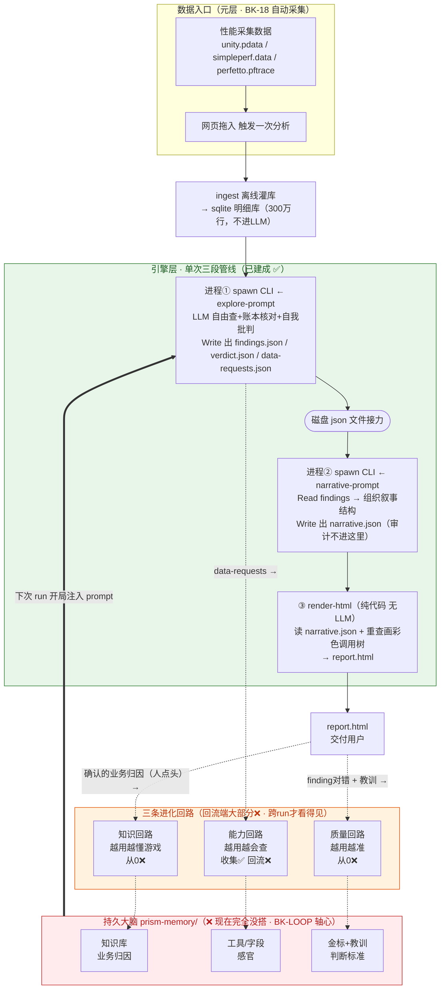
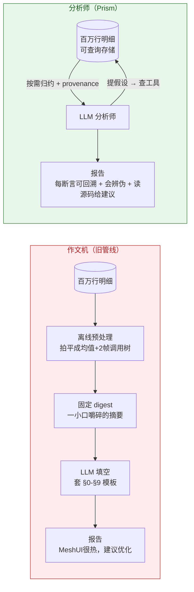
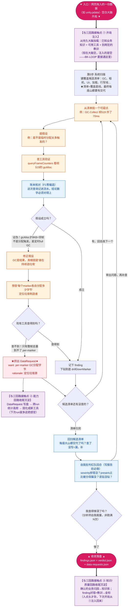

# PRISM 设计哲学（Philosophy）

> **这份文档回答"为什么"，用人话。** 它填补两个空档：CHARTER 太简（只有结论）、RATIONALE 太流水账（按时间记决策，读不出全貌）。
> 这里是**成体系的思想**——把散落在 40 条 DR 里的洞察串成一条能读下去的线。新人读完这份，再看 CHARTER 的 F1-F8 就懂了每条背后的分量。
>
> 关系：**CHARTER = 宪法条文**（不可漂移的结论）｜**PHILOSOPHY = 立法精神**（为什么这么定，成体系）｜**RATIONALE = 判例法**（逐条决策的历史推演）｜**BACKLOG = 待办**。
> 读者路径：想快速对齐 → 读本文；想查某条决策来龙去脉 → 查 RATIONALE 的 DR-N；想看当前干什么 → 看 BACKLOG。

---

## 零、Prism 全景图（一张图看懂整个系统）

先看骨架，再读后面的"为什么"。整个系统 = **数据入口 → 单次管线（引擎层）→ 三条回路把学到的沉淀进持久大脑 → 下次开局注入**。



**怎么读这张图**：
- **实线** = 一次 run 真实发生的数据流（数据→ingest→进程①→文件→进程②→渲染→报告）。**这一层已建成。**
- **虚线** = 跨 run 的"收尾沉淀"（run 学到的东西喂进三回路 → 存入持久大脑）。**大部分没建。**
- **粗箭头** = "开局注入"（下次 run 开始时，从持久大脑加载知识/感官/教训进 prompt）。**没建（因为大脑不存在）。**
- 颜色：绿=已建成，橙=待办/半截，红=完全没搭。

**一句话**：现在只有中间那个绿盒子（单次管线）在转——**投胎→分析→交付→死掉**。三条回路的虚线和粗箭头一旦接通，才从"一次性程序"变成"越用越强的 agent loop"。这就是 **BK-LOOP** 要做的事，也是第二节要展开讲的"两层结构"。

> 注：图中"进程①②是两次独立 CLI + 磁盘 json 接力"是核实代码后的事实（早期曾误画成一次进程跑两段，已更正）。

---

## 一、两个物种：作文机 vs 分析师

Prism 存在的理由，是取代"作文机"。但**它不是"更好的作文机"，是另一个物种**。

**作文机**（旧管线）：数据被离线预处理成一份固定的 digest（平均值、最热的两帧调用树），LLM 在这份嚼碎的摘要上"填空写作文"。套固定模板 §0-§9，每个槽位填一段话。

它的**结构性死穴**（不是质量问题，是物种缺陷，补 prompt 也治不好）：
- **只能回答 provider 预先算好的问题**。没预留的槽位，报告里永远不会出现。
- **永远从零开始**，不认识这款游戏。第 100 次分析和第 1 次一样懵。
- **只会报"哪里烫"，报不了"哪里变坏了 / 这烫合不合理"**——因为它没有参照系（见第四节）。
- 产出永远是"MeshUI 很热，建议优化"这类**正确的废话**。

**分析师**（Prism）：数据留在**可查询存储**里（几百万行明细，LLM 看不到全量），给 LLM 一组**只读、带 provenance 的查询工具**，让它像真人分析师一样——提假设、去数据里验证、每个断言都能回溯到一次可复现的查询。

**破局点（整个项目的第一性原理）**：
> "钉死在固定 digest 上"和"放开让它自由乱飘"是**假两难**。
> 破解 = 给它自由探索的工具，但**每个断言都可回溯到一次可审计的查询**。
> **反直觉但成立：能查了就不用猜，幻觉反而下降。**

**一图看清两个物种的分野**（关键：作文机看到的数据是被离线嚼碎的一小口，分析师能问整座数据库）：



| | 作文机 | 分析师 Prism |
|---|---|---|
| LLM 能看到的数据 | 离线嚼碎的**一小口** digest | **整座**可查询数据库（按需归约） |
| 数据流方向 | 单向：数据→摘要→填空 | **双向循环**：提假设↔查验证 |
| 能回答的问题 | 只有 provider 预留槽位 | 任何能查出来的关联/条件/尾延迟 |
| 断言可信度 | 无从核对 | 每条回溯到一次可审计查询 |

（注意分析师那边是**双向箭头**——这就是"分析师循环"，下一节展开画它内部。作文机是一条直线，没有循环，这是两个物种的形状差异。）

这一条催生了 F1（分析师非作文机）和 F2（自由发现），是所有其它设计的地基。

---

## 二、两层结构：单次管线 ⊥ 跨run回路（最容易混淆，务必分清）

Prism 有**两个垂直的层**，它们不是一条链上的先后步骤，是"一次运转"和"多次成长"的关系。混淆这两层是理解 Prism 最大的坑。

### 第一层：单次管线（一次分析真实发生的事）—— 已建成

用户往网页拖入一份数据（如 unity.pdata），触发一次分析。实际发生的是：

```
数据 → [ingest 离线灌进 sqlite 明细库，不进 LLM]
          │
   进程①  spawn CLI ← 喂 explore-prompt
          LLM 用查询工具自由探索 + 账本核对防编造 + 自我批判红队回合
          收尾用 Write 写出 → findings.json + verdict.json + data-requests.json
          进程结束、死掉
          │  ← 中间只剩磁盘上的 json 文件接力，不是进程内传递
   进程②  spawn CLI ← 喂 narrative-prompt
          LLM 用 Read 读上一步的 findings，组织成叙事结构
          写出 → narrative.json（审计信息不进这里）
          │
   ③  render-html（纯代码，无 LLM）读 narrative.json，重查画彩色调用树 → report.html
```

**关键澄清（曾误导）**：一次 codebuddy CLI 进程只喂一个 prompt。所以"两段"= **两次独立的 CLI 进程**，中间靠**磁盘 json 文件接力**，不是一次进程跑两段。narrative.json 没有任何代码写它——是 LLM 在进程②里用 Write 工具自己写的。

#### 引擎层不薄——薄的是流程图：探索盒子的内部才是灵魂

全景图里"进程①探索"只是一个框，看着和普通管线的一步没区别。但**引擎层的全部含金量都压在这个框内部**——它不是"执行一步"，是一个**分析师的循环**。这才是和作文机的本质分野（作文机那个框内部是"一次性填空"，没有循环）。

下图用一个**真实案例**贯穿全程（取自实际探索 DR-16/22）：分析师怀疑 GC 卡顿 → 查证发现是**结果不是根因** → 撞到工具查不了的数据 → **挤出一个 DataRequest**。跟着红色路径走一遍，就懂这个循环在干嘛，以及它怎么跟外面的三回路接上。



**怎么读这张图**：
- **粉色圆角** = 入口和出口（一份数据进、三个 json 出），最醒目，一眼找到起点。
- **红色路径**（GC 案例）就是一次真实的"分析师起疑→证伪→挤出 DataRequest"：怀疑 GC → 查证发现**是结果不是根因** → 想深挖"谁造的垃圾"却**撞到工具查不了** → 这一撞就**挤出一个 DataRequest**（"我要 per-marker 分配字节"）。**DataRequest 不是凭空提的，是分析撞墙撞出来的**——这就是能力回路的燃料来源。
- **紫色三个盒子** = 引擎跟外面三回路的**三个接触点**：①开局注入（大脑→prompt）②DataRequest 沉淀（能力回路）③归因/教训沉淀（知识/质量回路）。**这三个紫盒子就是引擎层和三回路"发生关系"的地方**——现在都是空的（大脑没搭），BK-LOOP 就是把这三处接通。
- **三处循环回边**（橙色）：证伪回头重提假设 / 红队审出问题再补查 / 自己判断没查够再来——这是"分析"不是"执行"，作文机一条都没有。

普通管线是"进→处理→出"的直线；Prism 引擎是**带三处自我循环、且三个接触点连着跨run大脑**的分析师循环。**含金量在循环和接触点，不在盒子数量**——往全景图堆盒子只会假厚，把这张内部图露出来才是真厚。

### 第二层：三条进化回路（让"下一次比这一次强"）—— 大部分没建

单次管线现在是"**空白大脑投胎 → 分析 → 写盘 → 进程死掉**"，这一次学到的东西没留下，下一次又从零开始。三条回路 = 三种"把这次学到的存下来、下次开局加载"的**持久记忆机制**。它们不在单次管线的链条上，是**包在管线外面**的循环：

```
      ┌────────── 持久大脑 prism-memory/（← 现在完全不存在）──────────┐
      │   知识库(业务归因)    工具/字段(感官)    金标+教训(判断标准)      │
      └──────────────────────────────────────────────────────────────┘
         ▲ 开局注入（run 开始加载进 prompt）      │ 收尾沉淀（run 结束写回）
         │                                        ▼
      ┌──┴─────────────── 一次 run（上面的单次管线）───────────────┴──┐
```

**"回路"这个词指的是"跨 run 的螺旋上升"，不是单次的先后顺序。** run 产出 → 沉淀进大脑 → 下次 run 开局注入 → 分析更强 → 又沉淀更好的东西……越转大脑越厚。

**为什么这才是取代作文机的终极形态**：单次管线做到极致，只是"一个很强的单次分析器"，报告质量能压过作文机——但那还是同一维度的竞争。三回路让 Prism 变成**越用越懂你这款游戏的分析师**——这是作文机这个物种**永远进化不到**的地方。

**清醒边界（DR-32）**：三回路是放大器。单次质量不行时，它放大的是垃圾。所以顺序是——**先确认单次报告质量，再搭回路框架，再深挖细节**。不赌大爆炸，滚雪球。

---

## 三、三条回路的具体形态（存什么 / 怎么注入 / 看得见的效果）

不谈抽象，each 回路落到"存什么、怎么用、用户看得见什么"。

### 能力回路 —— 越用越会查（长感官）

- **存什么**：新的查询工具 / 新的数据字段（"感官"）。
- **怎么转**：LLM 探索撞墙 → 发出 `DataRequest`（"我要 per-marker GC 分配，但工具只给整帧总量"）→ 跨多次 run 统计哪个缺口高频复现 → 固化成新工具 → 下次 run 多一把感官。
- **不是纯靠 LLM 发挥**，是**三层驱动**（DR-14，只有第2层靠 LLM）：
  1. **数据的轴 → 起手工具集**（机械推导，开工前钉死。现有10+工具就这么来的，**不靠 LLM**）
  2. **LLM 探索撞墙 → 发 DataRequest**（靠 LLM 当次发挥，想不到高级问题就提不出高级需求）
  3. **离线统计高频 DataRequest → 固化**（不靠单次 LLM 聪明，靠高频复现的统计规律；人也能往池里塞）
- **现状**：收集端✅（DataRequest 自动汇总排序），回流端❌（固化成工具没做）。

#### 深挖：拿到一份全新数据，引擎怎么知道"要抓什么"？（能力回路从0到扩展）

这是最容易误解的地方——**引擎开局并不"知道要抓什么"，这不是缺陷，是设计**。它不靠"预先知道抓什么"，靠"数据轴完备 → 撞墙 → 补轴"的三层机械展开。用一份 unity.pdata 走一遍"从0到有"：

**第0层（起点：由"数据的轴"推导，不由"问题"推导）**
接一份 pdata，只问一件事：**这数据的表有哪些列（=可切/聚合/关联的轴）？** 帧号、线程、marker名、self_ms、depth、时间。**每根轴机械地生出它该有的通用操作**：

| 数据的轴 | 机械生出的工具 | 涌现能力 |
|---|---|---|
| marker名 | 按名聚合 `queryMarkers` | 总量榜 |
| 时间/帧序 | 沿帧统计 `scanMetricOverFrames` | 周期性/自相关是副产品，非专门工具 |
| 调用树深度 | 展开/聚合 `getFrameCallTree`/`drillDownMarker`/`aggregateSubtree` | 结构定位、分叉点检测 |
| 峰值 | `scanPeakMarkers` | 偶发尖刺（总量榜看不到的） |

**这就是能力回路的"从0"**——不问"要发现什么问题"，只问"有几根轴"，每根配全通用操作。10+起手工具就这么来的，开工前钉死，**不靠 LLM、不靠预知问题**。为什么"不穷举问题"不致命：轴有限且已知（帧/线程/marker/深度/时间/集合关系），每轴配全操作覆盖的问题空间，远大于人能列举的问题。

**第1层（扩展：探索撞墙 → 挤出 DataRequest）** ← 唯一靠 LLM 的一层
分析师用起手工具探索，**撞到查不了的东西**就挤出 DataRequest。你库里的真实例子：
- 撞墙"GC炸了，想知道**哪个函数造垃圾**，但只有整帧总量" → DataRequest `per-marker GC分配字节`（DR-POOL-1，已复现2次）
- 撞墙"LuaMgr 6.82ms 是纯Lua，钻不进函数级" → DataRequest `Lua函数级耗时`（D5）

**DataRequest 不是拍脑袋想的，是分析撞墙撞出来的**——这就是"分析层反向驱动数据层"。

**第2层（扩展：新数据源带来新轴）**
接 counters.json（带 GC分配/面数/内存）→ 多了"每帧计数器"这根轴 → 机械生出 `queryFrameCounters`。**接新源 = 多几根轴 = 多几个工具，不重走流程**（这也是 F7 源无关的兑现）。

**回流闭合**：DataRequest 写盘 → `collect-datarequests.ts` 跨run统计高频 → 高频的固化成新工具 → 下次多这把感官。收集端✅转，回流端⬜（固化仍人工）。

> **一句话**：能力回路"从0建立"= 数据轴推导起手工具（机械，开工就有）；"扩展"= 撞墙吐 DataRequest（第1层）+ 新源带新轴（第2层）。**全程没有一步是"预先知道要抓什么"——靠的是轴完备+撞墙自扩张，不靠预知。**

#### "候选清单"是什么？为什么需要它？

上面第0层的四个扫描工具跑完，分析师**把几张榜合起来，列出这次所有值得关注的山头（通常5~10个）——这份现场扫出来的列表就是"候选清单"**。

- **它不是预设名单，是每份数据现场扫出来的成本地图**——内容随数据不同，不是背下来的。
- **为什么强制要它**（explore-prompt 第0步硬性纪律）：治一个真实教训（DR-35）——分析师容易"一头扎进相机移动反复深挖，把 Lua三Mgr/TServer/波动全漏了"。候选清单是**覆盖底线**：先把所有山头登记在册，收尾时逐一回扫，每座山都必须有交代（哪怕结论是"它没问题/是正常成本"），不许因为先钻深了一条就漏一片。
- 一句话：**"先知道有哪些山头，再决定爬哪座"** 的强制广度纪律，防"钻深一条、漏掉一片"。

#### 诚实标注：prompt 里那些业务词（相机/行军线）是隐患，不是白名单

有人会问：explore-prompt 里出现了"相机""行军线"这种具体业务词，是不是把盯防目标写死了？**诚实回答：是灰色地带，已记为待修（BK-22）。**
- 这些词是**举例/示范**（"候选类别举例""finding标题格式示范"），**不是 `if marker=="ArmyLine"` 那种硬编码逻辑**。发现机制仍是数据驱动的——ArmyLineMgr/YzEntityMoveLineNtf 都是分析师从榜单**扫**出来的（DR-18：YzEntity 靠 scanPeakMarkers 捞到第11名，非名字命中），prompt 里的词没参与"发现什么"。
- 但"行军线"是本游戏专属词，写进 prompt 降低了 F2「不预设盯防名单」的纯度（DR-2 废白名单的精神）。**通用引擎概念（GC/渲染/UI）任何游戏都有，可留；游戏专属词该清理**。→ BK-22。

### 知识回路 —— 越用越懂游戏（沉淀业务事实）

- **存什么**：关于这款游戏的**确认事实**。例："MapSignificanceMgr 批量增删实体，是镜头平移触发的设计行为，压测场景属正常，非 bug。"
- **怎么转**：一次 run 确认某业务归因（人点头才存，防存错）→ 写进 `prism-memory/knowledge/*.md` → 下次 run 开局把"已知业务事实"清单注入 explore-prompt。
- **看得见的效果**：同一个热点，第 10 次分析用 1/10 的探索成本就定性了——不再当新问题从头查，直接说"这是已知的镜头平移批量增删，正常，**除非这次比基线涨了 3 倍**"。能区分"老朋友"和"这次真异常了"。
- **现状**：❌ 从 0。确认的归因只写在报告里给人看，没有任何沉淀+注入机制。

### 质量回路 —— 越用越准（沉淀判断标准）

- **存什么**：① 金标集（历史已修 bug 回灌，带标准答案）② 教训清单（自审/人纠出的方法论错误）。
- **怎么转**：金标 → 每次改 prompt/工具后跑一遍，量出"召回 8/10、误报 15%"；教训（如"present 别用占比判会被分母稀释"）→ 注入 prompt 下次自动避坑。
- **看得见的效果**：你不用再肉眼读报告拍脑袋判断好坏——能回答"这版比上版是**真变好**还是**像模像样地胡说**"。
- **它同时治两个病**：报告质量 + **Claude 自评不可靠**（DR-36：没有客观标尺，"自审"就是自说自话。人现在是这个项目唯一的质量回路，质量回路就是把这件事自动化）。
- **现状**：❌ 从 0（依赖 BK-4 金标集）。

**贯穿三回路的一句话**：人只是往持久大脑灌东西的**其中一个**来源。人退场 loop 也转（LLM 自己往三回路灌），人在场转得更准。

### 三回路现状：设计是"活系统"，实现是"经验坟场"

有一个外部印证值得记：业界"第二大脑"概念——"不是简单的工具记忆或资料库，而是把个人经历、关系网络、决策逻辑、复盘反馈结构化沉淀的**经验系统**……通用知识已被大模型吸收，未被系统化整理的**第一方经验数据才是稀缺竞争优势**"。这几乎逐字印证了 Prism 的北极星（DR-10）：引擎（Claude）是不动的商品，护城河是"越用越懂这款游戏"的专属沉淀。三回路 ≈ 经历/关系→知识回路、决策/复盘→质量回路。

但必须**诚实标注现状**——一份沉淀是"活的"要满足四条：①自动回注运行时 ②改变下次行为 ③随用随长 ④自我纠错。对着盘：

| 沉淀物 | 活的吗 | 判定 |
|---|---|---|
| CHARTER/RATIONALE/PHILOSOPHY/BACKLOG | ❌ 0/4 | **死的**：给人读的文档，不自动回注、不改变任何一次 run，除非人读了手动改 prompt |
| DataRequest 池 | 🟡 2/4 | **半活**：自动收集+按频率排序（随用随长✅），但回注端死的——没机制固化成工具喂回下次 |
| 知识回路 / 质量回路 | ❌ 从0 | 归因只写报告给人看；金标不存在 |
| prism-memory 持久大脑 | ❌ 不存在 | 没有这个目录 |

**结论：现在有的是一座整理漂亮的"经验坟场"，不是"活的经验系统"。** 洞察都记下了、可回溯，但它们**躺着不动**——Prism 每次 run 仍是空白大脑投胎，学到的死在进程里。

**一个刺眼的反讽**：我们把"活的记忆"建给了**错误的 agent**。开发用的主 agent（Claude）有活记忆（跨 session 加载文档+memory，真的越来越懂项目）——**"开发这件事"的第二大脑已在转**；但**产品 Prism** 一份活记忆都没有，还停在"一次性对话工具"阶段。这段外部文字讲的正是产品该有第二大脑，而我们的产品恰恰还没有。

**死与活之间差的是什么**：就差 **BK-LOOP 那三条虚线**（全景图里的收尾沉淀↓ + 开局注入↑）。**坟场变活系统 = 接通回注端**。沉淀是死的不是因为沉淀得不好，是因为没有"自动加载回运行时、改变下次行为"的回路。这就是 BK-LOOP 是框架轴心的原因——它不是"再加个功能"，是**给死掉的沉淀通上电**。

**但 BK-LOOP 是必要非充分**——它是"电路总闸"（建持久大脑 + 注入/沉淀管道骨架）；闸合上后，每条回路还要**填内容**才真活：能力回路要回注固化逻辑、知识回路要 BK-10 归因沉淀、质量回路要 BK-4 金标集（没金标质量回路没料可沉淀）。所以顺序（DR-32）：**先确认单次质量 → 再搭 BK-LOOP 通电 → 再填三回路内容**。总闸没合先灌料，料没处流，白做。

---

## 四、认识论核心：把"哪里烫"和"该不该管"分开（本项目最重要的一次拆解）

用户的困扰："单源没有 baseline，怎么知道哪个数据达标、哪个是热点？貌似只能靠排序耗时。"

这句话里叠了**两个性质完全不同的问题**，混在一起才无解：

| | A. 哪里花钱最多（**定位**） | B. 这笔花费算不算问题（**价值判定**） |
|---|---|---|
| 问的是 | 客观事实：CPU 时间花哪了 | 主观判断：该不该管、是 bug 还是合理 |
| 需要什么 | **不需要 baseline**，数据自身能答 | **必须有参照系**，数据自身答不了 |

**关键认知**：困扰几乎全在 B，但直觉以为是 A 缺工具。想用 A 的手段（排序）去解 B 的问题——解不了，不是工具少，是 B 本质上需要 A 之外的东西。

### 问题 A（哪里烫）：单源能解，且远不止排序——三维定位

单源不需要任何 baseline，从三个正交维度定位热点：

1. **绝对量**：吃掉多少帧预算（`self ms/帧` vs `16.67ms`）。唯一挂在"绝对硬标准"上的维度。
2. **占比/贡献度**：占总 CPU 百分比、抹掉它中位数变化多少。治"排序榜首但占比很小"的误判。
3. **离群度**：某 marker **相对它自己的正常值**炸了多少倍（spikeX、p99/mean）。**这一维最关键——它是"自己跟自己比"的内生 baseline，不需要外部基准。**

> **占比维度为什么关键——真实例子**：
> `PostCameraMoveScale` 单次 **43ms**，很吓人，按单帧峰值排序它冲榜首。但它只在 **19 帧**出现（600 帧里）。
> - 真实贡献 = 43ms × 19 = 819ms，摊到 600 帧 = **平均每帧才 1.37ms**
> - `URP 渲染` 每帧稳定 ~10ms，600 帧全在 = **6000ms 总量**
>
> 按单帧峰值排序：PostCameraMoveScale 碾压 URP，榜首。
> 按占总 CPU 贡献：URP 是它的 **7 倍**，才是真吃帧率的大头。
> "抹掉它中位数变化多少"是同一件事的验证：抹掉 PostCameraMoveScale 中位数几乎不变（它不在那些帧里）；抹掉 URP 几乎每帧都降 → **抹掉后中位数掉得多 = 真凶**。
>
> **所以单靠耗时/峰值排序会把"偶尔炸一下的"排到"每帧都在吸血的"前面。** 这就是 BK-5 成本贡献度工具要解决的。

**A 的正解**：热点 = 绝对量大 **或** 占比高 **或** 离群严重，三维取并集。单纯按耗时排序会**同时**漏掉"占比小的榜首噪音"和"总量小的偶发尖刺"。

### 问题 B（该不该管）：单源结构上解不了——需要参照系

"MapSignificanceMgr 吃了 4ms"——**这个数字本身不含任何"好/坏"信息**。4ms 是 bug 还是合理业务？光看这份数据**物理上无法判定**。这不是工具不够，是**信息论意义上的缺失**：判定"合不合理"需要一个"合理是什么样"的参照，而这个参照不在单份采集里。

参照系只有三种来源：

| 参照系 | 回答的 B | 单源有吗 | 谁提供 |
|---|---|---|---|
| **① 绝对硬标准**（帧预算 16.67ms/60fps） | "整体这一帧达标没" | ✅ **单源就有** | Prism F8 已在用 |
| **② 时间基线**（同场景历史） | "这个开销**变坏了**没" | ❌ 跨 run 才有 | diff / 回归哨兵 / BK-LOOP |
| **③ 业务语义**（这游戏的常识） | "这笔花费**合不合理**" | ❌ 得懂业务 | 知识回路 |

**这张表闭合了整个项目的逻辑**：用户的困扰，恰好论证了为什么需要知识回路和回归哨兵——不是硬凑，是逻辑必然。

---

## 五、参照系是"热插拔"的判据：有知识就升级，没知识优雅降级

判定"某 marker 该不该管"是一条**降级链**（用户的洞察，精准命中架构本质）：

```
有这条业务知识  → 用知识判（"镜头平移触发批量增删，压测正常，别管"）      ← 知识回路，最准
     ↓ 没有就 fallback
有历史基线      → 用时间基线判（"比上版涨 3 倍 → 回归，得管"）           ← 回归哨兵/diff
     ↓ 也没有就 fallback
什么参照都没有  → 用通用三维（绝对量+占比+离群度）给"疑似热点"           ← 单源永远兜底
```

**知识不是硬编码的 if-else，是可插拔的判据**——有对应知识就升级判定精度，没有就优雅降级到通用维度，**绝不"缺知识就瘫痪"**。这与 F7"降级不降智"是同一个哲学：能力随信息量优雅升级，缺参照也不废。

**所以单源报告应该诚实标注它能判什么、判不了什么**：
- **能判**：整体达标（帧预算）+ 疑似热点（三维定位）。
- **判不了**：单 marker "该不该管"——需 diff（时间基线）或知识回路（业务语义）。假装"排序榜首就是问题"是不诚实的。

---

## 六、回归哨兵：把"哪里烫"升级成"哪里开始烫了"（近期最高价值的 loop 能力）

性能监控里最值钱的信号**不是"哪里烫"，是"哪里开始烫了"**。

- 用户**早就在手动做这件事**：diff 报告里"OutSideViewArmyLineMgr 0.02ms → 2.84ms **(+16594%)** 🔴"——这不是"ArmyLineMgr 2.84ms 很热"（哪里烫），是"它比 baseline 涨了 16594%"（哪里**开始**烫了）。做 diff 对标 baseline，本质就是在给每个模块提供"时间基线"参照系。
- **"涨了 3 倍"这种判定可采纳性极高**，因为它**不需要业务知识就成立**——是最硬的强信号。
- **回归哨兵 = 把用户现在手动跑 diff、且只在 diff 模式做的事，变成每次分析自动跟历史基线比、自动报变化**（单源模式也能有）。这天然依赖跨 run 记忆（BK-LOOP），是"agent loop > 作文机"最有说服力的证明。

---

## 七、几条不会再拉锯的既定共识（防重复踩坑）

- **工具由"数据的轴"推导，不由"问题清单"驱动**（DR-14）。造工具只看"这份数据有几个可切/聚合/关联的轴"，与"要发现什么问题"无关。周期性不是一个工具，是"时间轴+通用序列统计"的涌现副产品。→ 防"你问了我才造工具"的假自由发现。
- **Unity profiler 没有系统性盲区**（DR-6 修正早期误判）。线程等待关系在 timeline 里**看得见**，只是要功力读。perfetto 的优势不是"能不能看见"，是 off-CPU 给了开箱即用的归因标签。→ 强化 F7：单 Unity 下 Prism 的价值 = 当那个有功力、会读 timeline 的分析师。
- **确定性回放非必需**（DR-4）。环境变量（敌人数/RNG）不是要消除的噪声，是性能的**自变量**。能把"变慢"正确归因到"敌人多了"而非瞎报 regression，恰恰证明分析能力强。
- **金标集不是给 LLM 的笼子，是给用户的体温计**（DR-9）。它不进生产路径（LLM 分析时不看它），只在"体检"时量召回/误报。你越放 LLM 自由，误报风险越高，金标让你敢不敢上线有数字可依。
- **源码建议有硬护栏**（F5/DR-25）。只有当某 finding 的证据指向某符号、且源码已被检索出来，才准对该段代码发言。无 finding 指向 + 未检索 = 不许给代码建议。防"LLM 读了代码就自信编优化建议"。

---

## 八、Prism 与 agent 开发生态（LangChain / LangGraph / loop engineering）的关系

一个必须先祛魅的问题：Prism 现在全是手写 TS 代码，是不是"落后了"，该上 LangChain/LangGraph 这些"高级框架"？

**结论先行：概念上 Prism 一点不落后——它手写实现了这些框架倡导的核心理念；落后的只是"没用现成轮子"。而现在换轮子弊大于利。** 逐条对齐：

| 生态名词 | 它的本质（祛魅） | Prism 里的对应物 |
|---|---|---|
| **LangChain** | 把"调LLM+调工具+拼prompt+解析输出"封装成现成积木的库 | `explore-service.ts` 手写了这些（spawn CLI、喂prompt、账本核对、解析findings） |
| **LangGraph** | 把 agent 流程建模成**状态图**：节点+边+条件跳转+循环+**状态持久化(checkpointer)** | 第二节那张"探索内部循环图"就是一张状态图（有条件跳转、有循环回边），只是手写的 |
| **loop engineering** | 不是具体工具，是设计 agent"观察→决策→行动→再观察"反馈循环的方法论 | 分析师循环（run内）+ 三条进化回路（跨run）——教科书级的两层 loop |
| **RAG（检索增强）** | LLM 生成前先检索相关资料喂给它 | 知识回路的"开局注入"就是 RAG 思路；查询工具按需归约也是一种检索 |
| **ReAct（推理+行动）** | LLM 交替"想一步→做一个动作→看结果→再想" | 正是探索循环的"提假设→查工具→看结果→修正假设" |

**看这张表——你担心的"高级理念"，Prism 几乎条条都在做，只是名字没挂在墙上。** 这不是巧合：这些框架和 Prism 面对的是同一类问题（让 LLM 可靠地多步推理+用工具），殊途同归。

**那要不要换成 LangGraph？现在不要，三个理由：**
1. **语言不匹配**：LangChain/LangGraph 是 **Python** 生态，Prism 整栈是 TS/Node + codebuddy CLI。换 = 重写地基，违背 DR-11「不许再做死」和 DR-15「不动底座」。
2. **它解决的痛点不是你的痛点**：LangGraph 的价值是"手写 agent 循环容易乱、状态难管、断点难续"。而 Prism 当前痛点在 BK-15（写作偏见）、BK-20（判定标准）、BK-LOOP（跨run记忆没建）——**换框架一个都不解决**。
3. **架构已经对了**：你的探索循环、三回路，正是这些框架想让你写出来的样子。既然理念已落地，为理念本身而换轮子是纯负债。

**但有一个真该借鉴的点（记进 BK-LOOP）**：LangGraph 的 **"状态图 + checkpointer（把跨步骤/跨会话状态当一等公民持久化）"** 模型，恰恰是 BK-LOOP「持久大脑 prism-memory」要的东西——把 run 的状态存下来、下次加载。**借它的设计思想（跨run状态是一等公民、有明确的存/取接口），不引它的 Python 依赖。** 搭 BK-LOOP 时参考这个模型来设计 prism-memory 的读写接口，等于站在这个领域最成熟的设计上，而不重写地基。

**一句话**：Prism 不是"没用高级理念的手写程序"，是"用手写代码兑现了 agent 开发的主流理念"。手写在这里是优势（可解释、可 git、可回滚、不锁死在某框架的抽象里，呼应 DR-10「训练一个系统而非模型」），不是落后。真正要补的是能力（三回路），不是换框架。

---

_本文提炼自 CHARTER + RATIONALE(DR-1~40) + 2026-07 交接会话的设计哲学讨论。新洞察随讨论追加，但保持"成体系、可读"，不退化成流水账。_
