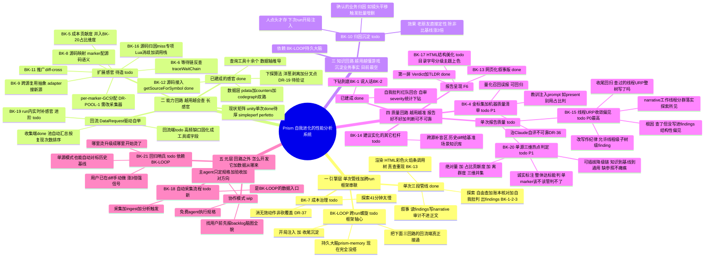

# PRISM 需求脑图（BACKLOG Mindmap）

> **顶层骨架 = Charter F4 的三条进化回路**（这是北极星的落地：三回路在转 = 系统自我进化）。每个需求都能回答"我服务哪条回路"，与 Charter"我服务哪条 Feature"同构。
> 详细条目见 [../plan/backlog.md](../plan/backlog.md)｜**为什么这么设计（成体系可读）见 [../memory/philosophy.md](../memory/philosophy.md)**｜决策历史见 [../memory/rationale.md](../memory/rationale.md)｜北极星见 [../memory/charter.md](../memory/charter.md)。
> **交互式查看/上色请用 mind-map（simple-mind-map）打开同目录 [`../plan/backlog.smm`](../plan/backlog.smm)**（含状态图标）；下方 mermaid 供 GitHub/VSCode 预览。
> 图例：✅完成　🔄进行中　⬜待办　⏸暂缓（在册不丢）
> 最后整理：2026-07-10（补全所有 BK-N；新增 BK-20/21；加哲学文档链接）

---

## 五块骨架（为什么这么分）

| 块 | 它回答的问题 | 归入原则 |
|---|---|---|
| **Ⅰ 引擎层** | 三回路怎么**转起来、串起来**？ | 管线本身 + 让回流端接通的框架(BK-LOOP) + 跑得起(成本) |
| **Ⅱ 能力回路** | 越用越**会查**——有哪些感官/工具/源？ | 一切"工具/算法/数据/源"的开发事项 |
| **Ⅲ 知识回路** | 越用越**懂游戏**——业务归因沉淀？ | 一切"确认的业务知识回灌"（目前最空） |
| **Ⅳ 质量回路** | 越用越**准**——报告好不好、判断可不可靠？ | 一切"写作/呈现/判断/金标"事项 |
| **Ⅴ 元层** | 回路之外：怎么**开发**它、数据**从哪来**？ | 协作模式 + 采集入口 |

> 切分死规矩：**工具/算法/数据/源 → Ⅱ 能力回路；写作/呈现/判断 → Ⅳ 质量回路。**
> 所以：下探算法(洋葱剥离/分叉点DR-19)属 Ⅱ（是工具算法）；BK-15 属 Ⅳ（是写findings的收敛偏见，纯写作）。

---

## 「优化思路」溯源表（手记里那些零碎设计原则 → 已进树干哪条，不再飘）

> 你 `.smm`「优化思路」下大段是**设计认知**（为什么这么做），不是待办。它们**已全部固化**进 CHARTER/RATIONALE，此表证明"没丢、可追溯"。

| 手记节点（口语） | 已固化为 | 位置 |
|---|---|---|
| 从写作文到分析师·可查询存储+带provenance查询 | F1 分析师非作文机 | CHARTER F1 / DR-1 / DR-14 |
| ②两相：自由探索→grounded合成 | 三阶段管线 | DR-1 / DR-15 |
| ③Provider自举·DataRequest变一等公民 | F4 能力回路 | CHARTER F4 / DR-15 / BK-3 |
| ④源码接入·检索+符号锚定+护栏 | F5 源码锚定建议 | CHARTER F5 / DR-33/34 |
| 金标集不是笼子是体温计 | F4 质量回路 | CHARTER F4 / DR-9 |
| 综合报告只讲非冗余20% | F3 组合非重推 | CHARTER F3 / DR-3 |
| 哪怕一源也榨到极限 | F7 单源榨干 | CHARTER F7 / DR-7 |
| 傻瓜结论从真实findings升顶 | F6 TL;DR优先 | CHARTER F6 |
| 三层驱动:数据轴/探索撞墙/新源 | 工具由数据轴推导 | DR-14 |
| 数据LLM解耦防幻觉 / 叙事非硬编码 / 热点自动下探 | F1 / F2 自由发现 | CHARTER F1/F2 / DR-1 |
| 自省自驱三回路(知识/能力/质量) | F4 三条进化回路 | CHARTER F4 / DR-10 |

（注：手记「设计原则→Hybrid架构」那套 Provider骨架+LLM_FILL+enrich 是**旧 skill 管线**的设计；Prism 的对应物是"探索→叙事→渲染"三段式，已在 Ⅰ 引擎层。）

---

## 优先级快照（一句话排序，跨块）

1. **BK-15 线程/URP 收敛偏见（四·质量）** — 绕最久的老问题，根因刚锁定（写作偏见非查询能力），改 prompt 即可，**先做**
2. **BK-20 单源三维热点判定（四·质量）** — 治"只靠耗时排序"，诚实标注能判/判不了；不依赖回路，可快做
3. **BK-16 源码归因 miss（二·能力）** — 让建议落到代码行，专项
4. **BK-17 HTML 结构美化（四·质量·呈现）** — 纯前端，快
5. **BK-4 质量清单（四·质量）** — 治判断不可靠 + 能量化"到底强了没"
6. （框架级，前面稳了再搭）**BK-LOOP 跨run螺旋（一·引擎）** — 核心愿景 agent loop；**BK-21 回归哨兵 / BK-18 自动采集** 依赖它
7. （靠后）BK-7 治慢、BK-9/BK-11 多源推广（二·能力）

> 注：**劲目前几乎全在 四 质量回路**（阶段一榨单次质量），三 知识回路还没开始转——这是真实现状，脑图如实反映。
