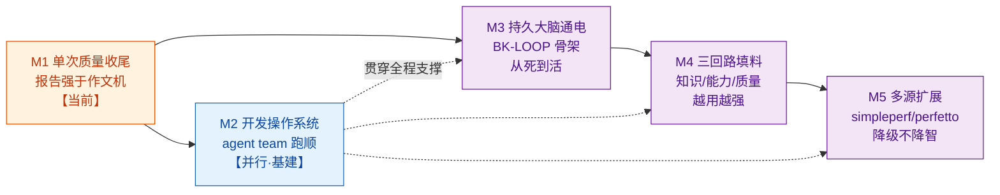

# PRISM 整体路线图（ROADMAP）

> **这是龙头文件**：从今天到终态，Prism 分几个里程碑、每段打通什么、验收门是什么。
> NOW（当前战线）、worktickets（工单）、BACKLOG（需求）全部以本文的里程碑为坐标系。
> 原则：**每个里程碑独立产出价值、可停可回退**（滚雪球，不赌大爆炸——CHARTER 建造顺序 / DR-10）。
> 维护：里程碑边界稳定；里程碑内的 BK 分配可随开发调整。每完成一个里程碑，更新本文 + NOW。

---

## 终态一句话（北极星的可交付版）

> 往网页拖一份性能数据 → 出一份**强于作文机**的分析报告；且**每跑一次，Prism 都更懂这款游戏、多一把查数据的工具、判断更准**——因为学到的东西沉淀进持久大脑、下次开局自动加载。人只是喂养大脑的输入源之一，人退场 loop 也转。

拆成两句可验收的话：
- **单次强**：任一单源报告，逐条对标作文机 8 项（DR-39）不弱且有超越。
- **越用越强**：同场景第 N 次分析，比第 1 次更懂业务/更快定性/能报"变坏了"——三回路真的在转。

---

## 里程碑总览（一张图看全程）

**读法**：M1 是当前主战场（把单次报告做到强于作文机）。M2 是**基建**（开发操作系统，让 agent team 能高效协作），跟 M1 并行搭、之后贯穿全程。M3 是**转折点**（给死掉的沉淀通电，从"一次性程序"变"agent loop"）。M4 往通电的回路里灌料。M5 扩展到多源。

---

## M1 · 单次质量收尾——报告强于作文机（当前主战场）

**目标**：把单 Unity 报告做到逐条对标作文机不弱、且有结构性超越。这是 DR-32「先确认单次质量再搭框架」的兑现——**单次不行，后面通电放大的是垃圾**。

**要打通的（都在改 `explore-prompt.txt` / `narrative-prompt.txt` / `tools.ts` 这几个文件，故串行协调、合并验收）**：
- **BK-15** 线程/URP 收敛偏见（P0·命门）：探索查了线程/URP 却没写进报告，改写作纪律让它们成条。
- **BK-20** 单源三维热点判定：从"只靠耗时排序"升级为绝对量+占比+离群度三维，诚实标注能判/判不了。
- **BK-16** 源码归因 miss：Lua 裸名消歧 + 调用栈辅助，让建议落到代码行。
- **BK-22** 清 prompt 业务词：提升 F2 纯度（"行军线"等专属词清理）。
- **BK-17** HTML 结构美化（可挂边并行，改 render-html.ts 不冲突）。

**验收门（客观，不靠感觉——DR-36/39）**：
1. 跑一次完整探索，产出报告；
2. 逐条对照 DR-39 的 8 项对标清单（叙事流/调用树+源码行/建议可落地/图文并茂/覆盖全 + 彩色可视化/贡献度排序+辨伪/审计剥离），Claude **不自评"强了"，拿两份并排给用户判**；
3. 线程账、URP 整树、三维判定在报告里**真的出现**（BK-15/20 的硬指标）。

**产出价值**：单源分析师立住，可对外用。**M1 达标 = 阶段一完成。**

---

## M2 · 开发操作系统——让 agent team 高效协作（基建·与 M1 并行）

**目标**：把"开发 Prism 这件事"本身变成一个有 harness、有记忆、有路线图的 agent loop——**主 agent 随时切会话能秒接上下文、自我调度、不靠用户当监工**（治 DR-28 的"开发流程层不自省"）。

**要打通的**：
- **docs/prism/ 目录归位**：长期记忆(CHARTER/PHILOSOPHY/RATIONALE) + 路线图(本文) + 当前战线(NOW) + 开发机制(HARNESS) + 需求(BACKLOG) 统一一处，新会话进这一个目录就够。
- **PRISM-NOW.md 活战线**：永远最新的"在哪个里程碑/做哪个工单/下一步动作"，切会话零重述。
- **PRISM-HARNESS.md 开发机制**：定义 ①工单协议（纯 md 自包含规格，适配任意执行方——用户搬 Cursor / 主 agent 派 Sonnet 子agent 都读同一张）②验收协议（对着工单客观标准核，不信自报——DR-36）③主 agent 自我调度循环（开局读 NOW+ROADMAP 定位 → 挑工单 → 派发 → 验收 → 更新 NOW → 循环）。
- **worktickets/ 工单流转**：发出→施工→完工报告→验收结论→PASS/返工。

**验收门**：新开一个会话，主 agent 只读 docs/prism/ 就能准确说出"现在在哪个里程碑、上一步做完什么、下一步该干嘛"，无需用户讲。

**产出价值**：此后每个里程碑的开发都省人力。**这是回本最快的基建。**

---

## M3 · 持久大脑通电——从"经验坟场"到"活系统"（转折点）

**目标**：搭 BK-LOOP 电路总闸——建 `prism-memory/` 持久大脑 + 开局注入/收尾沉淀的管道骨架。**这一步之前所有沉淀是死的（躺着不动），通电后才可能活**（PHILOSOPHY 第三节"坟场 vs 活系统"）。

**要打通的**：
- **BK-LOOP 骨架**：prism-memory/ 结构 + run 开局自动加载(注入 prompt) + run 收尾自动写回 + 人工注入口。设计借鉴 LangGraph checkpointer 模型（跨run状态一等公民，借思想不引 Python 依赖——PHILOSOPHY 第八节）。
- **能力回路回流端**：DataRequest 池高频项 → 固化成新工具（收集端已✅，接通回流）。

**验收门**：同一份数据连跑两次，第二次开局能加载到第一次的沉淀（哪怕先只沉淀一条），且注入真的改变了第二次的行为。**这是"agent loop"成立的最小证据。**

**产出价值**：Prism 从"一次性程序"正式变成"会成长的 agent"。**这是全项目最关键的转折。**

---

## M4 · 三回路填料——越用越强（往通电的回路里灌内容）

**目标**：BK-LOOP 通电后，三条回路各自填内容，让"越用越强"从口号变可观测。

**要打通的**：
- **知识回路**（BK-10）：确认的业务归因（人点头）→ 沉淀 → 下次开局注入。效果：老朋友直接定性，省探索成本。
- **质量回路**（BK-4 金标集）：历史已修 bug 回灌 + 教训清单 → 每次改进量召回/误报。**同时治 Claude 自评不可靠**。
- **回归哨兵**（BK-21）：把"哪里烫"升级成"哪里开始烫了"，自动对标历史基线报变化。**agent loop > 作文机最有说服力的证明**。
- （进阶·可选）BK-19 run 内实时补感官。

**验收门**：同场景第 N 次分析，报告能引用已沉淀的业务知识、能报出"这次比基线涨了X%"、金标集能给出召回/误报数字。

**产出价值**：三回路真的在转，护城河（第一方经验数据）开始积累。

---

## M5 · 多源扩展——降级不降智（阶段三）

**目标**：把榨干的能力从单 Unity 推广到 simpleperf/perfetto，接新源=写 adapter 非重走流程（F7 源无关内核的兑现）。

**要打通的**：BK-9 跨源复用抽象（adapter）、BK-11 推广 diff/cross、BK-18 自动采集流程、cross 综合报告只讲非冗余 20%（F3）。

**验收门**：接第二个源用"写 adapter"而非"重走一遍工具开发"完成；多源在场时能力叠加、缺源不废。

**产出价值**：三源分析师成型，Prism 完全体。

---

## 里程碑 ↔ BACKLOG 映射（全量·零遗漏）

**已完成✅（进"已建成"，不占里程碑）**：BK-1 下钻到底、BK-2 说人话、BK-3 datarequest自动汇总、BK-12 接源码getSourceForSymbol、BK-13 网页化叙事版。

| 里程碑 | 全部相关 BK | 状态 |
|---|---|---|
| **M1 单次质量** | BK-15 线程/URP偏见、BK-20 三维热点判定(含BK-5)、BK-16 源码归因、BK-12b 同名歧义、BK-22 清prompt业务词、BK-17 HTML美化、BK-6 等待链反查、BK-8 源码映射深化 | 🔄 当前 |
| **M2 开发OS** | docs/prism 归位✅ + NOW✅ + HARNESS✅ + worktickets✅ | ✅ 基本完成 |
| **M3 大脑通电** | BK-LOOP骨架、能力回路回流端、BK-7 成本治理(跨M1/M3) | ⬜ |
| **M4 三回路填料** | BK-10 知识回路、BK-4 金标集、BK-21 回归哨兵、BK-14 建议实化杠杆(历史diff/场景知识库部分)、BK-19 run内实时自举(进阶) | ⬜ |
| **M5 多源扩展** | BK-9 跨源复用抽象、BK-11 diff/cross推广、BK-18 自动采集、BK-14(跨源补盲部分) | ⬜ |

**跨里程碑支撑（数据层，按需插入）**：DR-POOL-1 per-marker GC分配（改采集器，M1 想深挖GC根因时需要 / 或 M5 随采集流程一起）。

> 说明：BK-5 已并入 BK-20（占比维度）；BK-14 按杠杆拆到 M4/M5 两处；BK-7 成本治理挂 M3（探索慢在框架期一并治）。**BACKLOG 里每个 BK 在此表都有归属，无遗漏。**

---

_本路线图是 NOW/工单/调度的坐标系。里程碑边界变更须经用户确认；里程碑内 BK 分配可随开发调整。_
