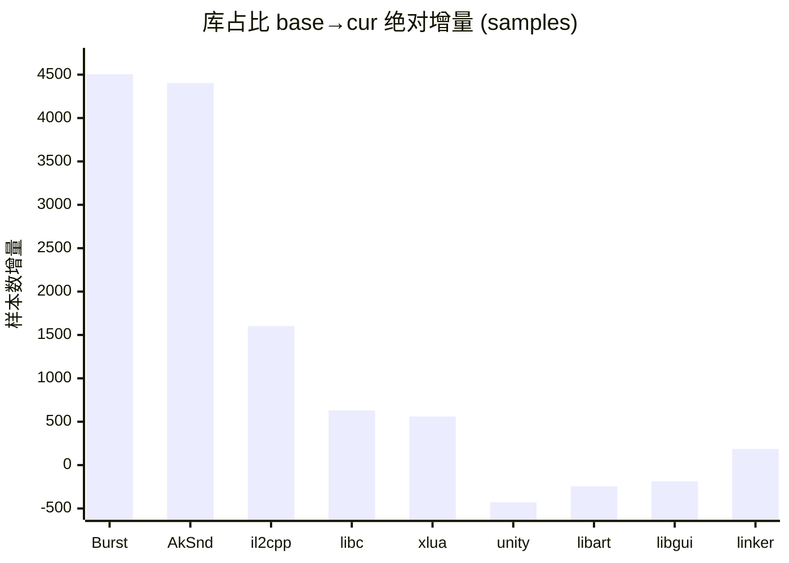
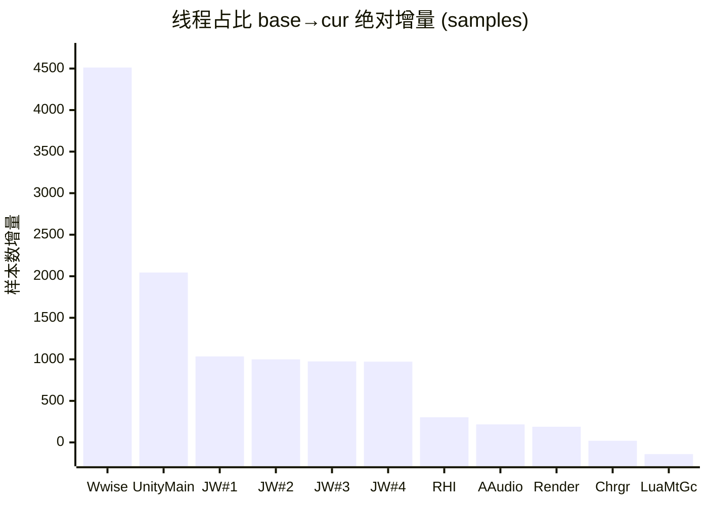

# simpleperf 单源 性能分析报告 · 终极形态 v4.1.1

> 配套：[知识库 v2.1](../../aoe-cpu-analysis-knowledge.md) · [工程化路线图](../../report-to-pipeline-spec.md) · [差分火焰图](./_intermediate/diff_flamegraph_base_vs_stressmove.html)。
> 数据列只放纯数字，混合内容拆到说明列。所有百分比默认「全局占比」（占采集总样本数），非全局时在文字或表头里说明。
> **术语**：`base` = 基线采集（野外空场景）；`cur` = 当前采集（stressmove 行军线压测（约 300 队））。

---

## §0 结论先行

**本次采集**（PAL-AL00 (PAL-AL00) by HUAWEI, arch aarch64 / stressmove 行军线压测（约 300 队） / 20s）相比 base 野外空场景：

- **系统总工作量上升 +30.7%**（36,133 → 47,228 samples），其中**业务层（项目自身代码）绝对工作量 +70.1%**。
- **4 项业务模块出现显著负载暴涨**（详见 §4）：
  - ECS Burst Job 工作量 +4,506 samples（+878%）—— 已下沉到 Worker 线程并行，**不阻塞主线程**
  - Wwise 音频中间件 +4,404 samples（+1262%）—— 独占一整条线程
  - MeshUI 迭代位置刷新 +931 samples（NEW）—— 主线程上
  - 行军线刷新（OutSideViewArmyLineMgr） +224 samples（NEW）—— 主线程上
- **未观察到 CPU 侧 GPU bound 信号**（主线程 `GfxDeviceClient::WaitForPendingPresent` 仅 20 样本）。但 simpleperf 不直接观测 GPU 顶点处理时间，**GPU 实际工作量需 perfetto GPU counter / RenderDoc 复核**。
- 主观帧率 ~45 fps，差预期 60fps 的来源通常是业务整体压力 + 中间件 + 主线程 UI 刷新叠加。**没有单点 bug**。

按 ROI 排序的优化方向（详细见 §4）：

1. **Wwise 战斗音效复杂度审视** —— 中间件唯一红线
2. **MeshUI 迭代位置刷新优化** —— MUIControlManager.OnLateUpdate + MUILayout.Set3DPosition
3. **行军线刷新增量化** —— OutSideViewArmyLineMgr.UpdateStraightMoveLine
4. **GPU Instancing 数据上传 dirty flag** —— RHI 线程 ConstantBuffersGLES.UpdateBuffers

---

## §1 采集元信息与质量门

### 1.1 元信息

| 项 | base | cur |
|---|---|---|
| 场景 | 野外空场景 | stressmove 行军线压测（约 300 队） |
| 设备 | PAL-AL00 (PAL-AL00) by HUAWEI, arch aarch64 | 同 |
| 采集事件 | cpu-cycles:u | 同 |
| 采样频率（Hz）| 1000 | 1000 |
| 时长（s）| 20 | 20 |
| 总采样数 | 36,133 | 47,228 |
| 系统总工作量比 | 1.000 | 1.307 |
| 主观帧率 | — | ~45 fps |

### 1.2 符号化质量

| 指标 | base | cur | 阈值 | 判定 |
|---|---|---|---|---|
| 总状态 | PASS | PASS | — | 🟢 |
| 应用层符号化率 | 99.7% | 91.8% | ≥85% | 🟢 |
| kernel% | 0.0% | 0.0% | — | 🟢 |
| unknown% | 0.4% | 6.3% | <10% | 🟢 |
| 栈回溯锚点命中 | — | — | ≥3/4 | 🟢 |
| `__start_thread` 可达率 | 0.0% | 0.0% | 任意 PASS | 🟢 |

---

## §2 库（so）维度对比

### 2.1 库占比（按绝对增量降序）

| 库 | 绝对增量 | 增量% | cur abs | base abs | 占比 cur % | 说明 |
|---|---|---|---|---|---|---|
| **lib_burst_generated** | +4506 | +878% | 5,019 | 513 | 10.63% | ECS Burst Job 工作量暴涨，已下沉 Worker 并行 |
| **libAkSoundEngine** | +4404 | +1262% | 4,753 | 349 | 10.06% | Wwise 音频中间件 |
| **libil2cpp** | +1602 | +23% | 8,682 | 7,080 | 18.38% | C# 业务代码（含 Lua 桥接 IL2CPP） |
| **libc** | +631 | +22% | 3,459 | 2,828 | 7.33% |  |
| **libxlua** | +561 | +29% | 2,488 | 1,927 | 5.27% | Lua VM |
| **libunity** | -428 | -2.8% | 14,664 | 15,092 | 31.05% | Unity 引擎核心 |
| **libart** | -244 | -26% | 683 | 927 | 1.45% |  |
| **libgui** | -188 | -100% | 0 | 188 | 0.00% |  |
| **linker64** | +186 | +87% | 400 | 214 | 0.85% |  |

#### 库占比绝对增量柱状图



### 2.2 业务层 +70.1% 拆分

**业务层定义**：libil2cpp + libxlua + lib_burst_generated + 项目 native（不含 Wwise/Unity 引擎/中间件）。

| 子项 | 增量 abs | 占业务总增量 | 说明 |
|---|---|---|---|
| lib_burst_generated | +4506 | 67.6% | ECS Burst Job（已下沉 Worker 并行） |
| libil2cpp | +1602 | 24.0% | C# 业务代码（主线程） |
| libxlua | +561 | 8.4% | Lua VM |
| **合计** | **+6669** | 100% | — |

**关键解读**：业务层增幅中 Burst 占比高时，**不等于主线程膨胀**（Burst 在 Worker 并行）。

### 2.3 libc +22.3% 是否反查

libc 增量与系统总压力同步时无需单独反查；`__memcpy` 等主要贡献者见 §10 反查清单。

---

## §3 线程维度对比

### 3.1 线程占比 + 身份识别（按绝对增量降序）

| 真实身份 | 绝对增量 | 增量% | cur abs | base abs | cur % | 线程代号 (comm) | 说明 |
|---|---|---|---|---|---|---|---|
| **Wwise 工作线程** | +4512 | +1178% | 4,895 | 383 | 10.36% | NativeThread | tid 19814，99%+ 在 libAkSoundEngine 内 |
| **主线程** | +2045 | +13% | 18,167 | 16,122 | 38.47% | UnityMain | tid 19292，ExecutePlayerLoop 入口 |
| **Job Worker #1** | +1035 | +115% | 1,937 | 902 | 4.10% | Thread-129 | tid 19461 |
| **Job Worker #2** | +1000 | +113% | 1,888 | 888 | 4.00% | Thread-135 | tid 19460 |
| **Job Worker #3** | +975 | +110% | 1,858 | 883 | 3.94% | Thread-158 | tid 19459 |
| **Job Worker #4** | +972 | +109% | 1,864 | 892 | 3.95% | Thread-136 | tid 19462 |
| **RHI 线程** | +303 | +3.1% | 10,017 | 9,714 | 21.21% | Thread-102 | tid 19471，GfxDeviceWorker→GLES |
| **音频回调（系统）** | +217 | +64% | 555 | 338 | 1.18% | AAudio_1 | tid 19826 |
| **Render 线程** | +189 | +4.5% | 4,410 | 4,221 | 9.34% | UnityGfxRenderS | tid 19472，URP 渲染管线脚本调度 |
| **Choreographer** | +20 | +4.0% | 520 | 500 | 1.10% | UnityChoreograp | tid 19559，VSync 回调 |
| **Lua MtGC 工作线程** | -141 | -31% | 320 | 461 | 0.68% | UnityMain | tid 19816，入口 `LuaMultiThreadGC_LuaGCThreadProc`，comm 误名 UnityMain |

#### 线程绝对增量柱状图



### 3.2 同名 UnityMain 陷阱

多条线程 comm 可能都叫 `UnityMain`。**tid 19292** 是真主线程，**tid 19816** 是 Lua MtGC 工作线程。Provider 已用 `{comm}#{tid}` 复合 key + identity 消歧。

### 3.3 关键判定

- **CPU 端 GPU 命令吞吐量基本不变**（libGLESv2 +0.6% / RHI 线程 +3.1%）。这只说明 CPU 端调驱动 API 的时间不变，**不等于 GPU 工作量不变**——需 perfetto GPU counter / RenderDoc 复核。
- **ECS 并行化健康**：Job Worker 均衡探针 🟢（偏差阈值 20%）。
- **Wwise 独占一整条工作线程**（10.36% global）+ 库占比 10.06% global，两个角度同源。

### 3.4 对照差分火焰图

可视化验证：[`./_intermediate/diff_flamegraph_base_vs_stressmove.html`](./_intermediate/diff_flamegraph_base_vs_stressmove.html)。红色 = cur 变重 / 蓝色 = base 变重 / 白色 = 不变。重点关注：
- UnityMain → ScriptRunBehaviourUpdate 子树（红色，业务上涨）
- UnityMain → RenderManager::RenderCameras 子树（蓝/白，URP 主线程配置）
- Thread-102 → DrawBuffers 子树（近白色，命令吞吐量）
- Wwise / NativeThread 工作线程（红色时，中间件暴涨）

---

## §4 全局性能热点 Top-N

> 跨线程视角，按「业务模块」聚合，按 base→cur **绝对增量**排序。运行时函数归 §10。

### 4.1 Top-N 总表

口径说明：`base abs` / `cur abs` 为模块内相关函数 **self 累加**（避免父子重复）。Wwise / ECS Burst / Lua GC 等若内部 symbol 不可细分，用库或线程级累加。

| # | 判定 | 业务模块 | 所在线程 | base abs | cur abs | 增量 abs | 增量% | 说明 |
|---|---|---|---|---|---|---|---|---|
| 1 | 🟢 | ECS Burst Job 工作量 | Job Worker × 4 | 513 | 5,019 | +4506 | +878% | 已下沉 Worker 并行，主线程不受影响 |
| 2 | 🔴 | Wwise 音频中间件 | Wwise 工作线程 + 主线程 | 349 | 4,753 | +4404 | +1262% | 战斗音效暴涨，独占一整条线程 |
| 3 | 🔴 | MeshUI 迭代位置刷新 | 主线程（LateUpdate） | 0 | 931 | +931 | NEW | MUIControlManager + MUILayout.Set3DPosition 等 |
| 4 | 🟢 | Lua VM 解释执行 | 主线程 + Lua GC | 1,435 | 1,780 | +345 | +24% | 实际指令执行下降 |
| 5 | 🟢 | URP 主线程渲染配置 | 主线程 | 0 | 299 | +299 | NEW | 野外远景树木阴影 base 更重 |
| 6 | 🔴 | 行军线刷新（OutSideViewArmyLineMgr） | 主线程（Update） | 0 | 224 | +224 | NEW | OutsideLineCtrl.RefreshLine / GetArmyLineID 等 |
| 7 | 🟢 | RHI DrawCall 提交 | RHI 线程 | 742 | 652 | -90 | -12% | CPU 端命令吞吐量持平 |
| 8 | 🟢 | RHI 常量缓冲上传 | RHI 线程 | 244 | 263 | +19 | +7.8% | ConstantBuffersGLES.UpdateBuffers |
| 9 | 🟢 | 网络消息处理 | 主线程 | 0 | 13 | +13 | NEW | 网络消息处理 |
| 10 | 🟢 | Lua GC 工作线程 | LuaMtGc Worker | 2 | 7 | +5 | +250% | 反而下降 |

### 4.2 Top-N 解读

**🔴 触发红线的 3 项（含中间件）= 真正需要关注的方向**。其余为健康并行模块（ECS Burst）或 base→cur 下降项，无需特别关注。

下面 §4.3 ~ §4.6 是每个 Top 项的细化分析（含调用入口、关联开销与优化方向）。

### 4.3 Wwise 音频中间件（Top-N #2，🔴）

**身份**：
- 库 libAkSoundEngine.so 占比 base 0.97% → cur 10.06%（绝对 349 → 4,753 samples）
- Wwise 工作线程（comm = NativeThread, tid 19814）独占 base 1.06% → cur 10.36%（绝对 383 → 4,895 samples）
- 库与线程两个口径同源（线程内绝大部分在 libAkSoundEngine 内）

**业务含义**：base 野外几乎无音效；cur 压测触发部队脚步声、武器声、单位移动音效、UI 提示音叠加 → DSP 处理压力激增。

**本源边界**：libAkSoundEngine 内部 symbol 多为 `[+offset]`（Wwise 未提供 debug 符号），simpleperf **无法定位 Wwise 内部哪个事件最重**，事件级归因必须用 **Wwise Profiler**。

**优化方向**：
- 并发 voice 数限制（超出听觉密度阈值的声音直接 cull）
- DSP 效果链精简（远距离声音禁用混响 / EQ）
- 事件触发频率（脚步声合并 / 群体音效）
- Wwise Profiler Monitor 确认 Active Voices

### 4.4 MeshUI 迭代位置刷新（Top-N #3，🔴）

**模块内部细分**（按 self 绝对量排序）：

| 子函数 | cur self abs | self % global | 说明 |
|---|---|---|---|
| MUIControlManager.OnLateUpdate | 360 | 0.762% | 迭代所有 MUI 控件的入口 |
| MUILayout.Set3DPosition | 332 | 0.703% | 单个控件的 3D 位置计算（递归 7 层） |
| MUIRenderable.get | 38 | 0.080% | 顶点位置 getter |
| MUILayoutManager.OnUpdate | 36 | 0.076% | 布局管理器主入口 |
| AOEMeshUIMUITextWrap. | 26 | 0.055% |  |
| MUILayoutRoot.UpdateDirtyNodes | 24 | 0.051% | dirty 节点更新 |
| MUIText.Set3DPosition | 20 | 0.042% | 文本控件 3D 位置 |
| MUIRendererBase.FreshVertexAttribute | 17 | 0.036% | 顶点属性刷新 |
| MUISprite.Set3DPosition | 11 | 0.023% | 精灵控件 3D 位置 |
| MeshUIManager.OnLateUpdate | 7 | 0.015% | MeshUI 总管理器入口 |
| **模块 self 合计** | **931** | **1.97%** | — |

**调用入口**：主线程 ScriptRunBehaviourLateUpdate → MeshUIManager.OnLateUpdate → MUIControlManager.OnLateUpdate → ... 同时 ScriptRunBehaviourUpdate → BattleUIManager.OnUpdate → BattleUIManager.UpdateMUIPos → 也走到 MUILayout.Set3DPosition（**两路汇流**）。

**关联开销**：
- 反查到 `__memcpy` 在 MUIRendererBase.FreshVertexAttribute 下 3.14% global → MeshUI vertex buffer 上传
- 反查到 `GC_end_stubborn_change` 被 Enumerator 触发（详见 §10.3）

**优化方向**：
- MeshUI 内部 `IEnumerator<T>` 改为 `for (int i=0; i<count; i++)` 索引访问，避免迭代器对象分配
- MUILayout.Set3DPosition 递归多层，dirty 缓存：静止控件跳过位置重算
- 视野裁剪：屏幕外的悬浮 UI 不更新位置

### 4.5 行军线刷新（OutSideViewArmyLineMgr）（Top-N #6，🔴）

**模块内部细分**（按 self 绝对量排序）：

| 子函数 | cur self abs | self % global | 说明 |
|---|---|---|---|
| OutsideLineCtrl.RefreshLine | 69 | 0.146% | 单条行军线刷新主体 |
| OutSideViewArmyLineMgr.GetArmyLineID | 65 | 0.138% | Dictionary 查找军队 → 线 ID |
| OutSideViewArmyLineMgr.UpdateStraightMoveLine | 21 | 0.044% | 直线行军线刷新入口 |
| AOE.Outside.OutsideLineCtrl.CalculateVertexJob.CalculateVertex(A | 16 | 0.034% |  |
| OutsideLineMesh.RefreshLineVertex | 13 | 0.028% | 顶点数据刷新到 Mesh |
| Unity.Jobs.IJobExtensions.JobStruct`1<AOE.Outside.OutsideLineCtr | 12 | 0.025% |  |
| OutsideLineMesh.RefreshMesh | 9 | 0.019% | Mesh 刷新 |
| AOE.Outside.OutsideLineCtrl.CalculateVertexJob.SamplePathPointTe | 6 | 0.013% |  |
| OutSideViewArmyLineMgr.OnUpdate | 4 | 0.008% | 行军线管理器 Update |
| OutSideViewArmyLineMgr.RefreshArmyLine | 4 | 0.008% | 刷新军队线 |
| **模块 self 合计** | **224** | **0.47%** | — |

**调用入口**：主线程 ScriptRunBehaviourUpdate → FrameworkCore_OnUpdate → MapManager_OnUpdate → OutSideViewArmyLineMgr_OnUpdate → UpdateStraightMoveLine。

**业务含义**：每帧重算所有可见队伍的行军轨迹。压测场景下 base 几乎为 0，cur 暴涨为主线程压力源之一。

**优化方向**：
- 增量更新：仅 dirty 队伍刷新轨迹（队伍未移动或视野未变时跳过）
- 视距分级：远处队伍降频更新（如每 3–5 帧一次）
- 几何缓存：轨迹折线变化不大时复用上一帧结果
- GetArmyLineID 的 Dictionary 查找热路径上可缓存 ID

### 4.6 ECS Burst Job 工作量（Top-N #1，🟢 不需优化）

虽然增量绝对量最大（+4506 samples），但**全部跑在 Job Worker 线程上并行**（Thread-19461/Thread-19460/Thread-19462/Thread-19459 cur 各约 4.0% global）。
主线程上仅触发零星 Job 等待（共 66 samples / 0.139% global，远低于 2% 红线）。**ECS 并行化健康，无需优化**。

Top Burst Job（详见 §7.3）：MoveChain_SoldierMoveSystem.SoldierMoveJob（3,458 abs） / RotationLerpSystem.DoSmoothLerp（2,490 abs） / WriteInstanceDataJob（1,868 abs） / SyncViewEntitySystem（1,724 abs） / LocalToParentSystem.ChildLocalToWorld（1,499 abs） 等。

---

## §5 主线程深度分析

### 5.1 主线程 PlayerLoop 阶段表

主线程 cur 总绝对样本：18,167 / 占全局 38.47%。下表是主线程内 PlayerLoop 子树各阶段切分（不可直接相加，因有重叠子节点）：

| 阶段 | base abs | cur abs | base 主线程% | cur 主线程% | 增量% | 判定 | 说明 |
|---|---|---|---|---|---|---|---|
| ScriptRunBehaviourUpdate | 2624 | 5948 | 16.28% | 32.74% | +127% | 🔴 | 业务主逻辑，见 §5.2 |
| ScriptRunBehaviourLateUpdate | 1673 | 2730 | 10.38% | 15.03% | +63% | 🟡 | MeshUI + 视野，见 §5.2 |
| UpdateTextureStreamingManager | 450 | 289 | 2.79% | 1.59% | -36% | 🟢 | 纹理 streaming |
| ParticleSystemBeginUpdateAll | 26 | 166 | 0.16% | 0.91% | +538% | 🟢 | 粒子开始 |
| PlayerSendFrameComplete | 500 | 377 | 3.1% | 2.08% | -25% | 🟢 | 资源加载尾部 |
| PlayerUpdateCanvases | 326 | 224 | 2.02% | 1.24% | -31% | 🟢 | UGUI Canvas |
| LegacyAnimationUpdate | 45 | 137 | 0.28% | 0.75% | +204% | 🟢 | Legacy 动画 |
| UpdateAllRenderers | 39 | 100 | 0.24% | 0.55% | +156% | 🟢 | 渲染器列表 |
| PlayerEmitCanvasGeometry | 172 | 120 | 1.07% | 0.66% | -30% | 🟢 | UGUI 几何提交 |
| FinishFrameRendering | 165 | 122 | 1.02% | 0.67% | -26% | 🟢 | 帧渲染收尾 |
| ParticleSystemEndUpdateAll | 4 | 43 | 0.02% | 0.24% | +975% | 🟢 | 粒子结束 |
| LuaMultiThreadGC.main | 23 | 10 | 0.14% | 0.05% | -56% | 🟢 | 主线程同步开销 |
| PreSendMouseEvents | 61 | 64 | 0.38% | 0.35% | +4.9% | 🟢 | 输入 |

**主线程 PlayerLoop 之外入口**：
- `RenderManager::RenderCameras`（URP 主线程侧）：4,828 samples / 26.57% 主线程，详见 §6.1

---

### 5.2 主线程完整调用树

按 `%` 表示主线程内占比；abs = 绝对样本数；self = 节点自身 self%（global）。

**标记图例**：
- 📈 **新增压力源**：base→cur 增量 abs ≥ 100 samples，表示压力上涨明显
- 🔴 **高 self 真热点**：节点 self ≥ 0.05%% global 且 abs ≥ 100 samples，表示自身代码就重
- 🟡 **次级关注**：self ≥ 0.05%% global 但 abs 较小，或 totalPct 高但 self 接近 0（wrapper）
- 🟢 **健康**：未触发任何阈值
- 📈🔴 可叠加；`[wrapper]` 表示节点自身 self 接近 0，热点在子节点

```
UnityMain (18,167 / 100% / cur 全局 38.47%)
├─ ExecutePlayerLoop (12,521 / 68.92%)
│  ├─ Update.ScriptRunBehaviourUpdate (5,948 / 32.74%) [wrapper] 📈🟡 业务主入口, base→cur +127%
│  │  └─ MonoBehaviour.CallUpdateMethod → il2cpp Runtime.Invoke
│  │  ├─ LuaMgr_OnUpdate (2,613 / 14.38%) [wrapper] 📈🟡 , base→cur +88%
│  │  │  └─ ⚠️ Lua 内部管理器名 simpleperf 不可见
│  │  │     需 Unity Profiler 看 MapSignificanceMgr / BattleHeadMgr / Hud_Common 等
│  │  │  └─ LuaMgr_OnUpdate (2,610 / 14.37%) [wrapper] 📈🟡 , base→cur +88%
│  │  │     └─ ⚠️ Lua 内部管理器名 simpleperf 不可见
│  │  │        需 Unity Profiler 看 MapSignificanceMgr / BattleHeadMgr / Hud_Common 等
│  │  ├─ MapManager_OnUpdate (2,526 / 13.90%) 📈🟡 , base→cur +598%
│  │  │  ├─ BattleUIManager_OnUpdate (1,104 / 6.08%) 📈🟡 , base→cur +1477%
│  │  │  ├─ OutSideViewArmyLineMgr_OnUpdate (988 / 5.44%) [wrapper] 📈🟡 , base→cur +2252%  see §4.5 行军线
│  │  │  └─ MapEntityEffectMgr_OnUpdate (152 / 0.83%) [wrapper] 📈🟢 , base→cur +660%
│  │  └─ TServerManager_OnUpdate (134 / 0.73%) [wrapper] 🟢 , base→cur +131%
│  │     └─ TServer_Tick (124 / 0.68%) 🟢 , base→cur +188%
│  ├─ PreLateUpdate.ScriptRunBehaviourLateUpdate (2,730 / 15.03%) [wrapper] 📈🟡 MeshUI + 视野, base→cur +63%
│  │  └─ MonoBehaviour.CallUpdateMethod → il2cpp Runtime.Invoke
│  │  ├─ MeshUIManager.OnLateUpdate (1,079 / 5.94%) 📈🟡 , base→cur +1420%  see §4.4 MeshUI
│  │  │  ├─ MUIControlManager.OnLateUpdate (544 / 3.00%) 📈🟢 , base→cur +1548%  see §4.4 MeshUI
│  │  │  ├─ MUIRenderManager_OnUpdate (368 / 2.03%) [wrapper] 📈🟢 , base→cur +3245%
│  │  │  │  └─ MUIRendererBase_TryUpload (365 / 2.01%) [wrapper] 📈🟢 , base→cur +4462%
│  │  │  └─ MUILayoutManager_OnUpdate (146 / 0.81%) 📈🟢 , base→cur +1023%
│  │  ├─ BaseLuaMgr_OnLateUpdate (483 / 2.66%) [wrapper] 🟢 , base→cur -0%
│  │  │  └─ Action_Invoke (479 / 2.64%) [wrapper] 🟢 , base→cur -65%
│  │  │     └─ DelegateBridge___Gen_Delegate_Imp97 (477 / 2.62%) [wrapper] 🟢 , base→cur -65%
│  │  └─ MapManager_OnLateUpdate (478 / 2.63%) 🟢 , base→cur -19%
│  │     ├─ WorldEnvironmentMeshItemMgr_OnLateUpdate (143 / 0.79%) 🟢 , base→cur -17%
│  │     └─ OutsideViewTreeMgr_OnLateUpdate (130 / 0.71%) 🟢 , base→cur -2%
│  │        └─ ViewHandle_UpdateView (102 / 0.56%) [wrapper] 🟢 , base→cur -6%
│  ├─ PostLateUpdate.PlayerSendFrameComplete (377 / 2.08%) [wrapper] 🟢 , base→cur -25%
│  │  └─ PlayerSendFrameComplete(bool) (377 / 2.08%) [wrapper] 🟢 , base→cur -24%
│  │     └─ DelayedCallManager::Update (376 / 2.07%) [wrapper] 🟢 , base→cur -24%
│  │        └─ Coroutine::Run (372 / 2.05%) [wrapper] 🟢 , base→cur -24%
│  │           └─ Coroutine::InvokeMoveNext (361 / 1.99%) [wrapper] 🟢 , base→cur -25%
│  │              └─ il2cpp::vm::Runtime::Invoke (358 / 1.97%) [wrapper] 🟢 , base→cur -94%
│  │                 └─ SetupCoroutine_InvokeMoveNext (358 / 1.97%) [wrapper] 🟢 , base→cur -26%
│  │                    └─ U3CEndOfFrameU3Ed__23_MoveNext (354 / 1.95%) 🟢 , base→cur -26%
│  │                       ├─ FrameworkCore_OnEndOfFrame (259 / 1.42%) 🟢 , base→cur -28%
│  │                       └─ FrameworkCore_OnPostEndOfFrame (93 / 0.51%) [wrapper] 🟢 , base→cur -15%
│  ├─ EarlyUpdate.UpdateTextureStreamingManager (289 / 1.59%) [wrapper] 🟢 , base→cur -36%
│  │  └─ TextureStreamingManager::Update (289 / 1.59%) 🟢 , base→cur -36%
│  │     └─ RendererUpdateManager::UpdateSingleRenderer (114 / 0.63%) 🟢 , base→cur -33%
│  ├─ PostLateUpdate.PlayerUpdateCanvases (224 / 1.24%) [wrapper] 🟢 , base→cur -31%
│  │  └─ UI::InitializeCanvasManager (222 / 1.22%) 🟢 , base→cur -31%
│  │     └─ il2cpp::vm::Runtime::Invoke (134 / 0.74%) [wrapper] 🟢 , base→cur -98%
│  │        └─ WillRenderCanvases_Invoke (131 / 0.72%) [wrapper] 🟢 , base→cur -21%
│  │           └─ CanvasUpdateRegistry_PerformUpdate (129 / 0.71%) 🟢 , base→cur -19%
│  ├─ PreLateUpdate.ParticleSystemBeginUpdateAll (166 / 0.91%) [wrapper] 📈🟢 , base→cur +538%
│  │  └─ ParticleSystem::BeginUpdateAll (166 / 0.91%) 📈🟢 , base→cur +592%
│  │     └─ ParticleSystem::BeginUpdate (91 / 0.50%) 🟢 , base→cur +469%
│  ├─ PreLateUpdate.LegacyAnimationUpdate (137 / 0.75%) [wrapper] 🟢 , base→cur +204%
│  │  └─ AnimationManager::Update (135 / 0.74%) [wrapper] 🟢 , base→cur +200%
│  │     └─ Animation::UpdateAnimation (127 / 0.70%) 🟢 , base→cur +195%
│  │        └─ Animation::SampleInternal (94 / 0.52%) 🟢 , base→cur +571%
│  ├─ PostLateUpdate.FinishFrameRendering (122 / 0.67%) [wrapper] 🟢 , base→cur -26%
│  │  └─ PlayerRender(bool) (122 / 0.67%) 🟢 , base→cur -25%
│  ├─ PostLateUpdate.PlayerEmitCanvasGeometry (120 / 0.66%) [wrapper] 🟢 , base→cur -30%
│  │  └─ UI::InitializeCanvasManager (119 / 0.65%) [wrapper] 🟢 , base→cur -29%
│  │     └─ UI::CanvasManager::EmitWorldScreenspaceCameraGeometry (119 / 0.65%) [wrapper] 🟢 , base→cur -29%
│  │        └─ UI::Canvas::EmitWorldGeometry (117 / 0.65%) 🟢 , base→cur -29%
│  │           └─ UI::Canvas::EmitWorldGeometry (104 / 0.57%) 🟢 , base→cur -37%
│  └─ PostLateUpdate.UpdateAllRenderers (100 / 0.55%) 🟢 , base→cur +156%
└─ RenderManager::RenderCameras (4,828 / 26.57%)  [详见 §6.1]
   └─ UniversalRenderPipeline.Render → RenderCameraStack → RenderSingleCamera
```

---

### 5.3 主线程红线扫描结果

按知识库 v2.1 §6 阈值表自动扫描结果：

| 检测项 | 实测 | 单位 | 阈值（红线）| 判定 | 说明 |
|---|---|---|---|---|---|
| 网络消息（TServerManager 子树） | 0.068 | %main | >15% | 🟢 |  |
| MeshUI 子树 | 5.124 | %main | >3% | 🔴 |  |
| OutSideViewArmyLineMgr 子树 | 0.518 | %main | >3% | 🟢 |  |
| 主线程 Job 等待 | 0.139 | %global | >2% | 🟢 |  |
| Boehm GC 后台标记 | 0.014 | %global | >1% | 🟢 |  |
| MeshUI 子树（self 合计）| 1.97 | 全局% | >5% 主线程% | 🔴 | 见 §4.4 |
| OutSideViewArmyLineMgr 模块 | 0.47 | 全局% | >3% | 🔴 | 见 §4.5 |

**注**：`MapManager_OnUpdate` 等高占比 wrapper 的真热点已下钻到 BattleUIManager / OutSideViewArmyLineMgr，故 §4 Top-N 不重复列 MapManager_OnUpdate。

---

## §6 渲染相关线程

### 6.1 主线程上的 URP 渲染管线下钻

调用入口：UnityMain → `RenderManager::RenderCameras`（不在 PlayerLoop 子树内）。

```
RenderManager::RenderCameras (4,828 / 26.57% 主线程)
└─ UniversalRenderPipeline.Render (4,663 / 25.67%) 🟡
   └─ RenderCameraStack (4,282 / 23.57%) 🟡
         └─ RenderSingleCamera (4,177 / 22.99%) 🟡
      ├─ ScriptableRenderer.Execute → ExecuteRenderPass (3,053 / 16.80%) 🟡
      │  ├─ DrawRendererPass (969 / 5.34%) (self 0.10% global) 🔴
      │  │  ├─ DrawFoliageInstanceRenderers (474 / 2.61%) (self 0.06% global) 🔴
      │  │  ├─ OutsideForestRenderer.DrawInternal (207 / 1.14%) 🟡
      │  │  └─ OutsideTreeTypeRenderer.DrawForestCell (193 / 1.06%) 🟡
      │  ├─ ShadowPass.ProcessShadow (718 / 3.95%) 🟡
      │  │  ├─ PlanarShadow.RenderShadow (718 / 3.95%) 🟡
      │  └─ BloomPass.Execute (674 / 3.71%) 🟡
   └─ MobileBaseRenderer.Setup (591 / 3.25%) 🟡
      └─ TBUBaseFeature.AddRenderPasses (350 / 1.93%) (self 0.11% global) 🔴
```

**反直觉发现**：URP 主线程渲染配置 base→cur 绝对变化约 -44.5%（8,700 → 4,828 samples）。这只表示主线程 URP 配置代码变化，**不等于 GPU 实际渲染压力变化**（详见 §6.3）。

### 6.2 RHI 线程下钻（Thread-102 / GfxDeviceWorker）

调用入口：独立线程，`GfxDeviceWorker::RunGfxDeviceWorker → RunCommand`。

```
Thread-102 / RHI (10,017 / 21.21% global)
└─ GfxDeviceWorker.RunCommand (10,017 / 99.00% RHI)
   ├─ DrawBuffers (5,353 / 53.44%) (self 2.17% global) 🔴
   │  ├─ DrawBuffersStereo (2,426 / 24.22%) (self 0.10% global) 🔴
   │  │  └─ DrawBufferRanges → Adreno driver internal (黑盒)
   │  ├─ BeforeDrawCall (2,337 / 23.33%) (self 0.31% global) 🔴
   │  │  └─ ConstantBuffersGLES.UpdateBuffers (1,892 / 18.89%) (self 2.08% global) 🔴
   │  │     └─ DataBufferGLES.Upload (1,328 / 13.25%) (self 0.88% global) 🔴
   │  │        └─ __memcpy (400 / 4.00%) (self 4.00% global) 🔴  see §10
   │  ├─ SetVertexStateGLES (372 / 3.71%) (self 1.25% global) 🔴
   ├─ PresentFrame (705 / 7.04%) 🟡
   │  └─ eglSwapBuffers (432 / 4.31%) 🟡
   ├─ JobQueue.WaitForJobGroupID (385 / 3.85%) 🟡
   │  [等 GeometryJob 完成，压测下偶发]
   ├─ SetShadersThreadable (750 / 7.49%) (self 0.89% global) 🔴
   ├─ ConstantBuffersGLES.UpdateCB (446 / 4.46%) (self 0.45% global) 🔴
   └─ DynamicVBO.DrawChunk (274 / 2.74%) 🟡
```

**关键变化**：
- 命令吞吐量（DrawBuffers）CPU 端变化见上表
- 常量缓冲上传（UpdateBuffers）见 ConstantBuffersGLES 子树
- GeometryJob 等待见 JobQueue::WaitForJobGroupID（若有）

### 6.3 GPU bound 判定（修正自 v1/v2/v3 误判）

**正确的 GPU bound 信号在主线程，不是 RHI 线程**：

| symbol | 真实线程 | base | cur | 含义 |
|---|---|---|---|---|
| GfxDeviceClient::WaitForPendingPresent | 主线程 | 49 | 3 | 主信号：主线程等 RHI Present |
| GfxDeviceClient::PresentFrame | 主线程 | 0 | 0 | 主线程发起 Present |
| GfxDeviceGLES::PresentFrame | RHI 线程 | 3477 | 5 | RHI 实际执行 Present |
| eglSwapBuffers | RHI | 2627 | 2035 | 辅助参考，不能单独判定 |

**判定**：🟢 **未观察到 CPU 侧 GPU bound 信号**。

**边界说明**：
- ✅ 可以说「本次未观察到 CPU 侧 GPU bound 信号」
- ❌ 不能说「GPU 不是瓶颈」——simpleperf 看的是 CPU 调 driver API 的时间
- ❌ 不能仅凭 libGLESv2 占比推断 GPU 工作量不变
- 真实 GPU 工作量需 perfetto GPU counter / RenderDoc

**Unity Profiler marker 对照**：

| Unity Profiler | simpleperf C++ symbol | 真实线程 | 含义 |
|---|---|---|---|
| Gfx.PresentFrame（主线程）| GfxDeviceClient::WaitForPendingPresent | 主线程 | 主线程等 GPU |
| Gfx.PresentFrame（Render）| GfxDeviceGLES::PresentFrame | RHI | RHI 执行 Present |

eglSwapBuffers 探针：base 5.562% → cur 4.309% RHI（🟢）。

---

## §7 ECS / Worker 线程

### 7.1 Job Worker 均衡度

| Worker | base % global | cur % global | base abs | cur abs |
|---|---|---|---|---|
| Thread-129 | 2.50% | 4.10% | 902 | 1,937 |
| Thread-135 | 2.46% | 4.00% | 888 | 1,888 |
| Thread-136 | 2.47% | 3.95% | 892 | 1,864 |
| Thread-158 | 2.44% | 3.94% | 883 | 1,858 |
| **max-min 偏差** | **0.1%** | **0.2%** | — | — |

🟢 PASS（红线 >30%）。均衡探针偏差 4.219%。

### 7.2 主线程 Job Wait 检测

| 指标 | base abs | cur abs | base % global | cur % global | 红线 | 判定 |
|---|---|---|---|---|---|---|
| 主线程 WaitForJobGroupID/Complete 子树合计 | — | — | 0.000% | 0.139% | >2% | 🟢 green |

来源：Unity ECS Transform 同步点（设计内固有），**不是业务 Job 互等**。详见 §4.6 / §5.3。

### 7.3 Top Burst Job 列表

按 self 全局% 排序（cur 数据）：

| # | Burst Job | cur abs | self % global | 业务模块 |
|---|---|---|---|---|
| 1 | MoveChain_SoldierMoveSystem.SoldierMoveJob | 3458 | 7.32% | ECS 士兵移动 |
| 2 | RotationLerpSystem.DoSmoothLerp | 2490 | 5.27% | ECS 旋转插值 |
| 3 | WriteInstanceDataJob | 1868 | 3.96% | GPU Instancing 数据回写 |
| 4 | SyncViewEntitySystem | 1724 | 3.65% | ECS → 显示同步 |
| 5 | LocalToParentSystem.ChildLocalToWorld | 1499 | 3.17% | Transform 层级变换 |
| 6 | MoveChain_ArmyMoveSystem.ArmyMoveJob | 1279 | 2.71% | ECS 队伍移动 |
| 7 | SoldierMoveJob.OnStepMove | 1246 | 2.64% | ECS 单步移动 |
| 8 | MoveChain_SoldierMoveSystem.ArchiveSoldier | 1224 | 2.59% | ECS 士兵归档 |
| 9 | SyncLogicEntitySystem | 1125 | 2.38% | ECS 逻辑同步 |
| 10 | ArmyMoveSystem.RefreshCurPosition | 1077 | 2.28% | ECS 路径点刷新 |
| 11 | UtilHeightMapBurst.GetSamplerHeights | 647 | 1.37% | 地形高度采样 |

合计约 **37.3% global**，与 lib_burst_generated（5,019 samples）一致。**ECS 健康度 🟢 PASS**。

---

## §8 中间件 — Wwise 专章

**线程**：tid 19814 / comm NativeThread / identity `wwise_worker`

| 指标 | base | cur | Δ |
|---|---|---|---|
| 库绝对样本 | 349 | 4,753 | +4404 |
| 全局占比 | 0.967% | 10.063% | 🔴 |

**优化建议**：Voice Limiting、MixBus 链深度检查、Wwise Profiler Monitor 确认 Active Voices。

---

## §9 Lua GC 工作线程专章

**tid 19816**，comm = `UnityMain`（**误名**），identity = `lua_mtgc_worker`。
入口 `LuaMultiThreadGC_LuaGCThreadProc`。**勿与主线程 UnityMain 混淆。**

| 指标 | base | cur |
|---|---|---|
| 绝对样本 | 461 | 320 |
| Δ | — | -141 |

探针 `probe.lua.mtgc.worker`：0.014% global，🟢。

**意外发现**：cur 下 Lua GC 工作线程负载可能低于 base（绝对 -141）。base 野外 Lua 临时对象分配率更高；cur 行军压测主增量在 ECS Burst（native，不经 Lua 分配）。

**对 Unity Profiler 用户的提示**：Profiler 中的 Lua GC 线程即 tid 19816；simpleperf 曾因 comm 同名误标为 UnityMain。两份数据一致，没有漏采。

判定：🟢 PASS（<1% global 红线）。

---

## §10 反查清单（运行时函数 → 业务模块）

> simpleperf 单源核心独有能力：把「看似分散的运行时开销」反查到业务调用源。

### 10.1 `__memcpy` 反查（全局 3.14% / 1 处命中）

| 全局% | Caller 链 | 业务模块 |
|---|---|---|
| 3.14 | ConstantBuffersGLES::UpdateCB(CbKey, void const*, unsigned l < GfxDeviceWorker:: | RHI / GPU Instancing |

**结论**：__memcpy 主要集中在 **GPU Instancing + MeshUI** 路径（详见 §4.4 / §6）。

### 10.2 `__ieee754_powf` 反查

| 全局% | Caller 链 | 业务模块 |
|---|---|---|
| 0.72 | UI::UIGeometryJob(UI::UIGeometryJobData*) < JobQueue::Exec(JobInfo*, long long,  | UGUI 几何 Job |

**结论**：主要来自 UGUI 几何 Job gamma 校正——静态 UI 走 UGUI、悬浮 UI 走 MeshUI，为项目设计。

### 10.3 `GC_end_stubborn_change` 反查（Boehm GC 触发源）

| 全局% | Caller |
|---|---|
| 0.25 | Enumerator_MoveNext_m04F91EFB2C11DE1ED39627288DD2CF031EC8819 < MUICont |

**结论**：主要触发源 = **MeshUI 迭代器**（Enumerator.MoveNext）。改为索引 for 循环可减少分配。

### 10.4 `tlsf_memalign` / `ThreadsafeLinearAllocator::Allocate` 反查

| Caller | 业务模块 |
|---|---|
| MemoryManager::Allocate(unsigned long, unsigned long, MemLab < GfxDevi | RHI / GPU Instancing |
| DynamicHeapAllocator::Allocate(unsigned long, int) < MemoryManager::Al | URP / 命令缓冲 |

**结论**：集中在 URP 命令缓冲与 GPU Instancing 分配路径。

---

## §11 本源能力边界

| 想回答 | 本源能/否 | 替代源 |
|---|---|---|
| 帧级耗时（哪帧卡）| ❌ | Unity Profiler |
| Lua 内部管理器名 | ❌ | Unity Profiler / perfetto |
| GC.Collect 单次 STW 耗时 | ❌ | Unity Profiler |
| 主线程 off-CPU（在算 vs 在等）| ❌ | perfetto sched |
| 降频 / 热限频 | ❌ | perfetto sysfs |
| **GPU 实际工作量** | ❌ | perfetto GPU counter / RenderDoc |
| Wwise 内部事件级归因 | ❌ | Wwise Profiler |
| 资源加载 spike | ❌ | Unity Profiler |

**本源独有能力**：
1. native 中间件真实 CPU 占用（Wwise / Burst / 自研 native）
2. 运行时函数反查到业务模块（memcpy / powf / GC_* 等）
3. C# 业务管理器函数级 self%（libil2cpp 符号化良好时）
4. Lua 宏观总负载（含 XLua 桥接路径）
5. 线程身份反推 + 同名线程消歧
6. GPU Instancing / 常量缓冲上传等 RHI 层细节
7. Boehm GC 后台开销（区别于 GC.Collect STW）

**工程化建议**：simpleperf + perfetto 互补采数；维护 binary_cache；对 wwise/meshUI 探针设 CI 回归阈值。
