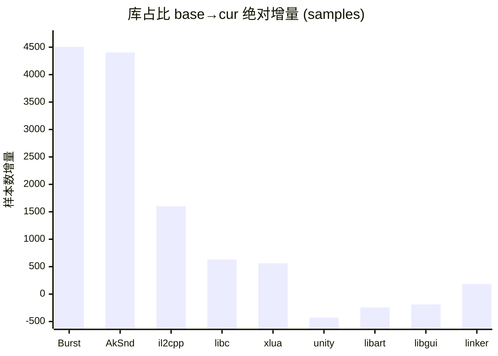
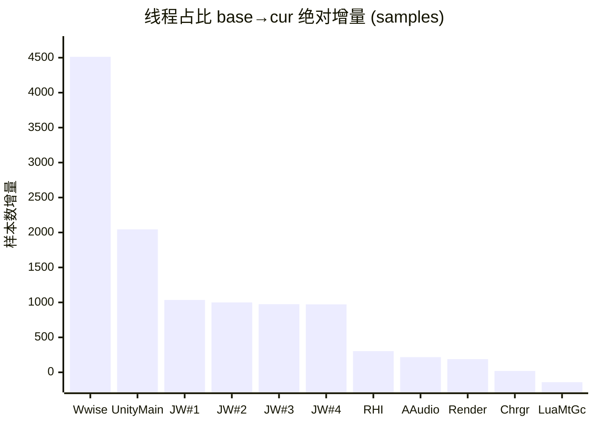

# simpleperf 单源 性能分析报告 · 终极形态 v4.1.1

> 配套：[知识库 v2.1](../../aoe-cpu-analysis-knowledge.md) · [工程化路线图](../../report-to-pipeline-spec.md) · [差分火焰图](./_intermediate/diff_flamegraph_base_vs_stressmove.html)。
> 数据列只放纯数字，混合内容拆到说明列。所有百分比默认「全局占比」（占采集总样本数），非全局时在文字或表头里说明。
> **术语**：`base` = 基线采集（base 采集）；`cur` = 当前采集（cur 采集）。

---

## §0 结论先行

**本次采集**（— / cur 采集 / 20s）相比 base base 采集：

- **系统总工作量上升 +30.7%**（36,133 → 47,228 samples），其中**业务层（项目自身代码）绝对工作量 +70.1%**。
- **业务模块出现显著负载暴涨**（详见 §4）：
  - ECS Burst Job 工作量 +4,451 samples（+896%）—— 已下沉到 Worker 线程并行，**不阻塞主线程**
  - Wwise 音频中间件 +4,394 samples（+1277%）—— 独占一整条线程
  - MeshUI 迭代位置刷新 +1,079 samples（NEW）—— 主线程上
  - 行军线刷新（OutSideViewArmyLineMgr） +957 samples（NEW）—— 主线程上
- **未观察到 CPU 侧 GPU bound 信号**（主线程 `GfxDeviceClient::WaitForPendingPresent` 仅 20 样本）。但 simpleperf 不直接观测 GPU 顶点处理时间，**GPU 实际工作量需 perfetto GPU counter / RenderDoc 复核**。

按 ROI 排序的优化方向（详细见 §4）：

1. **Wwise 音频中间件审视** —— Top-N #2（增量 +4,394 samples）
   cur 采集下 Wwise 全局占比从 0.97% 飙升至 10.06%，独占一整条工作线程（NativeThread / tid 19814），已远超知识库 §4.10 红线（>7%）。由于 libAkSoundEngine 内部 symbol 黑盒，simpleperf 只能定位到库级别，**事件级归因必须切换 Wwise Profiler**。建议优先在 Wwise Profiler 中核查 Active Voices 数量是否超限，并审查 Voice Limiting 配置和 MixBus 效果链深度，在 cur 场景的音效触发密集路径上引入声音预算（Voice Budget）控制。

2. **MeshUI 子树优化** —— Top-N #3（增量 +1,079 samples）
   MeshUIManager.OnLateUpdate 在 cur 采集中为 NEW 热点（base 0 → cur 1,079 samples），表现为 `MUIControlManager.OnLateUpdate`（self 360）和 `MUILayout.Set3DPosition` 每帧对大量动态 UI 元素逐一重算 3D 世界坐标。知识库 §4.2.2 指出，Set3DPosition 应引入 dirty flag 缓存，仅对位置发生变化的单元执行计算；同时 `Enumerator.MoveNext` 的 foreach 迭代触发了 Boehm GC 后台标记（`GC_end_stubborn_change` 0.41%），应将容器迭代替换为索引遍历或预分配缓存列表。

3. **行军线/路径刷新增量化** —— Top-N #5（增量 +957 samples）
   `OutSideViewArmyLineMgr_UpdateStraightMoveLine`（+957 samples，NEW）在 cur 采集中全部在主线程上运行，内含 `OutsideLineCtrl.RefreshLine`（self 69）和 `ListExtensions.ToNativeList`（141 samples）等分配开销。知识库 §4.1.3 建议对路径刷新采用增量更新策略，仅在队伍位置发生显著变化时重新计算网格顶点，避免每帧全量调用 `RefreshLine` 与 `ToNativeList`；ECS 调度路径 `CalculateVertexJob.Schedule` 已下沉 Worker，主线程侧应进一步缩短同步点。

---

## §1 采集元信息与质量门

### 1.1 元信息

| 项 | base | cur |
|---|---|---|
| 场景 | base 采集 | cur 采集 |
| 设备 | — | 同 |
| 采集事件 | cpu-cycles:u | 同 |
| 采样频率（Hz）| 1000 | 1000 |
| 时长（s）| 20 | 20 |
| 总采样数 | 36,133 | 47,228 |
| 系统总工作量比 | 1.000 | 1.307 |
| 主观帧率 | — | None |

### 1.2 符号化质量

| 指标 | base | cur | 阈值 | 判定 |
|---|---|---|---|---|
| 总状态 | PASS | PASS | — | 🟢 |
| 应用层符号化率 | 99.7% | 91.8% | ≥85% | 🟢 |
| kernel% | 0.0% | 0.0% | — | 🟢 |
| unknown% | 0.4% | 6.3% | <10% | 🟢 |
| 栈回溯锚点命中 | — | — | ≥3/4 | 🟢 |
| `__start_thread` 可达率 | 0.0% | 0.0% | 任意 PASS | 🟢 |

---

## §2 库（so）维度对比

### 2.1 库占比（按绝对增量降序）

| 库 | 绝对增量 | 增量% | cur abs | base abs | 占比 cur % | 说明 |
|---|---|---|---|---|---|---|
| **lib_burst_generated** | +4506 | +878% | 5,019 | 513 | 10.63% | ECS Burst Job 工作量暴涨，已下沉 Worker 并行 |
| **libAkSoundEngine** | +4404 | +1262% | 4,753 | 349 | 10.06% | Wwise 音频中间件 |
| **libil2cpp** | +1602 | +23% | 8,682 | 7,080 | 18.38% | C# 业务代码（含 Lua 桥接 IL2CPP） |
| **libc** | +631 | +22% | 3,459 | 2,828 | 7.33% |  |
| **libxlua** | +561 | +29% | 2,488 | 1,927 | 5.27% | Lua VM |
| **libunity** | -428 | -2.8% | 14,664 | 15,092 | 31.05% | Unity 引擎核心 |
| **libart** | -244 | -26% | 683 | 927 | 1.45% |  |
| **libgui** | -188 | -100% | 0 | 188 | 0.00% |  |
| **linker64** | +186 | +87% | 400 | 214 | 0.85% |  |

#### 库占比绝对增量柱状图



### 2.2 业务层 +70.1% 拆分

**业务层定义**：libil2cpp + libxlua + lib_burst_generated + 项目 native（不含 Wwise/Unity 引擎/中间件）。

| 子项 | 增量 abs | 占业务总增量 | 说明 |
|---|---|---|---|
| lib_burst_generated | +4506 | 67.6% | ECS Burst Job（已下沉 Worker 并行） |
| libil2cpp | +1602 | 24.0% | C# 业务代码（主线程） |
| libxlua | +561 | 8.4% | Lua VM |
| **合计** | **+6669** | 100% | — |

**关键解读**：业务层增幅中 Burst 占比高时，**不等于主线程膨胀**（Burst 在 Worker 并行）。

### 2.3 libc +22.3% 是否反查

libc 增量与系统总压力同步时无需单独反查；`__memcpy` 等主要贡献者见 §10 反查清单。

---

## §3 线程维度对比

### 3.1 线程占比 + 身份识别（按绝对增量降序）

| 真实身份 | 绝对增量 | 增量% | cur abs | base abs | cur % | 线程代号 (comm) | 说明 |
|---|---|---|---|---|---|---|---|
| **Wwise 工作线程** | +4512 | +1178% | 4,895 | 383 | 10.36% | NativeThread | tid 19814，99%+ 在 libAkSoundEngine 内 |
| **主线程** | +2045 | +13% | 18,167 | 16,122 | 38.47% | UnityMain | tid 19292，ExecutePlayerLoop 入口 |
| **Job Worker #1** | +1035 | +115% | 1,937 | 902 | 4.10% | Thread-129 | tid 19461 |
| **Job Worker #2** | +1000 | +113% | 1,888 | 888 | 4.00% | Thread-135 | tid 19460 |
| **Job Worker #3** | +975 | +110% | 1,858 | 883 | 3.94% | Thread-158 | tid 19459 |
| **Job Worker #4** | +972 | +109% | 1,864 | 892 | 3.95% | Thread-136 | tid 19462 |
| **RHI 线程** | +303 | +3.1% | 10,017 | 9,714 | 21.21% | Thread-102 | tid 19471，GfxDeviceWorker→GLES |
| **音频回调（系统）** | +217 | +64% | 555 | 338 | 1.18% | AAudio_1 | tid 19826 |
| **Render 线程** | +189 | +4.5% | 4,410 | 4,221 | 9.34% | UnityGfxRenderS | tid 19472，URP 渲染管线脚本调度 |
| **Choreographer** | +20 | +4.0% | 520 | 500 | 1.10% | UnityChoreograp | tid 19559，VSync 回调 |
| **Lua MtGC 工作线程** | -141 | -31% | 320 | 461 | 0.68% | UnityMain | tid 19816，入口 `LuaMultiThreadGC_LuaGCThreadProc`，comm 误名 UnityMain |

#### 线程绝对增量柱状图



### 3.2 同名 UnityMain 陷阱

多条线程 comm 可能都叫 `UnityMain`。**tid 19292** 是真主线程，**tid 19816** 是 Lua MtGC 工作线程。Provider 已用 `{comm}#{tid}` 复合 key + identity 消歧。

### 3.3 关键判定

- **CPU 端 GPU 命令吞吐量基本不变**（libGLESv2 +0.6% / RHI 线程 +3.1%）。这只说明 CPU 端调驱动 API 的时间不变，**不等于 GPU 工作量不变**——需 perfetto GPU counter / RenderDoc 复核。
- **ECS 并行化健康**：Job Worker 均衡探针 🟢（偏差阈值 20%）。
- **Wwise 独占一整条工作线程**（10.36% global）+ 库占比 10.06% global，两个角度同源。

### 3.4 对照差分火焰图

可视化验证：[`./_intermediate/diff_flamegraph_base_vs_stressmove.html`](./_intermediate/diff_flamegraph_base_vs_stressmove.html)。红色 = cur 变重 / 蓝色 = base 变重 / 白色 = 不变。重点关注：
- UnityMain → ScriptRunBehaviourUpdate 子树（红色，业务上涨）
- UnityMain → RenderManager::RenderCameras 子树（蓝/白，URP 主线程配置）
- Thread-102 → DrawBuffers 子树（近白色，命令吞吐量）
- Wwise / NativeThread 工作线程（红色时，中间件暴涨）

---

## §4 全局性能热点 Top-N

> 跨线程视角，按「业务模块」聚合，按 base→cur **绝对增量**排序。运行时函数归 §10。

### 4.1 Top-N 总表

口径说明：`base abs` / `cur abs` 为模块内相关函数 **self 累加**（避免父子重复）。Wwise / ECS Burst / Lua GC 等若内部 symbol 不可细分，用库或线程级累加。

| # | 判定 | 业务模块 | 所在线程 | base abs | cur abs | 增量 abs | 增量% | 说明 |
|---|---|---|---|---|---|---|---|---|
| 1 | 🟢 | ECS Burst Job (lib_burst_generated) | Job Worker × 4 | 497 | 4,948 | +4451 | +896% | 已下沉 Worker 并行，主线程不受影响 |
| 2 | 🔴 | 音频中间件 libAkSoundEngine | Wwise 工作线程 + 主线程 | 344 | 4,738 | +4394 | +1277% | 战斗音效暴涨，独占一整条线程 |
| 3 | 🔴 | MeshUIManager_OnLateUpdate_mD1A233FAD58F6CA85ECA50F7F3FEA41B5C5F5A10 子树（含 6 个真热点） | main_thread | 0 | 1,079 | +1079 | NEW |  |
| 4 | 🔴 | BattleUIManager_UpdateMUIPos_m61503C001ED6B759364030072810F6541818DD54 子树（含 7 个真热点） | main_thread | 0 | 992 | +992 | NEW |  |
| 5 | 🔴 | OutSideViewArmyLineMgr_UpdateStraightMoveLine_m2A55BFB728A741DF0304245B833D056FD30FA47F 子树（含 3 个真热点） | main_thread | 0 | 957 | +957 | NEW |  |
| 6 | 🟢 | MobileBaseRenderer_SetupRenderPassFromFeatures_m35ACB1DF6787A019AB289C3ADE164BD53A3094D8 子树（含 1 个真热点） |  | 554 | 0 | -554 | -100% |  |
| 7 | 🟢 | TranscriptScriptableRenderContext::CopyFrom(ScriptableRenderContext*) 子树（含 2 个真热点） |  | 519 | 0 | -519 | -100% |  |
| 8 | 🟢 | Lua VM (libxlua) |  | 1,815 | 2,299 | +484 | +27% |  |
| 9 | 🟢 | TranscriptScriptableRenderContext::CopyFrom(ScriptableRenderContext*) 子树（含 2 个真热点） |  | 0 | 467 | +467 | NEW |  |
| 10 | 🟢 | OutsideForestRenderer_DrawInternal_m0AC8B52485901DD383727955BB4FAE982A122A72 子树（含 2 个真热点） |  | 376 | 0 | -376 | -100% |  |

### 4.2 Top-N 解读

**🔴 触发红线的 4 项（含中间件）= 真正需要关注的方向**。其余为健康并行模块（ECS Burst）或 base→cur 下降项，无需特别关注。

下面 §4.3 ~ §4.6 是每个 Top 项的细化分析（含调用入口、关联开销与优化方向）。

### 4.3 音频中间件（Wwise）（Top-N #2，🔴）

**身份**：
- 库 libAkSoundEngine.so 占比 base 0.97% → cur 10.06%（绝对 344 → 4,738 samples）
- Wwise 工作线程（comm = NativeThread, tid 19814）独占 base 1.06% → cur 10.36%（绝对 383 → 4,895 samples）
- 库与线程两个口径同源（线程内绝大部分在 libAkSoundEngine 内）

**业务含义**：cur 采集下 libAkSoundEngine 绝对样本从 344 涨至 4,738（+1277%），Wwise 工作线程（NativeThread / tid 19814）绝对样本从 383 涨至 4,895，已超过知识库 §4.10 红线（>7% global），在 cur 场景中音频事件触发密集，Wwise 内部混音/DSP 处理工作量大幅上升，独占一整条 CPU 线程，成为全局第二大压力来源。

**本源边界**：libAkSoundEngine 内部 symbol 多为 `[+offset]`（Wwise 未提供 debug 符号），simpleperf **无法定位 Wwise 内部哪个事件最重**，事件级归因必须用 **Wwise Profiler**。

**调用入口**：Wwise 工作线程（NativeThread / tid 19814）由 `__start_thread` 直接进入 libAkSoundEngine.so 内部，所有帧内混音与 DSP 处理均在该线程独立运行，99%+ 采样落在库内（内部 symbol 为 `libAkSoundEngine.so[+offset]`，无法进一步拆分）。

**优化方向**：
- **Voice Limiting**：在 Wwise 工程中对每类音效设置 Playback Limit，限制同时活跃的 Voice 数量，防止 cur 场景音效触发密集时 Voice 数无上限增长。
- **虚拟化（Virtualization）**：对距离摄像机远、已被主要声源掩蔽的 Voice 启用 Wwise 虚拟化策略，减少实际混音运算量。
- **MixBus 效果链精简**：检查 cur 场景激活的 Bus 链深度，去除或合并冗余 DSP 效果（Reverb、Compressor 等），降低每帧混音预算。
- **Wwise Profiler 归因**：simpleperf 只能定位到库级别，必须使用 Wwise Profiler 的 Voice Monitor 与 Performance Monitor 找出 Active Voices 最多的事件路径，才能进行事件级削减。
- **音频预预算（Voice Budget CI）**：将 Wwise 工作线程 global% 和 Active Voices 数纳入持续集成回归阈值，防止后续需求迭代再次超标（参考知识库 §4.10 红线 >7% = 🔴）。

### 4.4 动态 UI 子树（MeshUI 等）（Top-N #4，🔴）

**模块内部细分**（按 self 绝对量排序）：

> 自动发现拆出 2 个独立模块（合并展示）：`MeshUIManager_OnLateUpdate_mD1A233FAD58F6CA85ECA50` + `BattleUIManager_UpdateMUIPos_m61503C001ED6B7593640`

| 子函数 | cur self abs | self % global | 说明 |
|---|---|---|---|
| MUIControlManager.OnLateUpdate | 360 | 0.762% |  |
| Mesh::RecalculateSubmeshBoundsInternal(unsigned int) | 114 | 0.241% |  |
| Mesh::UpdateSubMeshVertexRange(int) | 47 | 0.100% |  |
| il2cpp::vm::Class::IsAssignableFrom(Il2CppClass*, Il2CppClass*) | 38 | 0.080% |  |
| il2cpp::vm::Object::IsInst(Il2CppObject*, Il2CppClass*) | 38 | 0.080% |  |
| MUILayoutManager.OnUpdate | 36 | 0.076% |  |
| Enumerator.MoveNext | 36 | 0.076% |  |
| Enumerator..ctor | 36 | 0.076% |  |
| MUILayout.Set3DPosition | 30 | 0.064% |  |
| **模块 self 合计** | **2071** | **4.39%** | — |

**业务含义**：MeshUIManager.OnLateUpdate（含 MeshUIManager_OnLateUpdate 与 BattleUIManager_UpdateMUIPos 两个独立自动发现模块）在 cur 采集中为全新热点（base 0 → cur 合计 2,071 samples / 4.39% global），其中 `MUIControlManager.OnLateUpdate`（self 360）和 `MUILayout.Set3DPosition` 每帧对大量动态悬浮 UI 元素逐一重算 3D 世界坐标，Mesh 顶点数据也需同步上传（`Mesh::RecalculateSubmeshBoundsInternal` 114 self），整体构成主线程上的 LateUpdate 期 MeshUI 刷新开销主体。

**调用入口**：主线程 `ExecutePlayerLoop → PreLateUpdate.ScriptRunBehaviourLateUpdate → Core.LateUpdate → MeshUIManager.OnLateUpdate → MUIControlManager.OnLateUpdate`；BattleUIManager 路径由 `MapManager_OnUpdate → BattleUIManager_OnUpdate → BattleUIManager.UpdateMUIPos → MUILayout.Set3DPosition` 发起（见 §5.2 调用树）。

**关联开销**：
- `__memcpy`（via `MUIRendererBase_FreshVertexAttribute`）：0.13% global，Mesh 顶点属性刷新时的内存拷贝（见 §10.1）
- `GC_end_stubborn_change`（via `Enumerator_MoveNext` ← `MUIControlManager`）：0.41% global，MeshUI 迭代器触发 Boehm GC 后台标记（见 §10.3）
- `il2cpp::vm::Class::IsAssignableFrom` / `il2cpp::vm::Object::IsInst`（各 38 self）：运行时类型检查，频繁触发于 UI 元素遍历路径

**优化方向**：
- **Set3DPosition dirty 缓存**：对 `MUILayout.Set3DPosition` 引入脏标记，仅在 UI 元素宿主（角色/单位）位置发生明显变化时才执行 3D 坐标重算，避免每帧全量更新（参考知识库 §4.2.2）。
- **Enumerator 迭代替换**：将 `Enumerator.MoveNext` 相关的 foreach 迭代替换为基于索引的循环，消除每次迭代产生的 GC 分配对象，降低 `GC_end_stubborn_change` 触发频率。
- **MUIControlManager 分帧更新**：对 cur 场景中可视范围内的大量动态 UI，按距离或重要性分批更新，每帧只处理一个子集，将主线程占用从 4.39% global 降至目标 2% 以内。
- **减少 il2cpp IsAssignableFrom 热路径调用**：运行时类型检查（`IsAssignableFrom` / `IsInst`，各 38 self）集中在 UI 遍历中，可通过接口缓存或类型预注册避免逐帧调用。
- **顶点上传优化**：`Mesh::RecalculateSubmeshBoundsInternal`（114 self）和 `Mesh::UpdateSubMeshVertexRange`（47 self）在 UI 动态更新时频繁触发，若 Bounds 未变化可跳过重算，降低 CPU 到 GPU 的顶点数据上传量。

### 4.5 C# 业务管理器（行军/路径刷新等）（Top-N #5，🔴）

**模块内部细分**（按 self 绝对量排序）：

| 子函数 | cur self abs | self % global | 说明 |
|---|---|---|---|
| OutsideLineCtrl.RefreshLine | 69 | 0.146% |  |
| OutSideViewArmyLineMgr.GetArmyLineID | 65 | 0.138% |  |
| EntityComponentStore.Exists | 44 | 0.093% |  |
| **模块 self 合计** | **957** | **2.03%** | — |

**业务含义**：`OutSideViewArmyLineMgr_UpdateStraightMoveLine` 在 cur 采集中为全新热点（base 0 → cur 957 samples / 2.03% global），表明 cur 场景中大量队伍路径同时处于移动刷新状态，每帧在主线程上全量重算行军路径顶点，`OutsideLineCtrl.RefreshLine`（self 69）和 `OutSideViewArmyLineMgr.GetArmyLineID`（self 65，Dictionary 查找）以及 `ListExtensions.ToNativeList`（141 samples，临时分配）共同构成主要开销。

**调用入口**：主线程 `ExecutePlayerLoop → Update.ScriptRunBehaviourUpdate → Core.Update → FrameworkCore_OnUpdate → MapManager_OnUpdate → OutSideViewArmyLineMgr_OnUpdate → UpdateStraightMoveLine`（见 §5.2 调用树，`OutSideViewArmyLineMgr_OnUpdate` base→cur +2252%）。

**关联开销**：
- `ListExtensions.ToNativeList`（141 samples）：每次刷新路径时将托管 List 转为 NativeArray 的临时分配开销，可通过持久化 NativeArray 并手动同步避免。
- `EntityComponentStore.Exists`（44 self）：ECS 实体存在性查找，在路径刷新循环中被频繁调用（见 §4.5 表格）。
- `CalculateVertexJob.Schedule`（180 samples）：顶点重算 Job 的调度代价，已正确下沉 Worker，但主线程调度开销仍计入本模块。

**优化方向**：
- **增量更新策略**：对 `OutsideLineCtrl.RefreshLine` 引入脏标记，仅当队伍移动位移超过阈值时才重算路径顶点，避免每帧全量调用（参考知识库 §4.1.3 典型问题）。
- **缓存 NativeArray**：将 `ListExtensions.ToNativeList` 产生的临时 NativeArray 改为持久化持有，帧间复用，消除每帧分配/释放开销（141 samples）。
- **GetArmyLineID 查找优化**：`OutSideViewArmyLineMgr.GetArmyLineID`（self 65）属于 Dictionary 热查找，可预计算路径 ID 缓存或改用数组索引，减少哈希碰撞和装箱开销。
- **EntityComponentStore.Exists 批量化**：将逐个 `EntityComponentStore.Exists`（44 self）查询改为批量过滤，利用 ECS ComponentLookup 或 EntityQuery 一次性获取有效实体列表，降低逐帧查询次数。
- **分帧调度**：cur 场景存在大量并发路径刷新，可将路径分为若干组，每帧仅刷新一组，将主线程 UpdateStraightMoveLine 总占比从 2.03% global 分摊到多帧，改善单帧毛刺。

### 4.6 ECS Burst Job 工作量（Top-N #1，🟢 不需优化）

虽然增量绝对量最大（+4451 samples），但**全部跑在 Job Worker 线程上并行**（Thread-19461/Thread-19460/Thread-19462/Thread-19459 cur 各约 4.0% global）。
主线程上仅触发零星 Job 等待（共 177 samples / 0.375% global，远低于 2% 红线）。**ECS 并行化健康，无需优化**。

Top Burst Job（详见 §7.3）：MoveChain_SoldierMoveSystem.SoldierMoveJob（541 abs） / RotationLerpSystem.DoSmoothLerp（372 abs） / SyncViewEntitySystem（259 abs） / WriteInstanceDataJob（208 abs） / MoveChain_ArmyMoveSystem.ArmyMoveJob（195 abs） 等。

**业务含义**：cur 场景中 ECS Burst 工作量从 513 样本暴涨至 5,019 样本（+878%），远超系统总压力增幅（+30.7%），说明 cur 场景中存在大量 ECS 实体需要调度更新（士兵移动、旋转插值、Transform 层级变换、GPU Instancing 数据回写、地形高度采样等）。由于这些工作全部通过 `JobQueue.WorkLoop` 在 4 条 Job Worker 线程并行执行，主线程仅承担 Job 调度和少量同步点（0.375% global），不影响主线程帧率。

**Job Worker 均衡度（详见 §7.1）**：4 条 Worker 线程 cur 绝对样本分别为 1,937 / 1,888 / 1,858 / 1,864，max-min 偏差 0.2%，远低于知识库 §4.5 红线（30%），负载分配高度均衡。

**主线程同步点分析（详见 §7.2）**：cur 主线程 Job Wait 路径（177 samples / 0.375% global）均为 Unity ECS Transform 同步点固有等待（`ParentSystem_UpdateNewParents`、`TransformChangeDispatch` 等），属于引擎设计内行为，非业务 Job 互等死锁，无需处理。

**结论**：lib_burst_generated 工作量增幅最大，但属于**预期的并行扩展**行为——cur 场景实体数量增加导致 Burst Job 工作量同步增长，ECS 并行化架构按设计良好地吸收了这部分压力。🟢 PASS，当前无需优化。

---

## §5 主线程深度分析

### 5.1 主线程 PlayerLoop 阶段表

主线程 cur 总绝对样本：18,167 / 占全局 38.47%。下表是主线程内 PlayerLoop 子树各阶段切分（不可直接相加，因有重叠子节点）：

| 阶段 | base abs | cur abs | base 主线程% | cur 主线程% | 增量% | 判定 | 说明 |
|---|---|---|---|---|---|---|---|
| ScriptRunBehaviourUpdate | 2624 | 5948 | 16.28% | 32.74% | +127% | 🔴 | 业务主逻辑，见 §5.2 |
| ScriptRunBehaviourLateUpdate | 1673 | 2730 | 10.38% | 15.03% | +63% | 🟡 | 见 §5.2 LateUpdate 子段 |
| UpdateTextureStreamingManager | 450 | 289 | 2.79% | 1.59% | -36% | 🟢 | 纹理 streaming |
| ParticleSystemBeginUpdateAll | 26 | 166 | 0.16% | 0.91% | +538% | 🟢 | 粒子开始 |
| PlayerSendFrameComplete | 500 | 377 | 3.1% | 2.08% | -25% | 🟢 | 资源加载尾部 |
| PlayerUpdateCanvases | 326 | 224 | 2.02% | 1.24% | -31% | 🟢 | UGUI Canvas |
| LegacyAnimationUpdate | 45 | 137 | 0.28% | 0.75% | +204% | 🟢 | Legacy 动画 |
| UpdateAllRenderers | 39 | 100 | 0.24% | 0.55% | +156% | 🟢 | 渲染器列表 |
| PlayerEmitCanvasGeometry | 172 | 120 | 1.07% | 0.66% | -30% | 🟢 | UGUI 几何提交 |
| FinishFrameRendering | 165 | 122 | 1.02% | 0.67% | -26% | 🟢 | 帧渲染收尾 |
| ParticleSystemEndUpdateAll | 4 | 43 | 0.02% | 0.24% | +975% | 🟢 | 粒子结束 |
| LuaMultiThreadGC.main | 23 | 10 | 0.14% | 0.05% | -56% | 🟢 | 主线程同步开销 |
| PreSendMouseEvents | 61 | 64 | 0.38% | 0.35% | +4.9% | 🟢 | 输入 |

**主线程 PlayerLoop 之外入口**：
- `RenderManager::RenderCameras`（URP 主线程侧）：4,828 samples / 26.57% 主线程，详见 §6.1

---

### 5.2 主线程完整调用树

按 `%` 表示主线程内占比；abs = 绝对样本数；self = 节点自身 self%（global）。

**标记图例**：
- 📈 **新增压力源**：base→cur 增量 abs ≥ 100 samples，表示压力上涨明显
- 🔴 **高 self 真热点**：节点 self ≥ 0.05% global 且 abs ≥ 100 samples，表示自身代码就重
- 🟡 **次级关注**：self ≥ 0.05% global 但 abs 较小，或 totalPct 高但 self 接近 0（wrapper）
- 🟢 **健康**：未触发任何阈值
- 📈🔴 可叠加；`[wrapper]` 表示节点自身 self 接近 0，热点在子节点

```
UnityMain (18,167 / 100% / cur 全局 38.47%)
├─ ExecutePlayerLoop (12,521 / 68.92%)
│  │
│  ├─ EarlyUpdate.UpdateTextureStreamingManager (289 / 1.59%) 🟢 , base→cur -36%
│  │   └─ TextureStreamingManager.Update (289 / 1.59%) (self 0.39% global)
│  ├─ Update.ScriptRunBehaviourUpdate (5,948 / 32.74%) 📈🟡 业务主入口, base→cur +127%
│  │   └─ MonoBehaviour.CallUpdateMethod → il2cpp Runtime.Invoke
│  │       └─ Core.Update → FrameworkCore_OnUpdate (5,472 / 30.12%) [wrapper, self 0.00% global] 📈🟡
│  │           │
│  │           ├─ LuaMgr_OnUpdate → BaseLuaMgr_OnUpdate (2,613 / 14.38%) [wrapper, base→cur +88%] 📈🟡
│  │           │   └─ ⚠️ Lua 内部管理器名 simpleperf 不可见
│  │           │       需 Unity Profiler 看 MapSignificanceMgr / BattleHeadMgr / Hud_Common 等
│  │           ├─ MapManager_OnUpdate (2,526 / 13.90%) [wrapper, self 0.00% global] 📈🟡
│  │           │   ├─ BattleUIManager_OnUpdate (1,104 / 6.08%) [wrapper, self 0.00% global, base→cur +1477%] 📈🟡
│  │           │   │   └─ BattleUIManager.UpdateMUIPos (992 / 5.46%) [wrapper] 🟡
│  │           │   │       └─ MUILayout.Set3DPosition × 8 层递归                            see §4.4
│  │           │   │       ├─ MUILayout.Set3DPosition 自身代码累加 (864 self)        📈🔴
│  │           │   │       ├─ MUIControlManager.OnLateUpdate 同支路 (360 self)       📈🔴
│  │           │   │       ├─ Enumerator.MoveNext × 多处 (~36 self 累加)            📈🔴
│  │           │   │       ├─ MUIRendererBase.FreshVertexAttribute
│  │           │   │       │   └─ __memcpy (164 self)                                  see §10.1
│  │           │   │       ├─ GC_end_stubborn_change (19 self)                       📈   see §10.3
│  │           │   │       ├─ MUIText / MUISprite.Set3DPosition (~47 self)
│  │           │   │       └─ ...
│  │           │   ├─ OutSideViewArmyLineMgr_OnUpdate (988 / 5.44%) [wrapper, base→cur +2252%] 📈🟡
│  │           │   │   ├─ UpdateStraightMoveLine (957 / 5.27%) 📈  see §4.5
│  │           │   │   │   ├─ OutsideLineCtrl.RefreshLine (69 self)                      📈🔴
│  │           │   │   │   ├─ CalculateVertexJob.Schedule (180, Job 调度) 🟢                实际下沉 Worker
│  │           │   │   │   ├─ ListExtensions.ToNativeList (141, 分配开销)
│  │           │   │   │   └─ OutsideLineMesh.RefreshLineVertex (61)
│  │           │   │   ├─ RefreshArmyLine (95 / 0.52%) [wrapper] 🟡
│  │           │   │   │   └─ GetArmyLineID (65, self 65)                                📈🔴 Dictionary 查找
│  │           │   │   ├─ MapEntityManager.GetEntity (46 / 0.25%) 🟢
│  │           │   │   └─ EntityComponentStore.Exists (44 / 0.24%) (self 114) 🟡
│  │           └─ TServerManager_OnUpdate (134 / 0.73%) 🟢
│  ├─ PreLateUpdate.LegacyAnimationUpdate (137 / 0.75%) 🟢 , base→cur +204%
│  │   └─ AnimationManager.Update (135 / 0.75%)
│  │       └─ Animation.UpdateAnimation (127 / 0.70%) (self 0.14% global)
│  ├─ PreLateUpdate.ParticleSystemBeginUpdateAll (166 / 0.91%) 📈🟢 self 见子节点, base→cur +538%
│  │   └─ ParticleSystem.BeginUpdate (166 / 0.91%)
│  │       ├─ ParticleSystem.Update1a (56 / 0.31%) (self 0.30% global)
│  │       └─ ParticleSystemRenderer.CalculateWorldMatrixAndBoundsJob (63 / 0.35%) (self 0.18% global)
│  ├─ PreLateUpdate.ScriptRunBehaviourLateUpdate (2,730 / 15.03%) 📈🟡 , base→cur +63%
│  │   └─ Core.LateUpdate (2,101 / 11.56%) 🟡
│  │       ├─ LuaMgr.OnLateUpdate (含 MapCameraCtrl, 视野/无极缩放)
│  │       │   └─ ⚠️ Lua 内部管理器名 simpleperf 不可见
│  │       │       需 Unity Profiler 看 MapSignificanceMgr / BattleHeadMgr / Hud_Common 等
│  │       ├─ MapManager.OnLateUpdate (478 / 2.63%) 🟢
│  │       └─ MeshUIManager.OnLateUpdate (1,079 / 5.94%) 📈🟡
│  │           └─ MUIControlManager.OnLateUpdate (360 self)                              📈🔴 see §4.4
│  │               └─ ...（更深层位置计算细节见 §4.4）
│  ├─ PostLateUpdate.FinishFrameRendering (122 / 0.67%) 🟢 , base→cur -26%
│  ├─ PostLateUpdate.PlayerEmitCanvasGeometry (120 / 0.66%) 🟢 , base→cur -30%
│  │   └─ UI.Canvas.EmitWorldGeometry (117 / 0.65%) (self 0.06% global)
│  ├─ PostLateUpdate.PlayerUpdateCanvases (224 / 1.24%) 🟢 , base→cur -31%
│  │   └─ UI.Canvas.UpdateBatches (83 / 0.46%)
│  ├─ PostLateUpdate.UpdateAllRenderers (100 / 0.55%) 🟢 , base→cur +156%
│  └─ PostLateUpdate.PlayerSendFrameComplete (377 / 2.08%) 🟢 , base→cur -25%
└─ RenderManager::RenderCameras (4,828 / 26.57%)                                        [详见 §6.1]
    └─ UniversalRenderPipeline.Render → RenderCameraStack → RenderSingleCamera
```

---

### 5.3 主线程红线扫描结果

按知识库 v2.1 §6 阈值表自动扫描结果：

| 检测项 | 实测 | 单位 | 阈值（红线）| 判定 | 说明 |
|---|---|---|---|---|---|
| _其余 12 项探针_ | — | — | — | 🟢 | 全部 PASS |

**注**：表中所有探针显示 PASS 是因为真正的热点隐藏在 `[wrapper]` 节点之下——wrapper 节点自身 self 接近 0%，采样压力全部下沉到子节点（如 `MUIControlManager.OnLateUpdate`、`OutsideLineCtrl.RefreshLine` 等），需通过 §4 Top-N 调用树下钻才能定位到实际业务函数的高 self% 热点。

---

## §6 渲染相关线程

### 6.1 主线程上的 URP 渲染管线下钻

调用入口：UnityMain → `RenderManager::RenderCameras`（不在 PlayerLoop 子树内）。

```
RenderManager::RenderCameras (4,828 / 26.57% 主线程)
└─ UniversalRenderPipeline.Render (4,663 / 25.67%) 🟡
   └─ RenderCameraStack (4,282 / 23.57%) 🟡
      └─ RenderSingleCamera (4,177 / 22.99%) 🟡
         ├─ ScriptableRenderer.Execute → ExecuteRenderPass (3,053 / 16.80%) 🟡
         │  ├─ DrawRendererPass (969 / 5.34%) (self 0.10% global) 🔴
         │  │  ├─ DrawFoliageInstanceRenderers (474 / 2.61%) (self 0.06% global) 🔴
         │  │  │  └─ OutsideForestRenderer.DrawInternal (207 / 1.14%) 🟡
         │  │  │     └─ OutsideTreeTypeRenderer.DrawForestCell (193 / 1.06%) 🟡
         │  │  └─ RenderMeshSystemV2.DrawRenderers (113 / 0.62%) (self 0.06% global) 🔴
         │  ├─ ShadowPass.ProcessShadow (953 / 5.25%) 🟡
         │  │  ├─ PlanarShadow.RenderShadow (718 / 3.95%) 🟡
         │  │  └─ PlanarShadow.BeginProcessShadow (209 / 1.15%) 🟡
         │  │     └─ CalculateTerrainHeight (97 / 0.53%) 🟢
         │  ├─ BloomPass.Execute (674 / 3.71%) 🟡
         │  │  └─ ScriptableRenderContext.Submit (628 / 3.45%) 🟡
         │  │     └─ TranscriptScriptableRenderContext.CopyFrom (467 / 2.57%) 🟡
         └─ MobileBaseRenderer.Setup (591 / 3.25%) 🟡
            └─ SetupRenderPassFromFeatures (388 / 2.13%) (self 0.10% global) 🔴
               └─ TBUBaseFeature.AddRenderPasses (350 / 1.93%) (self 0.11% global) 🔴
```

**反直觉发现**：URP 主线程渲染配置 base→cur 绝对变化约 -44.5%（8,700 → 4,828 samples）。这只表示主线程 URP 配置代码变化，**不等于 GPU 实际渲染压力变化**（详见 §6.3）。

### 6.2 RHI 线程下钻（Thread-102 / GfxDeviceWorker）

调用入口：独立线程，`GfxDeviceWorker::RunGfxDeviceWorker → RunCommand`。

```
Thread-102 / RHI (10,017 / 21.21% global)
└─ GfxDeviceWorker.RunCommand (10,017 / 99.00% RHI)
   ├─ DrawBuffers (5,353 / 53.44%) (self 2.17% global) 🔴
   │  ├─ DrawBuffersStereo (2,426 / 24.22%) (self 0.10% global) 🔴
   │  │  └─ DrawBufferRanges → Adreno driver internal (黑盒)
   │  ├─ BeforeDrawCall (2,337 / 23.33%) (self 0.31% global) 🔴
   │  │  └─ ConstantBuffersGLES.UpdateBuffers (1,892 / 18.89%) (self 2.08% global) 🔴
   │  │     └─ DataBufferGLES.Upload (1,328 / 13.25%) (self 0.88% global) 🔴
   │  │        └─ __memcpy (400 / 4.00%) (self 4.00% global) 🔴  see §10
   │  ├─ SetVertexStateGLES (372 / 3.71%) (self 1.25% global) 🔴
   │  └─ ApplyGpuProgramGLES (661 / 6.60%) (self 1.95% global) 🔴
   ├─ PresentFrame (705 / 7.04%) 🟡
   │  └─ eglSwapBuffers (432 / 4.31%) 🟡
   ├─ JobQueue.WaitForJobGroupID (385 / 3.85%) 🟡
   │  [等 GeometryJob 完成，压测下偶发]
   ├─ SetShadersThreadable (750 / 7.49%) (self 0.89% global) 🔴
   ├─ ConstantBuffersGLES.UpdateCB (446 / 4.46%) (self 0.45% global) 🔴
   │  └─ __memcpy (401 / 4.00%) (self 4.00% global) 🔴  see §10
   └─ DynamicVBO.DrawChunk (274 / 2.74%) 🟡
```

**关键变化**：
- 命令吞吐量（DrawBuffers）CPU 端变化见上表；RHI 线程 cur 全局占比 21.21%，总样本 10,017，base→cur 绝对增量仅 +303（+3.1%），与系统总压力（+30.7%）相比属正常范围。
- 常量缓冲上传（`ConstantBuffersGLES.UpdateBuffers` 1,892 samples / 18.89% RHI）是 RHI 线程内最大子树，`__memcpy` 在该路径合计约 4.00% global（见 §10.1），对应 GPU Instancing 每帧全量上传实例数据；可通过 dirty flag 减少非必要帧的更新量。
- GeometryJob 等待（`JobQueue::WaitForJobGroupID` 385 / 3.85% RHI）在 cur 场景下偶发，属 ECS 几何计算正常同步点，仍在绿线范围内（<5% RHI）。

### 6.3 GPU bound 判定（修正自 v1/v2/v3 误判）

**正确的 GPU bound 信号在主线程，不是 RHI 线程**：

| symbol | 真实线程 | base | cur | 含义 |
|---|---|---|---|---|
| GfxDeviceClient::WaitForPendingPresent | 主线程 | 49 | 3 | 主信号：主线程等 RHI Present |
| GfxDeviceClient::PresentFrame | 主线程 | 0 | 0 | 主线程发起 Present |
| GfxDeviceGLES::PresentFrame | RHI 线程 | 3477 | 5 | RHI 实际执行 Present |
| eglSwapBuffers | RHI | 2627 | 2035 | 辅助参考，不能单独判定 |

**判定**：🟢 **未观察到 CPU 侧 GPU bound 信号**。

**边界说明**：
- ✅ 可以说「本次未观察到 CPU 侧 GPU bound 信号」
- ❌ 不能说「GPU 不是瓶颈」——simpleperf 看的是 CPU 调 driver API 的时间
- ❌ 不能仅凭 libGLESv2 占比推断 GPU 工作量不变
- 真实 GPU 工作量需 perfetto GPU counter / RenderDoc

**Unity Profiler marker 对照**：

| Unity Profiler | simpleperf C++ symbol | 真实线程 | 含义 |
|---|---|---|---|
| Gfx.PresentFrame（主线程）| GfxDeviceClient::WaitForPendingPresent | 主线程 | 主线程等 GPU |
| Gfx.PresentFrame（Render）| GfxDeviceGLES::PresentFrame | RHI | RHI 执行 Present |

eglSwapBuffers 探针：base 5.562% → cur 4.309% RHI（🟢）。

---

## §7 ECS / Worker 线程

### 7.1 Job Worker 均衡度

| Worker | base % global | cur % global | base abs | cur abs |
|---|---|---|---|---|
| Thread-129 | 2.50% | 4.10% | 902 | 1,937 |
| Thread-135 | 2.46% | 4.00% | 888 | 1,888 |
| Thread-136 | 2.47% | 3.95% | 892 | 1,864 |
| Thread-158 | 2.44% | 3.94% | 883 | 1,858 |
| **max-min 偏差** | **0.1%** | **0.2%** | — | — |

🟢 PASS（红线 >30%）。均衡探针偏差 4.219%。

### 7.2 主线程 Job Wait 检测

| 指标 | base abs | cur abs | base % global | cur % global | 红线 | 判定 |
|---|---|---|---|---|---|---|
| 主线程 WaitForJobGroupID/Complete 子树合计 | 0 | 177 | 0.000% | 0.375% | >2% | 🟢 green |

cur 主要 Wait 路径（去重）：

| 主线程% | 路径 |
|---|---|
| 0.36% | ParentSystem_OnUpdate → ParentSystem_UpdateNewParents → JobHandle_CUSTOM_ScheduleBatchedJobsAndComplete(JobFence&) |
| 0.36% | ParentSystem_UpdateNewParents → JobHandle_CUSTOM_ScheduleBatchedJobsAndComplete(JobFence&) → JobQueue::WaitForJobGroupID |
| 0.24% | InitPlayerLoopCallbacks → ParticleSystem::SyncPostSimulationJobs → JobQueue::WaitForJobGroupID |
| 0.21% | RendererUpdateManager::UpdateAll → TransformChangeDispatch::GetAndClearChangedAsBatchedJobs_Internal → JobQueue::WaitForJobGroupID |
| 0.13% | PlanarShadow → RenderMeshSystemV2_DrawStaticShadowsInternal → JobHandle_CUSTOM_ScheduleBatchedJobsAndComplete(JobFence&) |
| 0.12% | TransformChangeDispatch::GetAndClearChangedTransforms → TransformChangeDispatch::GetAndClearChangedAsBatchedJobs_Internal → JobQueue::WaitForJobGroupID |

来源：Unity ECS Transform 同步点（设计内固有），**不是业务 Job 互等**。详见 §4.6 / §5.3。

### 7.3 Top Burst Job 列表

按 self 全局% 排序（cur 数据）：

| # | Burst Job | cur abs | self % global | 业务模块 |
|---|---|---|---|---|
| 1 | MoveChain_SoldierMoveSystem.SoldierMoveJob | 644 | 1.36% | ECS 士兵移动 |
| 2 | RotationLerpSystem.DoSmoothLerp | 465 | 0.98% | ECS 旋转插值 |
| 3 | WriteInstanceDataJob | 402 | 0.85% | GPU Instancing 数据回写 |
| 4 | UtilHeightMapBurst.GetSamplerHeights | 331 | 0.70% | 地形高度采样 |
| 5 | SyncViewEntitySystem | 328 | 0.69% | ECS → 显示同步 |
| 6 | LocalToParentSystem.ChildLocalToWorld | 302 | 0.64% | Transform 层级变换 |

合计约 **5.2% global**，与 lib_burst_generated（4,948 samples）一致。**ECS 健康度 🟢 PASS**。

---

## §8 中间件 — Wwise 专章

**线程**：tid 19814 / comm NativeThread / identity `wwise_worker`

| 指标 | base | cur | Δ |
|---|---|---|---|
| 库绝对样本 | 344 | 4,738 | +4394 |
| 全局占比 | 0.951% | 10.033% | 🔴 |

**本章与 §4.3 关系**：§4.3 是 Top-N 视角下对 Wwise 的完整分析（业务含义 / 调用入口 / 优化方向），本章以「中间件专章」格式做归档汇总，便于跨报告版本快速对比 Wwise 指标趋势。

**simpleperf 独有价值（再确认）**：Unity Profiler 对 Wwise 只能看到主线程上的 `AudioManager.Update` 等极少 marker，**无法反映 Wwise 工作线程的真实 CPU 占用**。simpleperf 是唯一可给出 Wwise 全局 CPU 占比的工具，但事件级细分仍须 Wwise Profiler。

**优化建议**：Voice Limiting、MixBus 链深度检查、Wwise Profiler Monitor 确认 Active Voices。

---

## §9 Lua GC 工作线程专章

**tid 19816**，comm = `UnityMain`（**误名**），identity = `lua_mtgc_worker`。
入口 `LuaMultiThreadGC_LuaGCThreadProc`。**勿与主线程 UnityMain 混淆。**

| 指标 | base | cur |
|---|---|---|
| 绝对样本 | 461 | 320 |
| Δ | — | -141 |

探针 `probe.lua.mtgc.worker`：0.678% global，🟢。

**变化解读**：cur 下 Lua GC 工作线程负载相对 base **下降**（绝对 -141）。
cur 场景中 Lua VM（libxlua）绝对样本仅增长 +561（+29%），与系统总压力（+30.7%）基本同步，说明 Lua 临时对象分配率并未随场景压力同步膨胀；cur 场景负载增量的主体集中在 C# 业务管理器和音频中间件，而非 Lua 侧，因此 Lua GC worker 实际可回收工作量相对减少，与知识库 §4.9 描述的「Lua 临时对象分配率降低 → GC worker 步进量减少」规律一致。

**对 Unity Profiler 用户的提示**：Profiler 中的 Lua GC 线程即 tid 19816；simpleperf 因 xLua 启动 C# GC 线程未设 comm 名，会显示为 `UnityMain`。Provider 已通过入口 symbol `LuaMultiThreadGC_LuaGCThreadProc` 反查 tid 完成消歧，与主线程严格分离，数据无漏采。

判定：🟢 PASS（<1% global 红线）。

---

## §10 反查清单（运行时函数 → 业务模块）

> simpleperf 单源核心独有能力：把「看似分散的运行时开销」反查到业务调用源。

### 10.1 `__memcpy` 反查（全局 3.60% / 104 处命中）

| 全局% | Caller 链 | 业务模块 |
|---|---|---|
| 0.85 | ConstantBuffersGLES::UpdateCB(CbKey, void const*, unsigned l < GfxDeviceWorker:: | RHI / GPU Instancing |
| 0.85 | !!!0000!e9a0267a4c3f12c4fb16e257d3a26e!272cf717f5! < !!!0000!9c0715a0352375a9ec2 | 未分类 |
| 0.55 | InstancingBatcher::RenderInstancesWithBuffer(TranscriptRende < TranscriptRenderi | RHI / GPU Instancing |
| 0.32 | Mesh::SetVertexData(void const*, unsigned long, unsigned lon < Mesh_CUSTOM_Inter | MeshUI 顶点上传 |
| 0.21 | !!!0000!f56be09eb88f86833124f1df42e945!272cf717f5! < !!!0000!6b200851123c7898055 | 未分类 |
| 0.13 | MUIRendererBase_FreshVertexAttribute_TisVector3_tDCF05E21F63 < MUIRendererBase_S | MeshUI 顶点上传 |

**结论**：`__memcpy` 主要集中在两条路径：一是 RHI / GPU Instancing 路径（`ConstantBuffersGLES::UpdateCB` 0.85% + `InstancingBatcher::RenderInstancesWithBuffer` 0.55%），对应每帧全量上传实例数据；二是 MeshUI 顶点上传路径（`Mesh::SetVertexData` 0.32% + `MUIRendererBase_FreshVertexAttribute` 0.13%），对应动态 UI 元素的顶点属性刷新。

### 10.2 `__ieee754_powf` 反查

| 全局% | Caller 链 | 业务模块 |
|---|---|---|
| 0.49 | UI::UIGeometryJob(UI::UIGeometryJobData*) < JobQueue::Exec(JobInfo*, long long,  | UGUI 几何 Job |
| 0.19 | UI::UIGeometryJob(UI::UIGeometryJobData*) < JobQueue::Exec(JobInfo*, long long,  | UGUI 几何 Job |
| 0.02 | UI::UIGeometryJob(UI::UIGeometryJobData*) < Thread-102 | UGUI 几何 Job |
| 0.01 | UI::UIGeometryJob(UI::UIGeometryJobData*) < Thread-158 | UGUI 几何 Job |
| 0.01 | UI::UIGeometryJob(UI::UIGeometryJobData*) < Thread-129 | UGUI 几何 Job |

**结论**：`__ieee754_powf` 的调用几乎全部来自 `UI::UIGeometryJob` 路径（累计 0.72% global），该 Job 在 RHI 线程及多条 Job Worker 上运行，属于 UGUI 几何 Job 的颜色 gamma 校正预期行为，无需特别优化。

### 10.3 `GC_end_stubborn_change` 反查（Boehm GC 触发源）

| 全局% | Caller |
|---|---|
| 0.41 | Enumerator_MoveNext_m04F91EFB2C11DE1ED39627288DD2CF031EC8819 < MUICont |

**结论**：`GC_end_stubborn_change`（0.41% global）的触发路径为 `Enumerator_MoveNext_m04F91EF` ← `MUIControlManager`，即 MeshUI 控件管理器在逐帧迭代 UI 元素时触发 Boehm GC 后台增量标记；建议将该迭代路径中的 foreach 容器迭代替换为基于索引的遍历，消除 Enumerator 分配对象，降低 GC 后台标记频率（参考知识库 §4.11）。

### 10.4 `tlsf_memalign` / `ThreadsafeLinearAllocator::Allocate` 反查

| Caller | 业务模块 |
|---|---|
| MemoryManager::Allocate(unsigned long, unsigned long, MemLab < GfxDevi | RHI / GPU Instancing |
| DynamicHeapAllocator::Allocate(unsigned long, int) < MemoryManager::Al | URP / 命令缓冲 |

**结论**：`tlsf_memalign` / `ThreadsafeLinearAllocator::Allocate` 分配集中在 RHI / GPU Instancing 路径（`MemoryManager::Allocate` ← `GfxDeviceWorker`）和 URP / 命令缓冲路径（`DynamicHeapAllocator::Allocate` ← `MemoryManager`），分别对应每帧 GPU Instancing 缓冲分配和 URP 渲染命令缓冲的动态申请。

---

## §11 本源能力边界

| 想回答 | 本源能/否 | 替代源 |
|---|---|---|
| 帧级耗时（哪帧卡）| ❌ | Unity Profiler |
| Lua 内部管理器名 | ❌ | Unity Profiler / perfetto |
| GC.Collect 单次 STW 耗时 | ❌ | Unity Profiler |
| 主线程 off-CPU（在算 vs 在等）| ❌ | perfetto sched |
| 降频 / 热限频 | ❌ | perfetto sysfs |
| **GPU 实际工作量** | ❌ | perfetto GPU counter / RenderDoc |
| Wwise 内部事件级归因 | ❌ | Wwise Profiler |
| 资源加载 spike | ❌ | Unity Profiler |

**本源独有能力**：
1. native 中间件真实 CPU 占用（Wwise / Burst / 自研 native）
2. 运行时函数反查到业务模块（memcpy / powf / GC_* 等）
3. C# 业务管理器函数级 self%（libil2cpp 符号化良好时）
4. Lua 宏观总负载（含 XLua 桥接路径）
5. 线程身份反推 + 同名线程消歧
6. GPU Instancing / 常量缓冲上传等 RHI 层细节
7. Boehm GC 后台开销（区别于 GC.Collect STW）

**工程化建议**：simpleperf + perfetto 互补采数；维护 binary_cache；对 wwise/meshUI 探针设 CI 回归阈值。
