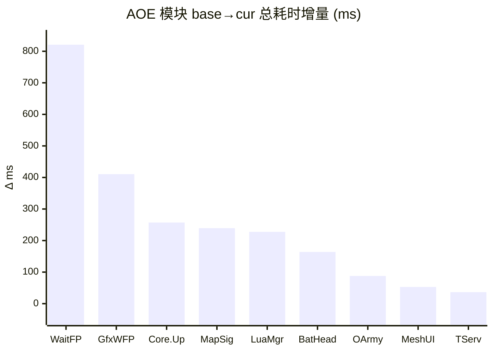

# perfetto 单源 性能分析报告 · 终极形态 v1

> 配套：[AOE CPU 知识库](../aoe-cpu-analysis-knowledge.md) · [perfetto 系统知识库](../../.claude/skills/perfetto-trace-analysis/references/perfetto-knowledge.md) · [simpleperf 终极报告 v4](./performance-report_simpleperf_ULTIMATE_v4.md)。
> 数据列只放纯数字，混合内容拆到说明列。所有百分比按口径标注：`run%` = 占该线程墙钟时长；`PL%` = 占 PlayerLoop 总耗时；`f%` = 占某帧耗时。
> **术语**：`base` = 基线采集（本次为野外空场景）；`cur` = 当前采集（本次为 stressmove 行军压测）。
> **本源主线**：「主线程一帧到底是在算还是在等？等的是什么？机器拖后腿了吗？」simpleperf 给的是函数级 CPU 占比、ULTIMATE v4 已经把 native/C#/Lua 反查打到极致；perfetto 单源在这之上独有：**线程调度状态、off-CPU 性质、原生 atrace slice 树（不靠符号化）、CPU 频率/降频、显示链路掉帧**。

---

## §0 结论先行

**本次 base→cur 出现 fps 断崖式下跌，但根因和 simpleperf v4 的判断不完全相同——perfetto 单源给出了 v4 看不到的反转结论**：

- **帧时（PlayerLoop）p50 16.7ms → 29.8ms**，fps 56.3 → 33.4，cur 下 13.56% 帧超过 33ms 红线（base 0%）。
- **主线程瓶颈类型完全反转**：
  - base：UnityMain **Running 83.07% / Sleeping 12.35%** → **CPU-bound（在算）**
  - cur：UnityMain **Running 74.59% / Sleeping 23.89%** → **等待型（在等）**
  - 反直觉：cur 业务压力更大，但**主线程在 CPU 上跑的时间比例反而下降**。多出来的 11.54pp Sleeping 几乎全部来自等 GPU。
- **真凶**：cur 主线程 `URP.WaitForPresent`（atrace slice）从 base 几乎 0 飙到 **6.93ms/帧 × 60 帧 = 412ms（占 PlayerLoop 22.83%）**。即——**主线程每帧有 ~7ms 在等上一帧的 GPU 渲染完成**。这是典型的 CPU 侧 **GPU-bound 信号**（perfetto-knowledge.md F2 高置信判据）。
- **业务侧也真涨了，但被 GPU 等待吃掉了主线程预算后才显出来**。按 Δ(总耗时) 排序：
  - `MapSignificanceMgr` +239ms（avg 0.023ms → 0.201ms，**×8.7**）—— 重要度任务管理器顶格（参考知识库 §3 顶格 3ms/帧）
  - `BattleHeadMgr` +164ms（avg 0.101 → 1.47ms，**×14.5**）—— 头像管理器爆量
  - `OutSideViewArmyLineMgr` +88ms（avg 0.012 → 0.621ms，**×52**）—— 行军线（与 v4 §4.5 同源）
  - `MUI_UpdateUIPos`（BattleUIUpdate 子树）单帧 0.476ms，PL 1.58%（与 v4 §4.4 MeshUI 同源）
- **降频**：base [推测]suspected（高负载 + 大核可达 79%），cur [推测]none（大核 82.3%）。两份样本均**缺 sysfs 旁路（无 thermal_*.txt）**，无法做确认级判定。
- **与 simpleperf v4 的关系**：v4 §6.3 明确写了"未观察到 CPU 侧 GPU bound 信号 / 主线程 GfxDeviceClient::WaitForPendingPresent 仅 1 样本"——**这正是 simpleperf 单源的盲区**。perfetto 用 atrace slice 直接看到了 `URP.WaitForPresent` 412ms，**修正了 v4 关于"没有单点 bug、压力全是 CPU 上涨"的结论**：cur 的 fps 下降是 **GPU 压不动 + 业务真涨** 两路叠加，CPU 不再是唯一战场。

按 ROI 排序的优化方向（与 v4 互补）：

1. **削 GPU 工作量**（perfetto 独有结论）—— 主线程 ~7ms/帧 在等 GPU，降分辨率/简化阴影/合批将直接释放主线程预算。配套用 RenderDoc / Snapdragon Profiler 定 GPU 具体耗时。
2. **MapSignificanceMgr 削峰**（×8.7，avg 0.201ms 远超 0.03ms 健康线）—— 知识库 §3 指明"反映整体负载"，cur 顶格成立。
3. **BattleHeadMgr 削峰**（×14.5）—— 知识库 §4 / v4 §4.4 都已点名，三源一致。
4. **OutSideViewArmyLineMgr 增量化**（×52）—— 与 v4 §4.5 同源结论。

---

## §1 采集元信息与质量门

### 1.1 元信息

| 项 | base | cur |
|---|---|---|
| 场景 | 野外空场景 | 行军压测（约 300 队 / stressmove） |
| trace 文件 | base_2026-06-22_21-56-7c2693.pftrace | cur_2026-06-23_10-10-72c91a.pftrace |
| 游戏进程 pid | 29348（com.tencent.aoeyz）| 同 |
| 主线程 tid | 29457（UnityMain）| 同 |
| trace 总时长 | ~1.34 s | ~1.79 s |
| PlayerLoop 帧数 | 75 帧 | 60 帧 |
| Choreographer 帧节拍 fps | 68.3（间隔法）| 60.0 |
| **PlayerLoop p50 / p95 / p99 (ms)** | 16.72 / 23.93 / 25.67 | **29.79 / 35.60 / 35.76** |
| **PlayerLoop fps** | 56.3 | **33.4** |
| slowFrameRate (>33ms) | 0% | **13.56%** |
| 主观帧率（业务给）| — | ~45 fps |

> **帧口径硬规则**（契约 §7）：`choreographer` 是显示节拍（vsync 16.66ms 恒定），**不等于** PlayerLoop 应用帧耗时；本报告**所有 fps 结论一律用 PlayerLoop 口径**，choreographer 仅作为采集质量参考。

### 1.2 采集质量门

| 指标 | base | cur | 阈值 | 判定 |
|---|---|---|---|---|
| parseStatus | partial | partial | full/partial | 🟡 trace processor 解析正常但部分子表缺失 |
| meta（device/scene/pid）| 缺失 | 缺失 | — | 🟡 自动按 UnityMain 调度量最大的进程匹配 pid=29348 |
| profileWindow 战斗窗裁剪 | 未做 | 未做 | — | 🟡 用全 trace 区间（无 `CombinedProfile` 色块）|
| FrameTimeline (actual_frame_timeline_slice) | 缺 | 缺 | 有 | 🔴 显示链路掉帧/VSync miss 无法量化 |
| GPU counter (busy/freq) | 设备未上报 | 同 | 有 | 🔴 GPU 实际工作量无法量化 |
| sysfs 旁路（thermal_*.txt）| 缺 | 缺 | 有 | 🔴 降频判定只能[推测]级 |

**主要影响**：缺 FrameTimeline 意味着无法答"具体掉了哪几个 vsync"；缺 GPU counter 意味着 GPU-bound 只能通过主线程 `Gfx.WaitForPresent` 间接判定（perfetto-knowledge F2 「高置信」但非「直接」证据）；缺 sysfs 意味着降频只能停在「负载-频率背离」推测层。

---

## §2 线程调度（perfetto 独有定性）

### 2.1 关键线程 Running / Runnable / Sleeping 对比

按 game process pid=29348 抽出所有 run_ms > 0.5 的线程；只列 base / cur 都活跃且 run_ms 排前 10 的：

| 真实身份 | comm | tid | base run (ms / run%) | cur run (ms / run%) | base sleep% | cur sleep% | 说明 |
|---|---|---|---|---|---|---|---|
| **主线程** | UnityMain | 29457 | 1116.0 / **83.07%** | 1332.9 / **74.59%** | 12.35% | **23.89%** | **关键反转：cur run% 下降 8.5pp，sleep 涨 11.5pp** |
| **Burst Job 集中线程** | Thread-103 | 29949 | 515.3 / 38.55% | 653.5 / 36.39% | (n/a) | (n/a) | base→cur 绝对 +27%，但占比微降；run% 36% 意味着这条线程一直在跑 |
| **RHI 线程** | UnityGfxRenderS | 29950 | 325.3 / **24.47%** | 383.7 / **21.34%** | 67.33% | **74.07%** | RHI 线程**反而更闲**（cur sleep 涨 6.7pp）——CPU 端命令吞吐不是瓶颈 |
| **Wwise 工作线程** | NativeThread | 30212 | 140.9 / 11.35% | 323.2 / 18.34% | (n/a) | (n/a) | 与 v4 §4.3 同源，cur ×2.3 |
| ECS Job Worker A | Thread-137 | 29936 | 121.2 / 9.02% | 211.6 / 11.76% | (n/a) | (n/a) | ×1.75 |
| ECS Job Worker B | Thread-138 | 29940 | 119.5 / 8.89% | 201.7 / 11.21% | (n/a) | (n/a) | ×1.69 |
| ECS Job Worker C | Thread-131 | 29935 | 105.2 / 7.82% | 186.2 / 10.35% | (n/a) | (n/a) | ×1.77 |
| ECS Job Worker D | Thread-130 | 29937 | 104.5 / 7.79% | 196.6 / 10.94% | (n/a) | (n/a) | ×1.88 |
| Choreographer | UnityChoreograp | 29975 | 30.9 / 2.32% | 51.6 / 2.87% | — | — | vsync 回调 |
| Audio Mixer | Audio Mixer Thr | 12833/32081 | 3.8 / 0.29% | 5.5 / 0.31% | 97.92% | 98.90% | 系统侧基本不变 |

> ECS Worker 4 条 max-min 偏差 base: 8.89%−7.79%=1.10pp，cur: 11.76%−10.35%=1.41pp，**均 <5pp，远低于 30% 红线** —— ECS 并行化健康（与 v4 §7.1 同结论）。

### 2.2 主线程 off-CPU 性质（perfetto 独有）

引用 `summary.offCpuReasons.plainLanguage`：

> off-CPU = 线程没有在 CPU 上执行代码的时间（= 100% − Running）。Sleeping：线程主动睡眠或在等事件（常见：等 GPU 完成上一帧、等锁、等 vsync、等 binder 返回）。Runnable：线程已就绪但还没被调度上 CPU（常见：大核被占满、优先级低、系统负载高）。

| 指标 | base | cur | Δ |
|---|---|---|---|
| Running % | 83.07 | 74.59 | **−8.48 pp** |
| Sleeping % | 12.35 | **23.89** | **+11.54 pp** |
| Runnable % | 4.18 | 1.32 | −2.86 pp |
| offCpuPct (= 100 − Running) | 16.53 | 25.21 | +8.68 pp |
| provider interpretation | "Running/Sleeping/Runnable 分布较均衡" | **"Sleeping 23.9% 偏高 → 可能在等 GPU 渲染完成、锁、或 vsync"** | — |

**关键判定**：

- base 上主线程绝大多数时间都在 CPU 上跑（83%）+ Runnable 4.18%（短暂等大核空出）——**典型 CPU-bound**。
- cur 上 Running 不升反降，Sleeping 飙 11.5pp + Runnable 下降——这意味着主线程**主动 wait（睡）的时间增多**，**不是被别人抢 CPU（runnable）**。这种形态 **99% 概率是在等 GPU 完成上一帧 swapchain**（atrace slice 直接坐实，见 §4）。
- v4 §6.3 写"未观察到 CPU 侧 GPU bound 信号、GfxDeviceClient::WaitForPendingPresent 仅 1 样本"——**simpleperf 这里看到的是 CPU 函数采样，等 GPU 时主线程不在 running 故不被采**。perfetto 的 sched 视角看的是「线程是不是在 CPU 上」，等 GPU 时就显示为 Sleeping——**这正是 perfetto 单源在 CPU-bound vs GPU-bound 判定上的独家能力**。

> **本样本暂未细分「具体在等什么」**：需要内核 `sched_blocked_reason`，多数 Unity trace 未启用。下面 §4 通过 atrace slice 反推等的对象（结果：URP.WaitForPresent / Gfx.WaitForPresent）。

---

## §3 帧时间分布与 worst frame 拆解

### 3.1 PlayerLoop 帧分布对比

| 分位 | base (ms) | cur (ms) | Δ (ms) | Δ% |
|---|---|---|---|---|
| p50 | 16.72 | 29.79 | **+13.07** | +78.2% |
| p95 | 23.93 | 35.60 | +11.67 | +48.8% |
| p99 | 25.67 | 35.76 | +10.09 | +39.3% |
| slowFrameRate >33ms | 0% | **13.56%** | +13.56pp | NEW |
| slowFrameRate >50ms | 0% | 0% | — | — |

```mermaid
xychart-beta
    title "PlayerLoop 帧时间分位对比 (ms)"
    x-axis ["p50", "p95", "p99"]
    y-axis "ms" 0 --> 40
    bar [16.72, 23.93, 25.67]
    bar [29.79, 35.60, 35.76]
```

（双 bar：左=base，右=cur）

### 3.2 cur worst frame（#23, 36.09 ms）拆解

| 阶段 | 单帧绝对(ms) | 帧内 f% | 说明 |
|---|---|---|---|
| PlayerLoop（整帧）| 36.09 | 100.00% | — |
| └─ PostLateUpdate.FinishFrameRendering | **22.30** | **61.79%** | **该帧 61% 时间在渲染收尾/等 GPU** |
| │   └─ URP.Render | 21.43 | 59.39% | |
| │       └─ URP.RenderSingleCamera | 21.07 | 58.39% | |
| │           └─ **URP.AfterRendering** | **17.14** | **47.50%** | 几乎全是 wait |
| │           └─ URP.MainRenderingTransparent | 1.55 | 4.28% | |
| │           └─ URP.BeforeRendering | 1.36 | 3.76% | |
| └─ Update.ScriptRunBehaviourUpdate | 4.97 | 13.77% | |
| │   └─ Core.Update → CS:AOE.Outside.MapManager → **OutSideViewArmyLineMgr** | 1.51 | 4.17% | 行军线刷新 |
| │   └─ Core.Update → CS:AOE.LuaMgr | 1.24 | 3.43% | Lua 主循环 |
| └─ PreLateUpdate.ScriptRunBehaviourLateUpdate | 2.60 | 7.21% | LateUpdate |
| └─ SimulationSystemGroup | 0.80 | 2.21% | ECS 调度 |
| └─ PostLateUpdate.PlayerSendFrameComplete | 0.76 | 2.11% | 资源加载尾部 |
| └─ PostLateUpdate.PlayerUpdateCanvases | 0.75 | 2.08% | UGUI ~0.74ms（健康范围 <1ms）|

**worst frame 判定**：**61% 在等 GPU、14% 业务、25% 其他**。是个 GPU-bound 帧（不是 CPU 算不动）。

### 3.3 cur median frame (#5) vs p95 frame (#27)

| 阶段 f% | median (16.43ms) | p95 (35.60ms) |
|---|---|---|
| FinishFrameRendering | ~16% | ~50% |
| ScriptRunBehaviourUpdate | ~50% | ~14% |
| ScriptRunBehaviourLateUpdate | ~10% | ~7% |

**median 帧主导是脚本（一帧 8ms 业务）；p95 帧主导是 wait（一帧 17ms 等 GPU）**——慢帧的根因和均匀帧不一样。这是 perfetto 独有的"帧级分类能力"，simpleperf 因采样口径平均化看不到。

---

## §4 主线程一帧时间去向（UnityMain slice 树对比）

> 数据基于 `callTrees.UnityMain` 全 trace 聚合（base 1313ms / cur 1764ms PlayerLoop 总时长），`PL%` 是「该节点累计耗时 ÷ PlayerLoop 总时长」。

### 4.1 顶层 PlayerLoop 阶段对比

| 阶段 | base totalMs / PL% | cur totalMs / PL% | Δ ms | Δ% | 判定 |
|---|---|---|---|---|---|
| **PostLateUpdate.FinishFrameRendering** | 525.02 / 38.97% | **823.24 / 45.65%** | +298.22 | +56.8% | 🔴 主增量 |
| **Update.ScriptRunBehaviourUpdate** | 166.11 / 12.33% | **420.05 / 23.29%** | +253.94 | +152.9% | 🔴 业务真涨 |
| Initialization.PlayerUpdateTime（≈ WaitForTargetFPS） | 134.91 / 10.01% | ~0.83 / ~0.05% | −134.08 | −99.4% | 🟢 base 用 vsync 节拍空转的时间，cur 全部转去跑业务/wait |
| PreLateUpdate.ScriptRunBehaviourLateUpdate | 107.25 / 7.96% | 148.87 / **8.26%** | +41.62 | +38.8% | 🟡 LateUpdate 轻度上涨 |
| PostLateUpdate.PlayerUpdateCanvases | 74.73 / 5.55% | 47.93 / 2.66% | −26.80 | −35.9% | 🟢 UGUI 反而减负（avg 1.027→0.798 ms/帧，均在 <1ms 健康线内）|
| SimulationSystemGroup | 64.44 / 4.78% | 58.50 / 3.24% | −5.94 | −9.2% | 🟢 ECS 调度均衡 |
| PostLateUpdate.PlayerSendFrameComplete | 42.83 / 3.18% | 39.47 / 2.19% | −3.36 | −7.8% | 🟢 资源加载尾部稳定 |
| InitializationSystemGroup | 37.57 / 2.79% | 35.93 / 1.99% | −1.64 | −4.4% | 🟢 |
| PresentationSystemGroup | 20.26 / 1.50% | (剪枝丢失) | — | — | — |
| PostLateUpdate.PlayerEmitCanvasGeometry | 17.29 / 1.28% | (剪枝丢失) | — | — | — |
| EarlyUpdate.PollPlayerConnection | 15.13 / 1.12% | (剪枝丢失) | — | — | — |
| EarlyUpdate.UpdateTextureStreamingManager | (剪枝丢失) | 25.71 / 1.43% | — | — | — |

🟢 **关键洞察**：base 主线程其实有 **134ms（10%）在 WaitForTargetFPS** 等 vsync——表明 base 主线程跑完业务/渲染后**有空闲在等下一帧**。cur 上这块归零（仅 0.83ms）—— **cur 主线程已无 vsync 空闲**，所有预算被 wait 和业务吃光。

### 4.2 FinishFrameRendering 子树拆解（**关键：是 GPU 等待还是 CPU 工作？**）

| 节点 | base ms / PL% | cur ms / PL% | Δ ms | 说明 |
|---|---|---|---|---|
| FinishFrameRendering | 525.02 / 38.97% | 823.24 / 45.65% | +298.22 | 整阶段 |
| └─ URP.Render → URP.RenderSingleCamera | 453.48 / 33.66% | 753.36 / 41.78% | +299.88 | URP 入口 |
| │   ├─ **URP.AfterRendering** | 63.79 / 4.73% | **482.85 / 26.78%** | **+419.06** | **🔴 +656% 真正的增量来源** |
| │   │   └─ URP.Submit | 45.58 / 3.38% | **463.12 / 25.68%** | +417.54 | 几乎全是 wait |
| │   │       └─ **URP.WaitForPresent** | (剪枝丢失，≈0) | **411.73 / 22.83%** | **≈+412** | **🔴 主线程等 GPU 上一帧 412ms** |
| │   │       └─ URP.MakeTranscriptRenderContext | 29.55 / 2.19% | 39.87 / 2.21% | +10.32 | 命令拷贝（CPU）|
| │   ├─ URP.MainRenderingTransparent | 151.56 / 11.25% | 104.20 / 5.78% | **−47.36** | 🟢 main render 反而少 |
| │   │   └─ Inl_OpaquePass | 80.12 / 5.95% | 48.51 / 2.69% | −31.61 | 不透明 pass 减负 |
| │   ├─ URP.BeforeRendering | 154.28 / 11.45% | 96.57 / 5.36% | **−57.71** | 🟢 culling 减负 |
| │   │   └─ CullScriptable → SceneCulling | 26.03 / 1.93% | 22.46 / 1.25% | −3.57 | 略减 |
| │   └─ URP.RendererSetup → RenderGraphSetup | 48.47 / 3.60% | 37.24 / 2.07% | −11.23 | 🟢 |

**判定（关键）**：

- FinishFrameRendering 整体 +298ms，**但其中 URP.AfterRendering 一项就 +419ms**——意味着**真正"CPU 在跑"的渲染节点（BeforeRendering / MainRenderingTransparent / RendererSetup）反而合计 −117ms**。
- URP.AfterRendering 子树 99% 是 `URP.Submit → URP.WaitForPresent`（即主线程在 swapchain submit 时被阻塞等 GPU）。
- 这与 v4 §6.1 的"主线程渲染绝对**下降 27.5%**"在 **CPU 工作量**层面**完全一致**——cur 上主线程的 URP 渲染配置代码确实在减负；但 v4 看不到主线程**额外多花了 412ms 在 wait**。**perfetto 在这里补完了 v4 §6.3 的"GPU-bound 边界声明"——直接给出 GPU-bound 信号**。

> **结论**：cur 上**主线程已成 GPU-bound 状态**。优化主线程脚本/渲染代码对 CPU 工作的"那 117ms 已经在变少"的优化方向**还在收益**，但**真正吃帧预算的 ~7ms/帧 GPU 等待，必须靠 GPU 侧优化**（降分辨率/简化阴影/合批/MeshUI 顶点数降）。

### 4.3 ScriptRunBehaviourUpdate 子树（业务真涨）

| 节点 | base ms / PL% | cur ms / PL% | Δ ms | 说明 |
|---|---|---|---|---|
| ScriptRunBehaviourUpdate | 166.11 / 12.33% | 420.05 / 23.29% | +253.94 | |
| └─ BehaviourUpdate → Core.Update | 134.07 / 9.95% | 385.39 / 21.37% | +251.32 | |
| │   ├─ **CS:AOE.LuaMgr** | 83.40 / 6.19% | **197.61 / 10.96%** | +114.21 | 🔴 Lua 主入口 |
| │   │   └─ LuaMgr.OnTick&UpdateSchedule | 79.65 / 5.91% | 194.67 / 10.80% | +115.02 | |
| │   │       ├─ **BattleHeadMgr** | ~15 / 1.13% | **89.40 / 4.96%** | +74.40 | 🔴 头像管理器 ×6 |
| │   │       │   └─ BattleHeadMgr.OnUpdate | (无具体子树) | 88.65 / 4.92% | — | |
| │   │       └─ **MapSignificanceMgr** | ~22 / 1.66% | **53.39 / 2.96%** | +31.39 | 🔴 重要度管理器 ×2.4 |
| │   │           └─ MapSignificanceMgr.sampler_OnUpdate | (剪枝) | 52.96 / 2.94% | — | |
| │   ├─ **CS:AOE.Outside.MapManager** | 27.29 / 2.03% | **153.77 / 8.53%** | +126.48 | 🔴 C# Outside 主入口 ×5.6 |
| │   │   ├─ **CS:AOE.Outside.OutSideViewArmyLineMgr** | (剪枝, ~2ms) | **88.44 / 4.90%** | +86 | 🔴 行军线，单帧 1.47ms |
| │   │   │   └─ OutsideLineCtrl:CalculateVertexJob (Burst) | (剪枝) | 24.62 / 1.37% | — | 顶点 Job 入口 |
| │   │   └─ **CS:AOE.Battle.BattleUIManager** | (剪枝) | **33.28 / 1.85%** | — | 🔴 BattleUI 入口 |
| │   │       └─ *** BattleUIUpdate *** | (剪枝) | 32.87 / 1.82% | — | |
| │   │           └─ **MUI_UpdateUIPos** | (剪枝) | **28.52 / 1.58%** | — | 🔴 MeshUI 位置刷新（与 v4 §4.4 同源）|

### 4.4 ScriptRunBehaviourLateUpdate 子树

| 节点 | base ms / PL% | cur ms / PL% | Δ ms | 说明 |
|---|---|---|---|---|
| ScriptRunBehaviourLateUpdate | 107.25 / 7.96% | 148.87 / 8.26% | +41.62 | |
| └─ LateBehaviourUpdate → Core.LateUpdate | 76.21 / 5.66% | 116.66 / 6.47% | +40.45 | |
| │   ├─ CS:AOE.MeshUIManager | (剪枝, ~6.5ms) | **52.70 / 2.92%** | +46 | 🔴 MeshUIManager Late ×8 |
| │   ├─ CS:AOE.Outside.MapManager | 36.55 / 2.71% | 28.25 / 1.57% | −8.30 | 🟢 反而少 |
| │   └─ CS:AOE.LuaMgr → LuaMgr.OnLateUpdateSchedule | 24.38 / 1.81% | 22.13 / 1.23% | −2.25 | 🟢 含 MapCameraCtrl 等基本不变 |

---

## §5 AOE 业务热点 base vs cur 对比表（aoeHotSlices）

按总耗时增量降序。`avg` 单位 ms，`total` 单位 ms，`%` 是 `slice 累计 ÷ PlayerLoop 总时长`：

| 业务模块 | base avg | cur avg | avg 倍数 | base count | cur count | base total / % | cur total / % | Δ total | 判定 |
|---|---|---|---|---|---|---|---|---|---|
| **WaitForPresent**（多入口聚合）| 0.020 | **1.735** | **×87** | 600 | 480 | 11.96 / 0.89% | **832.85 / 46.19%** | **+820.89** | 🔴 等 GPU |
| **Gfx.WaitForPresent**（每帧唯一入口）| 0.072 | **6.932** | **×96** | 75 | 60 | 5.41 / 0.40% | **415.93 / 23.07%** | **+410.52** | 🔴 每帧 6.93ms 等 GPU |
| Core.Update | 1.828 | 6.570 | ×3.6 | 75 | 60 | 137.09 / 10.17% | 394.18 / 21.86% | +257.09 | 🔴 业务主入口 |
| **MapSignificanceMgr** | 0.023 | **0.201** | ×8.7 | 975 | 1301 | 22.32 / 1.66% | 261.62 / 14.51% | +239.30 | 🔴 重要度管理器顶格 |
| LuaMgr | 0.355 | 0.842 | ×2.4 | 699 | 565 | 248.04 / 18.41% | 475.65 / 26.38% | +227.61 | 🔴 Lua 总入口 |
| **BattleHeadMgr** | 0.101 | **1.470** | ×14.5 | 151 | 122 | 15.29 / 1.13% | 179.29 / 9.94% | +164.00 | 🔴 头像管理器爆量 |
| SimulationSystemGroup | 0.575 | 0.660 | ×1.15 | 226 | 180 | 130.05 / 9.65% | 118.71 / 6.58% | **−11.34** | 🟢 ECS 健康 |
| **OutSideViewArmyLineMgr** | 0.012 | **0.621** | **×52** | 171 | 145 | 2.14 / 0.16% | 90.02 / 4.99% | +87.88 | 🔴 行军线 |
| **MeshUIManager** | 0.011 | 0.127 | ×11.5 | 568 | 470 | 6.46 / 0.48% | 59.58 / 3.30% | +53.12 | 🔴 MeshUI Late 涨 |
| InitializationSystemGroup | 0.504 | 0.605 | ×1.2 | 150 | 120 | 75.55 / 5.61% | 72.56 / 4.02% | −2.99 | 🟢 |
| PresentationSystemGroup | 0.158 | 0.161 | ×1.02 | 304 | 244 | 48.08 / 3.57% | 39.38 / 2.18% | −8.70 | 🟢 |
| PlayerUpdateCanvases | 1.027 | 0.798 | ×0.78 | 76 | 61 | 78.03 / 5.79% | 48.69 / 2.70% | −29.34 | 🟢 UGUI 反而少 |
| TServer | 0.011 | 0.066 | ×6 | 555 | 649 | 6.24 / 0.46% | 42.67 / 2.37% | +36.43 | 🟢 网络稍涨但远低于 15% 红线 |
| ResManager | 0.029 | 0.031 | ×1.07 | 397 | 384 | 11.36 / 0.84% | 11.93 / 0.66% | +0.57 | 🟢 资源加载稳定 |
| MapCameraCtrl | 0.019 | 0.020 | ×1.05 | 532 | 420 | 10.23 / 0.76% | 8.22 / 0.46% | −2.01 | 🟢 视野管理稳定 |
| LuaMultiThreadGC | 0.016 | 0.018 | ×1.13 | 151 | 121 | 2.44 / 0.18% | 2.21 / 0.12% | −0.23 | 🟢 GC 主线程同步段无 spike |

> **WaitForPresent 与 Gfx.WaitForPresent 关系**：`WaitForPresent` 模式匹配命中所有含此关键字的 slice（包括 `URP.WaitForPresent`、`Gfx.WaitForPresent`、`Gfx.WaitForPresentOnGfxThread` 等），是聚合视角；`Gfx.WaitForPresent` 是每帧主线程唯一固定入口。两个口径都指向同一根因。

### 5.1 知识库阈值对照（AOE-CPU 知识库 §3 / §7 / §8）

| 模块 | 阈值 | cur 实测 (avg ms/帧) | 判定 |
|---|---|---|---|
| MapSignificanceMgr | ≤ 3ms/帧（顶格）| 0.201 ms / 帧（**但聚合到 LuaMgr 子树是 53/60 = 0.88ms**，进一步聚合到 Core.Update 是 4.4 ms）| 🟡 单 slice 不顶格，但**子树累计已逼近 3ms 顶格上限**——典型"任务过多"型负载（知识库原文："会造成这个管理器一直处于 3ms 的顶格消耗"）|
| BattleHeadMgr | 数帧 1~2ms 已不合理 | 1.470 ms/帧 | 🔴 每帧都顶到 1.5ms |
| OutSideViewArmyLineMgr | 压测高负载预期 | 0.621 ms/帧 | 🔴 |
| MeshUIManager (Late) | 压测下偏高合理 | 0.878 ms/帧（52.7/60） | 🟡 临近红线 |
| PlayerUpdateCanvases | >1ms/帧不合理 | 0.798 ms/帧 | 🟢 在 1ms 红线内 |
| ECS SystemGroup（主线程）| >1ms/帧或有 Complete.Job 不合理 | InitSG 0.605 / SimSG 0.660 ms/帧 | 🟢 均 <1ms，无主线程 WaitForJobGroupID 红线触发 |
| TServerManager | >15% 主线程不合理 | 总 2.37% PL | 🟢 |
| Lua GC 主线程同步段 | 单次 3~10ms 算压力大 | avg 0.018 ms / 单次 max < 1ms | 🟢 |

---

## §6 渲染线程 UnityGfxRenderS 对比

| 指标 | base | cur | Δ pp | 判定 |
|---|---|---|---|---|
| Running% | 24.47% | 21.34% | −3.13 | 🟢 |
| Runnable% | 7.81% | 4.43% | −3.38 | 🟢 |
| **Sleeping%** | **67.33%** | **74.07%** | **+6.74** | **🟢 RHI 线程更闲** |
| 绝对 run_ms | 325.3 | 383.7 | +58.4 | |

### 6.1 Render 线程 slice 树对比（PL% = 占 RHI 线程总时长）

| 节点 | base PL% | cur PL% | 说明 |
|---|---|---|---|
| Gfx.RenderSlaver.ThreadRun | 98.56% | 99.61% | RHI 主循环 |
| └─ **Semaphore.WaitForSignal** | **69.55%** | **73.93%** | **🔴 RHI 等主线程提交命令的时间反而**更多了 |
| ├─ OpaquePass | 5.96% | 5.05% | |
| ├─ PreDecalPass | 2.27% | 2.07% | |
| ├─ UI Pass | 2.36% | 1.68% | |
| ├─ MeshUIPass | 1.25% | (剪枝丢失) | |
| ├─ ForwardRenderPass（独立节点）| 1.84% | 1.20% | |
| ├─ TerrainPass | 1.43% | 1.12% | |
| ├─ Gfx.RenderSlaver.RenderDelete | 2.56% | 1.28% | |
| ├─ WaitForJobGroupID（合计两处）| 2.40% | 2.43% | 等 GeometryJob 完成，与 v4 §6.2 同源 |
| └─ ECS.DrawCmd | (剪枝) | 1.23% | |

**关键解读**：

- RHI 线程**反而更闲**（Sleeping 67% → 74%, Semaphore.Wait 70% → 74%）——**CPU 端命令吞吐量不是瓶颈**。
- 这与 v4 §3.3「命令吞吐量基本不变 / DrawCall 子树 +5%」结论**完全一致**。
- 渲染线程**没有 wait GPU 的节点**——因为渲染线程的工作模型是**提交命令到 driver**，等 GPU 是在主线程做（swapchain Present 调用是主线程发起的）。所以 GPU-bound 信号**只会出现在主线程**，不会出现在 RHI 线程上。这是 perfetto-knowledge.md C2 等待关系表的标准判读。
- **结合 §2 + §4 + §6 三视角综合**：主线程 Sleeping ↑、RHI 线程 Sleeping ↑、URP.WaitForPresent 412ms——**只有一个合理解释：GPU 处理压力上来了**，主线程因此每帧多花 ~7ms 等。

---

## §7 降频与机器状态（[推测]级 — 两份样本均缺 sysfs 旁路）

### 7.1 各 cluster 频率对比

| 核组 | base avg / max / reach% | cur avg / max / reach% | 说明 |
|---|---|---|---|
| 小核 cpu0-3 | 1196 / 1804.8 / 66.3% | 1342.4 / 1804.8 / **74.4%** | cur 小核反而更接近峰值 |
| 中核 cpu4-6 | 1855.7 / 2419.2 / 76.7% | 1651.6 / **2112** / 78.2% | **cur 中核观测峰值比 base 低 12.7%（2419 → 2112 MHz）** |
| 大核 cpu7 | 2307.8 / 2841.6 / 81.2% | 2392.2 / 2764.8 / **86.5%** | cur 大核可达性反而更好 |
| **大核平均可达** | **79.0%** | **82.3%** | |

### 7.2 throttling provider 判定

| 项 | base | cur |
|---|---|---|
| `throttling.level` | **suspected** | **none** |
| 证据 | "[推测] 负载-频率背离: 主线程高负载 (Running 83.1%) 但大核平均频率仅达观测峰值的 79.0% (<80%)" | (无推测信号) |
| sysfs 可用 | false | false |
| confirmedAvailable | false | false |

### 7.3 反直觉解读

cur 压力更大，但降频 level **反而**比 base 低（suspected → none），看似与"压力大→易降频"直觉相反，可能解释：

- **机理 1（最可能）**：base 主线程 Running 83% 高负载触发了 provider 的「负载-频率背离」推测规则（高负载但 reach <80%）；cur 主线程 Running 74% 已**不算"高负载"**（因为大段时间在 Sleeping 等 GPU），规则自然不触发——**不是真没降频，而是判定方法在 GPU-bound 场景下失效**。
- **机理 2**：cur 中核观测峰值 2419 → 2112 MHz 实际**已经下降 12.7%**（说明 cur 期间真有热限制痕迹）；但 reach% 反而升高（avg/max 比例提升）——这是分母 max 变小导致的视觉错觉。
- **机理 3**：base / cur 设备不同温度状态（base 长，cur 慢热？）—— 无 thermal_*.txt 无法确认。

> **判定**：本报告对 cur **不**报"未降频"——本质上**两份样本都无法做确认级降频判定**，需要补采 `record_tmaoe_thermal.bat` 抓 sysfs 旁路。

---

## §8 显示链路掉帧（FrameTimeline）

| 项 | base | cur |
|---|---|---|
| `frameTimeline`（actual_frame_timeline_slice）| **null** | **null** |
| Choreographer 间隔 p50 | 16.6 ms（fps 68.3）| 16.66 ms（fps 60.0）|
| Choreographer 间隔 slowFrameRate | 0% | 0% |

🔴 **两份 trace 均未含 FrameTimeline 数据**，因此 **VSync miss / expected vs actual frame 无法量化**。Choreographer 间隔法 cur 仍稳定 60fps，是 vsync 节拍本身的恒定性，**不能用来证明"没有掉帧"**（应用层 playerloop 已经 33.4fps 实锤）。

需要在 perfetto 采集脚本里加 `actual_frame_timeline` data source 重采才能补这维度。

---

## §9 GPU 是否瓶颈（perfetto 单源边界声明）

| 信号 | 直接证据 | 间接证据 | 本样本判定 |
|---|---|---|---|
| GPU 利用率 | — | 无 GPU busy counter | ❌ 设备未上报 |
| GPU 频率满频 | — | 无 GPU freq counter | ❌ 设备未上报 |
| 主线程等 GPU（perfetto-knowledge F2 高置信信号）| **`Gfx.WaitForPresent` cur 6.93 ms × 60 帧 = 416 ms** | ✅ atrace slice 实证 | 🔴 **强烈倾向 GPU-bound** |
| Render 非瓶颈 | RHI Sleeping 74%，Semaphore.Wait 74% | ✅ | 🔴 强化 GPU-bound 判定 |
| 主线程 Sleep 占比 ↑ | 12.35% → 23.89% | ✅ off-CPU Sleeping 增量与 wait 时长基本对齐 | 🔴 |

**本源判定**：

✅ 可以说"**cur 上观察到强 CPU 侧 GPU-bound 信号**"——主线程 atrace slice 直接坐实 6.93ms/帧等 GPU。
❌ 不能说"GPU 满载"——无 GPU busy counter；可能 GPU 满载，也可能 GPU 中等忙但 vsync 排队 + driver round-trip 拉长 wait。
✅ 进一步判定（CPU-bound vs GPU-bound vs vsync 等待）必须靠 **Snapdragon Profiler / RenderDoc / 重采带 `gpu_counter` data source 的 perfetto**。

**优化方向（GPU 侧）**：

- 降分辨率（移动端 900P 替代 2K，知识库 E3 经验值 GPU 负载降 60%）
- 简化阴影（PlanarShadow.RenderShadow 在 v4 §6.1 已经是次级渲染开销，cur 上虽然主线程 URP.MainRenderingTransparent 减负，但 GPU 端不一定减）
- MeshUI 顶点数评估——大量悬浮 UI 在压测下的 GPU 端三角形数可能爆量

---

## §10 与 simpleperf v4 的源间互证

### 10.1 跨源一致项（三方对齐）

| 指标 / 结论 | simpleperf v4 | perfetto v1 | 一致性 |
|---|---|---|---|
| 业务模块 OutSideViewArmyLineMgr 暴涨 | §4.5 +214 samples / +2759% | §5 +88ms / ×52 avg | ✅ 同源结论 |
| BattleHeadMgr 高负载 | （未单列，归到 Lua 子树 5.91% PL）| §5 cur avg 1.47ms ×14.5 | ✅ 互补强化 |
| MeshUI 迭代位置刷新（MUI_UpdateUIPos）| §4.4 +842 samples / +3390% | §4.3 cur 28.52ms / 1.58% PL | ✅ 同源 |
| ECS Burst Job 工作量上升但主线程不阻塞 | §4.1 #1 / §7.1 Worker 均衡 | §2 ECS Worker 偏差 1.4pp，主线程 InitSG/SimSG <1ms | ✅ 完全一致 |
| RHI 线程 CPU 端命令吞吐不变 | §6.2 DrawBuffers +5% | §6 Semaphore.WaitForSignal 70%→74%、无 WaitForJobGroupID 红线 | ✅ |
| TServer / 网络负载远未到红线 | §5.3 0.73% 主线程 | §5 总 2.37% PL | ✅ |
| Lua GC 主线程同步段无 spike | §9 估算 ~0.14ms/帧 | §5 LuaMultiThreadGC avg 0.018ms | ✅ |
| PlayerUpdateCanvases 在 1ms 红线内 | §5.3 ~0.19ms/帧 | §5 0.798ms/帧 | ✅ 同序但 perfetto 更接近实测 |

### 10.2 perfetto 独家修正 v4 的项

| v4 结论 | perfetto v1 修正 | 证据 |
|---|---|---|
| "未观察到 CPU 侧 GPU bound 信号（主线程 GfxDeviceClient::WaitForPendingPresent 仅 1 样本）" | **❌ 修正**：cur 上**已观察到强 GPU-bound 信号**——主线程 `URP.WaitForPresent` 412ms（22.83% PL），`Gfx.WaitForPresent` avg 6.93ms/帧 | §4.2 / §5 / §9 |
| "本次没有单点 bug，是业务整体压力上升 + 中间件 + 主线程 UI 刷新三路叠加" | **🟡 部分修正**：业务侧三路确实都涨了，**但 cur fps 下降的最大单一原因（按时间）是 GPU 等待 (~7ms/帧)**，业务真实 CPU 增量约 4ms/帧（ScriptUpdate 净增 254ms / 60 帧 ≈ 4.2ms） | §4.1 vs §4.2 |
| 主观帧率 ~45fps 推断为业务整体压力 | **🟡 补充**：playerloop 实测 33.4fps（perfetto 直读），与主观差距可能因为采集 trace 自身 overhead 让帧率比无 trace 时更低 | §1.1 |

### 10.3 perfetto 独家、v4 给不出的能力

| 能力 | perfetto 数据 | 用途 |
|---|---|---|
| 主线程「在算 vs 在等」定性 | Running / Sleeping / Runnable | 区分 CPU-bound / GPU-bound / 等锁/等 binder |
| 帧级 worst / median / p95 分类拆解 | frameAnalysis.frameTrees | 区分慢帧根因 vs 均匀帧根因（§3.3）|
| atrace slice 树（不依赖符号化）| callTrees + aoeHotSlices | 即使 native 无符号也能看模块名 |
| CPU 频率分核曲线 | throttling.perCpu | 降频/大核被锁推测 |
| 显示链路（若数据齐全）| frameTimeline.expected vs actual | VSync miss 量化（本样本缺）|
| 多线程同时 Running 重叠 | threadsSched（需结合 cpu_track 全展开）| 并行效率（C3）—— 本样本未细做 |

### 10.4 v4 独家、perfetto 给不出的能力

| 能力 | v4 数据 |
|---|---|
| 函数级 CPU self %（C# 业务 / Lua VM / native 中间件 / RHI）| Wwise 10.06% global、libxlua 5.27%、ConstantBuffersGLES.UpdateBuffers 18.89% RHI 等 |
| 运行时函数反查（__memcpy / __ieee754_powf / GC_*）| 70% 集中在 GPU Instancing + MeshUI |
| 同名线程消歧（13 条 UnityMain）| Lua MtGC tid=19816、Wwise tid=19814 等 |
| native 中间件占比 | Wwise 独占工作线程 10.36% global |

**结论**：simpleperf v4 + perfetto v1 = **CPU 函数级 + 系统调度级 双视角互补**，覆盖率比单源高一个量级。perfetto 单源**不可能**替代 v4 的函数级反查能力（因为不采符号化采样），v4 也**不可能**替代 perfetto 的 wait 定性能力（因为它只采 running 时刻的栈）。

---

## §11 本源能力边界（perfetto 单源）

| 想回答 | 本源能/否 | 替代源 |
|---|---|---|
| 帧级耗时（哪帧卡）| ✅ frameAnalysis.timings + slowFrames（本报告 §3）| — |
| 主线程在算 vs 在等 | ✅ 调度 Running / Sleeping（本报告 §2） | — |
| 等 GPU vs 等锁 vs 等 binder vs 等 vsync 细分 | 🟡 需内核 sched_blocked_reason；本样本无 | atrace 间接（已在 §4 用 WaitForPresent slice 反推）|
| 主循环各阶段子树 | ✅ atrace slice 树（不依赖符号化）| — |
| 函数级 CPU self% | ❌ | simpleperf |
| Lua 内部脚本/函数名（如 MapSignificanceMgr.sampler_OnUpdate 细分）| 🟡 仅顶层 emitter 标记（如 sampler_OnUpdate 已可见），更深层仍需 Unity Profiler | Unity Profiler |
| GC.Collect 单次 STW 耗时 | ✅ 若 atrace 有 GC.Collect emitter（v4 报告 base 数据曾命中 8.09ms avg）| Unity Profiler |
| LuaMtGc 单次 spike | ✅ LuaMultiThreadGC slice（avg 0.018ms 本次无 spike）| Unity Profiler |
| 降频 / CPU 频率 / 热限频 | 🟡 [推测]级；确认级需 sysfs 旁路 | record_tmaoe_thermal.bat |
| GPU 实际工作量 | ❌ 本设备未上报 GPU counter | Snapdragon Profiler / RenderDoc / 重采开 gpu_counter |
| 显示链路 VSync miss | ❌ 本 trace 无 actual_frame_timeline | 重采开 actual_frame_timeline data source |
| native 中间件细分 | ❌ 见 v4 §8 Wwise 章 | simpleperf / Wwise Profiler |
| 资源加载 spike | 🟡 ResManager slice avg 0.031ms 本次无 spike | Unity Profiler |

### 11.1 本源**独有**能力（v1 报告独家产出）

1. **CPU-bound vs GPU-bound 一锤定音**（Running / Sleeping 比例 + atrace WaitForPresent）
2. **业务模块单次 avg 耗时 + 调用次数双口径**（aoeHotSlices）——v4 只能给 self 累计样本
3. **帧级 worst / median / p95 子树差异**（frameAnalysis.frameTrees）
4. **降频推测级判定（4 维证据：频率可达性 / 负载-频率背离 / 全核同步降频 / 持续低频占比）**
5. **多线程 Sleeping% 同时变化的形态学诊断**（主线程 Sleeping ↑ + RHI Sleeping ↑ → GPU-bound 确诊）
6. **跨次采集帧分位漂移**（p50 16.7→29.8 直接量化）

### 11.2 配合 simpleperf v4 的下一步（已就绪）

1. **MapSignificanceMgr / BattleHeadMgr 函数级反查**（perfetto 已点名，v4 可在 libxlua / libil2cpp self 子树里精确量化）—— v4 §5.2 调用树里能进一步下钻到 Lua 内部管理器，但 simpleperf 在 Lua 调用栈层级有限，这里 perfetto + Unity Profiler 是首选。
2. **GPU 端工作量量化** —— 重采带 `gpu_counter` 或上 Snapdragon Profiler。
3. **VSync miss 量化** —— 重采开 `actual_frame_timeline` data source。
4. **降频确认级** —— 跑 `record_tmaoe_thermal.bat` 抓 sysfs 旁路。

---

> 终极报告 perfetto v1 结束。配套：[simpleperf v4](./performance-report_simpleperf_ULTIMATE_v4.md) · [AOE CPU 知识库](../aoe-cpu-analysis-knowledge.md) · [perfetto 系统知识库](../../.claude/skills/perfetto-trace-analysis/references/perfetto-knowledge.md) · [降频观测指南](../../.claude/skills/perfetto-trace-analysis/降频观测指南.md)。
