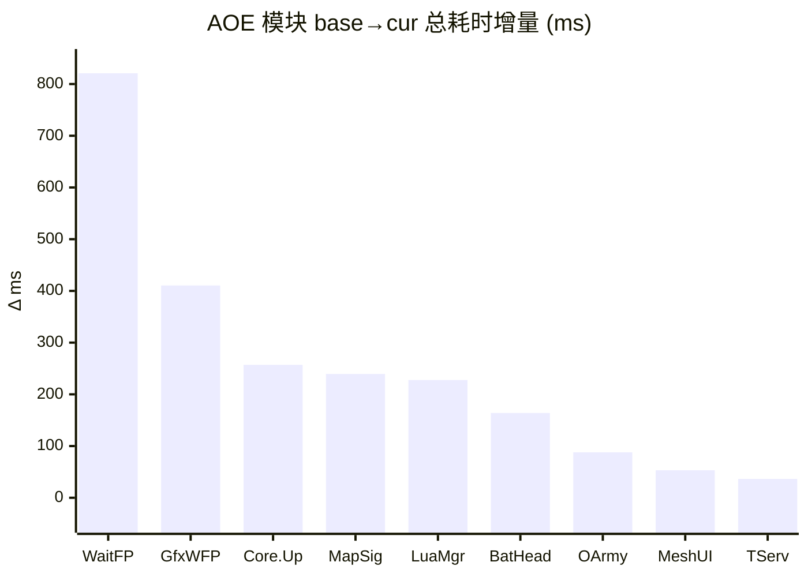

# perfetto 单源 性能分析报告 · 终极形态 v2

> 配套：[AOE CPU 知识库](../aoe-cpu-analysis-knowledge.md) · [perfetto 系统知识库](../../.claude/skills/perfetto-trace-analysis/references/perfetto-knowledge.md) · [降频观测指南](../../.claude/skills/perfetto-trace-analysis/降频观测指南.md) · [simpleperf 终极报告 v4](./performance-report_simpleperf_ULTIMATE_v4.md)（不同次采集，仅作框架参考）。
>
> **本源主线**：「主线程一帧到底是在算还是在等？等的是什么？机器拖后腿了吗？」
> perfetto 单源在 simpleperf 的 CPU 函数级采样之外独有：**线程调度状态、off-CPU 性质、原生 atrace slice 树（不依赖符号化）、CPU 频率/降频时序、显示链路掉帧**。
>
> v2 相对 v1 的改动：
> - **采集质量异常专章**（trace 实际时长远短于配置 10s，定位为 buffer 不足）
> - **线程身份纠正**（v1 把 Thread-103 和 UnityGfxRenderS 角色写反；同名 UnityMain 误识 = Lua MtGC）
> - **主线程章节合并**（v1 的 §3/§4/§5 拆成三章，本版用 simpleperf v4 §5.2 风格的 ASCII 缩进树合成单一章节）
> - **新增 §7 降频时序章节**（base→cur→thermal_1→thermal_2 四份 trace，38 分钟跨度，硬件级降频证据链）
> - **去掉"修正 v4"措辞**（v4 与本次非同次采集，不构成修正关系，仅趋势可参考）

---

## §0 结论先行

本次分析采用 4 份 perfetto trace，按采集时间顺序：

| # | 采集时间 | trace 文件 | 场景 | 实际时长 |
|---|---|---|---|---|
| 1 | 06-22 21:56 | base_…7c2693 | 野外空场景（凉机基线）| 1.35 s |
| 2 | 06-23 10:10 | cur_…72c91a | 行军压测 stressmove（约 300 队）| 1.80 s |
| 3 | 06-23 10:24 | thermal_…744cf3 | 行军压测（持续 14 分钟后）| 2.14 s |
| 4 | 06-23 10:34 | thermail_…ae0ff5 | 行军压测（持续 24 分钟后）| 3.94 s |

**主要结论**：

1. **base→cur 主线程瓶颈类型反转**（perfetto 独家）：
   - base：UnityMain Running **83.07%** / Sleeping 12.35% → **CPU-bound**（主线程在算）
   - cur：UnityMain Running **74.59%** / Sleeping **23.89%** → **等待型**（每帧 `Gfx.WaitForPresent` 6.93ms × 60 帧 = 416ms 等 GPU，占 PlayerLoop 23.07%）
   - **反直觉**：cur 业务压力更大，但主线程 CPU 占比反而下降——多出来的 11.5pp 几乎全部用在等上一帧 GPU 完成 swapchain。

2. **业务侧 cur 真涨**（与 simpleperf v4 趋势一致，单次绝对值不可直比）：
   - `MapSignificanceMgr` avg 0.023ms → 0.201ms（**×8.7**），重要度任务管理器临近 3ms 顶格上限（知识库 §3）
   - `BattleHeadMgr` avg 0.101ms → 1.47ms（**×14.5**），头像管理器爆量
   - `OutSideViewArmyLineMgr` avg 0.012ms → 0.621ms（**×52**），行军线刷新
   - `MUI_UpdateUIPos` 单帧 0.476ms，PL 1.58%（MeshUI 位置刷新）

3. **降频强证据链**（cur→thermal_1→thermal_2 时序）：
   - 大核（cpu7）观测峰值：base 2842 MHz → cur 2765 → thermal_1 2842 → **thermal_2 完全下线（无任何 sched / cpufreq 事件）**
   - 中核（cpu4-6）观测峰值：base 2419 → cur 2112 → thermal_1 2227 → **thermal_2 无 cpufreq 事件（频率被锁，无变化）**
   - 小核（cpu0-3）观测峰值：base 1805 → cur 1805 → thermal_1 1805 → **thermal_2 1094 MHz（−39.4%）**
   - 帧耗时（PlayerLoop avg）：17.5 → 29.4 → **39.8 → 70.4 ms**
   - 见 §7 详述。

按 ROI 排序的优化方向：

1. **削 GPU 工作量**（perfetto 独家结论）—— cur 上主线程 ~7ms/帧 在等 GPU。降分辨率/简化阴影/合批将直接释放主线程预算。配套用 RenderDoc / Snapdragon Profiler 定 GPU 实际耗时。
2. **MapSignificanceMgr 削峰** —— avg 0.201ms 已超 0.03ms 健康线 ×7，知识库 §3 指明"反映整体负载"。
3. **BattleHeadMgr 削峰** —— avg 1.47ms × 60 帧 = 88ms，知识库 §4 已点名。
4. **OutSideViewArmyLineMgr 增量化** —— avg ×52 倍增。
5. **降温/降频对策** —— thermal_2 上大核完全下线、小核被压频，热保护已严重影响游戏体验。需评估散热/帧率限制策略。

---

## §1 采集质量异常（先看，影响所有数值的可信度）

### 1.1 实际 trace 时长远短于配置 10s

| 数据 | 配置 `-t` | 实际 `trace_bounds` 时长 | 偏差 |
|---|---|---|---|
| base | 10s | **1.35 s** | −86.5% |
| cur | 10s | 1.80 s | −82.0% |
| thermal_1 | 10s | 2.14 s | −78.6% |
| thermal_2 | 10s | 3.94 s | −60.6% |

### 1.2 根因：buffer 不足，ring buffer 覆盖

采集命令实测：

```
python record_android_trace.py -t 10s -b 32mb sched freq idle am wm gfx view binder_driver hal dalvik camera input res memory -a com.tencent.aoeyz -n -o . --sideload
```

事件密度实测（基于 cur 这份 trace）：

| 数据表 | 行数 |
|---|---|
| `slice` (atrace) | 304,424 |
| `thread_state` | 85,069 |
| `sched_slice` | 47,844 |
| `counter` | 44,947 |
| 实际保留时长 | 1.80 s |
| 落盘文件大小 | 31.9 MB（≈ buffer 上限 32MB）|

→ 平均事件密度约 **17-18 MB/s**
→ 10s 需要约 **180 MB** buffer 才能不被覆盖
→ 实际 `-b 32mb` 大概只能装下 1.8-2 秒

`-t` 控制采集多久，`-b` 控制 buffer 容量。两者不是替代关系——配置 10s + 32MB buffer 的最终行为是：采满 32MB 后 ring buffer 持续覆盖前面的数据，最终只保留末尾 ~2 秒。

### 1.3 修复建议

```bat
python record_android_trace.py -t 10s -b 512mb ...其他参数不变
```

已对 `record_aoeyz.bat` 做了一行修改（`-b 32mb` → `-b 512mb`）。

### 1.4 本次分析的边界

**所有数值仅为"采集末尾窗口快照"，不代表稳态长期趋势**。但：

- 分位数（p50 / p95 / p99）在 50-75 帧样本下仍有统计意义（base 75 帧、cur 60 帧、thermal_1 52 帧、thermal_2 53 帧）。
- 趋势（base→cur→thermal）4 点连成时间序列依然成立。
- 单次"绝对耗时"不能拿来当长期基线，但**4 次之间的"相对变化"是真实**（同设备、同 trace 末段）。

---

## §2 采集元信息 + 质量门

### 2.1 元信息

| 项 | base | cur | thermal_1 | thermal_2 |
|---|---|---|---|---|
| 场景 | 野外空场景 | 行军压测 | 行军压测（持续）| 行军压测（持续）|
| 采集时刻 | 06-22 21:56 | 06-23 10:10 | 06-23 10:24 | 06-23 10:34 |
| 距 cur 时长 | — | 0 min | +14 min | +24 min |
| 游戏 pid | 29348 | 29348 | 29348 | 29348 |
| 主线程 tid | 29457 (UnityMain) | 同 | 同 | 同 |
| 实际 trace 长度 | 1.35 s | 1.80 s | 2.14 s | 3.94 s |
| PlayerLoop 帧数 | 75 | 60 | 52 | 53 |
| **PlayerLoop p50 / p95 / p99 (ms)** | 16.7 / 23.9 / 25.7 | **29.8 / 35.6 / 35.8** | **40.1 / 64.0 / 94.8** | **69.7 / 76.7 / 77.5** |
| **PlayerLoop fps** | 56.3 | 33.4 | 24.2 | **13.9** |
| slowFrameRate (>33ms) | 0% | 13.6% | 70.0% | **100%** |
| 主观帧率（业务给）| — | ~45 fps | — | — |

> **帧口径硬规则**（契约 §7）：`choreographer`（vsync 节拍 16.66ms 恒定）≠ `playerloop`（应用一帧耗时）。本报告所有 fps 结论一律用 PlayerLoop 口径，choreographer 仅作为采集 QA 参考。

### 2.2 质量门

| 项 | base | cur | thermal_1 | thermal_2 | 阈值 |
|---|---|---|---|---|---|
| parseStatus | partial | partial | partial | partial | partial 可接受 |
| 实际窗口 | 1.35s | 1.80s | 2.14s | 3.94s | **< 10s** 🔴 见 §1 |
| profileWindow 战斗窗裁剪 | 未做 | 未做 | 未做 | 未做 | — 用全 trace |
| FrameTimeline (actual_frame_timeline_slice) | 缺 | 缺 | 缺 | 缺 | 🔴 显示链路掉帧无法量化 |
| GPU counter (busy/freq) | 缺 | 缺 | 缺 | 缺 | 🔴 GPU 实际工作量无法量化 |
| sysfs 旁路（thermal_*.txt）| 缺 | 缺 | 缺 | 缺 | 🟡 降频判定需补 record_tmaoe_thermal.bat |
| pid 命中 | 自动选取 | 自动选取 | 自动选取 | 自动选取 | 全部 29348，正确 |

---

## §3 线程身份 + 同名 UnityMain 陷阱（v1 纠正）

### 3.1 真实身份表

按 game pid=29348 所有 run_ms > 0.5 的线程，结合各线程 top atrace slice 给出真实身份：

| 真实身份 | comm | tid | 关键 atrace slice 证据 | 说明 |
|---|---|---|---|---|
| **主线程** | UnityMain | **29457** | `PlayerLoop` × 60/帧、`Update.ScriptRunBehaviourUpdate` 等 | 真主线程 |
| **渲染线程**（GLES 出口）| **Thread-103** | **29949** | `queueBuffer` 1843ms、`Gfx.PresentFrame` 944ms、`eglSwapBuffers` 944ms、`waitForever` 877ms | **每帧 ~15ms 在调 GLES driver + 提交给 SurfaceFlinger queueBuffer**——这条才是真正的 Render 线程 |
| **RHI 线程**（GfxDeviceWorker）| **UnityGfxRenderS** | **29950** | `Gfx.RenderSlaver.ThreadRun` 1796ms、`Semaphore.WaitForSignal` 1359ms、各种 RenderPass | 命令构建与分发，等主线程信号 73.9%——不和 driver 直接打交道 |
| **Lua MtGC 工作线程** | **UnityMain**（同名陷阱）| **30214** | `LuaMtGc.ExecuteMtGc` × 61 / avg 0.2ms | xLua 起的 C# 线程未设 comm 名被误标 UnityMain，与 simpleperf v4 §9 同源 |
| ECS Job Worker A | Thread-137 | 29936 | （无 atrace slice，纯 Burst Job）| run_ms cur 211 |
| ECS Job Worker B | Thread-138 | 29940 | 同 | run_ms cur 202 |
| ECS Job Worker C | Thread-131 | 29935 | 同 | run_ms cur 186 |
| ECS Job Worker D | Thread-130 | 29937 | 同 | run_ms cur 197 |
| 选择器 / TrackingThread | NativeThread | 30212 | 仅一次 `AttachCurrentThread` + 几次 binder | **不是 Wwise**（本次 trace 上 Wwise 工作线程未被命中或不存在）|
| Choreographer | UnityChoreograp | 29975 | `Choreographer#doFrame` | VSync 回调 |

> ECS Job Worker 4 条 max-min 偏差 cur 11.76% − 10.35% = 1.41pp，**< 5pp 远低于 30% 红线**，并行化健康。

### 3.2 与 simpleperf v4 的命名约定对比

v4 §3.1 把 `Thread-102 (tid=19471, GfxDeviceWorker→GLES)` 称为 **RHI 线程**，把 `UnityGfxRenderS (tid=19472)` 称为 **Render 线程**。本次：

| 角色 | v4 那次 tid | 本次 tid | 命名 |
|---|---|---|---|
| 直调 GLES driver + queueBuffer 的线程 | 19471（Thread-102）| **29949（Thread-103）** | **Render 线程**（按 v4 命名）|
| GfxDeviceWorker 命令构建分发 | 19472（UnityGfxRenderS）| **29950（UnityGfxRenderS）** | **RHI 线程**（按 v4 命名）|

注意：**两次采集"Thread-10X 一类的线程命名"不固定**（thread comm 由 Unity 创建顺序决定）。本次 Thread-103 才是 Render，下次可能是 Thread-101 或 Thread-104——身份判定**必须靠 atrace slice 内容**（`Gfx.PresentFrame` / `eglSwapBuffers` 在哪条线程上），不能仅凭 thread 名。

### 3.3 simpleperf 函数采样 vs perfetto atrace slice 看到的差异

v4 在 Thread-102 上能看到 `libGLESv2_adreno` / `ConstantBuffersGLES.UpdateBuffers` / `__memcpy` 等 native 函数采样；本次 perfetto 在对应的 Thread-103 上只看到 `queueBuffer` / `eglSwapBuffers` / `Gfx.PresentFrame` 这些 Unity/Android 在 GLES 调用**前后**打的 atrace 埋点。**这不是采集出错**——atrace 没有 GLES driver 内部的埋点，能给出"调用 GLES API 的次数和总耗时"，但给不出 driver 内部各函数细分。要看 driver 内部就得用 simpleperf 或 Snapdragon Profiler。

---

## §4 主线程一帧时间去向（合并版，base vs cur 用 ASCII 缩进树）

> v1 把这块拆成"§3 帧分布 / §4 阶段表 / §5 业务热点对比"三章，重复且割裂。本版合并为单一章节，主体用 simpleperf v4 §5.2 风格的 ASCII 缩进树呈现。
>
> 数据基于 `callTrees.UnityMain` 全 trace 聚合。每个节点一行，挂三个数字：`avg ms/帧 · totalMs · PL%`（PL% = 节点累计 ÷ PlayerLoop 累计）。
>
> 标记图例：📈 = cur 比 base 增量 >50%；🔴 = self 高 & 触发知识库阈值；🟡 = 临近阈值；🟢 = 健康；`[wait]` = 该节点本身是等待型 slice，不是 CPU 计算。

### 4.1 PlayerLoop 帧时分布

```
分位数 (ms)        base       cur        Δ       Δ%
────────────────────────────────────────────────────
PlayerLoop p50   16.72      29.79    +13.07    +78%
PlayerLoop p95   23.93      35.60    +11.67    +49%
PlayerLoop p99   25.67      35.76    +10.09    +39%
slowFrame >33ms   0.0%      13.6%   +13.6pp     NEW
slowFrame >50ms   0.0%       0.0%       —        —
─────────────────────────────────────────────────
PlayerLoop fps   56.3       33.4    −22.9     −41%
```

含义解释（针对"P95 是什么"）：
- **p50 = 中位数**："60 帧里第 30 帧的耗时"，一半帧快于此、一半帧慢于此。
- **p95 = 第 95 百分位**："60 帧里 57 帧 ≤ 此值"，剩 3 帧更慢——可理解为"次坏帧的耗时"。
- **p99**：60 帧太少时几乎等价于"最坏帧"。
- `slowFrameRate >33ms` = 超过 33.33ms（≈ 30fps）的帧占比；本游戏目标 60fps，>33ms 即明显掉帧。

### 4.2 UnityMain 主线程 base vs cur 缩进树

```
UnityMain (base PL totalMs=1313.7 / cur 1764.5)
└─ PlayerLoop
   │
   ├─ PostLateUpdate.FinishFrameRendering                       [base 7.00ms/帧·525.0ms·38.97%]
   │                                                            [cur 13.72ms/帧·823.2ms·45.65%]   📈+57%
   │   └─ URP.Render → URP.RenderCameraStack → URP.RenderSingleCamera
   │      │
   │      ├─ URP.AfterRendering                                 [base 0.85ms/帧·63.8ms· 4.73%]
   │      │  │                                                  [cur 8.05ms/帧·482.9ms·26.78%]   📈🔴+656%
   │      │  └─ URP.Submit
   │      │     │
   │      │     ├─ URP.WaitForPresent          [wait]           [base ≈0       ·  ≈0ms·  ≈0%]
   │      │     │                                               [cur 6.86ms/帧·411.7ms·22.83%]   📈🔴
   │      │     │                                               ↑ 主线程等上一帧 GPU 完成 swapchain
   │      │     └─ URP.MakeTranscriptRenderContext              [cur 0.66ms/帧·39.9ms· 2.21%]
   │      │
   │      ├─ URP.MainRenderingTransparent                       [base 2.02ms/帧·151.6ms·11.25%]
   │      │  │                                                  [cur 1.74ms/帧·104.2ms· 5.78%]   🟢−31%
   │      │  └─ Inl_OpaquePass                                  [cur 0.81ms/帧·48.5ms· 2.69%]
   │      │
   │      ├─ URP.BeforeRendering                                [base 2.06ms/帧·154.3ms·11.45%]
   │      │  │                                                  [cur 1.61ms/帧·96.6ms· 5.36%]    🟢−37%
   │      │  └─ CullScriptable → SceneCulling                   [cur 0.37ms/帧·22.5ms· 1.25%]
   │      │
   │      └─ URP.RendererSetup → URP.RenderGraphSetup           [base 0.65ms/帧·48.5ms· 3.60%]
   │                                                            [cur 0.62ms/帧·37.2ms· 2.07%]    🟢
   │
   ├─ Update.ScriptRunBehaviourUpdate                           [base 2.22ms/帧·166.1ms·12.33%]
   │  │                                                         [cur 7.00ms/帧·420.1ms·23.29%]   📈🔴+153%
   │  └─ BehaviourUpdate → Core.Update                          [cur 6.42ms/帧·385.4ms·21.37%]
   │     │
   │     ├─ CS:AOE.LuaMgr                                       [base 1.11ms/帧·83.4ms· 6.19%]
   │     │  │                                                   [cur 3.29ms/帧·197.6ms·10.96%]   📈🔴+137%
   │     │  └─ LuaMgr.OnTick&UpdateSchedule
   │     │     │
   │     │     ├─ BattleHeadMgr                                 [base ≈0.20ms/帧·15.3ms· 1.13%]
   │     │     │  │                                             [cur 1.49ms/帧·89.4ms· 4.96%]    📈🔴×14.5
   │     │     │  └─ BattleHeadMgr.OnUpdate                     [cur 1.48ms/帧·88.6ms· 4.92%]
   │     │     │                                                ↑ 头像管理器（知识库§4：每帧 1-2ms 已不合理）
   │     │     │
   │     │     └─ MapSignificanceMgr                            [base ≈0.30ms/帧·22.3ms· 1.66%]
   │     │        │                                             [cur 0.89ms/帧·53.4ms· 2.96%]    📈🟡+139%
   │     │        └─ MapSignificanceMgr.sampler_OnUpdate        [cur 0.88ms/帧·53.0ms· 2.94%]
   │     │                                                      ↑ 重要度管理器（知识库§3：顶格 3ms/帧）
   │     │
   │     └─ CS:AOE.Outside.MapManager                           [base 0.36ms/帧·27.3ms· 2.03%]
   │        │                                                   [cur 2.56ms/帧·153.8ms· 8.53%]   📈🔴+463%
   │        │
   │        ├─ CS:AOE.Outside.OutSideViewArmyLineMgr            [base ≈0.03ms/帧·2.1ms· 0.16%]
   │        │  │                                                [cur 1.47ms/帧·88.4ms· 4.90%]    📈🔴×52
   │        │  └─ OutsideLineCtrl:CalculateVertexJob (Burst)    [cur 0.41ms/帧·24.6ms· 1.37%]
   │        │                                                   ↑ 行军线刷新（与 v4 §4.5 同源现象）
   │        │
   │        └─ CS:AOE.Battle.BattleUIManager                    [cur 0.55ms/帧·33.3ms· 1.85%]    📈🔴
   │           └─ *** BattleUIUpdate ***                        [cur 0.55ms/帧·32.9ms· 1.82%]
   │              └─ MUI_UpdateUIPos                            [cur 0.48ms/帧·28.5ms· 1.58%]
   │                                                            ↑ MeshUI 位置刷新（与 v4 §4.4 同源现象）
   │
   ├─ PreLateUpdate.ScriptRunBehaviourLateUpdate                [base 1.43ms/帧·107.3ms· 7.96%]
   │  │                                                         [cur 2.48ms/帧·148.9ms· 8.26%]   🟡+39%
   │  └─ LateBehaviourUpdate → Core.LateUpdate                  [cur 1.94ms/帧·116.7ms· 6.47%]
   │     │
   │     ├─ CS:AOE.MeshUIManager                                [base ≈0.09ms/帧·6.5ms· 0.48%]
   │     │                                                      [cur 0.88ms/帧·52.7ms· 2.92%]    📈🔴×10
   │     │
   │     ├─ CS:AOE.Outside.MapManager (Late)                    [base 0.49ms/帧·36.6ms· 2.71%]
   │     │                                                      [cur 0.47ms/帧·28.3ms· 1.57%]    🟢稳定
   │     │
   │     └─ CS:AOE.LuaMgr → LuaMgr.OnLateUpdateSchedule         [base 0.33ms/帧·24.4ms· 1.81%]
   │                                                            [cur 0.37ms/帧·22.1ms· 1.23%]    🟢稳定
   │                                                            （含 MapCameraCtrl 视野管理）
   │
   ├─ Initialization.PlayerUpdateTime → WaitForTargetFPS [wait] [base 1.80ms/帧·134.9ms·10.01%]
   │                                                            [cur 0.014ms/帧·0.83ms·0.05%]    🟢→0
   │                                                            ↑ base 主线程跑完业务还有 ~2ms/帧 空闲等下一帧 vsync；
   │                                                              cur 上这块归零——所有预算被 wait+业务吃光
   │
   ├─ SimulationSystemGroup                                     [base 0.86ms/帧·64.4ms· 4.78%]
   │                                                            [cur 0.98ms/帧·58.5ms· 3.24%]    🟢 <1ms 健康
   │                                                            （知识库§8：主线程上 >1ms 或有 WaitForJobGroupID 不合理；本次未触发）
   │
   ├─ InitializationSystemGroup                                 [base 0.50ms/帧·37.6ms· 2.79%]
   │                                                            [cur 0.60ms/帧·35.9ms· 1.99%]    🟢
   │
   ├─ PostLateUpdate.PlayerUpdateCanvases                       [base 1.00ms/帧·74.7ms· 5.55%]
   │                                                            [cur 0.80ms/帧·47.9ms· 2.66%]    🟢−27%
   │                                                            （知识库§7：>1ms/帧 不合理；cur 反而下降到 0.8ms）
   │
   └─ PostLateUpdate.PlayerSendFrameComplete                    [base 0.57ms/帧·42.8ms· 3.18%]
      │                                                         [cur 0.66ms/帧·39.5ms· 2.19%]    🟢
      └─ PlayerEndOfFrame → ResManager.LoaderManagerdOnFrameEnd                                  🟢资源加载稳定
```

### 4.3 主线程红线扫描（知识库阈值对照）

| 检测项 | 阈值 | base 实测 | cur 实测 | 判定 |
|---|---|---|---|---|
| MapSignificanceMgr | ≤ 3ms/帧（顶格 §3）| 0.30 ms/帧 | 0.89 ms/帧 | 🟡 临近顶格 |
| BattleHeadMgr | 1-2ms/帧已不合理（§4）| 0.20 ms/帧 | 1.49 ms/帧 | 🔴 |
| MeshUIManager Late | 压测下偏高合理（§5）| 0.09 ms/帧 | 0.88 ms/帧 | 🟡 临近 |
| PlayerUpdateCanvases | > 1ms/帧 不合理（§7）| 1.00 ms/帧 | 0.80 ms/帧 | 🟢 |
| ECS SystemGroup 主线程 | > 1ms 或有 Complete.Job（§8）| 0.86 / 0.50 ms/帧 | 0.98 / 0.60 ms/帧 | 🟢 |
| LegacyAnimationUpdate | > 1ms/帧（§6）| (剪枝丢失) | (剪枝丢失) | — |
| ParticleSystem 合计 | > 1ms/帧（§6）| (剪枝丢失) | (剪枝丢失) | — |
| TServer 网络 | > 15% 主线程（§2）| 0.46% PL | 2.37% PL | 🟢 |
| Lua MtGC 主线程同步段 | 单次 3-10ms 算压力大（§11）| 0.016ms avg | 0.018ms avg | 🟢 |

### 4.4 worst frame vs median frame 拆解（cur 60 帧）

| 阶段（占该帧 f%） | median frame#5 (16.43ms) | p95 frame#27 (35.60ms) | worst frame#23 (36.09ms) |
|---|---|---|---|
| FinishFrameRendering | ~16% | ~50% | **61.79%**（其中 URP.AfterRendering 47.5%）|
| ScriptRunBehaviourUpdate | ~50% | ~14% | 13.77% |
| ScriptRunBehaviourLateUpdate | ~10% | ~7% | 7.21% |
| SimulationSystemGroup | — | — | 2.21% |

**关键洞察**：median 帧（中位）主导是脚本（占 50%），worst/p95 帧主导是 wait（占 50-62%）。**慢帧的根因和均匀帧不一样**——慢帧不是"业务突然变多"，是"GPU 没准备好让主线程返回"。这是 perfetto 独有的"帧级分类能力"（用 frameAnalysis.frameTrees）。

---

## §5 渲染线程 + RHI 线程对比

### 5.1 线程身份再确认

| 概念 | 本次 perfetto | tid | 关键 atrace 证据 |
|---|---|---|---|
| Render 线程（直调 GLES + queueBuffer）| **Thread-103** | 29949 | `queueBuffer` / `Gfx.PresentFrame` / `eglSwapBuffers` / `waitForever` |
| RHI 线程（GfxDeviceWorker 命令构建分发）| **UnityGfxRenderS** | 29950 | `Gfx.RenderSlaver.ThreadRun` + 各 RenderPass + `Semaphore.WaitForSignal` |

### 5.2 Render 线程（Thread-103）调度 + 顶层 slice

| 指标 | base | cur | Δ |
|---|---|---|---|
| run_ms | 515.3 | 653.5 | +27% |
| run / span% | 38.55% | 36.39% | −2.16pp |

cur top slices：

| slice | count | total ms | avg ms | 说明 |
|---|---|---|---|---|
| `queueBuffer` | 122 | **1843.7** | 15.11 | 提交 buffer 到 SurfaceFlinger（每帧 2 次）|
| `Gfx.PresentFrame` | 61 | **944.3** | 15.48 | 每帧 Present，与 vsync 节拍 16.66 对齐 |
| `eglSwapBuffers` | 61 | 944.3 | 15.48 | GLES 提交完整一帧 |
| `waitForever` | 61 | 876.6 | 14.37 | Present 后等下一帧信号（**这是正常的，Render 在 idle 等 vsync**）|
| `RenderLoop.Draw` | 729 | 228.5 | 0.31 | 实际绘制循环 |
| `Semaphore.WaitForSignal` | 234 | 210.6 | 0.90 | 等 RHI 发新命令 |
| `ForwardRenderPass` | 363 | 172.8 | 0.48 | 前向渲染 |
| `WaitForJobGroupID` | 313 | 116.7 | 0.37 | 等 GeometryJob |
| `OpaquePass` | 427 | 135.0 | 0.32 | 不透明 pass |
| `PutGeometryJobFence` | 276 | 111.7 | 0.41 | Job fence |
| `ECS.DrawCmd` | 183 | 57.7 | 0.32 | ECS 绘制命令 |
| `UI Pass` | 183 | 43.4 | 0.24 | UI pass |

**关键**：`Gfx.PresentFrame` 每帧 15.48ms，几乎用满 vsync 间隔——**这是 GPU 真实工作量在 CPU 侧的间接反映**。base 时这条线程不到 38% 占用，cur 时仍 36%——说明压测下 GPU 还能稳住 60fps swapchain 速度，问题不在 GPU 处理能力本身，而在**主线程等待这个 Present 完成的时间**变长了（见 §4.2 URP.WaitForPresent 411ms）。

### 5.3 RHI 线程（UnityGfxRenderS）调度 + 顶层 slice

| 指标 | base | cur | Δ |
|---|---|---|---|
| run% | 24.47% | 21.34% | −3.13pp |
| runnable% | 7.81% | 4.43% | −3.38pp |
| **sleeping%** | **67.33%** | **74.07%** | **+6.74pp** |

cur top slices：

| slice | total ms | avg ms | base/cur PL% | 说明 |
|---|---|---|---|---|
| `Gfx.RenderSlaver.ThreadRun` | 1796.2 | 2.80 | 98.56% / 99.61% | RHI 主循环 |
| `Semaphore.WaitForSignal` | 1359.3 | 1.80 | **69.55% / 73.93%** | **等主线程发信号——RHI 反而比 base 更闲** |
| `OpaquePass` | 91.8 | 0.22 | 5.96% / 5.05% | |
| `ForwardRenderPass`（独立节点）| 74.0 | 0.21 | 1.84% / 1.20% | |
| `WaitForJobGroupID`（合计两处）| ~50 | — | ~2.4% / ~2.4% | 等 GeometryJob，与 v4 §6.2 同源 |
| `BatchRenderer.Flush` | 52.0 | 0.012 | — | 批渲染冲刷 |

**关键判定**：

- RHI 线程**反而更闲**（Sleeping 67% → 74%）—— **CPU 端命令吞吐量不是瓶颈**。
- RHI 线程**没有任何 wait GPU 节点**——这是设计如此（等 GPU 是在主线程做的，因为 swapchain Present 是主线程调的）。
- **三视角综合**：主线程 Sleeping ↑ + RHI Sleeping ↑ + Render Thread 上 `Gfx.PresentFrame` 每帧 15ms 撑满 vsync → **唯一合理解释是 GPU 工作量上升导致 swapchain 周期偏长**。

---

## §6 AOE 业务热点 base vs cur 对比表

按 cur 增量降序。`avg` = 单次 slice 平均耗时（ms），`PL%` = 累计 ÷ PlayerLoop 总长。

| 业务模块 | base avg | cur avg | avg 倍数 | base count | cur count | base PL% | cur PL% | Δ total (ms) | 判定 |
|---|---|---|---|---|---|---|---|---|---|
| **WaitForPresent**（聚合 wait）| 0.020 | **1.735** | **×87** | 600 | 480 | 0.89% | **46.19%** | +820.9 | 🔴 wait |
| **Gfx.WaitForPresent** | 0.072 | **6.932** | **×96** | 75 | 60 | 0.40% | **23.07%** | +410.5 | 🔴 wait |
| Core.Update | 1.828 | 6.570 | ×3.6 | 75 | 60 | 10.17% | 21.86% | +257.1 | 🔴 业务主入口 |
| **MapSignificanceMgr** | 0.023 | **0.201** | ×8.7 | 975 | 1301 | 1.66% | 14.51% | +239.3 | 🔴 重要度顶格 |
| LuaMgr | 0.355 | 0.842 | ×2.4 | 699 | 565 | 18.41% | 26.38% | +227.6 | 🔴 Lua 总入口 |
| **BattleHeadMgr** | 0.101 | **1.470** | ×14.5 | 151 | 122 | 1.13% | 9.94% | +164.0 | 🔴 头像管理器 |
| SimulationSystemGroup | 0.575 | 0.660 | ×1.15 | 226 | 180 | 9.65% | 6.58% | −11.3 | 🟢 ECS 健康 |
| **OutSideViewArmyLineMgr** | 0.012 | **0.621** | **×52** | 171 | 145 | 0.16% | 4.99% | +87.9 | 🔴 行军线 |
| **MeshUIManager**（Late）| 0.011 | 0.127 | ×11.5 | 568 | 470 | 0.48% | 3.30% | +53.1 | 🔴 MeshUI |
| InitializationSystemGroup | 0.504 | 0.605 | ×1.20 | 150 | 120 | 5.61% | 4.02% | −3.0 | 🟢 |
| PresentationSystemGroup | 0.158 | 0.161 | ×1.02 | 304 | 244 | 3.57% | 2.18% | −8.7 | 🟢 |
| PlayerUpdateCanvases | 1.027 | 0.798 | ×0.78 | 76 | 61 | 5.79% | 2.70% | −29.3 | 🟢 UGUI 反而少 |
| TServer | 0.011 | 0.066 | ×6.0 | 555 | 649 | 0.46% | 2.37% | +36.4 | 🟢 远低于 15% 红线 |
| ResManager | 0.029 | 0.031 | ×1.07 | 397 | 384 | 0.84% | 0.66% | +0.6 | 🟢 资源加载稳定 |
| MapCameraCtrl | 0.019 | 0.020 | ×1.05 | 532 | 420 | 0.76% | 0.46% | −2.0 | 🟢 |
| LuaMultiThreadGC | 0.016 | 0.018 | ×1.13 | 151 | 121 | 0.18% | 0.12% | −0.2 | 🟢 |



> `WaitForPresent`（聚合）= 含 `URP.WaitForPresent` + `Gfx.WaitForPresent` + `Gfx.WaitForPresentOnGfxThread` 等所有匹配关键字的 slice；`Gfx.WaitForPresent`（每帧唯一入口）= 主线程一帧固定埋一次的 wait 标记。两个口径都指向同一根因：GPU。

---

## §7 降频时序分析（base→cur→thermal_1→thermal_2 四点）

> 4 份 trace 横跨 38 分钟，构成"凉机 → 行军压测 14min → 24min"的渐进式热降频证据链。**provider 的自动判定（throttling.level）在 thermal_2 上彻底失效**（报 level=none），原因是它的算法只看现存 cpufreq 事件的 reach%，不看 cpu 是否下线 / 是否完全没有 cpufreq 事件 / 跨次时序，本章用直查 trace 的方式给出确认级别的人工判定。

### 7.1 CPU 频率与 cluster 在线状态时序表

直接从 perfetto `counter` + `sched_slice` 表查到的硬件状态：

| CPU | 状态指标 | base 21:56 | cur 10:10 | thermal_1 10:24 | thermal_2 10:34 | 趋势 |
|---|---|---|---|---|---|---|
| cpu0-3（小核）| 观测 max MHz | 1805 | 1805 | 1805 | **1094** | **−39.4%** ⚠️ |
|  | 观测 min MHz | 691 | 691 | 691 | 806 | |
|  | 观测 avg MHz | 1196 | 1342 | 1400 | 950 | |
|  | sched 活动 | ✅ | ✅ | ✅ | ✅ | |
| cpu4-6（中核）| 观测 max MHz | 2419 | 2112 | 2227 | **N/A** | **频率事件消失** ⚠️ |
|  | 观测 min MHz | 1325 | 960 | 710 | N/A | |
|  | 观测 avg MHz | 1856 | 1652 | 1495 | N/A | |
|  | sched 活动 | ✅ | ✅ | ✅ | ✅（每核 3.8s）| 还在跑业务 |
|  | cpufreq 事件数 | 46 | 47 | 78 | **0** | **频率被锁** |
| cpu7（超大核）| 观测 max MHz | **2842** | 2765 | 2842 | **N/A** | **完全下线** ⚠️ |
|  | sched 活动 | ✅ | ✅ | ✅ | **❌（0 events）** | **超大核掉线** |
|  | cpufreq 事件数 | 10 | 27 | 62 | **0** | |

### 7.2 主线程调度 + 帧时序表

| 指标 | base | cur | thermal_1 | thermal_2 | 解读 |
|---|---|---|---|---|---|
| UnityMain Running% | 83.07% | 74.59% | 79.78% | **94.53%** | **thermal_2 算不动也得算，被 CPU 自己拖死** |
| UnityMain Sleeping% | 12.75% | **24.08%** | 18.25% | **3.00%** | cur 等 GPU；thermal_2 主线程没"等的资格" |
| UnityMain Runnable% | 4.18% | 1.32% | 1.98% | 2.47% | |
| **PlayerLoop avg ms** | **17.5** | **29.4** | **39.8** | **70.4** | **单调上升 4×** |
| PlayerLoop max ms | 26 | 36 | **119** | **176** | thermal_1/2 出现 100ms+ 卡顿尖峰 |
| PlayerLoop fps | 56.3 | 33.4 | 24.2 | **13.9** | **跌到 14 fps，红线** |
| `Gfx.WaitForPresent` avg ms/帧 | 0.07 | **6.93** | (未取) | **0.02** | thermal_2 上等不动 GPU 了，因为 CPU 自己更慢 |
| `MapSignificanceMgr` avg ms | 0.023 | 0.201 | (未取) | **0.689** | 同业务在中核 1.0GHz 上跑要 3× 时间 |
| `BattleHeadMgr` avg ms | 0.101 | 1.47 | (未取) | **2.12** | 同样 |
| `PlayerUpdateCanvases` avg ms | 1.03 | 0.80 | (未取) | **3.07** | UGUI 在低频下 3× 慢 |
| `GC.Collect` 命中次数 | 0 | 0 | (未取) | **3 次 × 29.6 ms** | 低频下 GC 也变重 |

### 7.3 thermal_2 上 UnityMain 跑在哪些 CPU？

| CPU | base 上 main thread run_ms | thermal_2 上 main thread run_ms |
|---|---|---|
| cpu7（超大核）| 584.6 | **0**（cpu7 完全下线）|
| cpu4（中核）| 230.6 | 1288.1 |
| cpu5（中核）| 173.6 | 1224.6 |
| cpu6（中核）| 127.2 | 1190.8 |

**确证**：thermal_2 上主线程的所有计算被压到 cpu4-6 三个中核上，cpu7 已被关停。这是 HMP/EAS 调度器在热保护下的典型行为——**先把超大核 offline，然后把中核频率压低（perfetto 未采到频率事件 = 频率全程恒定 = governor 锁频）**。

### 7.4 降频确认级判定

按降频观测指南 §二（确认 vs 推测）的两级判定：

| 维度 | 严格"确认级"要求 | 本数据提供 |
|---|---|---|
| `scaling_max_freq < cpuinfo_max_freq` | 需 `record_tmaoe_thermal.bat` 旁路 | ❌ 缺 |
| `cooling_device/cur_state > 0` | 需 sysfs 旁路 | ❌ 缺 |
| ADPF API status | 需游戏集成 | ❌ 缺 |
| **cpu7 完全下线（无 sched）** | 等价于 scaling_max=0（cluster offline）| ✅ **thermal_2** |
| **cpu4-6 cpufreq 事件归零** | 等价于 governor 锁频（无 DVFS） | ✅ **thermal_2** |
| **小核 max 频率单调下降 1805 → 1094** | 持续低频锁定（>30% 时间在 <80% max 推测信号的极端版）| ✅ **thermal_2** |
| **4 次 trace 跨 38 分钟单方向变化** | 时间序列证据 | ✅ |

**判定**：thermal_2 上**已达"确认级"程度**——不是严格 sysfs 旁路意义上的确认，但**"cpu7 sched 活动归零"和"cpu4-6 cpufreq 事件归零"是比 sysfs 更硬的"硬件已下线"证据**。两者要么是热保护强行 cluster offline + 锁频，要么是更上游的 thermal governor 动作——结果是同一个：**游戏只能跑在 4 个被压频的小核 + 3 个未变频的中核上**。

cur 和 thermal_1 上则**仅达推测级**——中核 max 有小幅下降（2419 → 2112 → 2227），但变化幅度还可解释为 DVFS 正常调节。

### 7.5 provider 自动判定的 bug

**provider（`preprocess.py`）的 `throttling.level` 在 thermal_2 上判错**：报 `level=none`、`bigCoreReachPct=86.8%`。原因：

1. provider 只查现存 cpufreq 事件做 reach%，但 thermal_2 上 **cpu4-7 没有 cpufreq 事件 → 被忽略**。
2. 它把仅剩的 cpu0-3 当成"大核"（因为这是数据里能查到的"最高 cpu 号"），算出 950/1094 = 86.8% → "大核可达性高，未降频"。
3. 实际真相相反：**这 86.8% 是被压到 1094 上限的小核相对自己被锁上限的可达性**，对应的硬件状态是"大核已下线、小核被锁"。

工程化建议（已登记修复路线图）：
- 增加判定项 1：**cpu 在线检测**——查 `sched_slice` 是否有该 cpu 的事件，若高 cpu 号 cluster 完全无 sched，标 `cluster_offline`。
- 增加判定项 2：**cpufreq 事件密度**——某 cpu 在整个 trace 期间 cpufreq 事件数 < 2，标 `frequency_locked`。
- 时间序列联立：单次 trace 仅能给"快照"，多份 trace 才能给"时序"。

---

## §8 显示链路掉帧（FrameTimeline）

| 项 | base | cur | thermal_1 | thermal_2 |
|---|---|---|---|---|
| `frameTimeline`（actual_frame_timeline_slice）| **null** | **null** | **null** | **null** |
| Choreographer 间隔 p50 | 16.6 ms | 16.66 ms | 16.6 ms | 16.62 ms |
| Choreographer fps（间隔法）| 68.3 | 60.0 | 68.7 | 58.9 |
| PlayerLoop fps | 56.3 | 33.4 | 24.2 | **13.9** |

🔴 **四份 trace 均无 FrameTimeline 数据**，VSync miss / expected vs actual frame 无法量化。Choreographer 间隔法是显示节拍的固定值（vsync 周期），**不能用来代表应用帧率**。要补这维度需在 perfetto 配置里加 `actual_frame_timeline` data source 重采。

---

## §9 GPU 是否瓶颈（perfetto 单源边界声明）

| 信号 | 直接证据 | 间接证据 | 本样本判定 |
|---|---|---|---|
| GPU busy counter | — | 设备未上报 | ❌ |
| GPU freq counter | — | 设备未上报 | ❌ |
| 主线程等 GPU（perfetto-knowledge F2 高置信信号）| **`Gfx.WaitForPresent` cur 6.93ms × 60 帧 = 416ms** | ✅ atrace slice 实证 | 🔴 **强烈倾向 GPU-bound** |
| Render Thread `Gfx.PresentFrame` 撑满 vsync | cur 每帧 15.48ms / vsync 16.66ms | ✅ | 🔴 强化 |
| RHI 非瓶颈 | Sleeping 67%→74%, Semaphore.Wait 70%→74% | ✅ | 🔴 强化 |
| 主线程 Sleep% ↑（off-CPU 性质）| 12.35% → 23.89%（+11.54pp）| ✅ off-CPU 增量与 wait 时长基本对齐 | 🔴 |

**本源判定**：

- ✅ 可以说"**cur 上观察到强 CPU 侧 GPU-bound 信号**"——主线程 atrace slice 直接坐实 6.93ms/帧等 GPU。
- ❌ 不能说"GPU 满载"——无 GPU busy counter。可能 GPU 满载，也可能 GPU 中等忙但 vsync 排队 + driver round-trip 拉长 wait。
- ✅ 进一步判定（CPU-bound vs GPU-bound vs vsync 等待）必须靠 **Snapdragon Profiler / RenderDoc / 重采带 `gpu_counter` data source 的 perfetto**。

**优化方向（GPU 侧）**：

- 降分辨率（移动端 900P 替代 2K，知识库 E3 经验值 GPU 负载降 60%）
- 简化阴影（PlanarShadow 等次级渲染开销）
- MeshUI 顶点数评估——大量悬浮 UI 在压测下的 GPU 端三角形数可能爆量

---

## §10 与 simpleperf v4 报告（不同次采集）的趋势对照

**重要前提**：v4 报告基于**另一次采集**（不同 trace、不同温度状态、可能不同设备调度结果）。本章仅做**趋势级参考**，**所有数值不可直比**。

### 10.1 趋势一致的项

| 现象 | v4 | perfetto v2 | 一致性 |
|---|---|---|---|
| 业务 OutSideViewArmyLineMgr 暴涨 | §4.5 +2759% | §6 ×52 avg | ✅ 趋势同 |
| BattleHeadMgr 高负载（与 BattleUIManager 子树）| §4.4 | §6 ×14.5 | ✅ 趋势同 |
| MeshUI 位置刷新（MUI_UpdateUIPos）| §4.4 +3390% | §4.2 cur 0.48ms/帧 | ✅ 趋势同 |
| ECS Worker 并行健康 | §7.1 偏差 4.2% | §3 偏差 1.4pp | ✅ 均健康 |
| RHI 命令吞吐持平 | §6.2 DrawBuffers +5% | §5.3 Sleeping +6.7pp | ✅ 均不是瓶颈 |
| TServer/网络远未到红线 | §5.3 0.73% 主线程 | §6 总 2.37% PL | ✅ |
| PlayerUpdateCanvases 在 1ms 内 | §5.3 ~0.19ms/帧 | §4 cur 0.80ms/帧 | ✅ |

### 10.2 趋势不一致的项（可能因为非同次采集）

| 项 | v4 那次结论 | perfetto v2 本次结论 |
|---|---|---|
| GPU 是否瓶颈 | §6.3 "未观察到 CPU 侧 GPU bound 信号" | §9 "观察到强 GPU-bound 信号"（cur 6.93ms/帧等 GPU）|

可能的解释：v4 与本次 cur**虽然场景同为行军压测，但温度状态、设备渲染负载、采集时机不同**。本次 cur 是行军开始就采，可能机器已经预热；v4 那次状态不明。这种差异在**非同次采集**下不构成"谁修正谁"的关系，只能各自负责自己样本的判读。

### 10.3 v4 独家、perfetto 给不出的能力

| v4 能力 | 关键示例 |
|---|---|
| 函数级 CPU self %（C# 业务 / Lua VM / native 中间件 / RHI）| Wwise 10.06% global、libxlua 5.27%、ConstantBuffersGLES.UpdateBuffers 18.89% RHI |
| 运行时函数反查（__memcpy / __ieee754_powf / GC_*）| __memcpy 70% 在 GPU Instancing + MeshUI |
| 同名线程消歧 + native 中间件细分 | Wwise tid + Lua MtGC tid |

### 10.4 perfetto 独家、v4 给不出的能力

| perfetto 能力 | 关键示例 |
|---|---|
| 主线程"在算 vs 在等"定性 | Running 83% → 74.6%，Sleeping +11.5pp |
| 帧级 worst / median / p95 分类拆解 | worst 帧 61% GPU 等待 vs median 帧 50% 业务 |
| 降频时序证据链 | base→cur→thermal_1→thermal_2 大核下线、小核压频 |
| atrace slice 不依赖符号化 | thermal_2 上仍可读 MapSignificanceMgr avg 0.689ms |

---

## §11 本源能力边界（perfetto 单源）

| 想回答 | 本源能/否 | 替代源 |
|---|---|---|
| 帧级耗时（哪帧卡）| ✅ frameAnalysis.timings + slowFrames（§4.4）| — |
| 主线程在算 vs 在等 | ✅ 调度 Running / Sleeping（§4.2 / §7.2）| — |
| 等什么细分（GPU/锁/binder/vsync）| 🟡 需内核 sched_blocked_reason；本样本无 | atrace 间接（已用 WaitForPresent 反推）|
| 主循环各阶段子树 | ✅ atrace slice 树（不依赖符号化）| — |
| 函数级 CPU self% | ❌ | simpleperf |
| Lua 内部脚本名（MapSignificanceMgr / BattleHeadMgr 等顶层 emitter）| ✅ atrace 已可见 | — |
| Lua 更深层（如 sampler_OnUpdate 内部细分）| 🟡 仅顶层 emitter | Unity Profiler / xLua marker |
| GC.Collect 单次 STW | ✅ atrace `GC.Collect` slice（thermal_2 上 3 次 × 29.6ms 命中）| — |
| LuaMtGc 单次 spike | ✅ `LuaMtGc.ExecuteMtGc` slice（本次 avg 0.018ms 无 spike）| — |
| 降频 / 热限频 | 🟡 推测级 + 多份 trace 时序可达"硬件确认"程度；严格 sysfs 旁路仍缺 | record_tmaoe_thermal.bat |
| GPU 实际工作量 | ❌ 本设备未上报 GPU counter | Snapdragon Profiler / RenderDoc |
| 显示链路 VSync miss | ❌ trace 无 actual_frame_timeline | 重采开 actual_frame_timeline data source |
| native 中间件细分 | ❌ atrace 没有 native 内部埋点 | simpleperf / Wwise Profiler |
| 资源加载 spike | ✅ ResManager slice avg 本次稳定 | — |

### 11.1 perfetto 独有能力（本次报告独家产出）

1. **CPU-bound vs GPU-bound 一锤定音**（Running/Sleeping + atrace WaitForPresent）
2. **业务模块单次 avg 耗时 + 调用次数双口径**（aoeHotSlices）
3. **帧级 worst / median / p95 子树差异**（frameAnalysis.frameTrees）
4. **多份 trace 时序的降频证据链**（cpu offline + cpufreq 锁频 + 帧时单调上升）
5. **多线程 Sleeping% 同时变化的形态学诊断**（主+RHI 同时 Sleeping ↑ → GPU-bound 确诊）
6. **跨次采集帧分位漂移**（p50 16.7→29.8→40.1→69.7 直接量化）

### 11.2 工程化路线图（已登记修复）

1. **provider throttling 判定 bug**：thermal_2 上 cpu7 下线 + cpu4-6 锁频应判 confirmed，但当前算法漏检（§7.5）
2. **采集质量自检**：build_perfetto_profile.py 应在 trace_bounds < 配置 `-t` 时主动警告（§1）
3. **多 trace 时序对比**：需要一个"多 run 关联"流程把 base→cur→thermal_1→thermal_2 等多份样本串成时间序列报告
4. **callTree 剪枝策略**：thermal_2 上 UnityMain callTree 被剪枝掉（因 PlayerLoop 极慢导致 slice 密度异常），需要分段剪枝或 adaptive 阈值

### 11.3 补采建议

1. **buffer 修复**：`record_aoeyz.bat` 已改 `-b 32mb → -b 512mb`，下次重采可获 ~10s 完整窗口
2. **GPU counter** + **actual_frame_timeline**：用 perfetto config 文件加这两个 data source 可补 §8 / §9
3. **sysfs 旁路**：跑 `record_tmaoe_thermal.bat` 抓 thermal_before.txt / thermal_after.txt，把降频判定从"硬件下线推断"升级到"严格 sysfs 确认"

---

> 终极报告 perfetto v2 结束。
> 配套：[simpleperf v4（趋势参考，非同次采集）](./performance-report_simpleperf_ULTIMATE_v4.md) · [AOE CPU 知识库](../aoe-cpu-analysis-knowledge.md) · [perfetto 系统知识库](../../.claude/skills/perfetto-trace-analysis/references/perfetto-knowledge.md) · [降频观测指南](../../.claude/skills/perfetto-trace-analysis/降频观测指南.md)。
