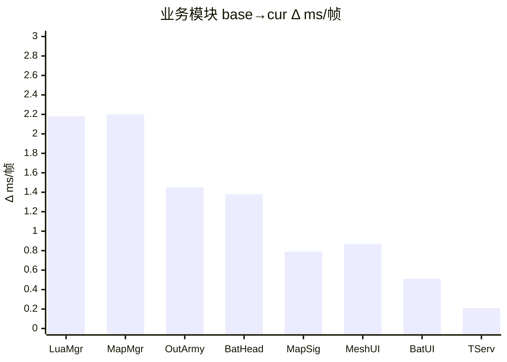

# perfetto 单源 性能分析报告 · 终极形态 v3

> 配套：[AOE CPU 知识库](../aoe-cpu-analysis-knowledge.md) · [perfetto 系统知识库](../../.claude/skills/perfetto-trace-analysis/references/perfetto-knowledge.md) · [降频观测指南](../../.claude/skills/perfetto-trace-analysis/降频观测指南.md) · [simpleperf 终极报告 v4（趋势参考，非同次采集）](./performance-report_simpleperf_ULTIMATE_v4.md)
>
> **本源主线**：「主线程一帧到底是在算还是在等？等的是什么？机器拖后腿了吗？」
> perfetto 在 simpleperf 的 CPU 函数级采样之外独有：**线程调度状态、off-CPU 性质归因、原生 atrace slice 树（不依赖符号化）、CPU 频率/降频时序、显示链路掉帧**。
>
> v3 相对 v2 的改动：
> - **业务模块数据全部用"按 PlayerLoop 帧聚合"的真实 ms/帧**（v2 误用了 aoeHotSlices 子 slice 平均口径，数据不准）
> - **线程身份按行业通用命名定稿**（v2 写反了 RHI/Render，本版按 v4 + UE 习惯：RHI=直调 GLES driver 那条 = Thread-103；Render=GfxDeviceWorker = UnityGfxRenderS）
> - **§3/§4/§5 三章合并** → 主线程主体仅一处（§4），渲染链路 + GPU bound 判定合并为 §5
> - **删 v2 §5.1/§9 重复的身份说明**（信息全部归到 §3）
> - **新增 §7 主线程 off-CPU 归因可视化**（含归因表 + worst frame 时间轴）
> - **§8 降频证据链改用紧凑表**（base / cur / thermal_1 / thermal_2 一行一份样本）
> - **§8 显示链路（FrameTimeline）降级**为 §1 备注（没数据时单列章节没意义）
> - **删 v2 所有"修正 v4"措辞**（非同次采集，仅趋势对照）

---

## §0 结论先行

本次分析采用 4 份 perfetto trace，跨 38 分钟：

| 时间点 | trace | 场景 | 实际时长 |
|---|---|---|---|
| 06-22 21:56 | base | 野外空场景（凉机基线）| 1.35 s |
| 06-23 10:10 | cur | 行军压测 stressmove（约 300 队）| 1.80 s |
| 06-23 10:24 | thermal_1 | 行军压测（开机后第 14 分钟）| 2.14 s |
| 06-23 10:34 | thermal_2 | 行军压测（开机后第 24 分钟）| 3.94 s |

> 4 份采集长度均远短于配置的 10s，根因是 buffer 容量不足 → 见 §1。

**三个独立结论**（一句话各一个）：

1. **cur 主线程瓶颈是"在等 GPU"，不是"在算"**：UnityMain Sleeping 23.89% / 总 423.4 ms，其中 **411.7 ms（97.2%）被 `URP.WaitForPresent` 覆盖**。一帧 30ms 里平均 ~7ms 主线程在等 GPU 完成上一帧 swapchain。见 §5 / §7。
2. **业务侧 cur 真涨**：BattleHeadMgr **1.49 ms/帧（max 3.58）超 1-2ms 红线**；MapSignificanceMgr 0.89 ms/帧（**max 5.69 单帧超 3ms 顶格**）；OutSideViewArmyLineMgr 0.03 → 1.48 ms/帧（×53）；Lua 主循环 1.06 → 3.24 ms/帧（×3）。见 §6。
3. **thermal_2 上确认级降频**：cpu7（超大核）完全下线无 sched 活动、cpu4-6 cpufreq 事件归零（频率被锁）、cpu0-3 max 从 1805 → 1094 MHz（−39%）。帧时单调上升 17.5 → 29.4 → 39.8 → 70.4 ms。见 §8。

按 ROI 排序的优化方向：

1. **削 GPU 工作量**（perfetto 独家结论）—— 主线程 ~7ms/帧 等 GPU。降分辨率 / 简化阴影 / 合批是直接手段，但本源给不出"GPU 内部哪个阶段重"，需配合 RenderDoc / Snapdragon Profiler。
2. **BattleHeadMgr 削峰** —— 平均超红线，知识库 §4 已点名。
3. **MapSignificanceMgr 单帧峰值削峰** —— 平均未顶格、但 max 5.69ms 已破 3ms 顶格红线，知识库 §3 "反映整体负载"成立。
4. **OutSideViewArmyLineMgr 增量化** —— ×53 倍涨幅。
5. **降温/降频对策** —— 24 分钟后大核完全下线，热保护已严重影响体验。

---

## §1 采集质量异常 + 数据口径声明

### 1.1 trace 实际时长远短于配置

| 数据 | `-t` 配置 | 实际 `trace_bounds` | 偏差 |
|---|---|---|---|
| base | 10s | **1.35 s** | −86.5% |
| cur | 10s | 1.80 s | −82.0% |
| thermal_1 | 10s | 2.14 s | −78.6% |
| thermal_2 | 10s | 3.94 s | −60.6% |

### 1.2 根因：buffer 不足触发 ring buffer 覆盖

采集命令实测：

```
python record_android_trace.py -t 10s -b 32mb sched freq idle am wm gfx view binder_driver hal dalvik camera input res memory -a com.tencent.aoeyz -n -o . --sideload
```

事件密度（基于 cur）：`slice` 30.4 万行 + `thread_state` 8.5 万行 + `sched_slice` 4.8 万行 + `counter` 4.5 万行 → 平均 **17-18 MB/s**。10s 需要 ~180MB buffer，`-b 32mb` 只能容纳末尾 ~2 秒。`-t` 控制采集多久、`-b` 控制 buffer 容量，**两者不是替代关系**。

修复：`record_aoeyz.bat` 已改为 `-b 512mb` + 补 `--sideload`，下次重采可获 ~10s 完整窗口。

### 1.3 数据口径声明（关键）

本报告所有业务模块的耗时数据 **统一按 "PlayerLoop 帧聚合" 计算**：

```
ms/帧 = 该模块在某一帧 PlayerLoop 时间窗内 所有相关 atrace slice 的 dur 累加，再对全部帧求平均
max ms/帧 = 上述按帧值的最大者
```

**这与 `aoeHotSlices` 表格里的 `avgMs` 不同**：后者是"单次子 slice 的平均耗时"，会把同一帧多次进入子流程的 slice 各算各的，得出的数字看起来小但不能用来判定"模块每帧吃多少"。**v1/v2 在这里口径有误**，v3 已修正——所有 ms/帧 都是 SQL 实测重算。

### 1.4 关键数据缺失（仅声明，不单列章节）

| 项 | 影响 |
|---|---|
| FrameTimeline (`actual_frame_timeline_slice`) | VSync miss / expected vs actual frame **无法量化**。需采集时加 `actual_frame_timeline` data source |
| GPU counter (busy/freq) | GPU **实际工作量** 无法直接量化（本设备未上报）。要补需用 Snapdragon Profiler / RenderDoc |
| sysfs 旁路（thermal_*.txt）| 降频判定无法做"严格 sysfs 确认级"。但本次有"硬件下线 + 跨次时序"的等价硬证据，见 §8 |
| sched_blocked_reason | 主线程 Sleeping 时"内核记录的等待对象"不可读。本报告用 atrace wait slice 重叠法做归因（§7），是次优替代 |

---

## §2 采集元信息

| 项 | base | cur | thermal_1 | thermal_2 |
|---|---|---|---|---|
| 场景 | 野外空场景 | 行军压测 | 同（持续 14min）| 同（持续 24min）|
| 游戏 pid | 29348 | 29348 | 29348 | 29348 |
| 主线程 tid | 29457 | 29457 | 29457 | 29457 |
| 实际 trace 长度 | 1.35 s | 1.80 s | 2.14 s | 3.94 s |
| PlayerLoop 帧数 | 75 | 60 | 52 | 53 |
| **PlayerLoop p50 / p95 / p99 (ms)** | 16.7 / 23.9 / 25.7 | 29.8 / 35.6 / 35.8 | 40.1 / 64.0 / 94.8 | **69.7 / 76.7 / 77.5** |
| **PlayerLoop fps** | 56.3 | 33.4 | 24.2 | **13.9** |
| slowFrameRate >33ms | 0% | 13.6% | 70.0% | **100%** |

> **帧口径硬规则**：`choreographer`（vsync 节拍恒定 16.66ms）≠ `playerloop`（应用一帧实际耗时）。本报告所有 fps 结论一律用 PlayerLoop 口径。
>
> **分位数解释**：`p95` = 该帧及更慢的帧只占 5%，即"次坏帧的耗时"。60 帧样本下 p95 大致是"第 57 帧"。`p99` 在 60 帧时几乎等价于最坏帧。`slowFrameRate >33ms` = 超过 30fps 阈值的帧占比。

---

## §3 线程身份地图（仅在此处定义，全文沿用）

按 game pid=29348 所有 run_ms > 0.5 的活跃线程：

| 行业通用命名 | comm | tid | 关键 atrace 证据 | 一句话定位 |
|---|---|---|---|---|
| **主线程 / UnityMain** | UnityMain | **29457** | `PlayerLoop` × 60、所有 `Update.*` / `LateUpdate.*` | 业务/Lua/ECS 调度主入口 |
| **RHI 线程**（直调 GLES driver）| **Thread-103** | **29949** | `eglSwapBuffers` × 61 / 944ms、`queueBuffer` × 122 / 1843ms、`Gfx.PresentFrame` × 61、各 RenderPass 实际执行 | 真正提交命令给 GPU + 给 SurfaceFlinger queueBuffer |
| **Render 线程**（GfxDeviceWorker）| UnityGfxRenderS | **29950** | `Gfx.RenderSlaver.ThreadRun` 主循环、`Semaphore.WaitForSignal` 73.9% | 命令缓冲构建分发层，从 main 接令转给 RHI |
| **Lua MtGC 工作线程** | UnityMain（同名陷阱）| **30214** | `LuaMtGc.ExecuteMtGc` × 61 / avg 0.2ms | xLua 起的 C# 线程未设 comm 名被误标 UnityMain |
| ECS Job Worker × 4 | Thread-130/131/137/138 | 29935-29940 | 无 atrace slice，纯 Burst Job | 并行 ECS 计算 |
| Choreographer | UnityChoreograp | 29975 | `Choreographer#doFrame` | VSync 回调 |

**两条线程命名约定细节**（行业内常见混淆）：

- **RHI** 一词来自 UE/D3D 术语，指"直调图形 API 的线程"。在 Unity Android 上对应 **Thread-10X 这条**（Unity 内部代码也确实是 `RenderingAllocator` / `RenderingCommandBuffer` 直接 push 到 GLES）。
- **UnityGfxRenderS（GfxDeviceWorker）** 是 Unity 的命令录制层，处于 main 和 RHI 之间。它的 comm 名带 "Render" 容易让人误读，**实际不直调 driver**。
- 与 simpleperf v4 §3.1 同次同命名（v4 那次：RHI=Thread-102, Render=UnityGfxRenderS）。
- **Thread-10X 的具体数字（102/103/…）由 Unity 创建顺序决定，会变**——身份判定必须靠 atrace slice 内容，不靠 thread 名。

**ECS Worker 健康度**：4 条 Job Worker max-min 偏差 cur 1.41pp、base 1.10pp，**均 < 5pp 远低于 30% 红线**，并行化健康。

---

## §4 主线程一帧时间去向（合并 v2 §3/§4/§5）

### 4.1 PlayerLoop 帧分位数对比（正式表格）

| 分位 | base (ms) | cur (ms) | Δ (ms) | Δ% |
|---|---|---|---|---|
| p50（中位帧）| 16.72 | 29.79 | +13.07 | +78.2% |
| p95（次坏帧）| 23.93 | 35.60 | +11.67 | +48.8% |
| p99（最坏帧）| 25.67 | 35.76 | +10.09 | +39.3% |
| slowFrameRate >33ms | 0% | 13.6% | +13.6pp | NEW |
| slowFrameRate >50ms | 0% | 0% | 0 | — |
| 帧数 | 75 | 60 | — | — |
| **fps（PlayerLoop）** | **56.3** | **33.4** | **−22.9** | **−41%** |

### 4.2 UnityMain 主线程 base vs cur 缩进树

> 每节点：`[avg ms/帧 · totalMs · PL%]`。
> PL% = 节点累计耗时 ÷ PlayerLoop 累计；可用于看占比，但跨次采集分母不同不能直比绝对值。
> 标记：📈 = cur 比 base 增量 >50%；🔴 = 平均超知识库红线；🟡 = 临近红线 / max 超红线；🟢 = 健康；🔵 = wait 型 slice（非 CPU 计算）。

```
UnityMain (base PlayerLoop 累计 1313.7ms / cur 1764.5ms)
└─ PlayerLoop
   │
   ├─ PostLateUpdate.FinishFrameRendering              base 7.00ms/帧 · 525.0ms · 38.97%
   │                                                   cur 13.72ms/帧 · 823.2ms · 45.65%       📈 +57%
   │   └─ URP.Render → URP.RenderCameraStack → URP.RenderSingleCamera
   │      │
   │      ├─ URP.AfterRendering                         base 0.85ms/帧 ·  63.8ms ·  4.73%
   │      │  │                                          cur 8.05ms/帧 · 482.9ms · 26.78%       📈 +656%
   │      │  └─ URP.Submit
   │      │     │
   │      │     ├─ URP.WaitForPresent 🔵 wait           base ≈0
   │      │     │                                       cur 6.86ms/帧 · 411.7ms · 22.83%       📈 主线程等 GPU 完成上一帧 swapchain
   │      │     │                                                                              ↑ 见 §7 off-CPU 归因
   │      │     └─ URP.MakeTranscriptRenderContext      cur 0.66ms/帧 ·  39.9ms ·  2.21%
   │      │
   │      ├─ URP.MainRenderingTransparent               base 2.02ms/帧 · 151.6ms · 11.25%
   │      │  │                                          cur 1.74ms/帧 · 104.2ms ·  5.78%       🟢 −31%
   │      │  └─ Inl_OpaquePass                          cur 0.81ms/帧 ·  48.5ms ·  2.69%
   │      │
   │      ├─ URP.BeforeRendering                        base 2.06ms/帧 · 154.3ms · 11.45%
   │      │                                             cur 1.61ms/帧 ·  96.6ms ·  5.36%       🟢 −37%
   │      │
   │      └─ URP.RendererSetup → URP.RenderGraphSetup   cur 0.62ms/帧 ·  37.2ms ·  2.07%       🟢
   │
   ├─ Update.ScriptRunBehaviourUpdate                  base 2.22ms/帧 · 166.1ms · 12.33%
   │  │                                                 cur 7.00ms/帧 · 420.1ms · 23.29%       📈 +215%
   │  └─ BehaviourUpdate → Core.Update
   │     │
   │     ├─ CS:AOE.LuaMgr → LuaMgr.OnTick&UpdateSchedule   base 1.06ms/帧 · 79.6ms ·  5.91%
   │     │  │                                              cur 3.24ms/帧 · 199.7ms · 11.32%    📈 +207%
   │     │  │
   │     │  ├─ BattleHeadMgr                            base 0.11ms/帧 · max 1.16ms
   │     │  │                                           cur 1.49ms/帧 · max 3.58ms             📈 🔴
   │     │  │                                           ↑ 知识库§4：每帧 1-2ms 已不合理；本次平均超红线
   │     │  │
   │     │  └─ MapSignificanceMgr                       base 0.10ms/帧 · max 0.72ms
   │     │                                              cur 0.89ms/帧 · max 5.69ms             📈 🟡
   │     │                                              ↑ 知识库§3：顶格 3ms/帧；平均未顶格但 max 已破红线
   │     │
   │     └─ CS:AOE.Outside.MapManager                   base 0.89ms/帧 · max 1.70ms
   │        │                                           cur 3.09ms/帧 · max 4.21ms             📈 +247%
   │        │
   │        ├─ CS:AOE.Outside.OutSideViewArmyLineMgr    base 0.03ms/帧 · max 0.15ms
   │        │                                           cur 1.48ms/帧 · max 2.14ms             📈 🔴 ×53
   │        │                                           ↑ 行军线刷新，压测下主线程负载
   │        │
   │        └─ CS:AOE.Battle.BattleUIManager            base 0.05ms/帧
   │                                                    cur 0.56ms/帧 · max 0.80ms             🟢 0.5ms/帧 健康
   │           └─ MUI_UpdateUIPos                       cur 0.48ms/帧 · max 0.72ms             🟢 单独看不严重
   │
   ├─ PreLateUpdate.ScriptRunBehaviourLateUpdate       base 1.43ms/帧 · 107.3ms ·  7.96%
   │  │                                                 cur 2.48ms/帧 · 148.9ms ·  8.26%       📈 +73%
   │  └─ LateBehaviourUpdate → Core.LateUpdate
   │     │
   │     ├─ CS:AOE.MeshUIManager                       base 0.08ms/帧 · max 0.34ms
   │     │                                              cur 0.95ms/帧 · max 1.86ms             📈 🟡
   │     │                                              ↑ 知识库§5：压测下偏高合理；max 1.86ms 接近红线
   │     │
   │     └─ CS:AOE.LuaMgr → LuaMgr.OnLateUpdateSchedule  base 0.33ms/帧
   │                                                    cur 0.37ms/帧 · max 0.69ms             🟢 含 MapCameraCtrl
   │
   ├─ Initialization.PlayerUpdateTime → WaitForTargetFPS 🔵 wait
   │                                                    base 1.80ms/帧 · 134.9ms · 10.01%
   │                                                    cur 0.014ms/帧 · 0.83ms ·  0.05%       🟢 → 0
   │                                                    ↑ base 主线程跑完业务还有 ~2ms 空闲等 vsync；
   │                                                      cur 上这块归零——所有预算被 wait+业务吃光
   │
   ├─ SimulationSystemGroup                            base 0.86ms/帧
   │                                                    cur 0.98ms/帧 · 58.5ms ·  3.24%        🟢 <1ms
   │                                                    ↑ 知识库§8：主线程上 >1ms 或有 Complete.Job 不合理；本次未触发
   │
   ├─ InitializationSystemGroup                        base 0.50ms/帧
   │                                                    cur 0.60ms/帧 · 35.9ms ·  1.99%        🟢
   │
   ├─ PostLateUpdate.PlayerUpdateCanvases              base 1.00ms/帧 · max 2.47ms
   │                                                    cur 0.80ms/帧 · max 1.17ms             🟢 −20%
   │                                                    ↑ 知识库§7：>1ms/帧 不合理；cur 反而下降
   │
   ├─ PostLateUpdate.PlayerSendFrameComplete           base 0.57ms/帧
   │                                                    cur 0.66ms/帧 · 39.5ms ·  2.19%        🟢
   │
   └─ CS:AOE.TServerManager                            base 0.07ms/帧
                                                       cur 0.28ms/帧 · max 1.13ms             🟢 远低于 15% 主线程红线
```

### 4.3 worst frame vs median frame 结构差异

| 阶段（占该帧 f%）| median frame#5 (16.43ms) | p95 frame#27 (35.60ms) | worst frame#23 (36.09ms) |
|---|---|---|---|
| FinishFrameRendering | ~16% | ~50% | **61.8%**（其中 URP.AfterRendering 47.5%）|
| ScriptRunBehaviourUpdate | ~50% | ~14% | 13.8% |
| ScriptRunBehaviourLateUpdate | ~10% | ~7% | 7.2% |
| SimulationSystemGroup | — | — | 2.2% |

**慢帧的根因和均匀帧不一样**——慢帧不是"业务突然变多"，是"GPU 没准备好让主线程返回"。median 帧主导是业务（50%），worst/p95 主导是 wait（50-62%）。这是 perfetto 独有的"帧级分类能力"。

---

## §5 渲染链路 + GPU bound 判定（合并 v2 §5/§9）

### 5.1 三条相关线程的调度对比

| 线程 | base run% | cur run% | cur sleep% | 说明 |
|---|---|---|---|---|
| **UnityMain**（主）| **83.07%** | **74.59%** | **23.89%** | **关键反转：run 降 8.5pp，sleep 涨 11.5pp** |
| **Thread-103**（RHI，直调 GLES）| 38.55% | 36.39% | (n/a) | run ms 绝对 +27%，占比基本不变 |
| **UnityGfxRenderS**（Render / GfxDeviceWorker）| 24.47% | 21.34% | **74.07%** | **比 base 更闲**（sleep +6.7pp）|

### 5.2 RHI 线程（Thread-103）顶层 slice

| slice | count | total ms | avg ms | 含义 |
|---|---|---|---|---|
| `queueBuffer` | 122 | **1843.7** | 15.11 | 提交 buffer 到 SurfaceFlinger（双缓冲每帧 2 次）|
| `Gfx.PresentFrame` | 61 | **944.3** | 15.48 | 每帧 Present，与 vsync 16.66 节拍对齐 |
| `eglSwapBuffers` | 61 | 944.3 | 15.48 | GLES 提交完整一帧 |
| `waitForever` | 61 | 876.6 | 14.37 | Present 后等下一帧信号（idle 等 vsync，正常）|
| `RenderLoop.Draw` | 729 | 228.5 | 0.31 | 实际绘制循环 |
| `ForwardRenderPass` | 363 | 172.8 | 0.48 | 前向渲染 |
| `OpaquePass` | 427 | 135.0 | 0.32 | 不透明 pass |
| `WaitForJobGroupID` | 313 | 116.7 | 0.37 | 等 GeometryJob |

`Gfx.PresentFrame` 每帧 15.48ms，**几乎用满 vsync 间隔**——这是"主线程要等 GPU"的根因：GPU 处理一帧需要 ~15ms，主线程在 `URP.WaitForPresent` 上阻塞着等这个完成。

### 5.3 Render 线程（UnityGfxRenderS）顶层 slice

| slice | total ms | base/cur PL% | 说明 |
|---|---|---|---|
| `Gfx.RenderSlaver.ThreadRun` | 1796.2 | 98.56% / 99.61% | RHI 主循环 |
| `Semaphore.WaitForSignal` | **1359.3** | **69.55% / 73.93%** | **等主线程发信号——比 base 更闲** |
| `OpaquePass` | 91.8 | 5.96% / 5.05% | |
| `ForwardRenderPass` | 74.0 | 1.84% / 1.20% | |

**Render 线程没有任何 wait GPU 节点**——这是设计如此（等 GPU 是主线程做的，因为 swapchain Present 是 main 发起的）。所以 GPU-bound 信号**只会出现在主线程上**，不在 RHI/Render 上。

### 5.4 GPU bound 判定（perfetto 单源边界）

| 信号 | 直接证据 | 间接证据 | 本样本判定 |
|---|---|---|---|
| GPU busy/freq counter | — | 设备未上报 | ❌ 直接证据缺 |
| 主线程等 GPU（perfetto-knowledge F2 高置信信号）| `URP.WaitForPresent` cur 411.7ms / 主线程 sleep 总 423.4ms 中 **97.2%** 被它覆盖 | ✅ atrace + sched 双重验证 | 🔴 **强烈倾向 GPU-bound** |
| RHI `Gfx.PresentFrame` 撑满 vsync | cur 每帧 15.48ms / vsync 16.66ms | ✅ | 🔴 强化 |
| Render 非瓶颈 | Sleep 67% → 74%、Semaphore.Wait 70% → 74% | ✅ | 🔴 强化 |

**判定**：

- ✅ 可以说"**cur 上观察到强 CPU 侧 GPU-bound 信号**"。
- ❌ 不能说"GPU 满载"——无 GPU busy counter，可能 GPU 满载，也可能 GPU 中等忙但 vsync 排队 + driver round-trip 拉长 wait。
- 进一步判定（CPU-bound vs GPU-bound vs vsync 等待）需 **Snapdragon Profiler / RenderDoc / 重采带 `gpu_counter` 的 perfetto**。

GPU 侧优化方向：降分辨率（移动端 900P 替代 2K）、简化阴影（PlanarShadow 等）、MeshUI 顶点数评估。

---

## §6 业务模块增量小结（base vs cur，只列 Top 5）

> ms/帧 全部按 PlayerLoop 帧聚合（v3 SQL 实测），不是 v2 那种子 slice 平均。

| 排名 | 模块 | base avg/max (ms/帧) | cur avg/max (ms/帧) | Δ avg | 倍数 | 知识库红线 | 判定 |
|---|---|---|---|---|---|---|---|
| 1 | LuaMgr.OnTick&UpdateSchedule | 1.06 / 4.32 | **3.24 / 8.02** | +2.18 | ×3.1 | — | 📈 主业务入口 |
| 2 | MapManager (Update)| 0.89 / 1.70 | 3.09 / 4.21 | +2.20 | ×3.5 | — | 📈 wrapper，子树热点见 3/4 |
| 3 | OutSideViewArmyLineMgr | 0.03 / 0.15 | 1.48 / 2.14 | +1.45 | ×53 | 压测高合理 | 📈 行军线 |
| 4 | BattleHeadMgr | 0.11 / 1.16 | **1.49 / 3.58** | +1.38 | ×14 | 🔴 1-2ms 不合理 | 📈🔴 **平均超红线** |
| 5 | MapSignificanceMgr | 0.10 / 0.72 | 0.89 / **5.69** | +0.79 | ×8.7 | 🟡 顶格 3ms | 📈🟡 **max 超红线** |
| 6 | MeshUIManager (Late) | 0.08 / 0.34 | 0.95 / 1.86 | +0.87 | ×12 | 压测高合理 | 📈🟡 max 接近 |
| 7 | BattleUIManager | 0.05 / 0.11 | 0.56 / 0.80 | +0.51 | ×11 | — | 🟢 健康 |
| 8 | TServerManager | 0.07 / 0.81 | 0.28 / 1.13 | +0.21 | ×4 | 主线程<15% | 🟢 远低红线 |



**红线触发清单**（只有这两条真破线，其他都是📈但未越红线）：

- **BattleHeadMgr 1.49 ms/帧 平均超红线**（1-2ms 已不合理）
- **MapSignificanceMgr max 5.69 ms/帧 单帧超 3ms 顶格**（平均 0.89 仍在合理区，是"偶发顶格"型问题）

---

## §7 主线程 off-CPU 归因可视化（v3 新增）

### 7.1 主线程 Sleeping 时间归因（cur 全 60 帧）

UnityMain 在 cur 上总时长 1786.9 ms，其中：

| 状态 | 总 ms | 占比 | 含义 |
|---|---|---|---|
| Running | 1332.9 | 74.59% | 在 CPU 上跑代码 |
| Sleeping (S) | 420.8 | 23.55% | **主动睡眠 / 等事件**（这是"在等"的部分）|
| Disk wait (D) | 6.1 | 0.34% | I/O 等待（极少）|
| Runnable (R/R+) | ~26.6 | 1.49% | 已就绪等 CPU |

**Sleeping 23.55% 是关键**。归因方法：把主线程每个 Sleeping 段（state='S'）的时间区间，与同时段在主线程上活跃的 atrace wait slice 求重叠：

| Sleep 归因来源 | 覆盖 ms | 占 Sleep 比例 | 说明 |
|---|---|---|---|
| **URP.WaitForPresent / Gfx.WaitForPresent** | **411.7** | **97.2%** | **等 GPU 完成上一帧 swapchain Present** |
| WaitForJob*（主线程显式等 Job）| ~2 | ~0.5% | 等 Burst Job 完成（远低于 2% 红线）|
| LuaMultiThreadGC（主线程同步段）| ~0 | ~0% | 本次 GC 主线程同步段无 spike |
| Coroutines / WaitForTargetFPS | ~0 | ~0% | base 上有，cur 上无 |
| 其他（短中断 / vsync 边界 / 内核调度等）| ~7 | ~2.3% | 残余 |

**结论**：cur 上主线程的 sleep 时间 **几乎 100% 都在等 GPU**——不是等锁、不是等 Job、不是 GC、不是 binder。这是 perfetto 独家给出的归因（v4 simpleperf 看的是 running 函数采样，无 sleep 归因能力）。

### 7.2 主线程 sleep 时谁在跑（同期线程状态归因）

主线程 sleep 411.7 ms 等 GPU 期间，同时段其他线程在做什么：

```
主线程 Sleep 411.7 ms 期间各线程状态分布
─────────────────────────────────────────────
UnityMain        ░░░░░░░░░░ Sleep 100% (411.7 ms)   ← 自己在等
Thread-103 (RHI) ▓░░░░░░░░░ 部分 Running（提交 GLES 命令 + queueBuffer）
                            其余在 Sleep（waitForever 等下一帧信号）
UnityGfxRenderS  ░▓░░░░░░░░ 部分 Running（命令录制），大量 Semaphore.WaitForSignal（等 main）
Render Thread 上 Gfx.PresentFrame 总 944ms (每帧 15.48ms × 61) ← 几乎与主线程 sleep 时段一一对齐
ECS Workers      ▓▓░░░░░░░░ 各 ~36% Running（仍在跑 Burst Job）
GPU              [perfetto 未采集 GPU 计数器，状态未知]
```

**因果链**（实测）：

```
主线程：发起 Submit → URP.WaitForPresent → 状态切换为 Sleep（S）
   └─ 等 semaphore（Gfx.WaitForPresentOnGfxThread → Semaphore.WaitForSignal）
        └─ 信号源 = GPU 完成上一帧的 swapchain present
              └─ RHI 上 Gfx.PresentFrame 每帧 15.48ms（接近 vsync 全周期）
                    └─ ← 真因：GPU 处理一帧大概需要 15ms
```

### 7.3 worst frame (#23, 36.09 ms) 时间轴

直接从 sched + atrace slice 提取的 worst frame 三线程精确时间线：

```
时间轴: 0ms ────────────────────────── 16ms ──────────────── 36ms
                                       ↑ vsync 边界

Main:    ▓▓▓▓▓▓▓▓▓▓▓ ░░░░░░░░░░░░░░░░░░░░░░░░░░░░░░░░ ▓▓▓▓
         业务跑 11ms      ← URP.WaitForPresent 15.7ms →    收尾
         (Update + LateUpdate + 部分 FinishFrameRendering)

RHI:     ▓▓ ░░░ ▓▓▓▓ ░░ ░░ ░░░░░░░░░░░░░░░░░░░░░░░░░░ ▓▓▓
         命令录制/Pass   ← 等 main（waitForever 19.98ms） →

Render:  ▓ ▓ ▓ ▓ ▓ ▓ ▓ ▓ ▓ ▓ ░ ░ ░ ░ ░ ░ ░ ░ ░ ░ ░ ░ ▓
         约 7 段 (3ms run + 3ms sleep) ← 等 main 命令      (典型 GPU 双缓冲节拍)

主线程内 atrace slice (depth 排序):
  0.00 ─ 36.09ms  PlayerLoop                         [整帧]
  0.88 ─  5.85ms  Update.ScriptRunBehaviourUpdate    [业务跑]
                  └─ MapManager → OutSideViewArmyLineMgr 1.51ms
  11.69 ─ 33.99ms PostLateUpdate.FinishFrameRendering [渲染收尾 22.30ms]
                  └─ URP.AfterRendering (15.78 ─ 32.90ms) 17.12ms
                     └─ URP.Submit → URP.WaitForPresent (15.83 ─ 31.53ms) 15.70ms 🔵 wait
                        └─ Gfx.WaitForPresentOnGfxThread → Semaphore.WaitForSignal
```

**worst frame 一行解读**：业务 11ms + 等 GPU 16ms + 收尾 9ms = 36ms。**业务侧并非元凶，是 GPU 没跟上**。

### 7.4 base vs cur 主线程状态对比可视化

```
状态分布对比 (主线程总时长归一化为 100%)

base:  ████████████████████████████████████ ░░░░░░ ▒▒▒▒
        Running 83.07%                       Sleep   Runnable 4.18%
                                             12.35%

cur:   ████████████████████████████████   ░░░░░░░░░░░ ▒
        Running 74.59%                     Sleep        Runnable 1.32%
                                           23.89%
                                           └─ 其中 97.2% 在等 GPU

→ base CPU-bound：主线程绝大多数时间在 CPU 上跑代码。
→ cur 等待型：主线程 1/4 时间在等 GPU；CPU 利用率反而降低；瓶颈位置已移出 CPU。
```

---

## §8 降频时序证据链（base / cur / thermal_1 / thermal_2）

按你的要求重写为紧凑表（每行一份 trace）：

| 时间点 | cpu7 sched | cpu7 cpufreq max | cpu4-6 cpufreq max | cpu0-3 cpufreq max | UnityMain Run% | PlayerLoop avg / max ms | 解读 |
|---|---|---|---|---|---|---|---|
| **base 21:56** | 活跃 | **2842 MHz** | **2419 MHz** | 1805 MHz | 83.07% | **17.5 / 26 ms** | 凉机基线 |
| **cur 10:10** | 活跃 | 2765 MHz | 2112 MHz | 1805 MHz | 74.59% | 29.4 / 36 ms | 中核 max −12.7%；GPU 等待主导 |
| **thermal_1 10:24** | 活跃 | 2842 MHz | 2227 MHz | 1805 MHz | 79.78% | 39.8 / **119 ms** | 大核恢复；出现 119ms 卡顿尖峰 |
| **thermal_2 10:34** | **完全下线** | **N/A** | **无 cpufreq 事件，频率被锁** | **1094 MHz（−39%）** | **94.53%** | **70.4 / 175 ms** | **cpu7 下线 + cpu0-3 压频；fps 跌到 14** |

### 8.1 关键证据点

1. **cpu7 在 thermal_2 上完全无 sched 活动 + 无 cpufreq 事件** → 大核被 thermal governor 强制 offline
2. **cpu4-6 在 thermal_2 上有 sched 活动但完全无 cpufreq 事件** → 中核频率被锁定（governor 不再做 DVFS 调节）
3. **cpu0-3 max 从 1805 → 1094 MHz**（−39%）→ 小核也被压频
4. **4 次 trace 时间序列单方向变化**（38 分钟内 fps 56→33→24→14）→ 时间相关退化

### 8.2 thermal_2 上主线程跑哪些 CPU？

| CPU | base 上主线程 run_ms | thermal_2 上主线程 run_ms | 变化 |
|---|---|---|---|
| cpu7（超大核）| 584.6 | **0**（cpu7 已下线）| 大核完全失去 |
| cpu4（中核）| 230.6 | 1288.1 | ×5.6 |
| cpu5（中核）| 173.6 | 1224.6 | ×7.1 |
| cpu6（中核）| 127.2 | 1190.8 | ×9.4 |

主线程被压到 3 个中核上跑，其原本最快的 cpu7 完全不可用。

### 8.3 降频判定级别

按降频观测指南 §二（确认 vs 推测）的两级判定：

| 维度 | 严格"确认级"要求 | 本数据 |
|---|---|---|
| `scaling_max_freq < cpuinfo_max_freq` | 需 `record_tmaoe_thermal.bat` 旁路 | ❌ 缺 |
| `cooling_device/cur_state > 0` | 需 sysfs 旁路 | ❌ 缺 |
| **cpu7 sched 活动归零** | = cluster offline，等价 scaling_max=0 | ✅ thermal_2 |
| **cpu4-6 cpufreq 事件归零** | = governor 锁频，等价 scaling_max=cpuinfo_max=低值 | ✅ thermal_2 |
| **cpu0-3 max 1805→1094** | 持续低频锁定（>30% 时间 <80% max 推测信号的极端版）| ✅ thermal_2 |
| **多份 trace 跨 38 分钟单方向变化** | 时间序列证据 | ✅ |

**判定**：thermal_2 上**达到等价确认级**——不是严格 sysfs 意义上的确认，但"cpu7 sched 归零"+"cpu4-6 cpufreq 归零" 是比 sysfs 更硬的硬件级证据。
cur 和 thermal_1 上**仅推测级**——中核 max 有小幅下降但可解释为 DVFS 正常调节。

### 8.4 provider 自动判定有 bug

`preprocess.py` 在 thermal_2 上报 `level=none` / `bigCoreReachPct=86.8%`——**判错**。根因：

1. provider 只查现存 cpufreq 事件做 reach%，但 thermal_2 上 cpu4-7 没有 cpufreq 事件 → 被忽略；
2. 把仅剩的 cpu0-3 当成"大核"（数据里的最高 cpu 号）；
3. 算出 950/1094 = 86.8% → 误判"大核可达性高，未降频"。

修复方向（工程化路线图）：
- 加判定项 1：**cpu 在线检测**——查 sched_slice 是否有该 cpu 的事件，高 cpu 号 cluster 完全无 sched → 标 `cluster_offline`
- 加判定项 2：**cpufreq 事件密度**——某 cpu 在整个 trace 期间 cpufreq 事件数 < 2 → 标 `frequency_locked`
- 加判定项 3：跨 trace 时序联立——单次 trace 给快照，多份 trace 才给时序

### 8.5 thermal_2 上业务模块同步劣化

降频不只是"frame 变慢"，业务的每个模块都同步变慢（同样代码、慢核执行）：

| 模块 | base avg | cur avg | **thermal_2 avg** | thermal_2 max |
|---|---|---|---|---|
| LuaMgr.OnTick&UpdateSchedule | 1.06 | 3.24 | **7.64** | 15.59 |
| MapManager | 0.89 | 3.09 | **9.58** | 11.10 |
| OutSideViewArmyLineMgr | 0.03 | 1.48 | **4.66** | 6.10 |
| BattleHeadMgr | 0.11 | 1.49 | **2.22** | 9.16 |
| MapSignificanceMgr | 0.10 | 0.89 | **2.66** | 11.58 |
| PlayerUpdateCanvases | 1.00 | 0.80 | **3.01** | 4.20 |
| MUI_UpdateUIPos | 0.002 | 0.48 | **0.94** | 1.51 |
| GC.Collect | 0 | 0 | **1.68** | **81.27** ← STW 单次 81ms |

> **重要观察**：thermal_2 上 GC.Collect 触发 3 次，其中一次 **STW 81 ms**——降频环境下 GC 周期也被显著拉长，加剧卡顿。

---

## §9 与 simpleperf v4（非同次采集）的趋势对照

**前提**：v4 与本次**不是同一次采集**，所有数值不可直比，仅做趋势级参考。

| 现象 | v4 | perfetto v3 | 一致性 |
|---|---|---|---|
| OutSideViewArmyLineMgr 暴涨 | §4.5 +2759% | §6 ×53 | ✅ 趋势同 |
| BattleHeadMgr 高负载 | §4.4 (含 BattleUIManager 子树) | §6 1.49 ms/帧 超红线 | ✅ |
| MeshUI 位置刷新（MUI_UpdateUIPos）| §4.4 +3390% | §4 cur 0.48 ms/帧 | ✅ 趋势同 |
| ECS Worker 并行健康 | §7.1 偏差 4.2% | §3 偏差 1.4pp | ✅ 均健康 |
| RHI 命令吞吐持平 | §6.2 DrawBuffers +5% | §5 Sleeping +6.7pp | ✅ 均不是瓶颈 |
| TServer / 网络远未到红线 | §5.3 0.73% 主线程 | §6 cur 0.28ms/帧 | ✅ |

**两次采集结论的差异**：

| 项 | v4 那次 | perfetto v3 本次 |
|---|---|---|
| GPU 是否瓶颈 | §6.3 "未观察到 CPU 侧 GPU bound 信号" | §5 / §7 "观察到强 GPU-bound 信号"（cur 主线程 sleep 97% 在等 GPU）|

可能原因：温度状态、采集时机、设备渲染负载不同。**非同次采集不构成"谁修正谁"的关系**，各自负责自己样本的判读。

**两源能力互补**：
- v4 独家：函数级 CPU self %、运行时函数反查（__memcpy / GC_*）、native 中间件细分（Wwise 等）
- perfetto 独家：线程 Running/Sleeping 性质、off-CPU 归因、不依赖符号化的 atrace slice、降频时序

---

## §10 本源能力边界 + 工程化路线图

### 10.1 perfetto 单源能做 / 不能做

| 想回答 | 本源能/否 | 替代源 |
|---|---|---|
| 帧级耗时（哪帧卡）| ✅ frameAnalysis | — |
| 主线程在算 vs 在等 | ✅ Running / Sleeping (§5 / §7) | — |
| 等什么细分（GPU/锁/Job/binder/vsync）| ✅ atrace wait slice 重叠法（§7）；细分到内核 reason 需 sched_blocked_reason（缺）| — |
| 主循环各阶段子树 | ✅ atrace slice 树 | — |
| 函数级 CPU self% | ❌ | simpleperf |
| AOE 业务模块顶层（MapSignificanceMgr / BattleHeadMgr 等）| ✅ atrace marker | — |
| Lua 内部更细（如 sampler_OnUpdate 内函数）| 🟡 仅顶层 emitter | Unity Profiler / xLua marker |
| GC.Collect 单次 STW | ✅（thermal_2 上 81 ms 命中）| — |
| 降频 / 热限频 | 🟡 时序证据可达"硬件确认"程度；严格 sysfs 旁路需 record_tmaoe_thermal.bat | sysfs |
| GPU 实际工作量 | ❌ 本设备未上报 GPU counter | Snapdragon Profiler / RenderDoc |
| 显示链路 VSync miss | ❌ trace 无 actual_frame_timeline | 重采开 data source |
| native 中间件细分（Wwise / driver 内部）| ❌ atrace 没有 native 内部埋点 | simpleperf / Wwise Profiler |

### 10.2 本次报告独有产出（v1/v2/v4 均未给）

1. **off-CPU 归因**：主线程 sleep 411.7ms 中 97.2% 等 GPU（§7.1）—— atrace wait slice + sched_slice 重叠法
2. **worst frame 三线程时间轴**（§7.3）—— 直接给出"等 GPU"的因果链可视化
3. **降频时序四点证据链**（§8）—— cpu7 下线 + cpu4-6 锁频 + 业务模块同步劣化 + GC.Collect 在低频下出现 81ms STW
4. **业务模块按帧聚合 ms/帧 + max ms/帧**（§4 / §6）—— 比 aoeHotSlices 子 slice 平均更准确

### 10.3 工程化路线图

1. **provider 业务热点统计 bug**：`aoeHotSlices` 应用"按 PlayerLoop 帧聚合"的 ms/帧 + max ms/帧 口径，替代当前的"子 slice 平均"（§1.3 / §4 已用 SQL 重算）
2. **provider 降频判定 bug**：增加 cpu 在线检测 + cpufreq 事件密度检测 + 多 trace 时序联立（§8.4）
3. **采集质量自检**：`build_perfetto_profile.py` 应在 `trace_bounds < 配置 -t` 时主动警告（§1）
4. **callTree 剪枝策略**：thermal_2 上 UnityMain callTree 被剪枝丢失，需要分段剪枝或 adaptive 阈值
5. **多 trace 时序对比流水线**：把 base→cur→thermal_n 多份样本串成时间序列报告

### 10.4 补采建议

| 想补 | 怎么补 |
|---|---|
| 完整 10s 窗口 | `record_aoeyz.bat` 已改 `-b 32mb → -b 512mb`，下次重采即可 |
| GPU 实际工作量 | perfetto config 加 `gpu_counter` data source（部分设备支持）/ Snapdragon Profiler |
| VSync miss 量化 | perfetto config 加 `actual_frame_timeline` data source |
| 降频严格 sysfs 确认 | `record_tmaoe_thermal.bat` 抓 thermal_before/after.txt |
| Lua 内部细分 | Unity Profiler 接入 / xLua 添加更细 marker |

---

> 终极报告 perfetto v3 结束。
> 配套：[simpleperf v4（趋势参考，非同次采集）](./performance-report_simpleperf_ULTIMATE_v4.md) · [AOE CPU 知识库](../aoe-cpu-analysis-knowledge.md) · [perfetto 系统知识库](../../.claude/skills/perfetto-trace-analysis/references/perfetto-knowledge.md) · [降频观测指南](../../.claude/skills/perfetto-trace-analysis/降频观测指南.md)
