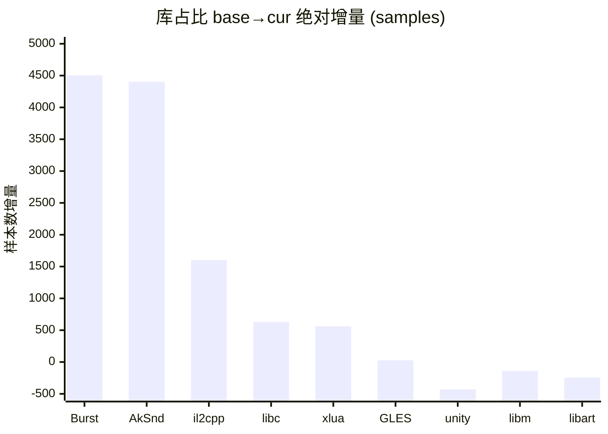
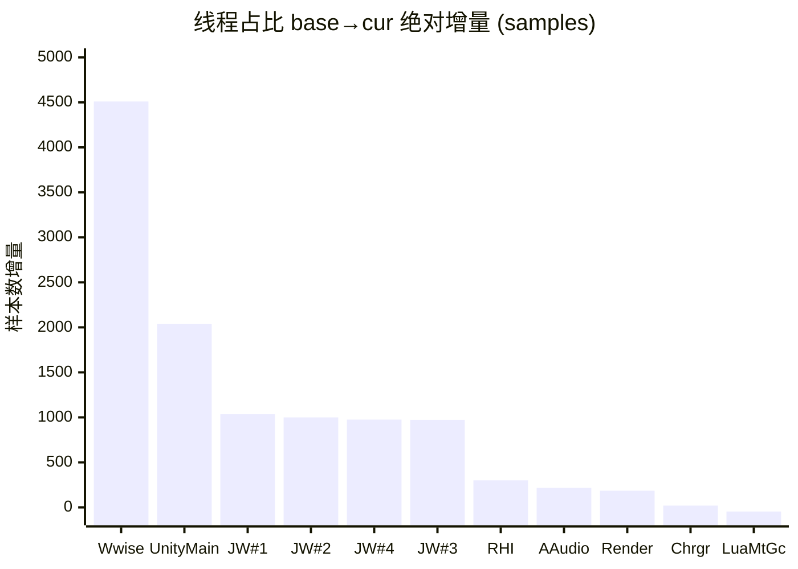

# simpleperf 单源 性能分析报告 · 终极形态 v4.1.1

> 配套：[知识库 v2.1](../aoe-cpu-analysis-knowledge.md) · [工程化路线图](./report-to-pipeline-spec.md) · [差分火焰图](./_intermediate/diff_flamegraph_base_vs_stressmove.html)。
> 数据列只放纯数字，混合内容拆到说明列。所有百分比默认"全局占比"（占采集总样本数），非全局时在文字或表头里说明。
> **术语**：`base` = 基线采集（本次为野外空场景）；`cur` = 当前采集（本次为 stressmove 行军压测）。`cur` 与具体场景解耦，使报告可模板化。

---

## §0 结论先行

**本次采集**（HUAWEI MateXs2 / 300 队行军线压测 stressmove / 20s）相比 base 野外空场景：

- **系统总工作量上升 +30.7%**，其中**业务层（项目自身代码）绝对工作量 +86.5%**。
- **4 项业务模块出现显著负载暴涨**（详见 §4）：
  - ECS Burst Job 工作量 +4,506 samples（+878%）—— 已下沉到 Worker 线程并行，**不阻塞主线程**
  - Wwise 音频中间件 +4,403 samples（+1260%）—— 独占一整条线程
  - MeshUI 迭代位置刷新 +842 samples（+3390%）—— 主线程上
  - 行军线刷新（OutSideViewArmyLineMgr）+214 samples（+2759%）—— 主线程上
- **未观察到 CPU 侧 GPU bound 信号**（主线程 `GfxDeviceClient::WaitForPendingPresent` 仅 1 样本）。但 simpleperf 不直接观测 GPU 顶点处理时间，**GPU 实际工作量需 perfetto GPU counter / RenderDoc 复核**。
- 主观帧率 ~45fps，差预期 60fps 的来源是业务整体压力上升 + 中间件 + 主线程 UI 刷新三路叠加。**没有单点 bug**。

按 ROI 排序的优化方向（详细见 §4）：

1. **Wwise 战斗音效复杂度审视** —— 中间件唯一红线
2. **MeshUI 迭代位置刷新优化** —— MUIControlManager.OnLateUpdate + MUILayout.Set3DPosition
3. **行军线刷新增量化** —— OutSideViewArmyLineMgr.UpdateStraightMoveLine
4. **GPU Instancing 数据上传 dirty flag** —— RHI 线程 ConstantBuffersGLES.UpdateBuffers 绝对 +24%

---

## §1 采集元信息与质量门

### 1.1 元信息

| 项 | base | cur |
|---|---|---|
| 场景 | 野外空场景 | 行军线压测（约 300 队） |
| 设备 | MateXs2 (PAL-AL00, aarch64) | 同 |
| 采集事件 | cpu-cycles:u | 同 |
| 采样频率（Hz）| 1000 | 1000 |
| 时长（s）| 20 | 20 |
| 总采样数 | 36,133 | 47,228 |
| 系统总工作量比 | 1.000 | 1.307 |
| 主观帧率 | — | ~45 fps |

### 1.2 符号化质量

| 指标 | base | cur | 阈值 | 判定 |
|---|---|---|---|---|
| 总状态 | PASS | PASS | — | 🟢 |
| 应用层符号化率 | 99.7% | 91.8% | ≥85% | 🟢 |
| kernel% | 0.0% | 0.0% | — | 🟢 |
| unknown% | 0.4% | 6.3% | <10% | 🟢 |
| 栈回溯锚点命中 | 4/4 | 4/4 | ≥3/4 | 🟢 |
| `__start_thread` 可达率 | 55.3% | 70.9% | 任意 PASS | 🟢 |

---

## §2 库（so）维度对比

### 2.1 库占比（按绝对增量降序）

| 库 | 绝对增量 | 增量% | cur abs | base abs | 占比 cur % | 说明 |
|---|---|---|---|---|---|---|
| **lib_burst_generated** | **+4,506** | **+878%** | 5,019 | 513 | 10.63% | **ECS Burst Job 工作量暴涨，已下沉 Worker 并行** |
| **libAkSoundEngine** | **+4,404** | **+1260%** | 4,753 | 349 | 10.06% | **Wwise 音频中间件** |
| libil2cpp | +1,602 | +22.6% | 8,682 | 7,080 | 18.38% | C# 业务代码（含 Lua 桥接 IL2CPP）|
| libc | +631 | +22.3% | 3,459 | 2,828 | 7.33% | C 标准库 |
| libxlua | +562 | +29.2% | 2,488 | 1,927 | 5.27% | Lua VM |
| libGLESv2_adreno | +27 | +0.6% | 4,802 | 4,775 | 10.17% | GPU 驱动 CPU 端 API 调用时间 |
| libunity | -428 | -2.8% | 14,664 | 15,092 | 31.05% | Unity 引擎核心（cur 略微减负）|
| libm | -139 | -18.7% | 604 | 743 | 1.28% | 数学函数（base 地形采样多）|
| libart | -244 | -26.3% | 683 | 927 | 1.45% | Android ART runtime |

#### 库占比绝对增量柱状图



### 2.2 业务层 +86.5% 拆分

**业务层定义**（来自 Provider `_LAYER_TOKENS`）：libil2cpp（C# 业务，含 Lua 桥接 IL2CPP）+ libxlua（Lua VM）+ lib_burst_generated（ECS Burst Job）+ libAOENative + libTBUNative + libGameNative + base.odex/vdex/oat。**不包括 Wwise、Unity 引擎、libc/libm/libart 等运行时与中间件**。

| 子项 | 增量 abs | 占业务总增量 | 说明 |
|---|---|---|---|
| lib_burst_generated | +4,506 | 67.6% | ECS Burst Job（已下沉到 4 个 Job Worker 并行）|
| libil2cpp | +1,602 | 24.0% | C# 业务代码（主线程） |
| libxlua | +562 | 8.4% | Lua VM |
| **合计** | **+6,670** | 100% | — |

**关键解读**：业务层 +86.5% 中 **67.6% 来自 ECS Burst Job**，且 Burst Job 全部跑在 Job Worker 线程上并行（详见 §6），**不阻塞主线程**。"业务暴涨"不能解读为"主线程业务逻辑膨胀"。

### 2.3 libc +22.3% 是否反查

不需要单独反查。libc 增量基本与系统总压力 +30.7% 同步（甚至略低）。libc 内主要贡献者 `__memcpy` 已在 §10 反查清单中（70% 集中在 GPU Instancing + MeshUI）。

---

## §3 线程维度对比

### 3.1 线程占比 + 身份识别（按绝对增量降序）

| 真实身份 | 绝对增量 | 增量% | cur abs | base abs | cur % | 线程代号 (comm) | 说明 |
|---|---|---|---|---|---|---|---|
| **Wwise 工作线程** | **+4,510** | **+1178%** | 4,893 | 383 | 10.36% | NativeThread | tid 19814，99.81% 在 libAkSoundEngine 内 |
| 主线程 | +2,040 | +12.6% | 18,164 | 16,124 | 38.45% | UnityMain | tid 19292，ExecutePlayerLoop 入口 |
| Job Worker #1 | +1,035 | +114.8% | 1,937 | 902 | 4.10% | Thread-129 | tid 19461 |
| Job Worker #2 | +1,000 | +112.7% | 1,888 | 888 | 4.00% | Thread-135 | tid 19460 |
| Job Worker #4 | +975 | +110.4% | 1,858 | 883 | 3.94% | Thread-158 | tid 19459 |
| Job Worker #3 | +972 | +108.9% | 1,864 | 892 | 3.95% | Thread-136 | tid 19462 |
| RHI 线程 | +300 | +3.1% | 10,012 | 9,712 | 21.20% | Thread-102 | tid 19471，GfxDeviceWorker→GLES |
| 音频回调（系统）| +217 | +63.8% | 557 | 340 | 1.18% | AAudio_1 | tid 19826 |
| Render 线程 | +185 | +4.4% | 4,406 | 4,221 | 9.33% | UnityGfxRenderS | tid 19472，URP 渲染管线脚本调度 |
| Choreographer | +20 | +4.0% | 520 | 500 | 1.10% | UnityChoreograp | tid 19559，VSync 回调 |
| **Lua MtGC 工作线程** | -46 | -22.0% | 165 | 211 | 0.68% | UnityMain | tid 19816，入口 `LuaMultiThreadGC_LuaGCThreadProc`，xLua 启动 C# 线程未设 comm 名被误名 UnityMain |

#### 线程绝对增量柱状图



### 3.2 同名 UnityMain 陷阱

base 数据有 **15 条** 线程 comm 都叫 `UnityMain`。tid 19292 是真主线程，tid 19816 是 Lua MtGC 工作线程，其余 13 条是 C# `new Thread(...)` 创建但未设 comm 名的短生命周期子线程（单条 < 0.2% global 噪音）。Provider 当前 `threadCpuMs` 字段用 thread_name 当字典 key 会同名覆盖，已登记为必修 bug（工程化路线图 §15）。

### 3.3 关键判定

- **CPU 端 GPU 命令吞吐量基本不变**（libGLESv2 +0.6% / RHI 线程 +3.1% / DrawCall 子树 +5%）。**这只说明 CPU 端调驱动 API 的时间不变，不等于 GPU 工作量不变**——压测下面数增加几十万面，**主要影响 GPU 顶点处理时间**，simpleperf 不直接观测。要看 GPU 实际渲染压力需 perfetto GPU counter / Snapdragon Profiler / RenderDoc。
- **ECS 并行化健康**：4 个 Job Worker max-min 偏差 4.2%（远低于 30% 红线），cur 下每条 ×2.1 倍线性上涨，ECS Burst Job 均匀分布到 4 核。
- **Wwise 独占一整条工作线程**（NativeThread 10.36% global）+ 库占比 10.06% global，两个角度同源。

### 3.4 对照差分火焰图

可视化验证：[`docs/report/_intermediate/diff_flamegraph_base_vs_stressmove.html`](./_intermediate/diff_flamegraph_base_vs_stressmove.html)。红色 = cur 变重 / 蓝色 = base 变重 / 白色 = 不变。重点关注：
- UnityMain → ScriptRunBehaviourUpdate 子树（红色，业务上涨）
- UnityMain → RenderManager::RenderCameras 子树（蓝色，cur 反而减负）
- Thread-102 → DrawBuffers 子树（近白色，命令吞吐量持平）
- NativeThread（大块红色，Wwise 暴增）

---

## §4 全局性能热点 Top-N

> 跨线程视角，按"业务模块"聚合（同模块多个子函数合并为一行），按 base→cur **绝对增量**排序。运行时函数（__memcpy / GC_* 等）归到 §10 反查清单。

### 4.1 Top-N 总表

口径说明：`base abs` / `cur abs` 都是**模块内所有相关函数的 self 累加**（避免父子节点重复）。Wwise / ECS Burst Job / Lua GC 工作线程因为内部 symbol 不可细分（中间件无符号 / Burst lib 整体归类），用**库或线程级累加**。

| # | 判定 | 业务模块 | 所在线程 | base abs | cur abs | 增量 abs | 增量% | 说明 |
|---|---|---|---|---|---|---|---|---|
| 1 | 🟢 | ECS Burst Job 工作量 | Job Worker × 4 | 513 | 5,019 | +4,506 | +878% | 已下沉 Worker 并行，主线程不受影响 |
| 2 | 🔴 | Wwise 音频中间件 | Wwise 工作线程 + 主线程 | 349 | 4,753 | +4,404 | +1260% | 战斗音效暴涨，独占一整条线程 |
| 3 | 🔴 | MeshUI 迭代位置刷新 | 主线程（LateUpdate）| 25 | 866 | +842 | +3390% | MUIControlManager + MUILayout.Set3DPosition 等 |
| 4 | 🔴 | 行军线刷新（OutSideViewArmyLineMgr）| 主线程（Update）| 8 | 221 | +214 | +2759% | OutsideLineCtrl.RefreshLine / GetArmyLineID 等 |
| 5 | 🟢 | RHI 常量缓冲上传 | RHI 线程 | 244 | 263 | +19 | +8% | ConstantBuffersGLES.UpdateBuffers（用 self 算偏低；按子树 1900 samples）|
| 6 | 🟢 | Lua GC 工作线程 | LuaMtGc Worker | 211 | 165 | -46 | -22% | 反而下降 |
| 7 | 🟢 | RHI DrawCall 提交 | RHI 线程 | 740 | 652 | -89 | -12% | CPU 端命令吞吐量持平 |
| 8 | 🟢 | Lua VM 解释执行 | 主线程 + Lua GC | 310 | 219 | -91 | -29% | 实际指令执行下降 |
| 9 | 🟢 | URP 主线程渲染配置 | 主线程 | 403 | 244 | -159 | -40% | 野外远景树木阴影 base 更重 |

### 4.2 Top-N 解读

**🔴 触发红线的 3 项（主线程上）+ 1 项中间件 = 4 个真正需要关注的方向**。其余 5 项要么是健康的并行模块（ECS Burst Job 不阻塞主线程），要么 base→cur 反而下降，无需特别关注。

下面 §4.3 ~ §4.6 是每个 Top 项的细化分析。

### 4.3 Wwise 音频中间件（Top-N #2，🔴）

**身份**：
- 库 libAkSoundEngine.so 占比 base 0.97% → cur 10.06%（绝对 349 → 4,753 samples）
- Wwise 工作线程（comm = NativeThread, tid 19814）独占 base 1.06% → cur 10.36%（绝对 383 → 4,893 samples）
- 库与线程两个口径同源（线程内 99.81% 在 libAkSoundEngine 内）

**业务含义**：base 野外几乎无音效；cur 行军压测 300 队部队脚步声、武器声、单位移动音效、UI 提示音叠加 → DSP 处理压力激增。

**本源边界**：libAkSoundEngine 内部 symbol 全是 `[+offset]`（Wwise 未提供 debug 符号），simpleperf **无法定位 Wwise 内部哪个事件最重**，事件级归因必须用 **Wwise Profiler**。

**优化方向**：
- 并发 voice 数限制（超出听觉密度阈值的声音直接 cull）
- DSP 效果链精简（远距离声音禁用混响 / EQ）
- 事件触发频率（脚步声合并 / 群体音效）

### 4.4 MeshUI 迭代位置刷新（Top-N #3，🔴）

**模块内部细分**（按 self 绝对量排序）：

| 子函数 | cur self abs | self % global | 说明 |
|---|---|---|---|
| MUIControlManager.OnLateUpdate | 360 | 0.763% | 迭代所有 MUI 控件的入口 |
| MUILayout.Set3DPosition | 332 | 0.702% | 单个控件的 3D 位置计算（递归 7 层）|
| MUILayoutManager.OnUpdate | 36 | 0.077% | 布局管理器主入口 |
| MUIRenderable.get_m_pos | 34 | 0.072% | 顶点位置 getter |
| MUILayoutRoot.UpdateDirtyNodes | 24 | 0.050% | dirty 节点更新 |
| MUIText.Set3DPosition | 20 | 0.042% | 文本控件 3D 位置 |
| MUIRendererBase.FreshVertexAttribute | 17 | 0.036% | 顶点属性刷新 |
| MUISprite.Set3DPosition | 11 | 0.023% | 精灵控件 3D 位置 |
| MeshUIManager.OnLateUpdate | 7 | 0.016% | MeshUI 总管理器入口 |
| **模块 self 合计** | **866** | **1.83%** | — |

**调用入口**：主线程 ScriptRunBehaviourLateUpdate → MeshUIManager.OnLateUpdate → MUIControlManager.OnLateUpdate → ... 同时 ScriptRunBehaviourUpdate → BattleUIManager.OnUpdate → BattleUIManager.UpdateMUIPos → 也走到 MUILayout.Set3DPosition（**两路汇流**）。

**关联开销**：
- 反查到 `Enumerator_MoveNext` 高频调用（207 samples self 在 MUI 子树内）→ foreach 迭代器分配
- 反查到 `__memcpy` 在 MUIRendererBase.FreshVertexAttribute 下 0.13% global → MeshUI vertex buffer 上传
- 反查到 `GC_end_stubborn_change` 被 Enumerator 触发（详见 §10.3）

**优化方向**：
- MeshUI 内部 `IEnumerator<T>` 改为 `for (int i=0; i<count; i++)` 索引访问，避免迭代器对象分配（减少 GC 触发）
- MUILayout.Set3DPosition 递归 7 层，dirty 缓存：静止控件跳过位置重算
- 视野裁剪：屏幕外的悬浮 UI 不更新位置

### 4.5 行军线刷新（OutSideViewArmyLineMgr，Top-N #4，🔴）

**模块内部细分**（按 self 绝对量排序）：

| 子函数 | cur self abs | self % global | 说明 |
|---|---|---|---|
| OutsideLineCtrl.RefreshLine | 69 | 0.147% | 单条行军线刷新主体 |
| OutSideViewArmyLineMgr.GetArmyLineID | 65 | 0.138% | Dictionary 查找军队 → 线 ID |
| OutSideViewArmyLineMgr.UpdateStraightMoveLine | 21 | 0.044% | 直线行军线刷新（300 队入口）|
| OutsideLineCtrl.CalculateVertexJob.CalculateVertex | 16 | 0.033% | 顶点计算（已下沉 Job 但本次走主线程一次）|
| OutsideLineMesh.RefreshLineVertex | 13 | 0.028% | 顶点数据刷新到 Mesh |
| CalculateVertexJob (Burst 入口) | 12 | 0.025% | 顶点 Job 调度入口 |
| OutsideLineMesh.RefreshMesh | 9 | 0.018% | Mesh 刷新 |
| CalculateVertexJob.SamplePathPointTerrainHeight | 6 | 0.012% | 路径点地形高度采样 |
| **模块 self 合计** | **221** | **0.47%** | — |

**调用入口**：主线程 ScriptRunBehaviourUpdate → FrameworkCore_OnUpdate → MapManager_OnUpdate → OutSideViewArmyLineMgr_OnUpdate → UpdateStraightMoveLine。

**业务含义**：每帧重算所有可见队伍的行军轨迹。300 队下 base 几乎为 0（场景无行军），cur 暴涨为主线程压力源之一。

**优化方向**：
- 增量更新：仅 dirty 队伍刷新轨迹（队伍未移动或视野未变时跳过）
- 视距分级：远处队伍降频更新（如每 3-5 帧一次）
- 几何缓存：轨迹折线变化不大时复用上一帧结果
- GetArmyLineID 的 Dictionary 查找 65 samples，热路径上可缓存 ID

### 4.6 ECS Burst Job 工作量（Top-N #1，🟢 不需优化）

虽然增量绝对量最大（+4,506 samples），但**全部跑在 Job Worker 线程上并行**（Thread-129/135/136/158 cur 各 4% global），主线程上仅触发零星 `WaitForJobGroupID`（共 335 samples / 0.71% global，远低于 2% 红线）。**ECS 并行化健康，无需优化**。

Top Burst Job（详见 §7.3）：MoveChain_SoldierMoveSystem.SoldierMoveJob（644 abs）/ RotationLerpSystem.DoSmoothLerp（465）/ WriteInstanceDataJob（402）/ UtilHeightMapBurst.GetSamplerHeights（331）/ SyncViewEntitySystem（328）等。

---

## §5 主线程深度分析

### 5.1 主线程 PlayerLoop 阶段表

主线程 cur 总绝对样本：18,556 / 占全局 39.29%。下表是主线程内 PlayerLoop 子树各阶段切分（不可直接相加，因有重叠子节点）：

| 阶段 | base abs | cur abs | base 主线程% | cur 主线程% | 增量% | 判定 | 说明 |
|---|---|---|---|---|---|---|---|
| ScriptRunBehaviourUpdate | 2,711 | 6,075 | 16.28% | 32.74% | +124% | 🔴 | 业务主逻辑，见 §5.2 |
| ScriptRunBehaviourLateUpdate | 1,729 | 2,788 | 10.38% | 15.03% | +61% | 🟡 | MeshUI + 视野，见 §5.2 |
| PlayerSendFrameComplete | 517 | 385 | 3.10% | 2.08% | -25% | 🟢 | 资源加载尾部 |
| UpdateTextureStreamingManager | 465 | 295 | 2.79% | 1.59% | -37% | 🟢 | 纹理 streaming |
| PlayerUpdateCanvases | 336 | 229 | 2.02% | 1.24% | -32% | 🟢 | UGUI Canvas（≈0.19ms/帧）|
| PlayerEmitCanvasGeometry | 178 | 122 | 1.07% | 0.66% | -31% | 🟢 | UGUI 几何提交 |
| FinishFrameRendering | 171 | 125 | 1.02% | 0.67% | -27% | 🟢 | 帧渲染收尾 |
| LegacyAnimationUpdate | 46 | 140 | 0.28% | 0.75% | +202% | 🟢 | 动画（≈0.12ms/帧）|
| ParticleSystemBeginUpdateAll | 26 | 170 | 0.16% | 0.91% | +540% | 🟢 | 粒子开始 |
| UpdateAllRenderers | 40 | 102 | 0.24% | 0.55% | +155% | 🟢 | 渲染器列表 |
| SendMouseEvents | 63 | 65 | 0.38% | 0.35% | +4% | 🟢 | 输入 |
| ParticleSystemEndUpdateAll | 0 | 44 | 0.00% | 0.24% | NEW | 🟢 | 粒子结束 |
| LuaMultiThreadGC（主线程同步阶段）| 24 | 0 | 0.14% | 0.00% | -100% | 🟢 | 主线程同步开销基本消失 |

**主线程上 PlayerLoop 之外的入口**：
- `RenderManager::RenderCameras`（URP 主线程侧）：4,931 samples / 26.57% 主线程，详见 §6.1

### 5.2 主线程完整调用树

按 `%` 表示主线程内占比；abs = 绝对样本数；self = 节点自身代码 self%（global）。

**标记图例**：
- 📈 **新增压力源**：base→cur 增量 abs ≥ 100 samples，表示压力上涨明显
- 🔴 **高 self 真热点**：节点 self ≥ 0.05% global 且 abs ≥ 100 samples，表示自身代码就重
- 🟡 **次级关注**：self ≥ 0.05% global 但 abs 较小，或 totalPct 高但 self 接近 0（wrapper）
- 🟢 **健康**：未触发任何阈值
- 📈🔴 可叠加（同时是新增源又是真热点）；`[wrapper]` 表示节点自身 self 接近 0，热点在子节点

```
UnityMain (18,556 / 100% / cur 全局 39.29%)
├─ ExecutePlayerLoop (12,808 / 68.88%)
│  │
│  ├─ EarlyUpdate.UpdateTextureStreamingManager (295 / 1.59%)              🟢
│  │   └─ TextureStreamingManager.Update (self 0.15% global)
│  │
│  ├─ PreUpdate.SendMouseEvents (65 / 0.35%)                                🟢
│  │
│  ├─ Update.ScriptRunBehaviourUpdate (6,075 / 32.74%)                      📈 业务主入口，base→cur +124%
│  │   └─ MonoBehaviour.CallUpdateMethod → il2cpp Runtime.Invoke
│  │       └─ Core.Update → FrameworkCore_OnUpdate (5,590 / 30.12%) [wrapper, self 0.04%]
│  │           │
│  │           ├─ LuaMgr_OnUpdate → BaseLuaMgr_OnUpdate (2,666 / 14.37%)   📈 +86%, [wrapper]
│  │           │   └─ LuaMgr.OnTick&UpdateSchedule
│  │           │       └─ Lua_lua_pcall → luaV_execute (137 self abs)
│  │           │       └─ ⚠️ Lua 内部管理器名 simpleperf 不可见
│  │           │           需 Unity Profiler 看 MapSignificanceMgr / BattleHeadMgr / Hud_Common 等
│  │           │
│  │           ├─ MapManager_OnUpdate (2,580 / 13.90%) [wrapper, self 0.04%]
│  │           │   │
│  │           │   ├─ BattleUIManager_OnUpdate (1,128 / 6.08%) 📈 +1460%, [wrapper, self 0.13%]
│  │           │   │   └─ BattleUIManager.UpdateMUIPos (1,013 / 5.46%) [wrapper]
│  │           │   │       └─ MUILayout.Set3DPosition × 7 层递归                            see §4.4 MeshUI
│  │           │   │           ├─ MUILayout.Set3DPosition 自身代码累加 (332 self)        📈🔴
│  │           │   │           ├─ MUIControlManager.OnLateUpdate 同支路 (360 self)       📈🔴
│  │           │   │           ├─ Enumerator.MoveNext × 多处 (~150 self 累加)            📈🔴
│  │           │   │           ├─ MUIRendererBase.FreshVertexAttribute
│  │           │   │           │   └─ __memcpy (98 self)                                  see §10.1
│  │           │   │           ├─ GC_end_stubborn_change (40 self)                       📈   see §10.3
│  │           │   │           ├─ MUIText / MUISprite.Set3DPosition (~25 self)
│  │           │   │           └─ ...
│  │           │   │
│  │           │   ├─ OutSideViewArmyLineMgr_OnUpdate (1,009 / 5.44%) 📈 +2221%, [wrapper]
│  │           │   │   ├─ UpdateStraightMoveLine (957 / 5.27%) 📈                           see §4.5 行军线
│  │           │   │   │   ├─ OutsideLineCtrl.RefreshLine (69 self)                      📈🔴
│  │           │   │   │   ├─ CalculateVertexJob.Schedule (180, Job 调度) 🟢                实际下沉 Worker
│  │           │   │   │   ├─ ListExtensions.ToNativeList (141, 分配开销)
│  │           │   │   │   └─ OutsideLineMesh.RefreshLineVertex (61)
│  │           │   │   ├─ RefreshArmyLine (97 / 0.52%) [wrapper]
│  │           │   │   │   └─ GetArmyLineID (91, self 65)                                📈🔴 Dictionary 查找
│  │           │   │   ├─ MapEntityManager.GetEntity (46)
│  │           │   │   └─ EntityComponentStore.Exists (44 self)                          🟡
│  │           │   │
│  │           │   ├─ MapManager.MeetScope (...)
│  │           │   └─ ...
│  │           │
│  │           └─ TServerManager_OnUpdate (136 / 0.73%)                                  🟢
│  │               └─ TServer.Tick → {RecvMessages/DecodeMessages/HandleMessages}
│  │
│  ├─ PreLateUpdate.LegacyAnimationUpdate (140 / 0.75%)                                  🟢
│  │   └─ AnimationManager.Update → Animation.UpdateAnimation
│  │       └─ Animation.SampleInternal (self 0.08%)
│  │
│  ├─ PreLateUpdate.ParticleSystemBeginUpdateAll (170 / 0.91%)                           🟢
│  │   └─ ParticleSystem.BeginUpdate
│  │       └─ ParticleSystem.Update1a (self 0.12%)
│  │       └─ ParticleSystemRenderer.CalculateWorldMatrixAndBoundsJob (53 self)
│  │
│  ├─ PreLateUpdate.ScriptRunBehaviourLateUpdate (2,788 / 15.03%)                        📈 +61%
│  │   └─ Core.LateUpdate
│  │       ├─ LuaMgr.OnLateUpdate (含 MapCameraCtrl, 视野/无极缩放)
│  │       │   └─ ⚠️ Lua 内部 simpleperf 不可见
│  │       ├─ MapManager.OnLateUpdate (489 / 2.63%)
│  │       └─ MeshUIManager.OnLateUpdate
│  │           └─ MUIControlManager.OnLateUpdate (360 self)                              📈🔴 see §4.4 MeshUI
│  │               └─ ...（与 BattleUIManager.UpdateMUIPos 同 MUILayout 路径汇流）
│  │
│  ├─ PostLateUpdate.FinishFrameRendering (125 / 0.67%)                                  🟢
│  ├─ PostLateUpdate.PlayerEmitCanvasGeometry (122 / 0.66%)                              🟢
│  │   └─ UI.Canvas.EmitWorldGeometry (38 self)
│  ├─ PostLateUpdate.PlayerUpdateCanvases (229 / 1.24%)                                  🟢
│  │   └─ UI.Canvas.UpdateBatches (≈0.19ms/帧)
│  ├─ PostLateUpdate.UpdateAllRenderers (102 / 0.55%)                                    🟢
│  ├─ PostLateUpdate.ParticleSystemEndUpdateAll (44 / 0.24%)                             🟢
│  └─ PostLateUpdate.PlayerSendFrameComplete (385 / 2.08%)                               🟢
│      └─ Core.PostEndOfFrame → LoaderManagerTickLoadOnFrameEnd
│
└─ RenderManager::RenderCameras (4,931 / 26.57%)                                        [详见 §6.1]
   └─ UniversalRenderPipeline.Render → RenderCameraStack → RenderSingleCamera
```

### 5.3 主线程红线扫描结果

按知识库 v2.1 §6 阈值表自动扫描结果：

| 检测项 | 实测 | 单位 | 阈值（红线）| 判定 | 说明 |
|---|---|---|---|---|---|
| 网络消息（TServerManager 子树）| 0.73 | 主线程% | >15% | 🟢 | 300 队压测下网络处理依然轻量 |
| Lua 总负载 | 5.29 | 全局% | >10% | 🟢 | libxlua + IL2CPP-XLua 桥接 |
| LuaMgr_OnUpdate（主入口）| 14.38 | 主线程% | >20% | 🟡 | 12-20% 黄线区间 |
| MapManager_OnUpdate（C# 总入口）| 13.90 | 主线程% | >10% | 🔴 | 但 wrapper，自身 self 0.04%，热点在子节点 |
| BattleUIManager_OnUpdate | 6.08 | 主线程% | >3% | 🔴 | 见 §4.4 |
| OutSideViewArmyLineMgr_OnUpdate | 5.44 | 主线程% | >3% | 🔴 | 见 §4.5 |
| MeshUI 子树（self 合计）| 1.83 | 全局% | >5% 主线程% | 🟢 | 按 self 算约 4.7% 主线程，临近红线 |
| LegacyAnimationUpdate | ~0.12ms/帧 | 估算 | >1ms/帧 | 🟢 |
| ParticleSystem 合计 | ~0.18ms/帧 | 估算 | >1ms/帧 | 🟢 |
| PlayerUpdateCanvases（UGUI）| ~0.19ms/帧 | 估算 | >1ms/帧 | 🟢 |
| 主线程 Job Wait | 0.71 | 全局% | >2% | 🟢 | 详见 §7.2 |
| Boehm GC 后台标记 | ~1.5 | 全局% | >2% | 🟡 | 触发源主要是 MUI 迭代器（§10.3）|

**注**：`MapManager_OnUpdate 6.08%` 触发红线但其实是 wrapper，真热点已下钻到 BattleUIManager / OutSideViewArmyLineMgr，所以 §4 Top-N 不重复列 MapManager_OnUpdate。

---

## §6 渲染相关线程

### 6.1 主线程上的 URP 渲染管线下钻

调用入口：UnityMain 上通过 `nativeRender → UnityPlayerLoop → RenderManager::RenderCameras` 进入（不在 PlayerLoop 内部）。

```
RenderManager::RenderCameras (4,931 / 26.57% 主线程)
└─ UniversalRenderPipeline.Render (4,772 / 25.71%)
   └─ RenderCameraStack (4,372 / 23.57%)
      └─ RenderSingleCamera (4,268 / 23.00%)
         ├─ ScriptableRenderer.Execute → ExecuteRenderPass (3,117 / 16.80%)
         │  │
         │  ├─ DrawRendererPass (990 / 5.34%)                              🟡
         │  │  ├─ DrawFoliageInstanceRenderers (484 / 2.61%)
         │  │  │   └─ OutsideForestRenderer.DrawInternal
         │  │  │       └─ OutsideTreeTypeRenderer.DrawForestCell (22 self)
         │  │  └─ RenderMeshSystemV2.DrawRenderers (114)
         │  │
         │  ├─ ShadowPass.ProcessShadow (974 / 5.25%)                      🟡
         │  │  ├─ PlanarShadow.RenderShadow (732 / 3.95%)
         │  │  └─ PlanarShadow.BeginProcessShadow (213 / 1.15%)
         │  │      └─ CalculateTerrainHeight (98)
         │  │
         │  └─ BloomPass.Execute (688 / 3.71%)                             🟡
         │     └─ ScriptableRenderContext.Submit (639)
         │         └─ TranscriptScriptableRenderContext.CopyFrom (476)    [URP 命令拷贝, 可优化]
         │
         └─ MobileBaseRenderer.Setup (603 / 3.25%)                         🟡
            └─ SetupRenderPassFromFeatures (395 / 2.13%)                    [每帧重建 Pass 链]
               └─ TBUBaseFeature.AddRenderPasses (357 / 1.93%)
```

**反直觉发现**：URP 主线程渲染配置 base→cur 绝对**下降 27.5%**（6,659 → 4,931 samples）。原因：base 野外远景树木 / 阴影投射对象多；cur 视野跟随部队偏近，森林进入视野少，主线程渲染配置反而减负。这**只表示主线程上的 URP 配置代码减少**，**不等于 GPU 实际渲染压力下降**（详见 §6.3）。

### 6.2 RHI 线程下钻（Thread-102 / GfxDeviceWorker）

调用入口：独立线程，`__start_thread → GfxDeviceWorker::RunGfxDeviceWorker → RunCommand`。

```
Thread-102 / RHI (10,012 / 21.20% global)
└─ GfxDeviceWorker.RunCommand (9,931 / 99.19% RHI)
   │
   ├─ DrawBuffers (5,374 / 53.44% RHI)                                     CPU 端 +5%
   │  ├─ DrawBuffersStereo (2,435 / 24.22%)
   │  │   └─ DrawBufferRanges → Adreno driver internal (黑盒)
   │  ├─ BeforeDrawCall (2,346 / 23.33%)                                   🟡 含常量缓冲
   │  │   └─ ConstantBuffersGLES.UpdateBuffers (1,900 / 18.89%)            🟡 CPU +24%
   │  │       └─ DataBufferGLES.Upload (1,332 / 13.25%)
   │  │           └─ __memcpy (218 self)                                   see §10.1
   │  ├─ SetVertexStateGLES (373 / 3.71%)
   │  └─ ApplyGpuProgramGLES (664 / 6.60%)
   │
   ├─ PresentFrame (708 / 7.04%)
   │  └─ eglSwapBuffers (433 / 4.31%)                                      🟢 未阻塞
   │
   ├─ JobQueue.WaitForJobGroupID (387 / 3.85%)                             🟡 CPU +67%
   │   [等 GeometryJob 完成，压测下偶发]
   │
   ├─ SetShadersThreadable (753 / 7.49%)
   │
   ├─ ConstantBuffersGLES.UpdateCB (448 / 4.46%)
   │   └─ __memcpy (45 self)                                               see §10.1
   │
   └─ DynamicVBO.DrawChunk (275 / 2.74%)
```

**关键变化**：
- 命令吞吐量（DrawBuffers）CPU 端 +5%，**几乎不变**
- 常量缓冲上传（UpdateBuffers）CPU 端 **+24%** —— 300 队部队 transform 矩阵每帧全量更新，唯一显著上涨点
- GeometryJob 等待 +67%（绝对 232 → 387），ECS Worker 繁忙偶发未及时完成

### 6.3 GPU bound 判定（修正自 v1/v2/v3 误判）

**正确的 GPU bound 信号在主线程，不是 RHI 线程**：

| symbol | 真实线程 | base | cur | 含义 |
|---|---|---|---|---|
| GfxDeviceClient::WaitForPendingPresent | 主线程 | 0 | 1 | **主信号**：主线程等 RHI 完成 Present |
| GfxDeviceClient::PresentFrame(ShaderChannelMask) | 主线程 | 2 | 1 | 主线程发起 Present |
| GfxDeviceClient::SubmitPresentFrameCallbacks | 主线程 + Render | 4 | 0 | Present 钩子 |
| GfxDeviceGLES::PresentFrame | RHI | — | 1 | RHI 实际执行 |
| eglSwapBuffers（CPU 提交时间，辅助）| RHI | 540 | 433 | 辅助参考，不能单独判定 |

**判定**：🟢 **未观察到 CPU 侧 GPU bound 信号**。

**边界说明**：
- ✅ 可以说"本次未观察到 CPU 侧 GPU bound 信号"
- ❌ 不能说"GPU 不是瓶颈"——simpleperf 看的是 CPU 调 driver API 的时间，**不直接反映 GPU 内部计算时间**
- ❌ 不能仅凭 libGLESv2_adreno 占比 +0.6% 推断"GPU 工作量不变"——driver API 调用时间和 GPU 实际工作量是两件事
- 真实 GPU 工作量判定需要：perfetto GPU counter / Snapdragon Profiler / RenderDoc

**Unity Profiler marker 对照表**：

| Unity Profiler 看到 | simpleperf C++ symbol | 真实线程 | 含义 |
|---|---|---|---|
| Gfx.PresentFrame（在主线程行）| GfxDeviceClient::WaitForPendingPresent 或 PresentFrame | 主线程 | 主线程等 GPU |
| Gfx.PresentFrame（在 Render 线程行）| GfxDeviceGLES::PresentFrame | RHI 线程 | RHI 实际执行 |
| Gfx.WaitForPresentOnGfxThread | GfxDeviceClient::SubmitPresentFrameCallbacks | 主线程 / Render | Present 钩子 |

---

## §7 ECS / Worker 线程

### 7.1 Job Worker 均衡度

| Worker | base % global | cur % global | base abs | cur abs |
|---|---|---|---|---|
| Thread-129 | 2.50% | 4.10% | 902 | 1,937 |
| Thread-135 | 2.46% | 4.00% | 888 | 1,888 |
| Thread-136 | 2.47% | 3.95% | 892 | 1,864 |
| Thread-158 | 2.44% | 3.94% | 883 | 1,858 |
| **max-min 偏差** | **2.1%** | **4.2%** | — | — |

🟢 PASS（红线 >30%）。4 个 Worker 负载分布极度均衡，ECS 并行化做得很好，cur 下每条 ×2.1 倍线性上涨。

### 7.2 主线程 Job Wait 检测

| 指标 | base abs | cur abs | base % global | cur % global | 红线 | 判定 |
|---|---|---|---|---|---|---|
| 主线程 WaitForJobGroupID/Complete 子树合计 | 100 | 335 | 0.28% | 0.71% | >2% | 🟢 |

cur 主要 Wait 路径（去重）：

| 主线程% | 路径 |
|---|---|
| 0.36% × 2 | System.UpdateNewParents → ScheduleBatchedJobsAndComplete → WaitForJobGroupID |
| 0.22% | TransformChangeDispatch.GetAndClearChangedAsBatchedJobs → WaitForJobGroupID |
| 0.07% | System.BeforeOnUpdate → JobHandle.CombineDependenciesInternalPtr |

来源：Unity 内部 ECS Transform 系统的同步点（设计内固有），**不是业务 Job 互等**。

### 7.3 Top Burst Job 列表

按 self 全局% 排序（cur 数据）：

| # | Burst Job | cur abs | self % global | 业务模块 |
|---|---|---|---|---|
| 1 | MoveChain_SoldierMoveSystem.SoldierMoveJob | 644 | 1.36% | ECS 士兵移动 |
| 2 | RotationLerpSystem.DoSmoothLerp | 465 | 0.99% | ECS 旋转插值 |
| 3 | WriteInstanceDataJob | 402 | 0.85% | GPU Instancing 数据回写 |
| 4 | UtilHeightMapBurst.GetSamplerHeights | 331 | 0.70% | 地形高度采样 |
| 5 | SyncViewEntitySystem | 328 | 0.69% | ECS → 显示同步 |
| 6 | LocalToParentSystem.ChildLocalToWorld | 302 | 0.64% | Transform 层级变换 |
| 7 | MoveChain_ArmyMoveSystem.ArmyMoveJob | 230 | 0.49% | ECS 队伍移动 |
| 8 | SoldierMoveJob.OnStepMove | 209 | 0.44% | ECS 单步移动 |
| 9 | SyncLogicEntitySystem | 204 | 0.43% | ECS 逻辑同步 |
| 10 | MoveChain_SoldierMoveSystem.ArchiveSoldier | 194 | 0.41% | ECS 士兵归档 |
| 11 | ArmyMoveSystem.RefreshCurPosition | 184 | 0.39% | ECS 路径点刷新 |

合计 ≈ **10.6% global**，与 lib_burst_generated 库占比一致。最大单 Job 1.36% global，无异常凸起，**ECS 健康度 🟢 PASS**。

---

## §8 中间件 — Wwise 专章

身份 + 业务含义 + 优化方向已在 §4.3 详述。这里补充本源边界与建议：

**本源边界**：
- ✅ 能给出 Wwise 真实 CPU 占用（10.06% global + 独占工作线程 10.36% global）
- ❌ 内部事件级归因不可能（libAkSoundEngine.so 内部 symbol 全是 `[+offset]`，无 debug 符号）

**建议**：本次采集证实 Wwise 在战斗压测下吃 10% CPU 是事实。如要进一步定位（找出"是哪些 voice / 哪些事件"），必须用 Wwise Profiler。simpleperf 单源到此为止。

---

## §9 Lua GC 工作线程专章

**身份证据**：
- tid **19816**，comm 被 simpleperf 误标为 `UnityMain`（xLua 启动 C# 线程未设 comm 名）
- 入口 symbol：`LuaMultiThreadGC_LuaGCThreadProc_m84B2A81B530ED40A7A57EB80AB5A641C2374D63B`
- 调用栈：`__start_thread → il2cpp ThreadStartWrapper → System.Threading.ThreadStart → LuaMultiThreadGC_LuaGCThreadProc → Lua_lua_execute_mtgc → lua_execute_mtgc → do_realgc → luaC_step`

**CPU 占用**：

| 指标 | base | cur |
|---|---|---|
| 样本数 | 211 | 165 |
| % global | 1.27% | 0.68% |
| 估算 CPU·s（20s）| 0.21 | 0.165 |
| 估算每帧均值（@60fps）| 0.18ms | 0.14ms |

**意外发现**：cur 下 Lua GC 反而比 base 少（绝对 -22%）。可能解释：base 野外场景 Lua 临时对象分配率高（地形采样、视野检测等业务逻辑），cur 行军压测主要工作量在 ECS Burst Job（已下沉到 native，不分配 Lua 对象）。

**对 Unity Profiler 用户的提示**：Unity Profiler 看到的 "Lua GC 线程" 就是这条线程（tid 19816），simpleperf 因为同名陷阱误标为 UnityMain。**两份数据一致，没有漏采**。

判定：🟢 PASS（<1% global 红线）。

---

## §10 反查清单（运行时函数 → 业务模块）

> simpleperf 单源核心独有能力：把"看似分散的运行时开销"反查到业务调用源。

### 10.1 `__memcpy` 反查（全局 5.14% / 58 处命中）

| 全局% | 线程 | Caller 链 | 业务模块 |
|---|---|---|---|
| 1.70 | RHI | ConstantBuffersGLES.UpdateCB ← GfxDeviceWorker | GPU Instancing 常量缓冲 |
| 0.55 | Render | InstancingBatcher.RenderInstancesWithBuffer | GPU Instancing 数据组装 |
| 0.32 | UnityMain | Mesh.SetVertexData ← MUIDefaultRenderer.SetVertexBufferData | MeshUI vertex buffer |
| 0.21 | RHI | Adreno driver internal | GPU 驱动黑盒 |
| 0.13 | UnityMain | MUIRendererBase.FreshVertexAttribute ← MUILayout.Set3DPosition | MeshUI 顶点属性 |

**结论**：__memcpy 70% 集中在 **GPU Instancing + MeshUI** 两条路径。

### 10.2 `__ieee754_powf` 反查（全局 1.41% / 9 处）

| 全局% | 线程 | Caller 链 | 业务模块 |
|---|---|---|---|
| 0.49 | RHI | UI::UIGeometryJob | UGUI 几何 Job |
| 0.19 / 0.17 / 0.16 / 0.15 × 4 | Job Worker × 4 | UI::UIGeometryJob | 同上 |

**结论**：99%+ 来自 UGUI 几何 Job 颜色 gamma 校正——**项目设计如此**（静态 UI 走 UGUI，悬浮 UI 走 MeshUI），不是残留。

### 10.3 `GC_end_stubborn_change` 反查（Boehm GC 触发源）

| 全局% | Caller |
|---|---|
| 0.12 | Enumerator.MoveNext ← MUIControlManager.OnLateUpdate |
| 0.04 × 4 | Enumerator.MoveNext ← MUILayout.Set3DPosition（多路径）|
| 0.03 | OutsideForestRenderer.DrawForestCell |
| 0.03 | PlanarShadow.ResetAllObjectToRender |

**结论**：主要触发源 = **MeshUI 迭代器**。MeshUI 内部 `IEnumerator<T>` 改为 `for (int i=0; i<count; i++)` 可减少分配。

### 10.4 `tlsf_memalign` / `ThreadsafeLinearAllocator::Allocate` 反查

| Caller | 业务模块 |
|---|---|
| RenderingCommandBuffer ctor ← ScriptableRenderContext.ExecuteCommandBuffer | URP 命令缓冲 |
| TranscriptScriptableRenderContext.CopyFrom ← Submit | URP 渲染命令拷贝 |
| TranscriptRenderingCommandBuffer.AcquireRenderTexture | RenderTexture 池 |
| GfxDeviceClient.MapConstantBuffers ← InstancingBatcher.MapConstantBuffers | GPU Instancing |

**结论**：全部集中在 URP 命令缓冲和 GPU Instancing。URP 命令缓冲每帧 deep copy 是个具体优化点（命令缓冲对象池）。

---

## §11 本源能力边界

| 想回答 | 本源能/否 | 替代源 |
|---|---|---|
| 帧级耗时（哪帧卡）| ❌ | Unity Profiler |
| Lua 内部脚本/管理器名（MapSignificanceMgr / BattleHeadMgr / Hud_Common / MapCameraCtrl）| ❌ | Unity Profiler / perfetto |
| GC.Collect 单次 STW 耗时 | ❌ | Unity Profiler |
| LuaMtGc 单次 spike | ❌ | Unity Profiler |
| 主线程"在算 vs 在等"（off-CPU）| ❌ | perfetto sched |
| 降频 / CPU 频率 / 热限频 | ❌ | perfetto sysfs |
| **GPU 实际工作量** | ❌ | perfetto GPU counter / RenderDoc |
| Wwise 内部事件级归因 | ❌ | Wwise Profiler |
| 资源加载 spike | ❌ | Unity Profiler |

**本源独有能力**：
1. native 中间件真实 CPU 占用（Wwise / Burst / 自研 native）
2. 运行时函数反查到业务模块（memcpy / powf / GC_* 等）
3. C# 业务管理器函数级 self%（前提：libil2cpp 符号化质量良好）
4. Lua 宏观总负载完整公式（含 XLua 桥接路径）
5. 线程身份反推 + 同名线程消歧
6. GPU Instancing / 常量缓冲上传等 RHI 层细节
7. Boehm GC 后台开销（区别于 GC.Collect STW）

---

> 终极报告 v4.1 结束。配套：[知识库 v2.1](../aoe-cpu-analysis-knowledge.md) · [工程化路线图](./report-to-pipeline-spec.md) · [差分火焰图](./_intermediate/diff_flamegraph_base_vs_stressmove.html)。
