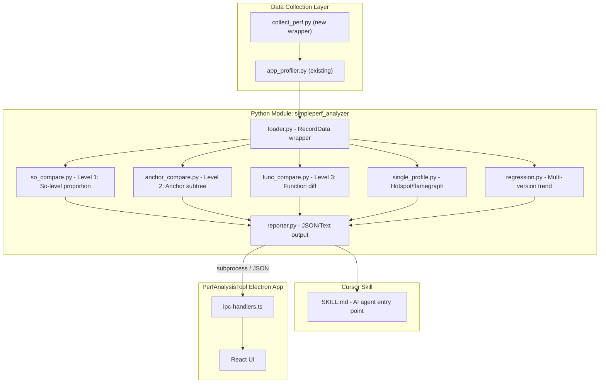

# Android Native Performance Analysis Toolkit

## Context

PerfAnalysisTool_Codebuddy is an Electron + React desktop app (Ant Design + ECharts + Zustand) that currently supports Unity Profiler `.pdata` analysis. It has:
- Main process: `src/main/` with IPC handlers for profiler + AI
- Renderer: React frontend with modules, services, store
- Skills: `.claude/skills/unity-profiler-analysis/` (TypeScript-based pdata analysis)
- AI: CodeBuddy Agent SDK integration for streaming analysis

The simpleperf toolkit will become a **second analysis engine** alongside the existing Unity Profiler engine, focused on native C++ (libil2cpp.so, libunity.so, etc.) performance via Android simpleperf.

## Architecture



## File Structure

```
K:\AI\PerfAnalysisTool_Codebuddy\simpleperf\
├── README.md                          # Documentation (full scheme from discussions)
├── requirements.txt                   # Dependencies (none beyond stdlib + simpleperf libs)
├── simpleperf_analyzer/               # Python module (importable)
│   ├── __init__.py
│   ├── loader.py                      # Wraps RecordData, exposes clean API
│   ├── so_compare.py                  # Level 1: So-level CPU proportion comparison
│   ├── anchor_compare.py             # Level 2: Anchor function subtree comparison
│   ├── func_compare.py               # Level 3: Function-level A/M/D diff
│   ├── single_profile.py            # Single profile: top-N hotspot, per-thread breakdown
│   ├── regression.py                 # Multi-version trend analysis
│   ├── reporter.py                   # Output formatting (JSON, text, CSV)
│   └── config.py                     # Configurable parameters (anchor funcs, lib whitelist)
├── scripts/
│   ├── collect_perf.py               # Wrapper: lock CPU freq + run app_profiler + organize output
│   ├── compare.py                    # CLI entry: run Level 1+2+3 comparison3
.0
│   ├── analyze.py                    # CLI entry: single profile analysis
│   └── batch_compare.py             # CLI entry: multi-file average + regression
├── data/                             # Convention: store perf.data files here
│   └── .gitkeep
├── result/                           # Convention: output reports here
│   └── .gitkeep
└── symbols/                          # Existing: symbol files
    ├── lib_burst_generated.txt
    └── libDummy.sym.so
```

## Cursor Skill

Location: `K:\AI\PerfAnalysisTool_Codebuddy\.cursor\skills\simpleperf-native-analysis\SKILL.md`

Triggers:
- User provides perf.data file or asks about native C++ performance
- User asks to compare two builds / A-B test
- User mentions simpleperf, libil2cpp, native profiling, CPU cycles
- User asks about MapleCC / MapleILOpt performance validation

Flow:
1. Determine task type (single analysis / A-B compare / regression)
2. Run appropriate script via `python scripts/compare.py ...` or `python scripts/analyze.py ...`
3. Read JSON output from `result/`
4. Present findings in structured format with recommendations

## Core Capabilities (6 total)

### Capability 1: Data Collection (`collect_perf.py`)

Automates the full collection workflow:
- Lock CPU frequency (eliminate DVFS)
- Call `app_profiler.py` with correct parameters
- Organize output into `data/{label}/` with binary_cache
- Support multiple runs for averaging

CLI:
```bash
python scripts/collect_perf.py --package com.your.game --label baseline --runs 3 --duration 30 --event cpu-cycles:u --lib /path/to/unstripped
```

### Capability 2: So-Level Comparison (`so_compare.py`)

Uses `gen_record_info()` -> `sampleInfo[].processes[].threads[].libs[]` to extract per-so eventCount.

Input: two perf.data files + binary_cache paths
Output: per-thread, per-so proportion diff (JSON + text)

### Capability 3: Anchor Subtree Comparison (`anchor_compare.py`)

Traverses callGraph tree, finds configurable anchor functions (e.g. `ExecutePlayerLoop`, `GfxDeviceWorker::RunCommand`), compares their `subtreeEventCount`.

Input: two perf.data files + anchor function list
Output: anchor function time diff in ms and % (JSON + text)

### Capability 4: Function-Level Diff (`func_compare.py`)

Expanded from `aoe_report_diff.py` logic but with:
- Parameterized lib whitelist (auto-detect from perf.data)
- Bug fixes (line 225 key error)
- No debugpy residue
- Percentage output
- Inline-aware annotation (functions marked as possibly-inlined)

### Capability 5: Single Profile Analysis (`single_profile.py`)

For one perf.data:
- Top-N hotspot functions (by self eventCount)
- Per-thread CPU breakdown
- Per-so CPU breakdown
- Generates folded stack for flamegraph

### Capability 6: Multi-Version Regression (`regression.py`)

Accepts N perf.data files with version labels, computes:
- Trend of libil2cpp.so proportion across versions
- Trend of anchor subtree times
- Statistical significance (mean +/- stddev)

## Key Design Decisions

1. **`loader.py` wraps simpleperf's `RecordData`** via `sys.path.append()` to the NDK simpleperf directory. The NDK path is configurable in `config.py` with default `D:/Android/android-ndk-r21e-windows-x86_64/simpleperf`.

2. **Output is always JSON** (machine-readable for Electron integration) + optional human-readable text. The Electron app can later call `python scripts/compare.py ...` via subprocess and parse JSON result.

3. **anchor functions are configurable** in `config.py` with sensible defaults for Unity games:
   - `ExecutePlayerLoop` (main thread total)
   - `ScriptRunBehaviourUpdate` (C# Update)
   - `GfxDeviceWorker::RunCommand` (render thread)

4. **lib whitelist is auto-detected** from perf.data's libList, filtered by package name pattern, rather than hardcoded.

## Integration Path (Future, not in this plan scope)

The project has **two client surfaces**:

### Web Dashboard (`web/`) — Primary integration target

The Fastify web dashboard already has analysis queue, compare, and trends infrastructure:
- `web/server/routes/` — add `simpleperf.ts` with routes:
  - `POST /api/simpleperf/upload` — upload perf.data files
  - `POST /api/simpleperf/compare` — trigger A/B comparison (calls Python scripts via subprocess)
  - `GET /api/simpleperf/compare/:id/stream` — SSE progress (reuse `cli-executor.ts` pattern)
  - `GET /api/simpleperf/history` — past analyses from SQLite
  - `GET /api/simpleperf/trends` — multi-version metrics
- `web/src/pages/` — add `SimpleperfCompare.tsx`, `SimpleperfReport.tsx`
- `web/server/db/` — extend schema for simpleperf sessions

### Electron Desktop App (`src/`) — Secondary

- `src/main/simpleperf/` TypeScript wrapper calling Python scripts via `child_process.execFile`
- New IPC handlers: `simpleperf:compare`, `simpleperf:analyze`, `simpleperf:regression`
- New renderer module: `src/renderer/modules/simpleperf/` with comparison views + ECharts

### JSON Output Contract (shared by both clients)

All Python scripts output standardized JSON that both web and Electron can consume:

```json
{
  "meta": { "baseline": "perf_A.data", "current": "perf_B.data", "event": "cpu-cycles:u" },
  "level1_so_compare": {
    "threads": [{
      "name": "UnityMain",
      "libs": [{ "name": "libil2cpp.so", "baseline_pct": 58.3, "current_pct": 54.1, "delta_pct": -4.2 }]
    }]
  },
  "level2_anchor_compare": {
    "anchors": [{ "name": "ExecutePlayerLoop", "baseline_ms": 823.5, "current_ms": 779.2, "delta_pct": -5.38 }]
  },
  "level3_func_diff": { "items": [...] },
  "summary": { "il2cpp_improvement_pct": 7.2, "main_thread_improvement_pct": 5.38 }
}
```

## Documentation (README.md)

Will contain the full scheme from our discussions:
- Background and objectives
- All strategies (A/B/C/D) with rationale and trade-offs
- The inline problem analysis and why Level 1+2 bypasses it
- Data collection procedure (step-by-step with exact commands)
- Analysis procedure (step-by-step with exact commands)
- Output JSON format specification
- Integration notes for Web Dashboard and Electron app
- Reference: original `aoe_report_diff.py` evaluation and why a new tool was needed
