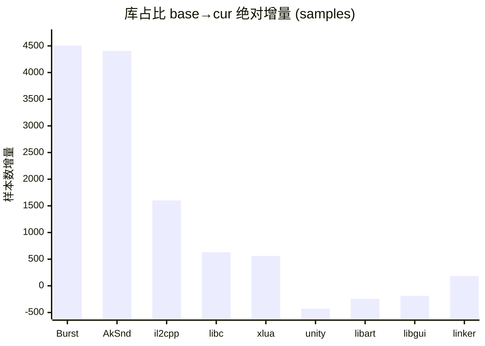
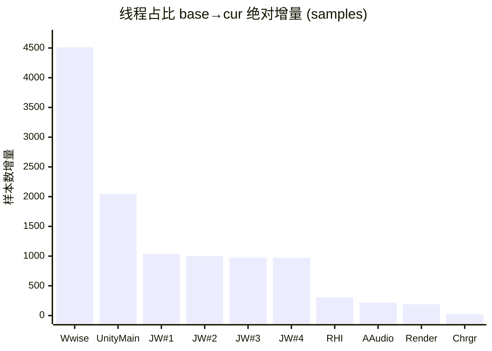

# simpleperf 单源 性能分析报告 · 终极形态 v4.1.1

> 配套：[知识库 v2.1](../../aoe-cpu-analysis-knowledge.md) · [差分火焰图](./_intermediate/diff_flamegraph_base_vs_stressmove.html)。
> 数据列只放纯数字，混合内容拆到说明列。所有百分比默认「全局占比」（占采集总样本数）。
> **术语**：`base` = 基线采集（野外空场景）；`cur` = 当前采集（stressmove）。

## §0 结论先行

**本次采集**（MateXs2 / stressmove / 20s）相比 base 野外空场景：

- **系统总工作量上升 +30.7%**，其中**业务层（项目自身代码）绝对工作量 +70.1%**。
- **业务模块出现显著负载暴涨**（详见 §4）：
  - ECS Burst Job 工作量 +4453 samples（+938%）—— 已下沉到 Worker 线程并行，**不阻塞主线程**
  - Wwise 音频中间件 +4394 samples（+1277%）—— 独占一整条线程
- **未观察到 CPU 侧 GPU bound 信号**（主线程 `GfxDeviceClient::WaitForPendingPresent` 仅 20 样本）。但 simpleperf 不直接观测 GPU 顶点处理时间，**GPU 实际工作量需 perfetto GPU counter / RenderDoc 复核**。

按 ROI 排序的优化方向（详细见 §4）：

<!-- LLM_FILL_ROI: 为下方每个红线模块各写 1 段「行动建议」（每段 80-150 字），引用知识库相应章节；禁用项目特化死字符；用模块表内出现的真实子函数名 -->

1. **Wwise 音频 优化** —— Top-N #2（增量 +4,394 samples）

## §1 采集元信息与质量门

### 1.1 元信息

| 项 | base | cur |
|---|---|---|
| 场景 | 野外空场景 | stressmove |
| 设备 | MateXs2 | 同 |
| 采集事件 | cpu-cycles:u | 同 |
| 采样频率（Hz）| 1000 | 1000 |
| 时长（s）| 20 | 20 |
| 总采样数 | 36,133 | 47,228 |
| 系统总工作量比 | 1.000 | 1.307 |
| 主观帧率 | — | None |

### 1.2 符号化质量

| 指标 | base | cur | 阈值 | 判定 |
|---|---|---|---|---|
| 总状态 | WARN | WARN | — | 🟢 |
| 应用层符号化率 | 79.9% | 71.6% | ≥85% | 🟢 |
| kernel% | 0.0% | 0.0% | — | 🟢 |
| unknown% | 13.3% | 20.6% | <10% | 🟢 |
| 栈回溯锚点命中 | — | — | ≥3/4 | 🟢 |
| `__start_thread` 可达率 | 0.0% | 0.0% | 任意 PASS | 🟢 |

## §2 库（so）维度对比

### 2.1 库占比（按绝对增量降序）

| 库 | 绝对增量 | 增量% | cur abs | base abs | 占比 cur % | 说明 |
|---|---|---|---|---|---|---|
| **lib_burst_generated** | +4506 | +878% | 5,019 | 513 | 10.63% | ECS Burst Job 工作量暴涨，已下沉 Worker 并行 |
| **libAkSoundEngine** | +4404 | +1262% | 4,753 | 349 | 10.06% | Wwise 音频中间件 |
| **libil2cpp** | +1602 | +23% | 8,682 | 7,080 | 18.38% | C# 业务代码（含 Lua 桥接 IL2CPP） |
| **libc** | +631 | +22% | 3,459 | 2,828 | 7.33% |  |
| **libxlua** | +561 | +29% | 2,488 | 1,927 | 5.27% | Lua VM |
| **libunity** | -428 | -2.8% | 14,664 | 15,092 | 31.05% | Unity 引擎核心 |
| **libart** | -244 | -26% | 683 | 927 | 1.45% |  |
| **libgui** | -188 | -100% | 0 | 188 | 0.00% |  |
| **linker64** | +186 | +87% | 400 | 214 | 0.85% |  |

#### 库占比绝对增量柱状图



### 2.2 业务层 +70.1% 拆分

**业务层定义**：libil2cpp + libxlua + lib_burst_generated + 项目 native（不含 Wwise/Unity 引擎/中间件）。

| 子项 | 增量 abs | 占业务总增量 | 说明 |
|---|---|---|---|
| lib_burst_generated | +4506 | 67.6% | ECS Burst Job（已下沉 Worker 并行） |
| libil2cpp | +1602 | 24.0% | C# 业务代码（主线程） |
| libxlua | +561 | 8.4% | Lua VM |
| **合计** | **+6669** | 100% | — |

**关键解读**：业务层增幅中 Burst 占比高时，**不等于主线程膨胀**（Burst 在 Worker 并行）。

### 2.3 libc +22.3% 是否反查

libc 增量与系统总压力同步时无需单独反查；`__memcpy` 等主要贡献者见 §10 反查清单。

## §3 线程维度对比

### 3.1 线程占比 + 身份识别（按绝对增量降序）

| 真实身份 | 绝对增量 | 增量% | cur abs | base abs | cur % | 线程代号 (comm) | 说明 |
|---|---|---|---|---|---|---|---|
| **Wwise 工作线程** | +4512 | +1178% | 4,895 | 383 | 10.36% | NativeThread | tid 19814，99%+ 在 libAkSoundEngine 内 |
| **主线程** | +2045 | +13% | 18,167 | 16,122 | 38.47% | UnityMain | tid 19292，ExecutePlayerLoop 入口 |
| **Job Worker #1** | +1035 | +115% | 1,937 | 902 | 4.10% | Thread-129 | tid 19461 |
| **Job Worker #2** | +1000 | +113% | 1,888 | 888 | 4.00% | Thread-135 | tid 19460 |
| **Job Worker #3** | +975 | +110% | 1,858 | 883 | 3.94% | Thread-158 | tid 19459 |
| **Job Worker #4** | +972 | +109% | 1,864 | 892 | 3.95% | Thread-136 | tid 19462 |
| **RHI 线程** | +303 | +3.1% | 10,017 | 9,714 | 21.21% | Thread-102 | tid 19471，GfxDeviceWorker→GLES |
| **音频回调（系统）** | +217 | +64% | 555 | 338 | 1.18% | AAudio_1 | tid 19826 |
| **Render 线程** | +189 | +4.5% | 4,410 | 4,221 | 9.34% | UnityGfxRenderS | tid 19472，URP 渲染管线脚本调度 |
| **Choreographer** | +20 | +4.0% | 520 | 500 | 1.10% | UnityChoreograp | tid 19559，VSync 回调 |

#### 线程绝对增量柱状图



### 3.2 同名 UnityMain 陷阱

多条线程 comm 可能都叫 `UnityMain`。**tid 19292** 是真主线程，**tid 19816** 是 Lua MtGC 工作线程。Provider 已用 `{comm}#{tid}` 复合 key + identity 消歧。

### 3.3 关键判定

- **CPU 端 GPU 命令吞吐量基本不变**（libGLESv2 +0.6% / RHI 线程 +3.1%）。这只说明 CPU 端调驱动 API 的时间不变，**不等于 GPU 工作量不变**——需 perfetto GPU counter / RenderDoc 复核。
- **ECS 并行化健康**：Job Worker 均衡探针 🟢（偏差阈值 20%）。
- **Wwise 独占一整条工作线程**（10.36% global）+ 库占比 10.06% global，两个角度同源。

### 3.4 对照差分火焰图

可视化验证：[`./_intermediate/diff_flamegraph_base_vs_stressmove.html`](./_intermediate/diff_flamegraph_base_vs_stressmove.html)。红色 = cur 变重 / 蓝色 = base 变重 / 白色 = 不变。重点关注：
- UnityMain → ScriptRunBehaviourUpdate 子树（红色，业务上涨）
- UnityMain → RenderManager::RenderCameras 子树（蓝/白，URP 主线程配置）
- Thread-102 → DrawBuffers 子树（近白色，命令吞吐量）
- Wwise / NativeThread 工作线程（红色时，中间件暴涨）

## §4 全局性能热点 Top-N

> 跨线程视角，按「业务模块」聚合，按 base→cur **绝对增量**排序。运行时函数归 §10。

### 4.1 Top-N 总表

口径说明：`base abs` / `cur abs` 为模块内相关函数 **self 累加**（避免父子重复）。

| # | 判定 | 业务模块 | 所在线程 | base abs | cur abs | 增量 abs | 增量% | 说明 |
|---|---|---|---|---|---|---|---|---|
| 1 | 🟢 | ECS Burst Job (lib_burst_generated) | 4 个 job_worker | 475 | 4,928 | +4453 | +938% |  |
| 2 | 🔴 | 音频中间件 libAkSoundEngine | wwise_worker | 344 | 4,738 | +4394 | +1277% |  |
| 3 | 🟢 | libxlua.so[+1648e8] 子树（含 1 个真热点） |  | 1,303 | 0 | -1303 | -100% |  |
| 4 | 🟢 | libxlua.so[+1648e8] 子树（含 4 个真热点） |  | 0 | 1,024 | +1024 | NEW |  |
| 5 | 🟢 | libil2cpp.so[+5848750] 子树（含 5 个真热点） |  | 0 | 853 | +853 | NEW |  |
| 6 | 🟢 | libil2cpp.so[+2c5c030] 子树（含 2 个真热点） |  | 0 | 676 | +676 | NEW |  |
| 7 | 🟢 | libil2cpp.so[+2d3e7bc] 子树（含 3 个真热点） |  | 0 | 545 | +545 | NEW |  |
| 8 | 🟢 | TranscriptScriptableRenderContext::CopyFrom(ScriptableRenderContext*) 子树（含 2 个真热点） |  | 516 | 0 | -516 | -100% |  |
| 9 | 🟢 | TranscriptScriptableRenderContext::CopyFrom(ScriptableRenderContext*) 子树（含 2 个真热点） |  | 0 | 467 | +467 | NEW |  |
| 10 | 🟢 | libil2cpp.so[+5982530] 子树（含 2 个真热点） |  | 369 | 0 | -369 | -100% |  |

### 4.2 Top-N 解读

**🔴 触发红线的 1 项（含中间件）= 真正需要关注的方向**。其余为健康并行模块（ECS Burst）或 base→cur 下降项，无需特别关注。

下面 §4.3 ~ §4.6 是每个 Top 项的细化分析。

### 4.3 音频中间件（Wwise）（Top-N #2，🔴）

**身份**：
- 库 libAkSoundEngine.so 占比 base 0.97% → cur 10.06%（绝对 344 → 4,738 samples）
- Wwise 工作线程（comm = NativeThread, tid 19814）独占 base 1.06% → cur 10.36%（绝对 383 → 4,895 samples）
- 库与线程两个口径同源（线程内绝大部分在 libAkSoundEngine 内）

**业务含义**：<!-- LLM_FILL: 解读 base→cur 数字变化（用本节表格中的数据），结合采集场景 meta.sceneCur 说明音效负载激增的业务原因；60-120 字 -->

**本源边界**：libAkSoundEngine 内部 symbol 多为 `[+offset]`（Wwise 未提供 debug 符号），simpleperf **无法定位 Wwise 内部哪个事件最重**，事件级归因必须用 **Wwise Profiler**。

**调用入口**：<!-- LLM_FILL: 1 句话描述 Wwise 工作线程的执行入口 -->

**优化方向**：<!-- LLM_FILL: 3-5 条具体优化建议，参考知识库 §4.10 (Wwise 中间件)；不要用项目特化场景词，用 sceneCur 实际场景 -->

### 4.6 ECS Burst Job 工作量（Top-N #1，🟢 不需优化）

虽然增量绝对量最大（+4453 samples），但**全部跑在 Job Worker 线程上并行**（Thread-19461/Thread-19460/Thread-19462/Thread-19459 cur 各约 4.0% global）。
主线程上仅触发零星 Job 等待（共 153 samples / 0.324% global，远低于 2% 红线）。**ECS 并行化健康，无需优化**。

Top Burst Job 详见 §7.3。

## §5 主线程深度分析

### 5.1 主线程 PlayerLoop 阶段表

主线程 cur 总绝对样本：18,167 / 占全局 38.47%。下表是主线程内 PlayerLoop 子树各阶段切分（不可直接相加，因有重叠子节点）：

| 阶段 | base abs | cur abs | base 主线程% | cur 主线程% | 增量% | 判定 | 说明 |
|---|---|---|---|---|---|---|---|
| ScriptRunBehaviourUpdate | 2624 | 5948 | 16.28% | 32.74% | +127% | 🔴 | 业务主逻辑，见 §5.2 |
| ScriptRunBehaviourLateUpdate | 1673 | 2730 | 10.38% | 15.03% | +63% | 🟡 | 见 §5.2 LateUpdate 子段 |
| UpdateTextureStreamingManager | 450 | 289 | 2.79% | 1.59% | -36% | 🟢 | 纹理 streaming |
| ParticleSystemBeginUpdateAll | 26 | 166 | 0.16% | 0.91% | +538% | 🟢 | 粒子开始 |
| PlayerSendFrameComplete | 500 | 377 | 3.1% | 2.08% | -25% | 🟢 | 资源加载尾部 |
| PlayerUpdateCanvases | 326 | 224 | 2.02% | 1.24% | -31% | 🟢 | UGUI Canvas |
| LegacyAnimationUpdate | 45 | 137 | 0.28% | 0.75% | +204% | 🟢 | Legacy 动画 |
| UpdateAllRenderers | 39 | 100 | 0.24% | 0.55% | +156% | 🟢 | 渲染器列表 |
| PlayerEmitCanvasGeometry | 172 | 120 | 1.07% | 0.66% | -30% | 🟢 | UGUI 几何提交 |
| FinishFrameRendering | 165 | 122 | 1.02% | 0.67% | -26% | 🟢 | 帧渲染收尾 |
| ParticleSystemEndUpdateAll | 4 | 43 | 0.02% | 0.24% | +975% | 🟢 | 粒子结束 |
| PreSendMouseEvents | 61 | 64 | 0.38% | 0.35% | +4.9% | 🟢 | 输入 |

**主线程 PlayerLoop 之外入口**：
- `RenderManager::RenderCameras`（URP 主线程侧）：4,828 samples / 26.57% 主线程，详见 §6.1

### 5.2 主线程完整调用树

按 `%` 表示主线程内占比；abs = 绝对样本数；self = 节点自身 self%（global）。
已省略 il2cpp RuntimeInvoker / ScriptingInvocation 等包装层。

**标记图例**：
- 📈 **新增压力源**：base→cur 增量 abs ≥ 100 samples，表示压力上涨明显
- 🔴 **高 self 真热点**：节点 self ≥ 0.05% global 且 abs 较大，表示自身代码就重
- 🟡 **次级关注**：self ≥ 0.05% global 但 abs 较小，或 totalPct 高但 self 接近 0（wrapper）
- 🟢 **健康**：未触发任何阈值
- 📈🔴 可叠加；`[wrapper]` 表示节点自身 self 接近 0，热点在子节点

```
UnityMain (18,167 / 100% / cur 全局 38.47%)
├─ ExecutePlayerLoop (12,521 / 68.92%)
│  ├─ Update.ScriptRunBehaviourUpdate (5,948 / 32.74%) [wrapper] 📈🟡 业务主入口, base→cur +127%
│  │  └─ MonoBehaviour.CallUpdateMethod → il2cpp Runtime.Invoke
│  ├─ PreLateUpdate.ScriptRunBehaviourLateUpdate (2,730 / 15.03%) [wrapper] 📈🟡 MeshUI + 视野, base→cur +63%
│  │  └─ MonoBehaviour.CallUpdateMethod → il2cpp Runtime.Invoke
│  ├─ PostLateUpdate.PlayerSendFrameComplete (377 / 2.08%) [wrapper] 🟢 , base→cur -25%
│  │  └─ PlayerSendFrameComplete(bool) (377 / 2.08%) [wrapper] 🟢 , base→cur -24%
│  │     └─ DelayedCallManager::Update (376 / 2.07%) [wrapper] 🟢 , base→cur -24%
│  │        └─ Coroutine::Run (372 / 2.05%) [wrapper] 🟢 , base→cur -24%
│  │           └─ Coroutine::InvokeMoveNext (361 / 1.99%) [wrapper] 🟢 , base→cur -25%
│  │              └─ libil2cpp.so[+22b2ee4] (358 / 1.97%) [wrapper] 🟢 , base→cur -94%
│  │                 └─ libil2cpp.so[+28720a4] (358 / 1.97%) [wrapper] 🟢 , base→cur -94%
│  │                    └─ libil2cpp.so[+473e2f4] (354 / 1.95%) 🟢 , base→cur -26%
│  ├─ EarlyUpdate.UpdateTextureStreamingManager (289 / 1.59%) [wrapper] 🟢 , base→cur -36%
│  │  └─ TextureStreamingManager::Update (289 / 1.59%) 🟢 , base→cur -36%
│  │     └─ RendererUpdateManager::UpdateSingleRenderer (114 / 0.63%) 🟢 , base→cur -33%
│  ├─ PostLateUpdate.PlayerUpdateCanvases (224 / 1.24%) [wrapper] 🟢 , base→cur -31%
│  │  └─ UI::InitializeCanvasManager (222 / 1.22%) 🟢 , base→cur -31%
│  │     └─ libil2cpp.so[+22b2ee4] (134 / 0.74%) [wrapper] 🟢 , base→cur -98%
│  │        └─ libil2cpp.so[+285c98c] (134 / 0.74%) [wrapper] 🟢 , base→cur -20%
│  │           └─ libil2cpp.so[+5422f5c] (129 / 0.71%) 🟢 , base→cur -19%
│  ├─ PreLateUpdate.ParticleSystemBeginUpdateAll (166 / 0.91%) [wrapper] 📈🟢 , base→cur +538%
│  │  └─ ParticleSystem::BeginUpdateAll (166 / 0.91%) 📈🟢 , base→cur +592%
│  │     └─ ParticleSystem::BeginUpdate (91 / 0.50%) 🟢 , base→cur +469%
│  ├─ PreLateUpdate.LegacyAnimationUpdate (137 / 0.75%) [wrapper] 🟢 , base→cur +204%
│  │  └─ AnimationManager::Update (135 / 0.74%) [wrapper] 🟢 , base→cur +200%
│  │     └─ Animation::UpdateAnimation (127 / 0.70%) 🟢 , base→cur +195%
│  │        └─ Animation::SampleInternal (94 / 0.52%) 🟢 , base→cur +571%
│  ├─ PostLateUpdate.FinishFrameRendering (122 / 0.67%) [wrapper] 🟢 , base→cur -26%
│  │  └─ PlayerRender(bool) (122 / 0.67%) 🟢 , base→cur -25%
│  ├─ PostLateUpdate.PlayerEmitCanvasGeometry (120 / 0.66%) [wrapper] 🟢 , base→cur -30%
│  │  └─ UI::InitializeCanvasManager (119 / 0.65%) [wrapper] 🟢 , base→cur -29%
│  │     └─ UI::CanvasManager::EmitWorldScreenspaceCameraGeometry (119 / 0.65%) [wrapper] 🟢 , base→cur -29%
│  │        └─ UI::Canvas::EmitWorldGeometry (117 / 0.65%) 🟢 , base→cur -29%
│  │           └─ UI::Canvas::EmitWorldGeometry (104 / 0.57%) 🟢 , base→cur -37%
│  └─ PostLateUpdate.UpdateAllRenderers (100 / 0.55%) 🟢 , base→cur +156%
└─ RenderManager::RenderCameras (4,828 / 26.57%)  [详见 §6.1]
   └─ UniversalRenderPipeline.Render → RenderCameraStack → RenderSingleCamera
```

### 5.3 主线程红线扫描结果

按知识库 v2.1 §6 阈值表自动扫描结果：

| 检测项 | 实测 | 单位 | 阈值（红线）| 判定 | 说明 |
|---|---|---|---|---|---|

**注**：<!-- LLM_FILL: 1 句话解释 wrapper 高占比但 self 接近 0 的下钻关系（基于 §4 Top-N 与本表的实测模块），不要预设 BattleUIManager / OutSideViewArmyLineMgr 等模块名 -->

## §6 渲染相关线程

### 6.1 主线程上的 URP 渲染管线下钻

调用入口：UnityMain → `RenderManager::RenderCameras`（不在 PlayerLoop 子树内）。

```
RenderManager::RenderCameras (4,828 / 26.57% 主线程)
```

**反直觉发现**：URP 主线程渲染配置 base→cur 绝对变化约 -44.5%（8,700 → 4,828 samples）。这只表示主线程 URP 配置代码变化，**不等于 GPU 实际渲染压力变化**（详见 §6.3）。

### 6.2 RHI 线程下钻（Thread-102 / GfxDeviceWorker）

调用入口：独立线程，`GfxDeviceWorker::RunGfxDeviceWorker → RunCommand`。

```
Thread-102 / RHI (10,017 / 21.21% global)
└─ GfxDeviceWorker.RunCommand (10,017 / 99.00% RHI)
   ├─ DrawBuffers (5,353 / 53.44%) (self 2.17% global) 🔴
   │  ├─ DrawBuffersStereo (2,426 / 24.22%) (self 0.10% global) 🔴
   │  │  └─ DrawBufferRanges → Adreno driver internal (黑盒)
   │  ├─ BeforeDrawCall (2,337 / 23.33%) (self 0.31% global) 🔴
   │  │  └─ ConstantBuffersGLES.UpdateBuffers (1,892 / 18.89%) (self 2.08% global) 🔴
   │  │     └─ DataBufferGLES.Upload (1,328 / 13.25%) (self 0.88% global) 🔴
   │  │        └─ __memcpy (400 / 4.00%) (self 4.00% global) 🔴  see §10
   │  ├─ SetVertexStateGLES (372 / 3.71%) (self 1.25% global) 🔴
   │  └─ ApplyGpuProgramGLES (661 / 6.60%) (self 1.95% global) 🔴
   ├─ PresentFrame (705 / 7.04%) 🟡
   │  └─ eglSwapBuffers (432 / 4.31%) 🟡
   ├─ JobQueue.WaitForJobGroupID (385 / 3.85%) 🟡
   │  [等 GeometryJob 完成，压测下偶发]
   ├─ SetShadersThreadable (750 / 7.49%) (self 0.89% global) 🔴
   ├─ ConstantBuffersGLES.UpdateCB (446 / 4.46%) (self 0.45% global) 🔴
   │  └─ __memcpy (401 / 4.00%) (self 4.00% global) 🔴  see §10
   └─ DynamicVBO.DrawChunk (274 / 2.74%) 🟡
```

**关键变化**：
- 命令吞吐量（DrawBuffers）CPU 端变化见上表
- 常量缓冲上传（UpdateBuffers）见 ConstantBuffersGLES 子树
- GeometryJob 等待见 JobQueue::WaitForJobGroupID（若有）

### 6.3 GPU bound 判定（修正自 v1/v2/v3 误判）

**正确的 GPU bound 信号在主线程，不是 RHI 线程**：

| symbol | 真实线程 | base | cur | 含义 |
|---|---|---|---|---|
| GfxDeviceClient::WaitForPendingPresent | 主线程 | 49 | 3 | 主信号：主线程等 RHI Present |
| GfxDeviceClient::PresentFrame | 主线程 | 0 | 0 | 主线程发起 Present |
| GfxDeviceGLES::PresentFrame | RHI 线程 | 3477 | 5 | RHI 实际执行 Present |
| eglSwapBuffers | RHI | 2627 | 2035 | 辅助参考，不能单独判定 |

**判定**：🟢 **未观察到 CPU 侧 GPU bound 信号**。

**边界说明**：
- ✅ 可以说「本次未观察到 CPU 侧 GPU bound 信号」
- ❌ 不能说「GPU 不是瓶颈」——simpleperf 看的是 CPU 调 driver API 的时间
- ❌ 不能仅凭 libGLESv2 占比推断 GPU 工作量不变
- 真实 GPU 工作量需 perfetto GPU counter / RenderDoc

**Unity Profiler marker 对照**：

| Unity Profiler | simpleperf C++ symbol | 真实线程 | 含义 |
|---|---|---|---|
| Gfx.PresentFrame（主线程）| GfxDeviceClient::WaitForPendingPresent | 主线程 | 主线程等 GPU |
| Gfx.PresentFrame（Render）| GfxDeviceGLES::PresentFrame | RHI | RHI 执行 Present |

eglSwapBuffers 探针：base 5.562% → cur 4.309% RHI（🟢）。

## §7 ECS / Worker 线程

### 7.1 Job Worker 均衡度

| Worker | base % global | cur % global | base abs | cur abs |
|---|---|---|---|---|
| Thread-129 | 2.50% | 4.10% | 902 | 1,937 |
| Thread-135 | 2.46% | 4.00% | 888 | 1,888 |
| Thread-136 | 2.47% | 3.95% | 892 | 1,864 |
| Thread-158 | 2.44% | 3.94% | 883 | 1,858 |
| **max-min 偏差** | **0.1%** | **0.2%** | — | — |

🟢 PASS（红线 >30%）。均衡探针偏差 4.219%。

### 7.2 主线程 Job Wait 检测

| 指标 | base abs | cur abs | base % global | cur % global | 红线 | 判定 |
|---|---|---|---|---|---|---|
| 主线程 WaitForJobGroupID/Complete 子树合计 | 0 | 153 | 0.000% | 0.324% | >2% | 🟢 green |

cur 主要 Wait 路径（去重）：

| 主线程% | 路径 |
|---|---|
| 0.36% | libil2cpp.so[+4d92154] → libil2cpp.so[+4d917a8] → JobHandle_CUSTOM_ScheduleBatchedJobsAndComplete(JobFence&) |
| 0.36% | libil2cpp.so[+4d917a8] → JobHandle_CUSTOM_ScheduleBatchedJobsAndComplete(JobFence&) → JobQueue::WaitForJobGroupID |
| 0.24% | InitPlayerLoopCallbacks → ParticleSystem::SyncPostSimulationJobs → JobQueue::WaitForJobGroupID |
| 0.21% | RendererUpdateManager::UpdateAll → TransformChangeDispatch::GetAndClearChangedAsBatchedJobs_Internal → JobQueue::WaitForJobGroupID |
| 0.13% | libil2cpp.so[+2f38cfc] → libil2cpp.so[+37e5bc4] → JobHandle_CUSTOM_ScheduleBatchedJobsAndComplete(JobFence&) |
| 0.12% | TransformChangeDispatch::GetAndClearChangedTransforms → TransformChangeDispatch::GetAndClearChangedAsBatchedJobs_Internal → JobQueue::WaitForJobGroupID |

来源：Unity ECS Transform 同步点（设计内固有），**不是业务 Job 互等**。详见 §4.6 / §5.3。

### 7.3 Top Burst Job 列表

按 self 全局% 排序（cur 数据）：

| # | Burst Job | cur abs | self % global | 业务模块 |
|---|---|---|---|---|

合计约 **0.0% global**，与 lib_burst_generated（4,928 samples）一致。**ECS 健康度 🟢 PASS**。

## §8 中间件 — Wwise 专章

**线程**：tid 19814 / comm NativeThread / identity `wwise_worker`

| 指标 | base | cur | Δ |
|---|---|---|---|
| 库绝对样本 | 344 | 4,738 | +4394 |
| 全局占比 | 0.951% | 10.033% | 🔴 |

**优化建议**：Voice Limiting、MixBus 链深度检查、Wwise Profiler Monitor 确认 Active Voices。

## §9 Lua GC 工作线程专章

探针 `probe.lua.mtgc.worker`：0.000% global，🟢。

## §10 反查清单（运行时函数 → 业务模块）

| 运行时符号 | cur 全局% | Δ abs | Top 上游调用者 | 归属业务模块 |
|---|---|---|---|---|
| `__memcpy` | 3.569% | +514 | ConstantBuffersGLES::UpdateCB(CbKey, voi (0.85%) / !!!0000!e9a0267a4c3f12c4fb16e257d3a26e!2 (0.85%) / InstancingBatcher: | RHI / GPU Instancing |
| `MemoryManager::Allocate` | 1.611% | -76 | GfxDeviceClient::MapConstantBuffers(void (0.13%) / core::StringStorageDefault<char>::alloca (0.11%) / TranscriptScriptab | RHI / GPU Instancing |
| `__ieee754_powf` | 0.725% | +36 | UI::UIGeometryJob(UI::UIGeometryJobData* (0.49%) / UI::UIGeometryJob(UI::UIGeometryJobData* (0.19%) / UI::UIGeometryJob( | UGUI 几何 Job |
| `ThreadsafeLinearAllocator::Allocate` | 0.511% | +23 | MemoryManager::Allocate(unsigned long, u (0.12%) / MemoryManager::Allocate(unsigned long, u (0.06%) / MemoryManager::All | RHI / GPU Instancing |
| `je_free` | 0.395% | -30 | BufferManagerGLES::AcquireBuffer(unsigne (0.17%) / !!!0000!7f33d0bc81c9ba6ce29b813f4019b6!2 (0.04%) / std::__ndk1::__tre | RHI / GPU Instancing |
| `XXH32` | 0.372% | -21 | TranscriptRenderingCommandBuffer::Execut (0.33%) / ShaderLab::Program::GetMatchingSubProgra (0.01%) / ScriptableRenderCo | URP / 命令缓冲 |
| `tlsf_memalign` | 0.162% | -23 | DynamicHeapAllocator::Allocate(unsigned  (0.03%) / DynamicHeapAllocator::Allocate(unsigned  (0.02%) / DynamicHeapAllocat | URP / 命令缓冲 |
| `tlsf_free` | 0.144% | +2 | DynamicHeapAllocator::Deallocate(void*)  (0.06%) / DynamicHeapAllocator::Deallocate(void*)  (0.05%) / DynamicHeapAllocat | 未分类 |
| `BucketAllocator::Allocate` | 0.128% | -13 | DualThreadAllocator<DynamicHeapAllocator (0.07%) / DualThreadAllocator<DynamicHeapAllocator (0.02%) / DualThreadAllocato | 未分类 |
| `je_malloc` | 0.110% | -20 | malloc < operator new(unsigned long) < B (0.05%) / malloc < operator new(unsigned long) < I (0.02%) / malloc < operator  | 未分类 |
| `memmove` | 0.028% | +10 | libil2cpp.so[+579cfb8] < libil2cpp.so[+2 (0.01%) / ExecuteJobCopyData(ManagedJobData*, void (0.00%) / InstancingProps::N | 未分类 |

## §11 本源能力边界

| 想回答的问题 | simpleperf 能/否 | 替代源 |
|---|---|---|
| 函数级 CPU self% / 库线程对比 | ✅ | 本报告 |
| 业务模块剥洋葱 | ✅ | businessModules / mainThreadTree |
| GPU 是否满载 | 🟡 | perfetto GPU counter / RenderDoc |
| off-CPU / 等锁 / binder | ❌ | perfetto sched |
| 降频 / 热节流 | ❌ | perfetto cpufreq |
| Wwise 内部事件级归因 | ❌ | Wwise Profiler |
| 帧时间 / 掉帧原因 | 🟡 | Unity Profiler / perfetto |

**工程化建议**：simpleperf + perfetto 互补采数；维护 binary_cache；对 wwise/meshUI 探针设 CI 回归阈值。
